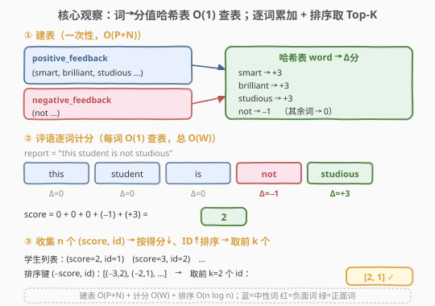
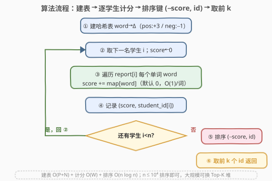

# 奖励最顶尖的K名学生

- **题目名称**：奖励最顶尖的K名学生
- **链接**：[2512. 奖励最顶尖的K名学生](https://leetcode.cn/problems/reward-top-k-students/)
- **难度**：中等
- **标签**：哈希表、排序、字符串、Top-K

## 1. 题目概述

给定两个字符串数组 `positive_feedback` 与 `negative_feedback`，分别是「正面词」与「负面词」集合，二者**无交集**（不会有一个词同时出现在两表中）。每位学生初始分数为 $0$：

- 评语中每出现一个**正面词**，分数 **加 $3$**；
- 评语中每出现一个**负面词**，分数 **减 $1$**；
- 其他词不影响分数。

再给定 $n$ 名学生的评语数组 `report` 与对应学号数组 `student_id`（`student_id[i]` 即评语 `report[i]` 的主人，所有学号互不相同），以及整数 $k$。请按**得分从高到低**返回最顶尖的 $k$ 名学生的学号；**同分时学号越小越靠前**。

**示例 1**：

```text
输入：positive_feedback = ["smart","brilliant","studious"],
     negative_feedback = ["not"],
     report = ["this student is studious","the student is smart"],
     student_id = [1,2], k = 2
输出：[1,2]
解释：两人各命中 1 个正面词，都得 3 分；学生 1 学号更小，排名更前。
```

**示例 2**：

```text
输入：positive_feedback = ["smart","brilliant","studious"],
     negative_feedback = ["not"],
     report = ["this student is not studious","the student is smart"],
     student_id = [1,2], k = 2
输出：[2,1]
解释：
- 学生 1：1 正面(studious, +3) + 1 负面(not, −1) → 2 分；
- 学生 2：1 正面(smart, +3) → 3 分。
学生 2 分数更高，返回 [2,1]。
```

**约束条件**：

- $1 \le \text{positive\_feedback.length},\ \text{negative\_feedback.length} \le 10^4$
- $1 \le \text{word.length} \le 100$，词仅含小写字母；两表无交集
- $1 \le n = \text{report.length} = \text{student\_id.length} \le 10^4$
- `report[i]` 仅含小写字母与空格，单词间以**单个空格**分隔；$1 \le \text{report[i].length} \le 100$
- $1 \le \text{student\_id[i]} \le 10^9$，学号互不相同
- $1 \le k \le n$

> 💡 关键细节：同一词若在一句话里**出现多次，每次都计分**（按词匹配而非去重）。词只全小写、以单空格分隔，意味着可直接 `split` 后逐词查表，无需规范化大小写或处理多空格。$n$、词表规模都在 $10^4$ 级别，但单条评语最长 $100$ 字符，故单词总数 $W$ 上界约 $n \times 50 \approx 5\times10^5$，量级不大。

---

## 2. 解题思路

### 2.1 暴力思路：逐词线性扫描反馈表

最直白的实现是**对每条评语 `split` 成词后，对每个词在 `positive_feedback` 与 `negative_feedback` 数组里各扫一遍**判定其类别：

- 命中正面 → `+3`；
- 命中负面 → `−1`；
- 都未命中 → `0`。

设词表总长 $F = P + N$（$P,N$ 各至 $10^4$），单词总数 $W$。每词一次线性扫描耗时 $O(F)$，整体 $O(W\cdot F)$。取 $W\approx 5\times10^5$、$F\approx 2\times10^4$，约 $10^{10}$ 次比较，**严重超时**。

> ⚠️ 枚举暴露的事实：判定一个词的类别本质是个「**查表**」操作，词→分值是**静态、全量预知**的映射。线性扫描把这张表当数组反复遍历，浪费在「重复比对同一批词」上。把表一次性载入哈希表，即可把每次查表从 $O(F)$ 降到 $O(1)$，整体塌缩为 $O(W)$。

### 2.2 核心观察：哈希表查表计分 + 排序取 Top-K



**关键直觉**：题目可拆成三段相互独立的子任务——**建表、计分、选 Top-K**，每段都有其最优手段：

1. **建表**：把 `positive_feedback` 的每个词映射到 $+3$、`negative_feedback` 每个词映射到 $-1$，存入哈希表 `delta[word]`。一次遍历两表，$O(P+N)$。词表无交集保证不会一个词被赋两个分值。
2. **计分**：对每名学生，`split` 其评语，逐词 `delta[word]`（默认 $0$）累加得到 `score`。每词 $O(1)$，总计 $O(W)$，其中 $W$ 是所有评语单词总数。
3. **选 Top-K**：收集 $n$ 个 `(score, student_id)`，按 **「分数降序，同分学号升序」** 排序，取前 $k$ 个学号。排序 $O(n\log n)$。

三段叠加：$O(P+N) + O(W) + O(n\log n)$。由于 $W \le n\times 50$，整体以 $O(n\log n)$ 为主，$n\le 10^4$ 时约 $10^4\log 10^4\approx 1.3\times10^5$ 次比较，秒杀。

> 💡 **排序键的统一写法**：把「分数降序」转成「负分数升序」，把「学号升序」原样保留，即可用一个二元组键 `(-score, id)` 做字典序升序排序，一行 `key=lambda x: (-x[0], x[1])` 搞定，无需自定义比较器。这把「主键降序、次键升序」这类混合方向排序转化为**纯升序字典序**，是 Python 里极省事的套路；C++ 则用自定义比较器 `cmp(a,b)` 直接表达「分数大者在前、同分学号小者在前」。

### 2.3 算法流程图



五步：

1. 建哈希表 `delta`：正面词 $\to +3$，负面词 $\to -1$；
2. 取下一名学生 $i$，`score = 0`，切分 `report[i]`；
3. 遍历其每个单词 `word`，`score += delta[word]`（缺省 $0$，$O(1)/$词）；
4. 记录 `(score, student_id[i])`，回到 ②，直至 $n$ 名学生处理完；
5. 按 `(-score, id)` 升序排序，取前 $k$ 个 `student_id` 返回。

> 💡 计分内层循环「每个单词查一次表」是典型的**把『线性扫描』替换为『哈希查表』**的优化；它在「候选集合全量预知且需被反复查询」的场景里反复出现（如 1 两数之和的哈希一次遍历、139 单词拆分的 `set` 查询）。

### 2.4 示例演算

![示例演算：示例 2，正/负词标色，逐词累加得学生 1=2 分、学生 2=3 分，排序取 k=2 得 [2,1]](../images/rewardtopk_example_walkthrough.svg)

以示例 2 为例（蓝=中性词、红=负面词、绿=正面词）：

**学生 1，`student_id = 1`，`report = "this student is not studious"`**

| 词 | 类别 | Δ |
|----|------|----|
| this | 中性 | $0$ |
| student | 中性 | $0$ |
| is | 中性 | $0$ |
| not | 负面 | $-1$ |
| studious | 正面 | $+3$ |

$$\text{score}_1 = 0+0+0+(-1)+(+3) = 2$$

**学生 2，`student_id = 2`，`report = "the student is smart"`**

| 词 | 类别 | Δ |
|----|------|----|
| the | 中性 | $0$ |
| student | 中性 | $0$ |
| is | 中性 | $0$ |
| smart | 正面 | $+3$ |

$$\text{score}_2 = 0+0+0+(+3) = 3$$

**排序取 Top-K**：收集 `[(2,1), (3,2)]`，按 `(-score, id)` 升序 → `[(−3,2), (−2,1)]` → 得分序列 `[3, 2]` 对应学号 `[2, 1]`，取前 $k=2$ 个 → **`[2, 1]` ✓**。

> 💡 注意 `student_id` 取值可达 $10^9$，远超数组下标范围，故不能「用学号当下标」做计数排序，必须以对象（结构体/元组）形式参与比较；好在只需 $n\le 10^4$ 个对象，比较排序毫无压力。

---

## 3. 参考代码

### C++

```cpp
class Solution {
public:
    vector<int> topStudents(vector<string>& positive_feedback,
                            vector<string>& negative_feedback,
                            vector<string>& report,
                            vector<int>& student_id, int k) {
        unordered_map<string, int> delta;
        for (auto& w : positive_feedback) delta[w] = 3;   // 正面词 +3
        for (auto& w : negative_feedback) delta[w] = -1;  // 负面词 −1

        int n = report.size();
        vector<pair<int, int>> stu;                        // (score, id)
        for (int i = 0; i < n; ++i) {
            int score = 0;
            stringstream ss(report[i]);
            string w;
            while (ss >> w) {                              // 按空格切分
                auto it = delta.find(w);
                if (it != delta.end()) score += it->second; // 命中才加分
            }
            stu.push_back({score, student_id[i]});
        }

        sort(stu.begin(), stu.end(), [](const pair<int,int>& a, const pair<int,int>& b){
            if (a.first != b.first) return a.first > b.first; // 分数降序
            return a.second < b.second;                       // 学号升序
        });

        vector<int> ans;
        for (int i = 0; i < k; ++i) ans.push_back(stu[i].second);
        return ans;
    }
};
```

> 💡 用 `unordered_map<string,int>` 即可；本题无序需求，不必 `map`。`stringstream >>` 按 `isspace` 切分，恰好契合「单词间单空格」的输入约定；若想更轻量也可手动 `find(' ')` 逐段截取。`delta.find` 先查再加分，避免对未命中词也写一个 $0$ 值进表，省一次哈希插入。

### Python

```python
class Solution:
    def topStudents(self, positive_feedback: List[str], negative_feedback: List[str],
                    report: List[str], student_id: List[int], k: int) -> List[int]:
        delta = {w: 3 for w in positive_feedback}
        delta.update({w: -1 for w in negative_feedback})

        stu = []
        for rep, sid in zip(report, student_id):
            score = sum(delta.get(w, 0) for w in rep.split())
            stu.append((score, sid))

        stu.sort(key=lambda x: (-x[0], x[1]))   # 分数降序、学号升序
        return [sid for _, sid in stu[:k]]
```

> 💡 `delta.get(w, 0)` 把「未命中记 $0$」内化进默认值，一句 `sum` 表达整条评语的计分。`(-score, id)` 把双方向排序压成单升序键，是 Python 处理「主降次升」的最简写法。两版逻辑等价，均为 $O(W + n\log n)$ 时间、$O(P+N+n)$ 空间。

---

## 4. 复杂度分析

| 维度 | 复杂度 | 说明 |
|------|--------|------|
| **时间复杂度** | $O(P+N+W+n\log n)$ | 建表 $O(P+N)$；逐词计分 $O(W)$；排序 $O(n\log n)$，$W$ 为评语单词总数 |
| **空间复杂度** | $O(P+N+n)$ | 哈希表存词表 $O(P+N)$；学生结果数组 $O(n)$ |
| 对照：暴力逐词扫描 | $O(W\cdot(P+N))$ | 每词线性扫两表，$W\cdot F\approx 10^{10}$，超时 |
| 对照：Top-K 堆 | $O(W + n\log k)$ | 维护大小 $k$ 的堆，$n$ 极大时优于排序；本题 $n\le10^4$ 不必 |

> 💡 $n\le 10^4$ 时排序 $O(n\log n)\approx 1.3\times 10^5$ 与计分 $O(W)\approx 5\times 10^5$ 同量级，二者均非瓶颈，故排序写法最简洁直观。$W$ 的上界来自「$n$ 条评语 $\times$ 每条至多约 $50$ 词（长度 $\le 100$、词长 $\ge 1$、单空格分隔）」。

---

## 5. 扩展：大规模时的 Top-K 堆解法

当 $n$ 远大于 $k$（例如 $n\sim 10^6$、$k\sim 10^2$）时，全排序 $O(n\log n)$ 不必要——**只需维护一个大小为 $k$ 的堆，保留当前最优的 $k$ 个**，复杂度降至 $O(n\log k)$。这是 Top-K 问题的通用范式（见 215、347、692）。

**堆的方向选择**：要保留「最优 $k$ 个」，应在堆顶放「**当前 Top-K 中的最差者**」，超额时弹掉它。对本题，「最差」= 分数最小，或同分时学号最大。比较器让「更优者」沉底、使最差者浮顶：

```cpp
// Top-K 最小堆变体：n 极大时 O(n log k) 优于 O(n log n)
// 比较器：使「最差者」位于堆顶，便于超额时弹出
auto worse = [](const pair<int,int>& a, const pair<int,int>& b){
    if (a.first != b.first) return a.first > b.first; // 分高者「更小」(更优) → 沉底
    return a.second < b.second;                       // id 小者「更小」(更优) → 沉底
};
priority_queue<pair<int,int>, vector<pair<int,int>>, decltype(worse)> pq(worse);
for (auto& p : stu) {
    pq.push(p);
    if ((int)pq.size() > k) pq.pop();                 // 弹出当前最差
}
vector<int> ans(k);
for (int i = k - 1; i >= 0; --i) {                     // 堆顶是最差，逆序填回
    ans[i] = pq.top().second;
    pq.pop();
}
return ans;
```

> ⚠️ **比较器方向的陷阱**：`priority_queue` 的第三模板参数 `Compare(a,b)` 返回 `true` 表示 $a$ 应排在 $b$ **之前（即 $a$ 更「小」）**，堆顶是该比较意义下的「最大者」。要让「最差者」上堆顶以便弹出，须令「更优」被视为「更小」（沉底），「最差」被视为「最大」（上顶）。这与排序比较器「谁更好谁在前」的方向**正好相反**，是 Top-K 堆最易错之处。可对照 215（第 K 大用小顶堆）、347（前 K 高频用小顶堆）巩固。

> 💡 Python 等价物：`heapq` 是小顶堆，弹出的是**最小者**。要让「最差者」上顶以便超 $k$ 时弹掉，须令其键最小——故压入 `(score, -id, id)`（分数低者小；同分时 `-id` 小=`id` 大者更小=更差者上顶），最后把存活的 $k$ 个按 `(-score, id)` 升序输出。或更省事地直接 `heapq.nsmallest(k, stu, key=lambda x: (-x[0], x[1]))`，取键 `(-score, id)` 最小的 $k$ 个即为最优 $k$ 个，逻辑与 C++ 版同构。

---

## 6. 面试要点

1. **为什么用哈希表而不是直接遍历反馈数组？**

   > 词→分值是**全量预知、需被反复查询**的静态映射。逐词线性扫两表把同一张表查了 $W$ 遍，$O(W\cdot F)$；哈希表一次建表 $O(F)$、之后每词 $O(1)$，$O(W)$。关键是「查询次数远多于建表一次」时，预建索引（哈希表/排序二分）几乎总赢过裸扫。

2. **同分时学号小的靠前，怎么在排序里表达？**

   > Python 用键 `(-score, id)` 做字典序**升序**：把分数取负就把「降序」翻成「升序」，学号保持升序，于是单一升序键同时表达两个方向。C++ 用自定义比较器 `cmp(a,b)`：`a.first != b.first` 时 `a.first > b.first`（分数大者在前），否则 `a.second < b.second`（学号小者在前）。两者等价，都是「主键降序、次键升序」的标准写法。

3. **同一词在一句话里出现多次怎么算？**

   > 按**词匹配、每次都计分**，不去重。题目要的是「评语中每个正面词 +3、每个负面词 −1」，本质是逐词累加，重复出现即重复加分。代码里 `split` 后逐词查表累加天然实现这点；若误用 `set(report[i].split())` 去重就会漏算，是常见踩坑。

4. **学号可达 $10^9$，能用来做下标吗？**

   > 不能。$10^9$ 远超 $n\le 10^4$，用学号当下标要么数组越界要么稀疏浪费。正解是把每名学生当**对象**——元组 `(score, id)` 或结构体，参与比较排序。排序仅 $n$ 个对象、$O(n\log n)$，与学号数值大小无关。

5. **$k=n$ 时还需要排序吗？直接全返回行不行？**

   > 仍需排序，因为输出要求**按分数从高到低**，不是按输入顺序。$k=n$ 只是不必「截断」，但「排序」这一步省不掉（除非题目改为「任意顺序返回」）。复杂度仍是 $O(W+n\log n)$。

> 💡 **一句话总结**：词→分值预建哈希表，逐词 $O(1)$ 查表累加得每人 score，再按 `(-score, id)` 排序取前 $k$；$O(P+N+W+n\log n)$ 出解，大规模换 Top-K 堆降至 $O(n\log k)$。

---

## 7. 同类练习题

- [692. 前 K 个高频单词](https://leetcode.cn/problems/top-k-frequent-words/)（[题解](../0601-0700/692_前K个高频单词.md)）：Top-K + 自定义排序（频率降序、同频字典序升序），与本题「分数降序、学号升序」同构
- [347. 前 K 个高频元素](https://leetcode.cn/problems/top-k-frequent-elements/)（[题解](../0301-0400/347_前K个高频元素.md)）：Top-K 母题，哈希计数 + 小顶堆/排序取前 k，承接本题第 5 节堆解法
- [215. 数组中的第 K 个最大元素](https://leetcode.cn/problems/kth-largest-element-in-an-array/)（[题解](../0201-0300/215_数组中的第K个最大元素.md)）：Top-K 的「取第 k」版本，小顶堆/快速选择，对照堆方向与边界
- [973. 最接近原点的 K 个点](https://leetcode.cn/problems/k-closest-points-to-origin/)（[题解](../0901-1000/973_最接近原点的K个点.md)）：按自定义距离键取前 k，排序或堆二选一，与本题结构平行
- [1. 两数之和](https://leetcode.cn/problems/two-sum/)（[题解](../0001-0100/1_两数之和.md)）：哈希一次遍历把「线性查找」压成 $O(1)$ 查表，同一「预建索引化简」范式的源头
