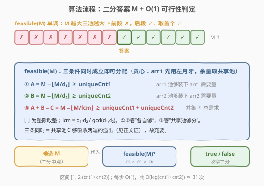
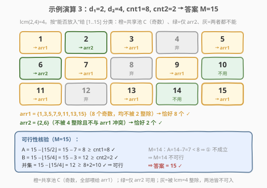

# 最小化两个数组中的最大值

- **题目名称**：最小化两个数组中的最大值
- **链接**：[2513. 最小化两个数组中的最大值](https://leetcode.cn/problems/minimize-the-maximum-of-two-arrays/)
- **难度**：中等
- **标签**：二分查找、数学、数论、容斥原理

## 1. 题目概述

给定四个整数 `divisor1`、`divisor2`、`uniqueCnt1`、`uniqueCnt2`。你需要往两个一开始都为空的数组 `arr1`、`arr2` 中添加正整数，使满足：

- `arr1` 含 `uniqueCnt1` 个**互不相同**的正整数，每个都**不能**被 `divisor1` 整除；
- `arr2` 含 `uniqueCnt2` 个**互不相同**的正整数，每个都**不能**被 `divisor2` 整除；
- `arr1` 与 `arr2` 中的元素**互不相同**（两数组之间无重叠）。

求两个数组中**最大元素**的**最小值**。空集的最大值定义为 $0$。

**示例 1**：

```text
输入：divisor1 = 2, divisor2 = 7, uniqueCnt1 = 1, uniqueCnt2 = 3
输出：4
解释：arr1 = [1]，arr2 = [2,3,4]，均满足条件，最大值为 4。
```

**示例 2**：

```text
输入：divisor1 = 3, divisor2 = 5, uniqueCnt1 = 2, uniqueCnt2 = 1
输出：3
解释：arr1 = [1,2]，arr2 = [3]，最大值为 3。
```

**示例 3**：

```text
输入：divisor1 = 2, divisor2 = 4, uniqueCnt1 = 8, uniqueCnt2 = 2
输出：15
解释：arr1 = [1,3,5,7,9,11,13,15]，arr2 = [2,6]，为最优解。
```

**约束条件**：

- $2 \le \text{divisor1},\ \text{divisor2} \le 10^5$
- $1 \le \text{uniqueCnt1},\ \text{uniqueCnt2} < 10^9$
- $2 \le \text{uniqueCnt1} + \text{uniqueCnt2} \le 10^9$

> 💡 关键观察：题目问的是「最大值的最小值」——这是典型的**二分答案**信号词。一旦固定上界 $M$，「$[1,M]$ 内能否选出满足约束的两组互不重叠的数」就变成了一个**计数 + 容斥**的判定问题，且该判定关于 $M$ 单调。而 $\text{uniqueCnt}$ 高达 $10^9$ 决定了判定必须是 $O(1)$（或 $O(\log)$），不能枚举每个数。

---

## 2. 解题思路

### 2.1 暴力思路：从小到大贪心填数

最朴素的念头是从 $1$ 开始逐个正整数 $x$，按如下贪心分配：能放 `arr1` 就放、否则能放 `arr2` 就放，直到两数组都填满为止，返回用到的最大数。问题在于：

1. **分配策略未必最优**。某些数同时满足两边的整除约束（即「两边都不能放」的反面——两边都允许），把它分给谁会影响后续能否凑齐。局部贪心会踩到「早早就用光共享资源」的陷阱。
2. **规模爆炸**。$\text{uniqueCnt1}+\text{uniqueCnt2} \le 10^9$，逐个填到 $10^9$ 量级，直接超时。

> ⚠️ 暴力暴露的本质：我们真正要决策的只有一个量——**两数组合用的最大正整数 $M$**。一旦 $M$ 给定，「够不够分」是个纯计数问题，与具体怎么摆无关。把「逐个填」升级为「二分猜 $M$ + 计数验证」，$10^9$ 量级便塌缩为 $\log(10^9)\approx 30$ 次判定。

### 2.2 核心观察：二分答案 + 容斥三池计数

![核心观察：候选上界 M 下 [1..M] 按“能否放入”分成三池](../images/minmax_two_arrays_concept.svg)

固定候选上界 $M$，考察区间 $[1, M]$ 内的正整数。按「能放进哪个数组」分成三个**容量可由容斥原理 $O(1)$ 算出**的池子：

| 池子 | 含义 | 容量公式 |
|------|------|----------|
| **arr1 可选池** $A$ | 不被 $d_1$ 整除（可入 arr1） | $A = M - \left\lfloor M / d_1 \right\rfloor$ |
| **arr2 可选池** $B$ | 不被 $d_2$ 整除（可入 arr2） | $B = M - \left\lfloor M / d_2 \right\rfloor$ |
| **共享池** $C$ | 不被 $d_1$ 且不被 $d_2$ 整除（两边都能入） | $C = M - \left\lfloor M / d_1 \right\rfloor - \left\lfloor M / d_2 \right\rfloor + \left\lfloor M / \mathrm{lcm}(d_1, d_2) \right\rfloor$ |

其中 $\mathrm{lcm}(d_1, d_2) = d_1 d_2 / \gcd(d_1, d_2)$。由容斥：「不被 $d_1$ 且不被 $d_2$」$=$ $M$ $-$ 「被 $d_1$ 或被 $d_2$」$=$ $M - \left\lfloor M/d_1 \right\rfloor - \left\lfloor M/d_2 \right\rfloor + \left\lfloor M/\mathrm{lcm} \right\rfloor$。

再记**并集**（至少可入其一）容量 $= A + B - C = M - \left\lfloor M / \mathrm{lcm} \right\rfloor$（即不被 $d_1 \cap d_2 = \mathrm{lcm}$ 整除者）。

> 💡 三池的直观关系：左月牙（仅 arr1）$= A - C$，右月牙（仅 arr2）$= B - C$，中间交集 $= C$。两数组各自只能从「自己的月牙 ∪ 共享池」取数，且共享池 $C$ 是两方争夺的紧缺资源。

**可行性充要条件（三条件同时成立）**：

$$
\boxed{\; A \ge \text{cnt1} \quad \wedge \quad B \ge \text{cnt2} \quad \wedge \quad (A + B - C) \ge \text{cnt1} + \text{cnt2} \;}
$$

- **①** $A \ge \text{cnt1}$：arr1 的可选池足够装下它需要的量；
- **②** $B \ge \text{cnt2}$：arr2 的可选池足够装下它需要的量；
- **③** 并集 $\ge \text{cnt1} + \text{cnt2}$：两数组总共需要的互不相同的数，不超过「至少能入其一」的总容量。

**充分性证明（贪心构造）**：arr1 先尽量吃自己的左月牙，取 $\min(\text{cnt1},\, A-C)$ 个；不足部分 $x = \max(0,\, \text{cnt1} - (A-C))$ 从共享池 $C$ 取。arr2 同理取 $y = \max(0,\, \text{cnt2} - (B-C))$ 个自共享池。需证 $x + y \le C$。

令 $p = A - \text{cnt1} \ge 0$、$q = B - \text{cnt2} \ge 0$（由 ①②）。则 $x = \max(0,\, C - p)$、$y = \max(0,\, C - q)$。

- 若 $C - p \le 0$ 或 $C - q \le 0$，则另一项 $\le C$ 显然成立；
- 若两项皆正：$x + y = (C - p) + (C - q) = 2C - p - q$。而 ③ $\Rightarrow A + B - C \ge \text{cnt1} + \text{cnt2} \Rightarrow (\text{cnt1}+p) + (\text{cnt2}+q) - C \ge \text{cnt1} + \text{cnt2} \Rightarrow p + q \ge C \Rightarrow 2C - p - q \le C$。✓

故三条件充要，可在 $O(1)$ 内判定 $\text{feasible}(M)$。

### 2.3 算法流程图



单调性：$M$ 越大，三池容量越大，$\text{feasible}(M)$ 由 false 单调翻转为 true。**二分求首个 true 的 $M$ 即答案**。

步骤：

1. 预计算 $\mathrm{lcm} = d_1 d_2 / \gcd(d_1, d_2)$；
2. 设二分区间 $[\,\text{lo}=1,\ \text{hi}=2 \cdot (\text{cnt1}+\text{cnt2})\,]$（上界证明见下）；
3. 取中点 $M$，计算 $A, B, U = A+B-C = M - \left\lfloor M/\mathrm{lcm} \right\rfloor$；
4. 若 $A \ge \text{cnt1} \wedge B \ge \text{cnt2} \wedge U \ge \text{cnt1}+\text{cnt2}$，则 $\text{hi} = M$；否则 $\text{lo} = M + 1$；
5. 收敛时 $\text{lo}$ 即答案。

> 💡 **上界 $2(\text{cnt1}+\text{cnt2})$ 的由来**：由 ③，$U = M - \left\lfloor M/\mathrm{lcm} \right\rfloor \ge M - \left\lfloor M/2 \right\rfloor \ge \lceil M/2 \rceil$（因 $\mathrm{lcm} \ge 2$）。取 $M = 2S,\ S = \text{cnt1}+\text{cnt2}$，得 $U \ge S$，③ 成立；同理 ①② 成立。故 $\text{feasible}(2S) = \text{true}$，$2S$ 是合法上界。$\gcd$ 与 $\mathrm{lcm}$ 均在 $\text{int64}$ 内（$d_1 d_2 \le 10^{10}$）。

### 2.4 示例演算



以示例 3（$d_1=2,\ d_2=4,\ \text{cnt1}=8,\ \text{cnt2}=2$）为例，$\mathrm{lcm}(2,4)=4$。

考察 $M=15$，把 $[1,15]$ 分类：

| 数 | 整除性 | 池子 | 分配 |
|----|--------|------|------|
| 1,3,5,7,9,11,13,15 | 奇数（不被 2 整除，自然也不被 4 整除） | 共享池 $C$ | → arr1 |
| 2,6,10,14 | 被 2 整除但不被 4 整除 | 仅 arr2 | 2,6 → arr2；10,14 不用 |
| 4,8,12 | 被 4 整除 | 两池皆不可入 | 弃 |

计数核验：

$$
A = 15 - \left\lfloor 15/2 \right\rfloor = 15 - 7 = 8 \ge 8\ \checkmark
$$
$$
B = 15 - \left\lfloor 15/4 \right\rfloor = 15 - 3 = 12 \ge 2\ \checkmark
$$
$$
U = A + B - C = 15 - \left\lfloor 15/4 \right\rfloor = 12 \ge 8+2=10\ \checkmark
$$

三条件成立 $\Rightarrow$ $M=15$ 可行。而 $M=14$ 时 $A = 14 - 7 = 7 < 8$，① 失败 $\Rightarrow$ 不可行。故**答案 $= 15$ ✓**。

> 💡 这里 $d_1 \mid d_2$（$2 \mid 4$）使得「不被 $d_1$ 整除」严格强于「不被 $d_2$ 整除」，于是 $A \subseteq B$、左月牙 $A - C = 0$：arr1 的所有候选都同时是 arr2 候选，共享池 $C = A$。最紧的瓶颈正是 ①（arr1 需要的奇数必须凑齐），答案由它卡住。

---

## 3. 参考代码

### C++

```cpp
class Solution {
public:
    int minimizeSet(int divisor1, int divisor2, int uniqueCnt1, int uniqueCnt2) {
        long long d1 = divisor1, d2 = divisor2;
        long long g = std::gcd(d1, d2);
        long long lcm = d1 / g * d2;                 // lcm(d1,d2)，<= 1e10，int64 安全
        long long c1 = uniqueCnt1, c2 = uniqueCnt2;
        long long lo = 1, hi = 2LL * (c1 + c2);      // 合法上界：feasible(2S)=true
        while (lo < hi) {
            long long m = (lo + hi) / 2;
            long long A = m - m / d1;                // arr1 可选池
            long long B = m - m / d2;                // arr2 可选池
            long long U = m - m / lcm;              // 并集 = 至少可入其一
            bool ok = (A >= c1) && (B >= c2) && (U >= c1 + c2);
            if (ok) hi = m;
            else     lo = m + 1;
        }
        return (int)lo;                              // 答案 < 2^31，安全转回 int
    }
};
```

> 💡 用 `std::gcd`（C++17 `<numeric>`）省去手写。函数签名返回 `int`（与 LeetCode 官方一致），但内部全程 `long long`：`m / lcm`、`2LL*(c1+c2)` 都贴近 $2\times10^9$，用 `int` 会在 $2\cdot(\text{cnt1}+\text{cnt2})$ 处溢出。答案上界 $\le 2\times10^9 < 2^{31}$，末尾 `(int)lo` 安全。`lcm = d1 / g * d2` 先除后乘避免任何潜在中间溢出（虽然此处 $d_1 d_2 \le 10^{10}$ 本就不会溢出 `int64`）。

### Python

```python
class Solution:
    def minimizeSet(self, divisor1: int, divisor2: int,
                    uniqueCnt1: int, uniqueCnt2: int) -> int:
        import math
        d1, d2 = divisor1, divisor2
        lcm = d1 * d2 // math.gcd(d1, d2)
        c1, c2 = uniqueCnt1, uniqueCnt2
        lo, hi = 1, 2 * (c1 + c2)
        while lo < hi:
            m = (lo + hi) // 2
            A = m - m // d1
            B = m - m // d2
            U = m - m // lcm            # = A + B - C，并集
            if A >= c1 and B >= c2 and U >= c1 + c2:
                hi = m
            else:
                lo = m + 1
        return lo
```

> 💡 Python 原生大整数，无需担忧溢出；`math.gcd` 与整除 `//` 直接给出容斥三量。两版逻辑等价，均为 $O(\log(\text{cnt1}+\text{cnt2}))$ 时间、$O(1)$ 空间。

---

## 4. 复杂度分析

| 维度 | 复杂度 | 说明 |
|------|--------|------|
| **时间复杂度** | $O(\log(\text{cnt1}+\text{cnt2}))$ | 二分约 $\log_2(2\times10^9)\approx 31$ 轮，每轮 $O(1)$ 容斥计数 |
| **空间复杂度** | $O(1)$ | 仅常数变量，无额外结构 |
| 对照：逐数贪心 | $O(\text{cnt1}+\text{cnt2})$ | 逐个填数至 $10^9$，超时 |
| 对照：分配细节模拟 | $O(M)$ | 构造具体分配，不必要——判定只需计数 |

> 💡 把「构造一组具体分配」降级为「判定容量是否足够」是本题的破局点：题目只要最大值，不要分配方案，故三条件计数即可，无需真正摆放。这是「**判定 vs 构造**」分离的典型范例。

---

## 5. 扩展：$d_1 \mid d_2$ 的特例与更紧上界

当 $d_1 \mid d_2$（或 $d_2 \mid d_1$）时，两池有包含关系：若 $d_1 \mid d_2$，则「不被 $d_1$ 整除」$\Rightarrow$ 「不被 $d_2$ 整除」，故 $A \subseteq B$，左月牙 $A - C = 0$、$C = A$。此时 ③ 退化为 $B \ge \text{cnt1}+\text{cnt2}$，三条件简化为 $\max(\text{cnt1},\, \text{cnt1}+\text{cnt2} \text{ 之 } B \text{ 侧})$ … 实践中无需特判，通用公式已 $O(1)$ 足够快。

此外上界可进一步收紧为 $2(\text{cnt1}+\text{cnt2})$ 已是常数倍紧界；若追求极致，可取 $\text{hi} = \lceil \frac{\text{cnt1}+\text{cnt2}}{1 - 1/\mathrm{lcm}} \rceil$ 之类，但对 31 轮的二分毫无收益，反损可读性，不建议。

> ⚠️ 真正需小心的不是上界松紧，而是**整型溢出**：$\text{cnt1}+\text{cnt2} \le 10^9$、$d_1 d_2 \le 10^{10}$，乘以 2 后贴近 $\text{int32}$ 上界。C++ 必须全程 `long long`，Python 天然安全。

---

## 6. 面试要点

1. **为什么想到二分答案？**

   > 题目问「最大值的**最小值**」——「最小化最大值」是二分答案的招牌措辞。一旦固定上界 $M$，「能否在 $[1,M]$ 内凑出两组满足约束的数」成为关于 $M$ 单调的判定题（$M$ 越大越容易成立），故可二分。

2. **三条件为什么是充要的？**

   > ①② 是各自池容量的显然下界；③ 是「两数组共需 $\text{cnt1}+\text{cnt2}$ 个互不相同的数，而能取的总池 = 并集 $A+B-C$」的总量下界。充分性靠贪心：先吃各自专属月牙，再把对共享池的溢出需求 $x+y$ 与 $C$ 比；由 ①②③ 可推出 $x+y \le C$（见 2.2 证明），故总能摆下。

3. **共享池 $C$ 的容斥公式怎么记？**

   > 「不被 $d_1$ 且不被 $d_2$」= $M$ $-$ 「被 $d_1$ 或被 $d_2$」，后者由容斥 $= \left\lfloor M/d_1 \right\rfloor + \left\lfloor M/d_2 \right\rfloor - \left\lfloor M/\mathrm{lcm} \right\rfloor$。「或」的交 $= \mathrm{lcm}$，故减回 $\mathrm{lcm}$ 项。记「$M$ $-$ 或 $+$ 交」即可还原。

4. **上界为什么取 $2(\text{cnt1}+\text{cnt2})$？会漏解吗？**

   > 不会。因 $\mathrm{lcm} \ge 2$，$U = M - \left\lfloor M/\mathrm{lcm} \right\rfloor \ge \lceil M/2 \rceil$；取 $M = 2S$（$S=\text{cnt1}+\text{cnt2}$）即 $U \ge S$，③ 成立，①② 同理。故 $\text{feasible}(2S)=\text{true}$，答案 $\le 2S$ 必落在区间内。

5. **为什么不用 $\mathrm{lcm}$ 直接代公式而要算 $\gcd$？**

   > $\mathrm{lcm}(d_1,d_2) = d_1 d_2 / \gcd(d_1,d_2)$。「不被 $d_1$ 且不被 $d_2$」等价于「不被 $\mathrm{lcm}$ 整除」（因 $d_1\cap d_2$ 的倍数集 $=$ $\mathrm{lcm}$ 的倍数集），故并集 $= M - \left\lfloor M/\mathrm{lcm} \right\rfloor$ 一式搞定。$\gcd$ 是为算 $\mathrm{lcm}$ 服务的，$O(\log)$ 即可。

> 💡 **一句话总结**：二分上界 $M$，用容斥 $O(1)$ 算三池容量 $A=M-\lfloor M/d_1\rfloor$、$B=M-\lfloor M/d_2\rfloor$、并集 $=M-\lfloor M/\mathrm{lcm}\rfloor$，判 $A\ge\text{cnt1}\wedge B\ge\text{cnt2}\wedge \text{并集}\ge\text{cnt1}+\text{cnt2}$；$O(\log)$ 出解。

---

## 7. 同类练习题

- [875. 爱吃香蕉的珂珂](https://leetcode.cn/problems/koko-eating-bananas/)（[题解](../0801-0900/875_爱吃香蕉的珂珂.md)）：二分答案 + $O(n)$ 验证，母题级模板，与本题「二分上界 + 单调判定」同构
- [1011. 在 D 天内送达包裹的能力](https://leetcode.cn/problems/capacity-to-ship-packages-within-d-days/)（[题解](../1001-1100/1011_在D天内送达包裹的能力.md)）：二分答案 + 贪心验证，「最小化最大值」措辞与本题一致
- [410. 分割数组的最大值](https://leetcode.cn/problems/split-array-largest-sum/)（[题解](../0401-0500/410_分割数组的最大值.md)）：二分答案 + 贪心划分，困难版「最小化最大子数组和」
- [719. 找出第 K 小的数对距离](https://leetcode.cn/problems/find-k-th-smallest-pair-distance/)（[题解](../0701-0800/719_找出第K小的数对距离.md)）：二分答案 + 双指针计数，把「逐个枚举」升级为「计数判定」的范式同源
- [2517. 礼盒的最大甜蜜度](https://leetcode.cn/problems/maximum-tastiness-of-candy-basket/)（[题解](../2501-2600/2517_礼盒的最大甜蜜度.md)）：二分答案 + 贪心验证的同区间邻居，对照「最大化最小值」方向
