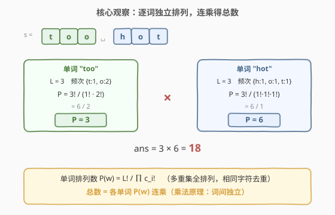
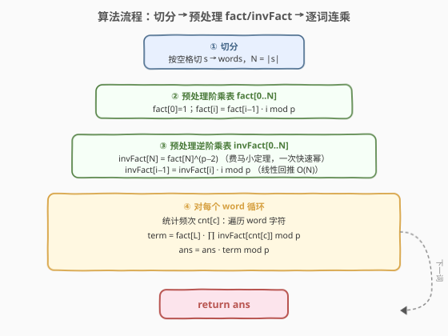
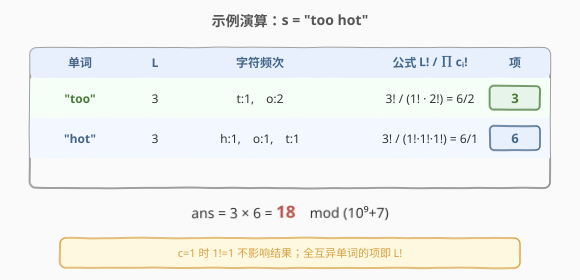

# LeetCode 统计同位异构字符串数目 题解

## 1. 题目概述

- **标题 / 题号**：统计同位异构字符串数目（#2514，hard）
- **链接**：https://leetcode.cn/problems/count-anagrams/
- **难度**：困难
- **标签**：哈希表、数学、字符串、组合数学、计数、费马小定理

**题意**：给你一个字符串 $s$，它包含一个或多个单词，单词之间用单个空格 `' '` 隔开。如果字符串 $t$ 中第 $i$ 个单词是 $s$ 中第 $i$ 个单词的一个**排列**，那么称 $t$ 是 $s$ 的同位异构字符串。请返回 $s$ 的同位异构字符串的数目，由于答案可能很大，对 $10^9 + 7$ 取余后返回。

**示例 1**：

```text
输入：s = "too hot"
输出：18
解释：一些同位异构字符串为 "too hot"、"oot hot"、"oto toh"、"too toh"、"too oht" 等。
```

**示例 2**：

```text
输入：s = "aa"
输出：1
解释：输入字符串只有一个同位异构字符串。
```

**约束**：

- $1 \le \text{s.length} \le 10^5$
- $s$ 只包含小写英文字母和空格 `' '`。
- 相邻单词之间由单个空格隔开。

> 💡 关键观察：「同位异构」要求**逐词独立排列**——第 $i$ 个单词只在自身内部打乱顺序，不与其他单词交换字符。因此各单词的排列方式数彼此独立，由**乘法原理**连乘即得总数；而单个单词的排列数正是经典的**多重集全排列**公式。

## 2. 解题思路

### 2.1 暴力思路：枚举所有排列

最直白的想法是对每个单词用回溯生成所有排列、再连乘。但单个长度为 $L$ 的单词（各字符互异时）有 $L!$ 种排列，$L=10^5$ 时是天文数字，连「枚举」都无从谈起。即便只统计「不重复」的排列数，暴力去重也需逐个比对，复杂度不可接受。

> ⚠️ 暴力暴露了一个事实：我们**不需要真的生成排列**，只需「数」有多少种。计数问题应回到计数公式，而非枚举。这正是组合数学介入的契机。

### 2.2 核心观察：乘法原理 + 多重集全排列



**两步拆解**：

1. **乘法原理**：$s$ 的同位异构字符串数 = 各单词排列数之积。因为第 $i$ 个单词的任意合法排列都可与其他单词的任意合法排列自由组合，方案数相乘。
   $$\text{ans} = \prod_{w} P(w)$$

2. **多重集全排列**：对单词 $w$，设长度为 $L$，字符频次为 $c_1, c_2, \dots, c_k$（$\sum c_i = L$）。其**不重复排列数**为
   $$P(w) = \frac{L!}{c_1!\, c_2!\, \cdots\, c_k!}$$
   直觉：$L$ 个位置的全排列有 $L!$ 种，但相同字符互换不产生新排列，故对每个出现 $c_i$ 次的字符除以 $c_i!$ 消去其内部顺序。

**验证示例 1** `"too hot"`：

- `"too"`：$L=3$，频次 $\{t:1,\ o:2\}$ → $P = \dfrac{3!}{1!\cdot 2!} = \dfrac{6}{2} = 3$；
- `"hot"`：$L=3$，频次 $\{h:1,\ o:1,\ t:1\}$ → $P = \dfrac{3!}{1!\cdot 1!\cdot 1!} = 6$；
- 总数 $= 3 \times 6 = 18$ ✓。

> 💡 **关键陷阱**：除法在模意义下不能直接做！答案需对 $p=10^9+7$ 取模，而 $p$ 是素数，用**费马小定理**把「除以 $c_i!$」转成「乘以 $c_i!$ 的逆元」$c_i!^{-1} \equiv c_i!^{\,p-2} \pmod{p}$。

### 2.3 算法流程图



四步：

1. **切分**：按空格把 $s$ 切成单词，记最大词长上界 $N = |s|$（单字时词长即串长）。
2. **预处理阶乘表**：`fact[0..N]`，`fact[i] = fact[i-1] * i % p`；
3. **预处理逆阶乘表**：`invFact[N] = fact[N]^(p-2) mod p`（费马小定理一次快速幂），再 `invFact[i-1] = invFact[i] * i % p` 线性回推（利用 $\frac{1}{(i-1)!} = \frac{i}{i!}$）。
4. **逐词连乘**：对每个词统计频次，$\text{term} = \text{fact}[L] \cdot \prod \text{invFact}[c_i] \bmod p$，`ans = ans * term % p`。

> 💡 **为何逆阶乘用回推而非逐个求逆？** 逐个对 $c_i!$ 调快速幂会退化到 $O(\text{字母数}\cdot\log p)$，而先算最大者 $N!$ 的逆（一次 $O(\log p)$），再用 $\text{invFact}[i-1]=\text{invFact}[i]\cdot i$ 一行回推整张表 $O(N)$，是竞赛/面试通用的高效写法。

### 2.4 示例演算



以 `"too hot"` 为例，逐词填表：

| 单词 | $L$ | 字符频次 | 公式 $\dfrac{L!}{\prod c_i!}$ | 项 $\bmod p$ |
|------|-----|----------|-------------------------------|--------------|
| `too` | 3 | $t:1,\ o:2$ | $\dfrac{3!}{1!\cdot 2!}$ | $3$ |
| `hot` | 3 | $h:1,\ o:1,\ t:1$ | $\dfrac{3!}{1!\cdot 1!\cdot 1!}$ | $6$ |

连乘：$\text{ans} = 3 \times 6 = 18 \pmod{10^9+7}$ ✓。

> 💡 单字符频次 $c_i=1$ 时 $1!=1$，对应 $\text{invFact}[1]=1$，乘了等于没乘——故「全互异」单词的项就是 $L!$，符合直觉（$L$ 个互异字符有 $L!$ 种排列）。

## 3. 参考代码

### C++

```cpp
class Solution {
    static constexpr int MOD = 1000000007;
    long long powmod(long long a, long long b) {
        long long r = 1; a %= MOD;
        while (b) {
            if (b & 1) r = r * a % MOD;
            a = a * a % MOD;
            b >>= 1;
        }
        return r;
    }
public:
    int countAnagrams(string s) {
        int n = s.size();
        vector<long long> fact(n + 1), invFact(n + 1);
        fact[0] = 1;
        for (int i = 1; i <= n; ++i) fact[i] = fact[i - 1] * i % MOD;
        invFact[n] = powmod(fact[n], MOD - 2);          // 费马小定理：N! 的逆
        for (int i = n; i >= 1; --i) invFact[i - 1] = invFact[i] * i % MOD;

        long long ans = 1;
        for (int i = 0; i < n; ) {
            int j = i, cnt[26] = {};
            while (j < n && s[j] != ' ') cnt[s[j] - 'a']++, j++;  // 统计本词频次
            long long term = fact[j - i];
            for (int c : cnt) if (c > 1) term = term * invFact[c] % MOD;
            ans = ans * term % MOD;
            i = (j < n) ? j + 1 : j;                    // 跳过单个空格
        }
        return (int)ans;
    }
};
```

> 💡 预处理规模取 $N = |s|$（单词最长即整串），一次建表全程复用。`c > 1` 才乘逆阶乘，$c=1$ 时 $1!=1$ 跳过省点常数。双指针 `i/j` 按空格切词，无需 `split` 额外分配。

### Python

```python
class Solution:
    def countAnagrams(self, s: str) -> int:
        MOD = 10**9 + 7
        n = len(s)
        fact = [1] * (n + 1)
        for i in range(1, n + 1):
            fact[i] = fact[i - 1] * i % MOD
        invFact = [1] * (n + 1)
        invFact[n] = pow(fact[n], MOD - 2, MOD)          # 费马小定理：N! 的逆
        for i in range(n, 0, -1):
            invFact[i - 1] = invFact[i] * i % MOD

        ans = 1
        for w in s.split():
            cnt = {}
            for ch in w:
                cnt[ch] = cnt.get(ch, 0) + 1
            term = fact[len(w)]
            for c in cnt.values():
                if c > 1:
                    term = term * invFact[c] % MOD
            ans = ans * term % MOD
        return ans
```

> 💡 Python 内置三参数 `pow(base, exp, mod)` 即快速幂 + 取模，一行求 $N!$ 的逆。`s.split()` 按空白切分天然吃掉空格（本题保证单词间单空格，结果一致）。两版均为 $O(n)$ 时间、$O(n)$ 空间。

## 4. 复杂度分析

| 维度 | 复杂度 | 说明 |
|------|--------|------|
| **时间复杂度** | $O(n)$ | 切分 $O(n)$；建 `fact` $O(n)$；一次快速幂 $O(\log p)$；回推 `invFact` $O(n)$；逐词统计与连乘共 $O(n)$（每字符常数次操作）。$n=|s|\le 10^5$ |
| **空间复杂度** | $O(n)$ | `fact` / `invFact` 各 $n+1$ 项；频次表 $O(26)=O(1)$ |
| 对照：逐词独立求逆 | $O(n\log p)$ | 每词对每个频次调 `pow`，常数多一个 $\log p\approx 30$ |
| 对照：暴力枚举排列 | $\Omega(L!)$ | 单词长 $L=10^5$ 时无法启动 |

> 💡 预处理 `fact/invFact` 一次建表全程复用是关键：把「除法取模」摊到 $O(1)$ 查询，整体线性。若单词数极多但每词极短，空间可压到 $O(\max L_{\text{词}})$，本题 $n\le10^5$ 无此必要。

## 5. 扩展：模逆元的技术细节与去重本质

### 5.1 费马小定理与逆阶乘回推

![阶乘与逆阶乘表：invFact[N]=fact[N]^(p−2)，invFact[i−1]=invFact[i]·i 回推](../images/countanagrams_fact_invfact.svg)

模 $p=10^9+7$ 为素数，对任意不被 $p$ 整除的 $a$，**费马小定理**给出 $a^{p-1}\equiv 1\pmod{p}$，两端乘 $a^{-1}$ 得 $a^{-1}\equiv a^{p-2}\pmod{p}$，用快速幂 $O(\log p)$ 求出。本题中 $i! < p$（$n\le 10^5 \ll 10^9$），恒与 $p$ 互素，逆元总存在。

**回推关系**：由 $\frac{1}{(i-1)!} = \frac{i}{i!}$ 得

$$\text{invFact}[i-1] = \text{invFact}[i] \cdot i \bmod p$$

只需对最大的 $\text{fact}[N]$ 调一次 `pow`，再 $O(N)$ 倒推出整张逆阶乘表，比逐个求逆省下 $N$ 个 $O(\log p)$。

> ⚠️ **前提**：模数必须是**素数**才能用费马小定理。若模非素数（如 LC 2221 的模 $10$），需改用扩展欧几里得求逆或 CRT 分解；本题 $10^9+7$ 是经典素模，费马直接套用。

### 5.2 「相同字符去重」的概率视角

另一理解：把 $L$ 个位置随机填入给定字符集合，总排布 $L!$ 种等概率；其中字符 $i$ 自身的 $c_i!$ 种内部顺序都对应「同一个可读字符串」，故每个可读字符串被重复计了 $\prod c_i!$ 次，除掉即得真排列数。这正是「多重集排列」公式的概率来源。

> 💡 若所有字符互异（$c_i\equiv1$），$\prod c_i!=1$，公式退化为 $L!$——普通全排列。

## 6. 面试要点

1. **为什么各单词排列数可以直接相乘？**

   > 同位异构要求第 $i$ 个单词只在自身字符内重排，不跨词交换。因此「选第 1 词的某排列」「选第 2 词的某排列」……是彼此独立的选择，由**乘法原理**方案数相乘。独立性来自「每词的字符池互不相交」——一词的排列不改变他词的可行集。

2. **模意义下「除以 $c_i!$」怎么实现？为何不会出错？**

   > 用费马小定理把除法转乘法：$\frac{1}{c_i!}\bmod p = c_i!^{\,p-2}\bmod p$，其中 $p=10^9+7$ 为素数。前提是 $c_i!$ 与 $p$ 互素——因 $c_i \le L \le 10^5 \ll 10^9$，$c_i!$ 不含因子 $p$，必互素，逆元总存在。实现上不逐个求逆，而是预建 `invFact` 表 $O(1)$ 取用。

3. **逆阶乘表为什么要「倒着回推」而非逐个求逆？**

   > 逐个对 $0..N$ 的阶乘调 `pow` 是 $O(N\log p)$，多一个 $\log p\approx 30$ 因子。利用 $\text{invFact}[i-1]=\text{invFact}[i]\cdot i$（源自 $\frac{1}{(i-1)!}=\frac{i}{i!}$），只对最大者 $\text{fact}[N]$ 调一次 `pow` $O(\log p)$，再 $O(N)$ 倒推整表，总体 $O(N+\log p)$，是模组合计数题的标配写法。

4. **预处理规模 $N$ 取多少？为什么不按「最大单词长度」而按 $|s|$？**

   > 单词最长可达整串（无空格时 $L=|s|$），故 $N=|s|$ 是安全上界，一次建表覆盖所有可能的 $L$ 与 $c_i$。按「实测最大词长」也行，但需先扫一遍求最大值再分两趟，多一次遍历且代码更繁；直接取 $|s|$ 简洁稳妥，空间 $O(n)\le 10^5$ 项完全可接受。

5. **`s = "a"`、`s = "aa"`、`s = "ab cd"` 各返回多少？**

   > `"a"`：一词 $L=1$、$a:1$，$\frac{1!}{1!}=1$，返回 $1$。`"aa"`：$L=2$、$a:2$，$\frac{2!}{2!}=1$，返回 $1$（两 a 互换无新串，示例 2 即此）。`"ab cd"`：`"ab"` $\frac{2!}{1!1!}=2$（ab/ba），`"cd"` 同样 $2$，连乘 $4$，返回 $4$。三者都自洽。

> 💡 **一句话总结**：同位异构 = 逐词独立排列的连乘；单词排列数 $=L!/\prod c_i!$（多重集全排列）。模 $10^9+7$ 下用费马小定理把除法转乘逆元，预建 `fact/invFact` 表后逐词 $O(1)$ 查询、$O(n)$ 出解。

## 同类练习题

| # | 题目 | 与本题的关联 |
|---|------|-------------|
| 2400 | [恰好移动 K 步到达某一位置的方法数目](https://leetcode.cn/problems/number-of-ways-to-reach-a-position-after-exactly-k-steps/)（[题解](../2301-2400/2400_恰好移动k步到达某一位置的方法数目.md)） | 同一套 `fact/invFact` + 费马小定理工具链，求组合数 $\binom{k}{r}$，模板可直接套用 |
| 1735 | [生成乘积数组的方案数](https://leetcode.cn/problems/count-ways-to-make-array-with-product/)（[题解](../1701-1800/1735_生成乘积数组的方案数.md)） | 阶乘 + 逆阶乘 + 隔板法，对组合数取模的进阶综合应用 |
| 1922 | [统计好数字的数目](https://leetcode.cn/problems/count-good-numbers/)（[题解](../1901-2000/1922_统计好数字的数目.md)） | 乘法原理 + 快速幂取模，无逆元的最简计数对照题 |
| 172 | [阶乘后的零](https://leetcode.cn/problems/factorial-trailing-zeroes/)（[题解](../0101-0200/172_阶乘后的零.md)） | 阶乘的数论性质，与本题对阶乘的「计数」用法互为补充 |
| 50 | [Pow(x, n)](https://leetcode.cn/problems/powx-n/)（[题解](../0001-0100/50_Powx_n.md)） | 快速幂模板，本题费马小定理求逆的核心依赖 |
