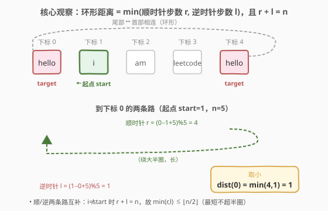
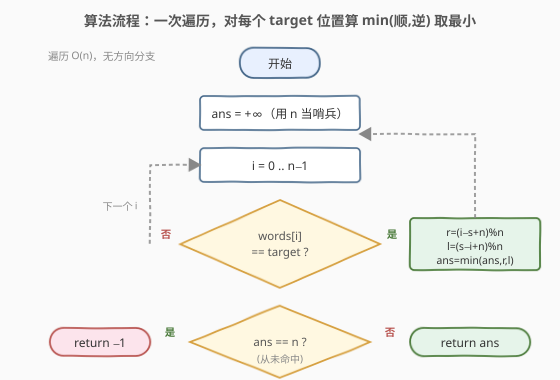
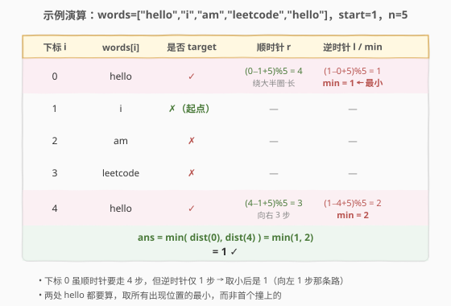

# LeetCode 到目标字符串的最短距离 题解

## 1. 题目概述

- **标题 / 题号**：到目标字符串的最短距离（#2515，easy）
- **链接**：https://leetcode.cn/problems/shortest-distance-to-target-string-in-a-circular-array/
- **难度**：简单
- **标签**：数组、字符串、环形数组、一次遍历

**题意**：给定一个 **0 下标** 的 **环形** 字符串数组 `words` 和一个字符串 `target`。「环形」指数组的尾部与首部相连：`words[i]` 的下一个是 `words[(i + 1) % n]`，上一个是 `words[(i - 1 + n) % n]`，其中 $n = \text{words.length}$。

从 `startIndex` 出发，每步可以走向下一个或上一个单词（各 1 步）。返回到达字符串 `target` 所需的 **最短** 距离；若 `target` 不在 `words` 中，返回 `-1`。

**示例 1**：

```text
输入：words = ["hello","i","am","leetcode","hello"], target = "hello", startIndex = 1
输出：1
解释：从下标 1 出发，到达 "hello"（出现在下标 0 和 4）的方式有：
- 向右走 3 步到下标 4；
- 向左走 2 步到下标 4；
- 向右走 4 步到下标 0；
- 向左走 1 步到下标 0。
最短距离为 1。
```

**示例 2**：

```text
输入：words = ["a","b","leetcode"], target = "leetcode", startIndex = 0
输出：1
解释：从下标 0 出发，向左走 1 步即可绕到下标 2 的 "leetcode"。
```

**示例 3**：

```text
输入：words = ["i","eat","leetcode"], target = "ate", startIndex = 0
输出：-1
解释："ate" 不在 words 中，返回 -1。
```

**约束**：

- $1 \le \text{words.length} \le 100$
- $1 \le \text{words[i].length} \le 100$
- `words[i]` 和 `target` 只由小写英文字母组成
- $0 \le \text{startIndex} < \text{words.length}$

> 💡 **两个关键设定**：① **环形**——尾部接头部，意味着从 `startIndex` 到任意下标 $i$ 都有「顺时针」「逆时针」两条路；② **target 可重复出现**——只要踏上任意一个 `target` 即算到达，因此要在所有出现位置中取最小。这两点合起来，把问题变成「对每个 target 出现位置算环形距离，再取最小」。

## 2. 解题思路

### 2.1 暴力思路：双向逐圈展开搜索

最直觉的做法是**模拟走路**：从 `startIndex` 出发，按步数 $d = 0, 1, 2, \dots$ 逐圈向外探，每一步同时检查「向右走 $d$ 步」「向左走 $d$ 步」两个位置是否等于 `target`，命中即返回 $d$。

```text
n = len(words)
for d in 0 .. n-1:
    if words[(startIndex + d) % n] == target:     # 向右走 d 步
        return d
    if words[(startIndex - d + n) % n] == target: # 向左走 d 步
        return d
return -1
```

以示例 1 验证 `words = ["hello","i","am","leetcode","hello"]`、`startIndex = 1`、$n = 5$：

- $d=0$：`words[1]="i"` ≠ target
- $d=1$：右 `words[2]="am"` ✗；左 `words[0]="hello"` ✓ → 返回 1 ✓

正确，且能**提前退出**。但它是「搜索式」思维：把「最短距离」当成「一步步试探直到撞上目标」，每次循环要分两个方向各判一次，逻辑上把「位置」与「方向」耦合在了一起。

> ⚠️ 这种写法依赖一个隐含事实：到下标 $i$ 的最短距离 $= \min(\text{顺时针步数}, \text{逆时针步数})$，而逐圈展开恰好是在 $\min$ 这个值上递增扫描——所以第一个命中的 $d$ 就是最短距离。事实对，但「为什么对」被藏起来了。下面的闭式公式把这个事实显式写出来。

### 2.2 核心观察：环形距离的闭式公式



把「从 `startIndex` 到下标 $i$」的两条路用模运算写死：

- **顺时针（向右）步数**：$r = (i - \text{startIndex} + n) \bmod n$
- **逆时针（向左）步数**：$l = (\text{startIndex} - i + n) \bmod n$

两条路一正一反，合起来恰好绕满一圈：当 $i \ne \text{startIndex}$ 时 $r + l = n$；当 $i = \text{startIndex}$ 时 $r = l = 0$。所以到 $i$ 的最短距离是：

$$\text{dist}(i) = \min(r,\, l) = \min\!\big((i - \text{startIndex} + n) \bmod n,\; (\text{startIndex} - i + n) \bmod n\big)$$

> 💡 **本质洞察**：$r + l = n$ 意味着 $\min(r, l) \le \lfloor n/2 \rfloor$——**环形上任意两点的最短距离不超过半圈**。这解释了 2.1 的逐圈展开为何 $d$ 最多扫到 $\lfloor n/2 \rfloor$ 就必命中（前提是 target 存在）：因为最远的出现位置也只需半圈。

有了闭式，问题就脱去了「走路」的外衣，变成纯计算：**枚举所有 `target` 出现的位置 $i$，对每个算 $\text{dist}(i)$，取全局最小**。`target` 不存在则返回 $-1$。

### 2.3 算法流程图



**完整步骤**：

1. 初始化 `ans = +∞`（用 $n$ 即可，距离必 $< n$）。
2. 遍历 $i = 0 \dots n-1$：若 `words[i] == target`，计算 $r = (i - \text{startIndex} + n) \bmod n$、$l = (\text{startIndex} - i + n) \bmod n$，更新 `ans = min(ans, min(r, l))`。
3. 循环结束若 `ans` 仍为 $+\infty$，说明 `target` 不存在，返回 $-1$；否则返回 `ans`。

### 2.4 示例演算

以示例 1 `words = ["hello","i","am","leetcode","hello"]`、`target = "hello"`、`startIndex = 1`、$n = 5$ 为例逐位置计算：



| 下标 $i$ | `words[i]` | 是否 target | 顺时针 $r$ | 逆时针 $l$ | $\min(r,l)$ |
|----------|-----------|-------------|-----------|-----------|-------------|
| 0 | `hello` | ✓ | $(0-1+5)\bmod5 = 4$ | $(1-0+5)\bmod5 = 1$ | **1** ← 最小 |
| 1 | `i` | ✗（起点） | — | — | — |
| 2 | `am` | ✗ | — | — | — |
| 3 | `leetcode` | ✗ | — | — | — |
| 4 | `hello` | ✓ | $(4-1+5)\bmod5 = 3$ | $(1-4+5)\bmod5 = 2$ | 2 |

`ans = min(1, 2) = 1` ✓。注意下标 0 虽顺时针要走 4 步（绕大半圈），但逆时针只要 1 步——`min` 取小后是 1，正是「向左走 1 步」那条路。

> 💡 **对比下标 0 与 4**：两者都是 `hello`，但下标 0 离起点更近（dist=1）。这正体现「target 可重复出现时要取所有位置的最小」——若只取第一个撞上的位置会错。2.1 的逐圈展开在 $d=1$ 命中下标 0、2.2 的闭式枚举也算出 $\min=1$，两者殊途同归。

## 3. 参考代码

### C++

```cpp
class Solution {
public:
    int closestTarget(vector<string>& words, string target, int startIndex) {
        int n = words.size(), ans = INT_MAX;
        for (int i = 0; i < n; ++i) {
            if (words[i] == target) {
                int r = (i - startIndex + n) % n;      // 顺时针步数
                int l = (startIndex - i + n) % n;      // 逆时针步数
                ans = min(ans, min(r, l));
            }
        }
        return ans == INT_MAX ? -1 : ans;
    }
};
```

### Python

```python
class Solution:
    def closestTarget(self, words: List[str], target: str, startIndex: int) -> int:
        n = len(words)
        ans = n                              # 距离上界 < n，用 n 当 +∞
        for i, w in enumerate(words):
            if w == target:
                r = (i - startIndex) % n     # 顺时针步数
                l = (startIndex - i) % n     # 逆时针步数
                ans = min(ans, r, l)
        return -1 if ans == n else ans
```

> 💡 **语言细节**：Python 的 `%` 对负数也返回非负结果（`(i - startIndex) % n` 天然落在 $[0, n)$），无需像 C++ 那样先 `+ n` 再取模防负。C++ 中 `i - startIndex` 可能为负，故写 `(i - startIndex + n) % n` 规避负数取模的实现定义行为。初值用 $n$ 当「正无穷」——因为任何真实距离都 $\le \lfloor n/2 \rfloor < n$，循环后 `ans == n` 即「从未命中」。

## 4. 复杂度分析

| 维度 | 复杂度 | 说明 |
|------|--------|------|
| **时间复杂度** | $O(n)$ | 一次遍历，每个位置 $O(1)$ 比较与两次取模 |
| **空间复杂度** | $O(1)$ | 仅用 `ans` 与循环变量 |

> 💡 $n \le 100$，闭式枚举与逐圈展开均为 $O(n)$，都能 AC。闭式法的优势在**一次遍历、无方向分支**：把「环形距离」直接写成公式，而非模拟走路；代码更短、可读性更好，也便于扩展（如改成「加权环形距离」时只需把步数换成权和）。

## 5. 扩展：逐圈展开 vs 闭式枚举——两种思维范式

2515 是「环形数组最短距离」的最简代表。这类问题的两种解法对应两种思维：

| 范式 | 代表写法 | 思维核心 | 特点 |
|------|----------|----------|------|
| **逐圈展开（搜索式）** | 2.1 的 `for d in 0..n-1` 双向探 | 「一步步走，撞上即停」 | 可提前退出，但方向耦合 |
| **闭式枚举（计算式）** | 2.2 的 `for i` + 模运算 | 「先算距离，再取最小」 | 一次遍历，位置与方向解耦 |

> 💡 **何时该用哪种？** 当只需「最近一个 target 的距离」且 target 稀疏时，逐圈展开可提前退出、常数更小；当需要「所有 target 的距离分布」或要扩展为「加权环形距离」时，闭式枚举更自然。本题 $n \le 100$ 两者无差别，**面试推荐闭式枚举**——它把环形距离的数学结构（$r + l = n$）显式写进代码，更易讲清「为什么对」。

> ⚠️ **环形 vs 线性**：若是**线性**数组（不首尾相连），从 `startIndex` 到 $i$ 只有唯一路径 $|i - \text{startIndex}|$，没有「两条路取小」的问题。环形的精髓正在于「同一起终点有顺/逆两条路」——`min(r, l)` 这一步只在环形时才需要。把线性思维（直接 $|i - \text{startIndex}|$）套到环形上会漏掉「绕另一边更近」的情况。

## 6. 面试要点

1. **为什么到下标 $i$ 的最短距离是 $\min(r, l)$？**

   > 环形上从 `startIndex` 到 $i$ 恰有两条不重合的路径：顺时针 $r = (i - \text{startIndex} + n) \bmod n$ 步、逆时针 $l = (\text{startIndex} - i + n) \bmod n$ 步，且 $r + l = n$（$i \ne \text{startIndex}$ 时）。两者一长一短互补，取小即为最短。

2. **$r + l = n$ 这个关系有什么用？**

   > 它给出上界 $\min(r, l) \le \lfloor n/2 \rfloor$，说明任何两点的环形最短距离不超过半圈；也意味着知道 $r$ 即知 $l = n - r$，代码里只算一个再取 `min(r, n - r)`（$r \ne 0$ 时）也对，但直接两个都算更对称、不易错。

3. **target 多次出现时为什么要取所有位置的最小？**

   > 题目问「到达字符串 target 的最短距离」，只要踏上任意一个 target 即算到达。不同出现位置离起点远近不同，须在所有位置的距离中取最小。若只取「第一个找到的」会漏掉更近的那一个。

4. **`target` 不存在时怎么处理？**

   > 用一个超过理论上界的值（如 $n$ 或 `INT_MAX`）初始化 `ans`，循环中只在命中时更新；循环后若 `ans` 仍是初值，说明从未命中，返回 $-1$。用 $n$ 当「正无穷」比 `INT_MAX` 更贴合题意（距离必 $< n$），也省去 `<climits>`。

5. **Python 的 `(i - startIndex) % n` 为何不用先 `+ n`？**

   > Python 的 `%` 运算结果符号随除数（$n > 0$ 故结果非负），负数取模天然落在 $[0, n)$。C++ 的 `%` 结果符号随被除数，负数取模得负，故需 `+ n` 规避。这是跨语言写环形下标时最易踩的坑。

> 💡 **一句话总结**：2515 =「环形数组 + 找最近 target」。核心是环形距离闭式 $\text{dist}(i) = \min((i - s + n) \bmod n,\; (s - i + n) \bmod n)$，枚举所有 target 位置取最小即可，$O(n)/O(1)$。口诀：**环形两路互补和为 n，取小不超半圈；target 重复取最小，不见返回负一**。

## 同类练习题

| # | 题目 | 与本题的关联 |
|---|------|-------------|
| 2516 | [每种字符至少取 K 个](https://leetcode.cn/problems/take-k-of-each-character-from-left-and-right/) | 同样在「从两端/环形取字符」的框架下用双指针求最短操作区间，本题的进阶——把「单向环形距离」升级为「左右两端同时取」 |
| 2134 | [最少交换次数来组合所有的 1 II](https://leetcode.cn/problems/minimum-swaps-to-group-all-1s-together-ii/) | 环形数组上求最小窗口，同样利用「环形可绕」把线性滑动窗口升级为环形窗口 |
| 2079 | [给植物浇水](https://leetcode.cn/problems/watering-plants/) | 线性单方向走动累加步数，对照本题「环形双向取小」的距离计算，区分线性 vs 环形 |
| 457 | [环形数组是否存在循环](https://leetcode.cn/problems/circular-array-loop/) | 环形数组下标 `(i + k) % n` 的经典运用，承接本题的环形下标遍历 |
