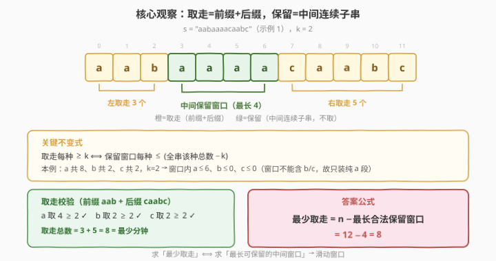
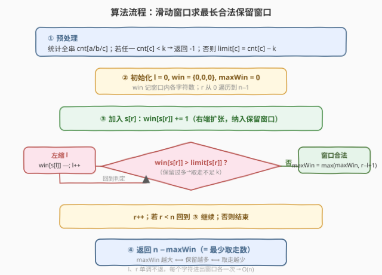
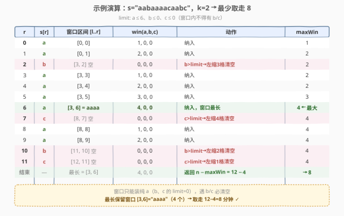

# LeetCode 每种字符至少取 K 个 题解

## 1. 题目概述

- **标题 / 题号**：每种字符至少取 K 个（#2516，medium）
- **链接**：https://leetcode.cn/problems/take-k-of-each-character-from-left-and-right/
- **难度**：中等
- **标签**：字符串、滑动窗口、双指针

**题意**：给你一个由字符 `'a'`、`'b'`、`'c'` 组成的字符串 `s` 和一个非负整数 $k$。每分钟，你可以选择取走 `s` **最左侧**还是**最右侧**的那个字符（取走后该字符从串中移除）。

你必须取走每种字符**至少 $k$ 个**，返回需要的**最少分钟数**；如果无法取到，则返回 $-1$。

**示例 1**：

```text
输入：s = "aabaaaacaabc", k = 2
输出：8
解释：
  从 s 的左侧取三个字符（"aab"），共取到两个 'a'、一个 'b'；
  从 s 的右侧取五个字符（"caabc"，按从右往左取），共取到四个 'a'、两个 'b'、两个 'c'。
  合计取到 a:4、b:2、c:2，均 ≥ 2，共需 3 + 5 = 8 分钟。
```

**示例 2**：

```text
输入：s = "a", k = 1
输出：-1
解释：串中只有 'a'，无法取到 'b' 或 'c'，返回 -1。
```

**约束**：

- $1 \le \text{s.length} \le 10^5$
- `s` 仅由字母 `'a'`、`'b'`、`'c'` 组成
- $0 \le k \le \text{s.length}$

> 💡 **关键不变式**：每次只能从「最左」或「最右」取走一个字符，这意味着**取走的部分 = 一个前缀 + 一个后缀**，而**留下未被取走的部分必然是中间一段连续子串**。于是「最少取走多少」$\Leftrightarrow$「最长能保留多长的中间子串」——把一个两端取数问题塌缩成单变量（中间窗口长度）的最优化。

## 2. 解题思路

### 2.1 暴力思路：枚举前缀与后缀长度

最直白的做法是枚举从左取 $i$ 个、从右取 $j$ 个（$0 \le i, j$ 且 $i+j \le n$），统计前缀 `s[0:i]` 与后缀 `s[n-j:n]` 合并后各字符的数目，若 `a`、`b`、`c` 都 $\ge k$，则用 $i+j$ 更新答案：

```text
ans = +∞
for i in 0..n:
    for j in 0..n-i:
        taken = s[0:i] + s[n-j:n]
        if count(taken,'a')>=k and count(taken,'b')>=k and count(taken,'c')>=k:
            ans = min(ans, i+j)
return ans (若仍 +∞ 则 -1)
```

这是 $O(n^3)$（枚举 $O(n^2)$ 对、每对重新统计 $O(n)$）。$n\le 10^5$ 远超承受，会 TLE。即便用前缀和把统计降到 $O(1)$，仍有 $O(n^2)$ 的枚举对，依旧超时。

> ⚠️ 暴力的根病在于「逐对枚举前缀+后缀」，把同一个「保留窗口」反复以不同 $(i,j)$ 表达。事实上 $i+j = n - (\text{中间窗口长度})$，固定中间窗口长度，前后缀的分割点虽多，但**取走总数只依赖窗口长度**。一旦把目标改为「最大化中间窗口长度」，所有冗余枚举消失。

### 2.2 核心观察：滑动窗口求「最长可保留的中间子串」



三个观察层层递进：

1. **取走 = 前缀 + 后缀，保留 = 中间连续子串**：因为每步只取最左或最右，取走 $t$ 步后，串被切成「左取走 $i$ 个 + 中间保留一段 + 右取走 $j$ 个」，$i+j=t$。**留下的中间部分恒为一段连续子串 `s[l..r]`**。因此最少取走数 $= n - (\text{最长合法中间窗口长度})$。

2. **取走每种 $\ge k$ $\Leftrightarrow$ 保留窗口每种 $\le \text{总数}-k$**：设全串中字符 $c$ 的总数为 $\text{cnt}[c]$。取走部分里 $c$ 的个数 $= \text{cnt}[c] - \text{win}[c]$（$\text{win}[c]$ 为窗口内 $c$ 的个数）。要求取走 $\ge k$，即 $\text{cnt}[c] - \text{win}[c] \ge k \iff \text{win}[c] \le \text{cnt}[c] - k$。于是窗口的合法上界 $\text{limit}[c] = \text{cnt}[c] - k$。

3. **可行性 + 单调滑窗**：若任一 $\text{cnt}[c] < k$，则即使全取走也不够，直接返回 $-1$。否则 $\text{limit}[c]\ge 0$，窗口非空地存在。窗口越右端扩张、越可能越界，但只需左端跟着收缩即可——这是经典**单调滑窗**：右指针 $r$ 单调右移扩张、左指针 $l$ 单调右移收缩，$l,r$ 各至多走 $n$ 步，总 $O(n)$。

> 💡 **一句话直觉**：别再问「取走几个」，转而问「能保留多长」。取走 $\ge k$ 的约束翻转成「窗口 $\le \text{总数}-k$」的上界约束，求最长合法窗口即答案。这是「**正难则反**」的典型翻转——最小化取走 ⟺ 最大化保留。

> ⚠️ 本题窗口的「合法性」是**上界型**（窗口内每类字符 $\le$ 某上界），与 76（最小覆盖子串，下界型）方向相反。下界型窗口「扩张易满足、收缩易破坏」，上界型窗口「扩张易破坏、收缩易修复」——故扩张后若越界就收缩，逻辑天然自洽。

### 2.3 算法流程图



四步：

1. **预处理**：统计全串 $\text{cnt}[a/b/c]$；若任一 $\text{cnt}[c] < k$，返回 $-1$；否则令 $\text{limit}[c] = \text{cnt}[c] - k$；
2. **初始化**：$l = 0$，窗口计数 $\text{win}=\{0,0,0\}$，$\text{maxWin}=0$；右指针 $r$ 从 $0$ 遍历到 $n-1$；
3. **滑窗**：每步先 $\text{win}[s[r]] \mathrel{+}= 1$（右端纳入）；若 $\text{win}[s[r]] > \text{limit}[s[r]]$，则 $\text{win}[s[l]] \mathrel{-}= 1,\ l \mathrel{+}= 1$ 左缩，直到合法；随后 $\text{maxWin} = \max(\text{maxWin}, r-l+1)$；
4. **返回**：$n - \text{maxWin}$ 即最少取走数。

> 💡 **为什么左缩时只判 $s[r]$ 一种字符就够？** 加入 $s[r]$ 之前窗口已合法（所有 $\text{win}[c]\le\text{limit}[c]$），这一步只让 $\text{win}[s[r]]$ 增 $1$，故只 $s[r]$ 这一类可能越界。左缩移除字符只会让各类 $\text{win}$ 减或不变，不会制造新的越界，故收缩到 $\text{win}[s[r]]\le\text{limit}[s[r]]$ 即整体合法，无需逐类复查。这让内层循环虽是 `while`，但 $l$ 单调不退、整体仍 $O(n)$。

### 2.4 示例演算



以示例 1 `s = "aabaaaacaabc"`（$n=12$，下标 $0\ldots11$）、$k=2$ 为例。先统计 $\text{cnt}$：$a=8, b=2, c=2$，均 $\ge 2$，故 $\text{limit}=\{a:6, b:0, c:0\}$——**窗口里 $b$、$c$ 的上界都是 $0$**，即窗口不得含任何 $b$ 或 $c$，只能装纯 $a$ 段且 $a\le 6$。

滑动过程（每行状态为处理完 $s[r]$ 后）：

- $r=0,1$（$a,a$）：窗口 $[0,1]$，$\text{win}(a,b,c)=2,0,0$，合法，$\text{maxWin}=2$；
- $r=2$（$b$）：$b=1>\text{limit}(0)$，左缩移除 $s[0..2]$（$a,a,b$）至空，$l=3$，$\text{maxWin}$ 仍 $2$；
- $r=3\ldots6$（$a,a,a,a$）：窗口长到 $[3,6]$，$\text{win}=4,0,0$，合法，$\text{maxWin}=4$；
- $r=7$（$c$）：$c=1>0$，左缩移除 $s[3..7]$（$a,a,a,a,c$）至空，$l=8$，$\text{maxWin}$ 仍 $4$；
- $r=8,9$（$a,a$）：窗口 $[8,9]$，$\text{win}=2,0,0$，合法，$\text{maxWin}$ 仍 $4$；
- $r=10$（$b$）、$r=11$（$c$）：各触发左缩清空，$\text{maxWin}$ 仍 $4$。

最长合法窗口 $[3,6]=$ `aaaa`（$4$ 个），返回 $n-\text{maxWin}=12-4=8$ ✓。

> 💡 注意每当窗口碰到 $b$ 或 $c$（其 $\text{limit}=0$）就立刻被清空——这正是「上界型窗口」扩张即越界、收缩即修复的体现。最终能保留的最长段，恰好是两段「非 $a$ 字符」之间最长的纯 $a$ 段。

## 3. 参考代码

### C++

```cpp
class Solution {
public:
    int takeCharacters(string s, int k) {
        int n = s.size();
        array<int, 3> cnt{};
        for (char c : s) cnt[c - 'a']++;
        for (int i = 0; i < 3; i++)
            if (cnt[i] < k) return -1;          // 全取也不够，无解

        array<int, 3> limit{cnt[0] - k, cnt[1] - k, cnt[2] - k};
        array<int, 3> win{};
        int l = 0, maxWin = 0;
        for (int r = 0; r < n; r++) {
            int idx = s[r] - 'a';
            win[idx]++;                          // 右端纳入保留窗口
            while (win[idx] > limit[idx]) {     // 该类越界 → 左缩
                win[s[l] - 'a']--;
                l++;
            }
            maxWin = max(maxWin, r - l + 1);
        }
        return n - maxWin;
    }
};
```

> 💡 用 `array<int,3>` 按 $c-\text{'a'}$ 索引，省去哈希、常数小。`while` 的判定只看刚加入的 `s[r]` 一类（理由见 2.3），故内层虽循环但 $l$ 单调不退，整体仍 $O(n)$。$k=0$ 时 $\text{limit}[c]=\text{cnt}[c]$，窗口可装下全串、$\text{maxWin}=n$，返回 $0$，正确退化。

### Python

```python
class Solution:
    def takeCharacters(self, s: str, k: int) -> int:
        n = len(s)
        cnt = [s.count(c) for c in 'abc']
        if any(c < k for c in cnt):            # 全取也不够
            return -1
        limit = [c - k for c in cnt]
        win = [0, 0, 0]
        l = 0
        max_win = 0
        for r, ch in enumerate(s):
            idx = ord(ch) - 97
            win[idx] += 1                      # 右端纳入保留窗口
            while win[idx] > limit[idx]:       # 该类越界 → 左缩
                win[ord(s[l]) - 97] -= 1
                l += 1
            max_win = max(max_win, r - l + 1)
        return n - max_win
```

> 💡 两版逻辑一致，均 $O(n)$ 时间、$O(1)$ 空间。`limit = [c - k for c in cnt]` 一行生成三类上界，对应「取走 $\ge k$」约束的翻转。Python 中 `[s.count(c) for c in 'abc']` 走三趟扫描但常数小、写法干净；若在意常数可改为单趟 `collections.Counter`，逻辑不变。

## 4. 复杂度分析

| 维度 | 复杂度 | 说明 |
|------|--------|------|
| **时间复杂度** | $O(n)$ | 右指针 $r$ 单调遍历 $n$ 次；左指针 $l$ 整个过程至多右移 $n$ 次（每个字符进/出窗口各一次），合计 $\Theta(n)$ |
| **空间复杂度** | $O(1)$ | 仅 `cnt`、`limit`、`win` 三个长度 $3$ 的数组与几个整型变量 |
| 对照：枚举前后缀对 | $O(n^3)$ | 枚举 $O(n^2)$ 对前缀+后缀、每对 $O(n)$ 重新统计字符数，$n=10^5$ 完全不可行 |
| 对照：前缀和+枚举对 | $O(n^2)$ | 用前缀和把统计降到 $O(1)$，仍需枚举 $O(n^2)$ 对，$n=10^5$ 仍超时 |

> 💡 把「最小化取走」翻转为「最大化保留窗口」后，目标从二维枚举 $(i,j)$ 降为一维窗口长度；再借助「上界型窗口」的单调性，左缩无需回溯，整体压到 $O(n)$。两次降阶（二维→一维、平方→线性）皆源于问题结构的翻转。

## 5. 扩展：与「最小覆盖子串」对照及变体

**范式对照——上界型 vs 下界型滑窗**。本题与 76（最小覆盖子串）同属「固定目标 + 单调滑窗」家族，但约束方向相反：

- **76 最小覆盖子串（下界型）**：窗口需满足每类 $\ge$ 某下界，扩张易满足、收缩易破坏 → 找**最小**合法窗口，右扩到合法后左缩求最短；
- **2516 本题（上界型）**：窗口需满足每类 $\le$ 某上界，扩张易破坏、收缩易修复 → 找**最大**合法窗口，右扩若越界则左缩修复求最长。

两者骨架一致（右扩、左缩、单调不退、$O(n)$），仅「合法方向」与「求极值方向」互换。记忆口诀：**下界求最短、上界求最长**。

**$k=0$ 的退化**。当 $k=0$ 时要求「每种至少取 $0$ 个」，即不取也满足，答案应为 $0$。算法中 $\text{limit}[c]=\text{cnt}[c]$，窗口可装下全串、$\text{maxWin}=n$，返回 $n-n=0$，自然正确。无需单独特判。

**字符集扩大的迁移**。题目限定 `'a','b','c'` 三类，故用长度 $3$ 的数组索引 $c-\text{'a'}$。若字符集扩大（如全小写 $26$ 类或更大），骨架完全不变：把数组换成 `dict` 或长度 $26$ 的数组、$\text{limit}$ 按各类总数减 $k$ 构造即可。**关键不变式「取走 $\ge k$ $\Leftrightarrow$ 窗口 $\le \text{总数}-k$」与窗口的单调性都不依赖字符集大小**。

> 💡 **变体联想**：若题面改为「取走每种**恰好** $k$ 个」，则约束变为等式 $\text{win}[c]=\text{cnt}[c]-k$，窗口必须每类个数精确等于某定值——单调滑窗不再直接适用（等式约束不保单调），需结合计数判定或状态记录，难度上升。本题取「至少」保住了窗口的「上界型」单调结构，故能线性求解。

## 6. 面试要点

1. **为什么取走的部分一定是「前缀 + 后缀」，而保留部分是连续子串？**

   > 每一步只能取走当前串的**最左**或**最右**一个字符。无论取多少步，被取走的总是原串「左边一截 + 右边一截」，二者夹住中间一段——而中间那段从未被触碰，必然是原串的一段**连续子串** `s[l..r]`。取走总数 $i+j$ 与中间窗口长度 $r-l+1$ 满足 $i+j+(r-l+1)=n$，故最小化取走 $\Leftrightarrow$ 最大化窗口。

2. **「取走 $\ge k$」如何翻转成「窗口 $\le \text{总数}-k$」？为什么这一步是关键？**

   > 取走部分里字符 $c$ 的个数 $=$ 全串总数 $\text{cnt}[c] -$ 窗口内个数 $\text{win}[c]$（窗口是不被取走的部分）。要求 $\text{cnt}[c]-\text{win}[c]\ge k$，移项得 $\text{win}[c]\le\text{cnt}[c]-k$。这一翻转把「取走端」的约束搬到「窗口端」，使目标变成纯粹的窗口上界约束，才得以用单调滑窗线性求解；否则只能在取走端做二维枚举。

3. **为什么内层 `while` 只判 $s[r]$ 一种字符、整体仍是 $O(n)$？**

   > 加入 $s[r]$ 前窗口已合法，这一步只让 $\text{win}[s[r]]$ 增 $1$，故只 $s[r]$ 可能越界，判它一种即可。左缩移除字符只会让各类 $\text{win}$ 减或不变，不会制造新越界，故收缩到 $\text{win}[s[r]]\le\text{limit}[s[r]]$ 就整体合法。$l$ 全程单调不退、至多右移 $n$ 次，故内层 `while` 累计执行 $\le n$ 次，总 $\Theta(n)$，不是 $O(n^2)$。

4. **什么样的输入返回 $-1$？为什么要先做总数检查？**

   > 当全串中 `'a'`、`'b'`、`'c'` 任一类总数 $< k$ 时返回 $-1$——即使把整串全取走也不够 $k$ 个该类，必然无解。提前检查是 $O(n)$ 的剪枝：既给出无解判定，又保证后续 $\text{limit}[c]=\text{cnt}[c]-k\ge 0$ 非负，窗口上界有意义。示例 2 `s="a", k=1` 中 `'b'`、`'c'` 总数都是 $0<1$，命中此条件返回 $-1$。

5. **$k=0$ 时会发生什么？需要特判吗？**

   > 不需要。$k=0$ 时要求「每种至少取 $0$ 个」，不取即满足，答案应为 $0$。算法中 $\text{limit}[c]=\text{cnt}[c]-0=\text{cnt}[c]$，窗口可装下整个串而不越界，$\text{maxWin}=n$，返回 $n-n=0$，正确退化。总数检查也自然通过（总数 $\ge 0$ 恒成立）。

> 💡 **一句话总结**：取走 = 前缀 + 后缀，保留 = 中间连续窗口；取走每种 $\ge k$ $\Leftrightarrow$ 窗口每种 $\le \text{总数}-k$；求最长合法窗口（上界型单调滑窗，右扩越界即左缩），$O(n)$ 时间、$O(1)$ 空间，答案 $= n-\text{maxWin}$。

## 同类练习题

| # | 题目 | 与本题的关联 |
|---|------|-------------|
| 76 | [最小覆盖子串](https://leetcode.cn/problems/minimum-window-substring/)（[题解](../0001-0100/76_最小覆盖子串.md)） | 下界型滑窗的招牌题，与本题上界型方向相反，对照「扩张/收缩」的合法方向与求极值方向 |
| 209 | [长度最小的子数组](https://leetcode.cn/problems/minimum-size-subarray-sum/)（[题解](../0201-0300/209_长度最小的子数组.md)） | 正数单调滑窗求「最短」合法窗口，同属单调滑窗家族，对照求最短 vs 本题求最长 |
| 713 | [乘积小于 K 的子数组](https://leetcode.cn/problems/subarray-product-less-than-k/)（[题解](../0701-0800/713_乘积小于K的子数组.md)） | 上界型滑窗（乘积 $<k$），与本题同属「扩张易越界、左缩修复」，并对照其「计数 $r-l+1$」技巧 |
| 3 | [无重复字符的最长子串](https://leetcode.cn/problems/longest-substring-without-repeating-characters/)（[题解](../0001-0100/3_无重复字符的最长子串.md)） | 上界型滑窗（每类字符 $\le 1$）求最长，是本题 $k$ 取特殊值、约束简化后的母题 |
| 1358 | [包含所有三种字符的子字符串数目](https://leetcode.cn/problems/number-of-substrings-containing-all-three-characters/) | 同为 `'a','b','c'` 三类字符的滑窗题，求「下界型」子串计数，与本题上界型求最长互为镜像 |
