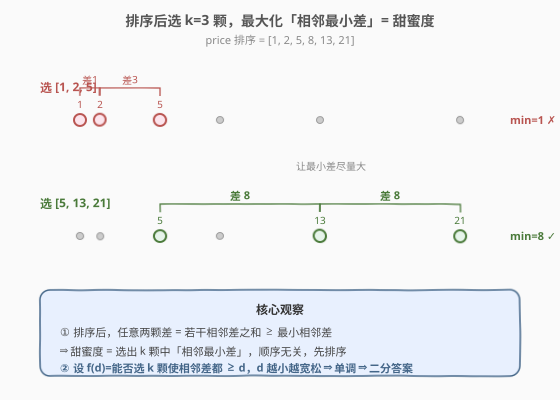
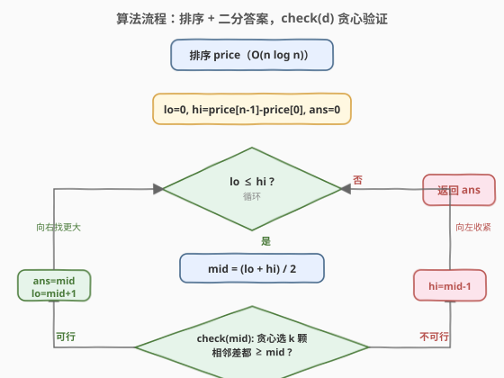

# 礼盒的最大甜蜜度

- **题目名称**：礼盒的最大甜蜜度
- **链接**：[2517. 礼盒的最大甜蜜度](https://leetcode.cn/problems/maximum-tastiness-of-candy-basket/)
- **难度**：中等
- **标签**：数组、二分查找、二分答案、贪心、排序

## 1. 题目概述

给定正整数数组 `price`（`price[i]` 为第 `i` 颗糖的价格）和正整数 `k`。商店出售装 `k` 颗**不同**糖果的礼盒，礼盒的**甜蜜度** = 盒内任意两颗糖果价格差的绝对值中的**最小值**。返回能达到的**最大甜蜜度**。

**示例 1**：

```text
输入：price = [13,5,1,8,21,2], k = 3
输出：8
解释：选价格 [13,5,21]（即排序后 [5,13,21]）。
     甜蜜度 = min(|5-13|, |13-21|) = min(8, 8) = 8。可以证明 8 是最大甜蜜度。
```

**示例 2**：

```text
输入：price = [1,3,1], k = 2
输出：2
解释：选 [1,3]。甜蜜度 = min(|1-3|) = 2。
```

**示例 3**：

```text
输入：price = [7,7,7,7], k = 2
输出：0
解释：任意两颗价格都相同，差为 0，甜蜜度 = 0。
```

**约束条件**：

- $2 \le k \le \text{price.length} \le 10^5$
- $1 \le \text{price[i]} \le 10^9$

> 💡 本题是经典的「最大化最小值」二分答案题，与 [1552. 两球之间的磁力](https://leetcode.cn/problems/magnetic-force-between-two-balls/) **完全同构**（同一骨架、不同包装：把"磁力最小间距"换成"价格最小差"）。

---

## 2. 解题思路

### 2.1 暴力思路

枚举从 `n` 颗中选 `k` 颗的所有组合（$\binom{n}{k}$ 种），每种计算两两差取最小、再取最大。$n=10^5$ 时组合数天文级，完全不可行。

> ⚠️ 暴力的根因在于把"选 k 颗"当成**组合搜索**处理。但甜蜜度的判定只依赖"选了哪些值"而与原始下标顺序无关，一旦意识到"相邻差"才是关键，问题就从指数搜索塌缩为对答案域的二分。

### 2.2 核心观察：排序 + 二分答案



三个观察层层递进：

1. **排序后只需看相邻差**：对任意选出的 $k$ 颗，按价格排序为 $a_1 \le a_2 \le \cdots \le a_k$。任意 $a_j - a_i\ (j>i)$ 是若干相邻差之和 $= (a_{i+1}-a_i)+\cdots+(a_j-a_{j-1}) \ge$ 其中最小的相邻差。故**全盒最小差必在某对相邻选中取得**，即甜蜜度 $=$ 选出 $k$ 颗中「相邻最小差」。于是原数组顺序无关，先整体排序。

2. **答案域单调（二段性）**：设 $f(d)=$ 能否选出 $k$ 颗使相邻差都 $\ge d$。$d$ 越小越宽松、越易满足。存在分界点 $d^*$：$d \le d^*$ 可行、$d > d^*$ 不可行，答案即最大可行 $d^*$。这正是二分所需的二段性。

3. **check 贪心 $O(n)$**：给定 $d$，能否选出 $k$ 颗使相邻差都 $\ge d$？贪心：先选最小的，再每次选"下一个价格 $\ge$ 上一个 $+\,d$"的。选越靠前的越给后面留空间（交换论证：贪心第 $i$ 个 $g_i \le$ 任意合法解第 $i$ 个 $b_i$，故贪心能选的个数 $\ge$ 合法解的个数）。

> 💡 **识别信号**：题目求「最大化最小值」+ 能 $O(n)$ 验证候选答案 $\Rightarrow$ 想「二分答案」。与 [875](../0801-0900/875_爱吃香蕉的珂珂.md)/[1011](../1001-1100/1011_在D天内送达包裹的能力.md)/[410](../0401-0500/410_分割数组的最大值.md) 的「最小化最大值」互为镜像：那类可行时收缩方向是「向左找更小」，本题是「向右找更大」。

### 2.3 算法流程图



二分 $d \in [0,\ \text{price[n-1]}-\text{price[0]}]$，每次 `check(d)` 贪心计数：

- `count = 1, last = price[0]`
- 遍历 `i = 1..n-1`：若 `price[i] - last >= d`，则 `count++, last = price[i]`（提前 `count >= k` 即返回真）
- `count >= k` 即可行

可行 $\Rightarrow$ `ans = mid; lo = mid + 1`（向右找更大）；不可行 $\Rightarrow$ `hi = mid - 1`（向左收紧）。

### 2.4 示例演算

![示例演算：price=[13,5,1,8,21,2], k=3 二分过程](../images/candy_tastiness_walkthrough.svg)

以示例 1 `price = [13,5,1,8,21,2]`、`k = 3` 为例。排序后 `price = [1,2,5,8,13,21]`，跨度 $\text{price[5]}-\text{price[0]} = 20$，故 `lo=0, hi=20`。各轮 `check(mid)` 的贪心选取与计数见上表，最终 `ans = 8`。

> ⚠️ **贪心选取的细节**：以 `mid=8` 为例，`last=1`：`2-1=1<8` 跳过、`5-1=4<8` 跳过、`8-1=7<8` 跳过、`13-1=12≥8` 选中（`last=13`）、`21-13=8≥8` 选中 $\Rightarrow$ 选中 `[1,13,21]`，`count=3≥k` ✓。可见"相邻差都≥d"是对**选中序列的相邻**而言，不是对原数组相邻下标而言。

---

## 3. 参考代码

### C++

```cpp
class Solution {
public:
    int maximumTastiness(vector<int>& price, int k) {
        sort(price.begin(), price.end());
        int lo = 0, hi = price.back() - price.front();
        int ans = 0;
        while (lo <= hi) {
            int mid = lo + (hi - lo) / 2;
            if (check(price, mid, k)) {
                ans = mid;        // 可行，向右找更大
                lo = mid + 1;
            } else {
                hi = mid - 1;      // 不可行，向左收紧
            }
        }
        return ans;
    }
private:
    bool check(const vector<int>& price, int d, int k) {
        int cnt = 1, last = price[0];
        for (int i = 1; i < (int)price.size(); ++i) {
            if (price[i] - last >= d) {
                if (++cnt >= k) return true;   // 提前终止
                last = price[i];
            }
        }
        return cnt >= k;
    }
};
```

### Python

```python
class Solution:
    def maximumTastiness(self, price: List[int], k: int) -> int:
        price.sort()
        def check(d: int) -> bool:
            cnt, last = 1, price[0]
            for p in price[1:]:
                if p - last >= d:
                    cnt += 1
                    last = p
                    if cnt >= k:
                        return True
            return cnt >= k

        lo, hi, ans = 0, price[-1] - price[0], 0
        while lo <= hi:
            mid = (lo + hi) // 2
            if check(mid):
                ans = mid       # 可行，向右找更大
                lo = mid + 1
            else:
                hi = mid - 1    # 不可行，向左收紧
        return ans
```

> ⚠️ **三个易错点**：
> 1. **`lo` 从 0 开始**：有重复值时答案可能为 0（示例 3），`check(0)` 恒真（任意 $k$ 颗都满足差 $\ge 0$）。若误从 1 开始会漏掉 0 答案。
> 2. **上界取 $\text{price[-1]}-\text{price[0]}$**：$k\ge 2$ 时最小相邻差不超过总跨度（鸽巢：$k$ 个点分布跨度 $R$ 内，最小相邻差 $\le R/(k-1) \le R$），是紧且合法的上界。也可取更紧的 $R/(k-1)$，仅省几次二分。
> 3. **提前终止**：`cnt >= k` 立即返回，避免遍历全数组，常数更优。

---

## 4. 复杂度分析

| 维度 | 复杂度 | 说明 |
|------|--------|------|
| **时间** | $O(n \log n + n \log M)$ | 排序 $O(n\log n)$；二分 $O(\log M)$ 次（$M=\text{price[n-1]}-\text{price[0]} \le 10^9$，约 $30$ 次），每次 `check` $O(n)$ |
| **空间** | $O(\log n)$ | 排序递归栈（原地排序，不额外开数组）；Python `check` 闭包常数空间 |
| 对照：暴力枚举组合 | $O(\binom{n}{k}\cdot k)$ | 组合数爆炸，$n=10^5$ 不可行 |

> 💡 $M \le 10^9$ 时二分约 $30$ 轮，$n=10^5$ ⇒ 总比较约 $3\times10^6$ 次，远低于时限。即便上界取 $10^9$ 也不慢；用更紧的 $R/(k-1)$ 可进一步省常数。

---

## 5. 扩展：上界收紧与贪心正确性证明

### 5.1 上界收紧到 $(M)/(k-1)$

由鸽巢原理，$k$ 个点分布在长度 $M=\text{price[n-1]}-\text{price[0]}$ 的区间内，最小相邻差 $\le M/(k-1)$（否则 $k$ 个点撑开的总跨度 $> (k-1)\cdot M/(k-1) = M$，矛盾）。故可令 `hi = M / (k-1)`。这只是省去约 $\log_2(k-1)$ 次二分，不改变复杂度；主解用更朴素的 `hi = M` 便于理解，且对 $k=2$ 时两者相等。

### 5.2 贪心 check 的正确性（交换论证）

设最优解选 $b_1 < b_2 < \cdots < b_k$（相邻差都 $\ge d$），贪心选 $g_1 < g_2 < \cdots$。归纳证明 $g_i \le b_i$：

- 基座：$g_1 = \text{price[0]} \le b_1$（$b_1$ 是某个选中元素，必 $\ge$ 最小元素）。
- 归纳：若 $g_i \le b_i$，则 $g_i + d \le b_i + d \le b_{i+1}$（因 $b_{i+1}-b_i\ge d$）。贪心取"首个 $\ge g_i + d$"的元素 $\le b_{i+1}$，即 $g_{i+1} \le b_{i+1}$。

故贪心至少能选出与最优解同样多个元素：贪心选出 $\ge k \Leftrightarrow$ 存在合法选法 $\Leftrightarrow$ `check(d)` 为真。即贪心判定与最优解等价，不会漏判也不会误判。

### 5.3 与「最小化最大值」的对照

| 维度 | 2517（最大化最小值） | 875/1011/410（最小化最大值） |
|------|------|------|
| 求解 | 最大可行下界 $d^*$ | 最小可行上界 $k^*$ |
| 单调方向 | $f(d)$ 随 $d$ 递减 | $g(k)$ 随 $k$ 递减 |
| 可行分支 | `ans=mid; lo=mid+1`（向右扩） | `ans=mid; hi=mid-1`（向左缩） |
| check 结构 | 贪心选满 $k$ 个（计数判定） | 贪心划分/装填不超过限额 |

---

## 6. 面试要点

1. **甜蜜度为何只需看相邻差？**

   > 选出 $k$ 颗排序后，任意 $a_j-a_i\ (j>i)$ 是若干相邻差之和 $\ge$ 其中最小相邻差。故全局最小差必在某对相邻选中取得。于是只需维护"选中序列的相邻差"，无需枚举所有 $\binom{k}{2}$ 对，且与原数组顺序无关 $\Rightarrow$ 先排序。

2. **为什么能二分？二段性来自哪？**

   > $f(d)=$"能否选 $k$ 颗使相邻差都 $\ge d$"随 $d$ 单调递减（$d$ 越大越难）。故存在分界 $d^*$：$\le d^*$ 可行、$>d^*$ 不可行。二分定位 $d^*$ 即最大可行值，就是答案。

3. **贪心 check 为什么对？**

   > 越靠前的选择给后续留的余量越大。形式化（交换论证）：贪心第 $i$ 个 $g_i \le$ 任意合法解第 $i$ 个 $b_i$（归纳），所以贪心能选的个数 $\ge$ 合法解的个数。即贪心可行 $\Leftrightarrow$ 存在合法解，不会漏判。

4. **答案为什么可能是 0？**

   > 当存在 $k$ 颗价格相同（或无法拉开任何正间距）时，最大相邻差为 $0$。如示例 3 全相等。`lo` 从 $0$ 起以覆盖此情形，`check(0)` 恒真（差 $\ge 0$ 总成立），保证 $ans\ge 0$。

5. **与 875/1011/410 等「最小化最大值」题有何异同？**

   > 同属二分答案，差异在二分方向与 check 形态：那些求「最小可行上限」，可行时 `ans=mid; hi=mid-1` 向左收缩、check 是"贪心划分不超过 m 段"；本题求「最大可行下限」，可行时 `ans=mid; lo=mid+1` 向右扩张、check 是"贪心选满 k 个"。识别题面"最大化最小/最小化最大"即可判定方向。

> 💡 **一句话总结**：2517 = 1552 的同构镜像——「排序 + 二分答案 + 贪心 check」。排序把"任意两两差"塌缩为"相邻差"；$f(d)$ 的单调性给出二段性；贪心 $O(n)$ 验证每个候选 $d$；可行即向右找更大，最终拿到最大可行甜蜜度。

---

## 7. 同类练习题

- [1552. 两球之间的磁力](https://leetcode.cn/problems/magnetic-force-between-two-balls/)：与本题**完全同构**（排序+二分答案+贪心选 k 个使最小间距最大），同一模板的不同包装，换汤不换药
- [875. 爱吃香蕉的珂珂](https://leetcode.cn/problems/koko-eating-bananas/)（[题解](../0801-0900/875_爱吃香蕉的珂珂.md)）：二分答案母题，对照「最小化最大值」的收缩方向，与本题方向相反
- [410. 分割数组的最大值](https://leetcode.cn/problems/split-array-largest-sum/)：二分答案+贪心 check，check 改为"贪心划分子数组不超过 m 段"，与 1011 同构
- [1011. 在 D 天内送达包裹的能力](https://leetcode.cn/problems/capacity-to-ship-packages-within-d-days/)（[题解](../1001-1100/1011_在D天内送达包裹的能力.md)）：二分答案+贪心按天装货验证，对照「最小化最大值」的 check 形态
- [2064. 分配给商店的最小商品数量](https://leetcode.cn/problems/minimized-maximum-of-products-distributed-to-any-store/)：「最小化最大值」二分答案，与本题方向相反，便于对照两种收缩写法与 check 计数方向
