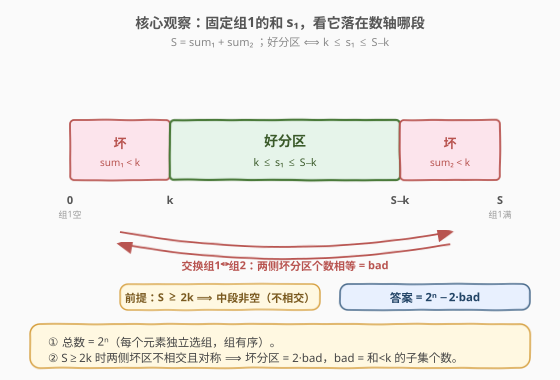
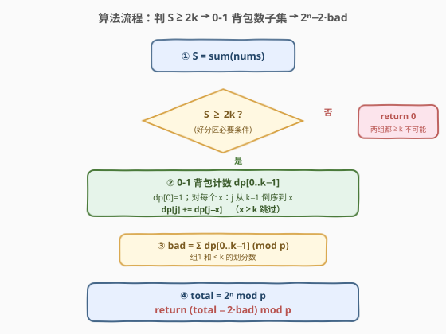

# 好分区的数目

- **题目名称**：好分区的数目
- **链接**：[2518. 好分区的数目](https://leetcode.cn/problems/number-of-great-partitions/)
- **难度**：困难
- **标签**：数组、动态规划、背包、数学

## 1. 题目概述

给你一个正整数数组 `nums` 和一个整数 `k`。**分区**的定义是：将数组划分成两个**有序**的组，每个元素**恰好**属于其中一个组。若分区中**每个组**的元素和都 $\ge k$，则称其为一个**好分区**。

返回**不同**的好分区数目。由于答案可能很大，返回对 $10^9+7$ 取余后的结果。两个分区不同 ⟺ 存在某元素 `nums[i]` 被分到了不同的组。

**示例 1**：

```text
输入：nums = [1,2,3,4], k = 4
输出：6
解释：好分区为 ([1,2,3],[4]), ([1,3],[2,4]), ([1,4],[2,3]), ([2,3],[1,4]), ([2,4],[1,3]), ([4],[1,2,3])。
```

**示例 2**：

```text
输入：nums = [3,3,3], k = 4
输出：0
解释：数组中不存在好分区。
```

**示例 3**：

```text
输入：nums = [6,6], k = 2
输出：2
解释：nums[0] 放第一组或第二组各算一种，好分区为 ([6],[6]) 和 ([6],[6])。
```

**约束条件**：

- $1 \le \text{nums.length},\ k \le 1000$
- $1 \le \text{nums}[i] \le 10^9$

> 💡 **关键语义**：两个组是**有序**的（组 1、组 2 可区分），所以「A 在组 1、B 在组 2」与「A 在组 2、B 在组 1」是**两种**不同分区。这让总分区数恰为 $2^n$（每个元素独立选组 1 或组 2），无需除以 2。

---

## 2. 解题思路

### 2.1 暴力思路：枚举每个元素归属

对每个元素二选一放组 1 / 组 2，共 $2^n$ 种分区，逐个判断两组和是否都 $\ge k$。$n = 1000$ 时 $2^{1000}$ 是天文数字，完全不可行。

### 2.2 核心观察：正难则反 —— 总数减去坏分区



直接数「好分区」难（要同时管两组和），反过来数「**坏分区**」容易：坏分区 = 至少有一组和 $< k$。把视角锁定在**组 1 的和**上，设 $S = \sum \text{nums}[i]$：

1. **必要条件**：好分区要求 $\text{sum}_1 \ge k$ 且 $\text{sum}_2 \ge k$，相加得 $S = \text{sum}_1 + \text{sum}_2 \ge 2k$。故 **$S < 2k$ 直接返回 0**。
2. **总数**：每个元素独立选组，总分区数 $= 2^n$。每个分区↔「组 1 的元素子集」一一对应，于是「组 1 和 $< k$」的分区数 = **和 $< k$ 的子集个数**，记为 $\text{bad}$。
3. **对称性**：把「组 1 和 $< k$」与「组 2 和 $< k$」对偶。由于两组可交换标签，二者**数目相等**，都是 $\text{bad}$。
4. **不相交**：当 $S \ge 2k$ 时，「组 1 和 $< k$」要求 $\text{sum}_1 < k$，「组 2 和 $< k$」要求 $\text{sum}_1 = S - \text{sum}_2 > S - k \ge k$，两者不可能同时成立 ⟹ **两类坏分区不相交**。

由容斥（不相交则直接相加）：坏分区总数 $= 2\,\text{bad}$，故

$$
\text{答案} = 2^n - 2 \cdot \text{bad} \pmod{10^9+7}
$$

> 💡 **$\text{bad}$ 是什么？** $\text{bad} = $ 「从 `nums` 中选一个子集作为组 1，使其元素和 $< k$」的方案数。这恰是 **0-1 背包计数**：`dp[j]` = 和恰为 $j$ 的子集个数，则 $\text{bad} = \sum_{j=0}^{k-1} \text{dp}[j]$。

> ⚠️ **空集与全集**：空集（组 1 为空，和 $0 < k$）计入 $\text{bad}$，对应「组 2 装满、组 1 空」这种坏分区；全集（组 1 装满，和 $S \ge 2k \ge k$）不在 $\text{bad}$ 内，但由对称性它对应「组 2 空」的坏分区，被**另一侧**的 $\text{bad}$ 计入。两侧各数一次，无重复无遗漏。

### 2.3 算法流程图



1. 算总和 $S$，若 $S < 2k$，返回 $0$。
2. 0-1 背包计数：`dp[0..k-1]`，`dp[0]=1`；对每个 $x \in \text{nums}$，$j$ 从 $k-1$ **倒序**到 $x$：$\text{dp}[j] \mathrel{+}= \text{dp}[j-x]$。
3. $\text{bad} = \sum_{j=0}^{k-1} \text{dp}[j] \bmod p$。
4. $\text{total} = 2^n \bmod p$。
5. 返回 $(\text{total} - 2\,\text{bad}) \bmod p$。

状态转移（**倒序**保证每个元素只用一次，0-1 背包核心）：

$$
\text{dp}[j] = \text{dp}[j] + \text{dp}[j - x]
$$

> 💡 **为什么只到 $k-1$？** 我们只关心和 $< k$ 的子集个数，故 dp 维度开到 $k$。任何 $x \ge k$ 的元素单独加入就和 $\ge k$，不可能出现在「和 $< k$」的子集中——内层循环 `j` 从 $k-1$ 起已小于 $x$，自然不执行，可显式 `continue` 跳过。但要注意：**这些大元素仍参与 $2^n$ 的计数**（每个仍贡献一个 ×2），只是不进背包。

### 2.4 示例演算

![示例演算：nums=[1,2,3,4], k=4 → dp 演化 → 16−2×5=6](../images/great_partition_walkthrough.svg)

以示例 1 `nums = [1,2,3,4]`、$k=4$ 演算。$S=10 \ge 2k=8$，继续。`dp` 长度 $k=4$（下标 $0..3$），初始 `dp[0]=1`：

| 处理 $x$ | dp[0] | dp[1] | dp[2] | dp[3] | 新增子集（和$<$4） | $\text{bad}$ |
|----------|-------|-------|-------|-------|----------------------|------|
| 初始     | 1     | 0     | 0     | 0     | $\{\}$（和 0）          | 1    |
| 1        | 1     | 1     | 0     | 0     | $\{1\}$（和 1）         | 2    |
| 2        | 1     | 1     | 1     | 1     | $\{2\}$,$\{1,2\}$（和 2,3） | 4    |
| 3        | 1     | 1     | 1     | **2** | $\{3\}$（和 3）         | 5    |
| 4($\ge k$, 跳过) | 1 | 1 | 1 | 2 | — | 5 |

- 处理 $x=3$ 时 `dp[3] += dp[0] = 1`，使 `dp[3]` 由 1 变 2（子集 $\{1,2\}$ 与 $\{3\}$ 都凑出和 3）。
- $x=4 \ge k$，内层循环不执行，dp 不变。
- $\text{bad} = 1+1+1+2 = 5$；$\text{total} = 2^4 = 16$；答案 $= 16 - 2\times5 = 6$ ✓。

> ⚠️ 示例 2 `[3,3,3], k=4`：$S=9 \ge 8$，`dp[0]=1, dp[3]=3`，$\text{bad}=1+3=4$，$\text{total}=8$，答案 $=8-8=0$ ✓。示例 3 `[6,6], k=2`：$S=12\ge4$，`dp[0]=1`（其余下标因 $6\ge k$ 全程跳过），$\text{bad}=1$，$\text{total}=4$，答案 $=4-2=2$ ✓。

---

## 3. 参考代码

### C++

```cpp
class Solution {
  public:
    int countPartitions(vector<int>& nums, int k) {
        const long long MOD = 1e9 + 7;
        long long s = 0;
        for (int x : nums) s += x;
        if (s < 2LL * k) return 0;                 // 两组都 >=k 不可能

        vector<long long> dp(k, 0);                // dp[j] = 和恰为 j 的子集个数, j ∈ [0,k-1]
        dp[0] = 1;
        for (int x : nums) {
            if (x >= k) continue;                  // 单元素已 >=k，不可能进入"和<k"子集
            for (int j = k - 1; j >= x; --j)       // 倒序，0-1 背包保证每个 x 用一次
                dp[j] = (dp[j] + dp[j - x]) % MOD;
        }
        long long bad = 0;                         // 组1 和 < k 的划分数
        for (int j = 0; j < k; ++j) bad = (bad + dp[j]) % MOD;

        long long total = 1;                      // 2^n mod MOD（大元素也算入 n）
        for (int i = 0; i < (int)nums.size(); ++i) total = total * 2 % MOD;

        long long two_bad = 2 * bad % MOD;
        return (int)((total - two_bad + MOD) % MOD);
    }
};
```

> ⚠️ **易错点**：(1) 内层 `j` 必须**倒序**，否则 `dp[j-x]` 会被本轮刚更新的值污染，退化成完全背包（一个元素被多次选）。(2) `2 * bad` 在 C++ 里 `bad < MOD`，`2*bad < 2*10^9` 用 `long long` 接住再取余，避免 `int` 溢出。(3) 作差后先 `+MOD` 再 `%MOD`，防止负数。

### Python

```python
class Solution:
    def countPartitions(self, nums: List[int], k: int) -> int:
        MOD = 10**9 + 7
        if sum(nums) < 2 * k:                      # 两组都 >=k 不可能
            return 0

        dp = [0] * k                               # dp[j] = 和恰为 j 的子集个数
        dp[0] = 1
        for x in nums:
            if x >= k:                             # 单元素已 >=k，跳过
                continue
            for j in range(k - 1, x - 1, -1):      # 倒序，0-1 背包
                dp[j] = (dp[j] + dp[j - x]) % MOD

        bad = sum(dp) % MOD                        # 组1 和 < k 的划分数
        total = pow(2, len(nums), MOD)             # 2^n mod MOD
        return (total - 2 * bad) % MOD             # Python 的 % 自动处理负数
```

> 💡 Python 大整数无溢出，`pow(2, n, MOD)` 内置快速幂一步到位；`(total - 2*bad) % MOD` 即使为负也自动转正，无需手动 `+MOD`。逻辑与 C++ 完全镜像。

---

## 4. 复杂度分析

| 维度 | 复杂度 | 说明 |
|------|--------|------|
| 时间复杂度 | $O(n \cdot k)$ | 每个 $x < k$ 的元素扫一遍长度 $k$ 的 dp；$n, k \le 1000$ ⟹ $\le 10^6$ |
| 空间复杂度 | $O(k)$ | 一维计数 dp，长度 $k$ |
| 对照：暴力枚举 | $O(2^n)$ | 逐分区判两组和，$n=1000$ 指数爆炸 |

> 💡 本题能做在于「只关心和 $< k$ 的子集」——dp 维度被 $k$（$\le 1000$）封顶，与元素值 $10^9$ 无关。$x \ge k$ 的元素直接跳过，背包里只留「小元素」，故是**伪多项式**复杂度。

---

## 5. 扩展：为什么不直接 DP 数好分区？

直觉上可定义 `dp[i][s1][s2]` = 前 `i` 个元素、组 1 和为 `s1`、组 2 和为 `s2` 的方案数。但 $s_1, s_2$ 都可高达 $n \cdot \max = 10^{12}$，状态空间爆炸，不可行。

**正难则反**的关键在于把「两组都 $\ge k$」的**联合约束**转化为「**某一组** $< k$」的**单侧约束**：

- 联合约束需同时跟踪两个高维和 → 状态爆炸；
- 单侧约束只跟踪一个和 $< k$ → 维度塌缩到 $k$；
- 再用「$S \ge 2k$ 时两侧不相交 + 对称」把单侧结果翻倍扣减，得到精确答案。

> 💡 这是计数题里常见的「**总数 − 补集**」范式：当目标集合（好分区）的结构复杂、而其补集（坏分区）有低维刻画时，转去数补集。配套的「对称性」与「不相交」则负责把补集规模与目标精确关联，避免重复计数。

---

## 6. 面试要点

1. **为什么总分区数是 $2^n$ 而不是 $2^n / 2$？**

   > 题目规定两个组**有序**（组 1、组 2 可区分），且「某元素分到不同组」即视为不同分区。故每个元素独立二选一，共 $2^n$ 种，无需除以 2。示例 3 `[6,6]` 输出 2 而非 1 正说明这一点。

2. **$S < 2k$ 为什么直接返回 0？**

   > 好分区要求 $\text{sum}_1 \ge k$ 且 $\text{sum}_2 \ge k$，相加 $S = \text{sum}_1 + \text{sum}_2 \ge 2k$。故 $S < 2k$ 是好分区存在的**必要条件**，不满足则必无解，提前剪枝省去全部 DP。

3. **两类坏分区为什么不相交？为什么数目相等？**

   > 不相交：$S \ge 2k$ 时，「组 1 和 $< k$」要 $\text{sum}_1 < k$，「组 2 和 $< k$」要 $\text{sum}_1 > S-k \ge k$，矛盾，故不相交。相等：交换两组标签是分区的双射，把「组 1 和 $< k$」映到「组 2 和 $< k$」，故两者个数相同，都是 $\text{bad}$。

4. **空集和全集怎么处理？会不会漏或多算？**

   > 空集（组 1 空，和 $0<k$）计入 $\text{bad}$，对应「组 1 空组 2 满」的坏分区；全集（组 1 满，和 $S\ge 2k$）不在 $\text{bad}$ 内，但由对称性它对应「组 2 空」的坏分区，被另一侧的 $\text{bad}$ 计入。两侧各算一次、不相交，故无重复无遗漏，$2\,\text{bad}$ 精确。

5. **背包为什么只到 $k-1$？大元素怎么处理？**

   > 我们只数「和 $< k$」的子集，dp 维度开到 $k$ 即可。任何 $x \ge k$ 单独加入就和 $\ge k$，不可能进入这种子集，内层循环 `j` 从 $k-1$ 起已小于 $x$ 故不执行，可显式跳过。但大元素仍参与 $2^n$（每个仍二选一贡献 ×2），只是不进背包——这正是复杂度能压到 $O(nk)$ 的原因。

> 💡 **一句话总结**：好分区 = 总分区 $2^n$ 减坏分区；$S \ge 2k$ 时两侧坏分区不相交且对称，坏分区 $= 2 \times$（和 $< k$ 的子集个数），后者用 0-1 背包计数 $O(nk)$ 求得，dp 维度被 $k$ 封顶与元素值 $10^9$ 无关。

---

## 7. 同类练习题

- [416. 分割等和子集](https://leetcode.cn/problems/partition-equal-subset-sum/)（[题解](../0401-0500/416_分割等和子集.md)）：0-1 背包判**精确和**可达性，对照本题用背包做**计数**，感受布尔版与计数版的状态转移
- [494. 目标和](https://leetcode.cn/problems/target-sum/)（[题解](../0401-0500/494_目标和.md)）：子集和**计数**问题，同样是「总数 − 补集」范式（符号分配转子集和）
- [1049. 最后一块石头的重量 II](https://leetcode.cn/problems/last-stone-weight-ii/)（[题解](../1001-1100/1049_最后一块石头的重量II.md)）：0-1 背包求最值，同「两组划分」结构，对照本题的计数问法
- [2035. 将数组分成两个数组并最小化数组和的差](https://leetcode.cn/problems/partition-array-into-two-arrays-to-minimize-sum-difference/)：两组划分 + meet-in-the-middle，对照本题「只关单侧和 $<k$」把状态塌缩到 $k$
