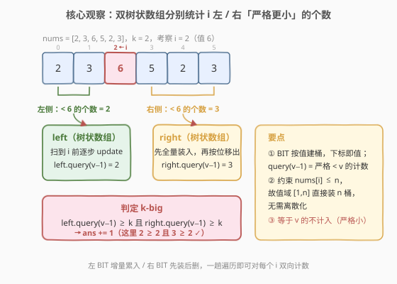
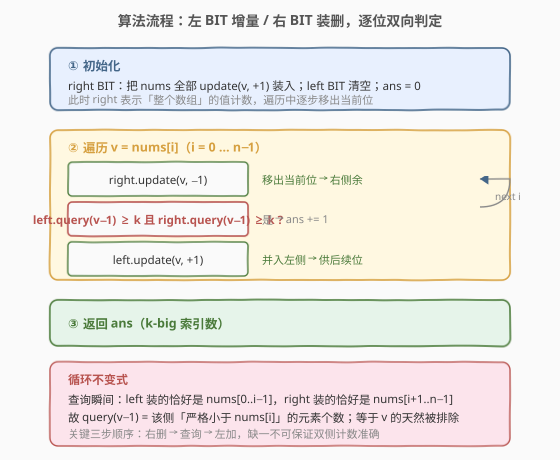

# 统计 K-Big 索引的数量

- **题目名称**：统计 K-Big 索引的数量
- **链接**：[2519. 统计 K-Big 索引的数量](https://leetcode.cn/problems/count-the-number-of-k-big-indices/)
- **难度**：困难
- **标签**：树状数组、线段树、数组、二分查找、分治、有序集合、归并排序

## 1. 题目概述

给定一个**下标从 $0$ 开始**的整数数组 `nums` 和一个正整数 $k$。

如果满足以下两个条件，我们称下标 $i$ 为 **k-big**：

- 存在至少 $k$ 个**不同的**索引 $\text{idx}_1$，满足 $\text{idx}_1 < i$ 且 $\text{nums}[\text{idx}_1] < \text{nums}[i]$（左侧严格更小的元素 $\ge k$ 个）；
- 存在至少 $k$ 个**不同的**索引 $\text{idx}_2$，满足 $\text{idx}_2 > i$ 且 $\text{nums}[\text{idx}_2] < \text{nums}[i]$（右侧严格更小的元素 $\ge k$ 个）。

返回 k-big 索引的数量。

**示例 1**：

```text
输入：nums = [2,3,6,5,2,3], k = 2
输出：2
解释：只有两个 2-big 索引
- i = 2（值 6）：左侧更小的 idx1 = 0,1（值 2,3）共 2 个；右侧更小的 idx2 = 3,4,5（值 5,2,3）共 3 个；
- i = 3（值 5）：左侧更小的 idx1 = 0,1（值 2,3）共 2 个；右侧更小的 idx2 = 4,5（值 2,3）共 2 个。
```

**示例 2**：

```text
输入：nums = [1,1,1], k = 3
输出：0
解释：没有任何索引左右两侧都各有 ≥ 3 个更小元素。
```

**约束条件**：

- $1 \le \text{nums.length} \le 10^5$
- $1 \le \text{nums}[i],\ k \le \text{nums.length}$

> 💡 关键细节：判定只看「**严格更小**」的元素，等于 $\text{nums}[i]$ 的不算；并且左右两侧各需 $\ge k$ 个，是「与」关系。约束里 $\text{nums}[i] \le n$ 这一条至关重要——它意味着**值域恰好是 $[1,n]$**，可让树状数组直接按下标即值建桶，无需离散化。

---

## 2. 解题思路

### 2.1 暴力思路：逐位双向扫描

最直白的写法是对每个下标 $i$，向左、向右各扫一遍统计严格小于 $\text{nums}[i]$ 的元素个数，再判断两侧是否都 $\ge k$。每个位置做两次最长 $O(n)$ 的扫描，$n$ 个位置共 $O(n^2)$。

$n \le 10^5$ 时约 $10^{10}$ 步，**必超时**。瓶颈在于「为每个位置重新统计两侧更小数」做了大量重复工作——其实只要维护一个能 $O(\log n)$ 回答「值域 $[1,v-1]$ 内已插入多少个数」的结构，就能把每位的双侧计数压到 $O(\log n)$。

> ⚠️ 这类「统计某侧严格更小元素个数」的需求，正是**树状数组（BIT）/ 归并排序 / 有序集合**的标准战场（参见 315、327、493）。关键不在于「扫两侧」，而在于「用一个可增量维护的前缀计数器，在 $O(\log n)$ 内回答前缀和」。

### 2.2 核心观察：双树状数组，左增右删



**关键直觉**：把判定拆成两个独立的「前缀计数」问题——左侧需要「$\text{nums}[0..i-1]$ 中 $< \text{nums}[i]$ 的个数」，右侧需要「$\text{nums}[i+1..n-1]$ 中 $< \text{nums}[i]$ 的个数」。两者都可用一个**按下标即值建桶的树状数组**回答：

- 维护两个 BIT：`left` 与 `right`，均以**值**为下标（值域 $[1,n]$）。
- `left`：从空开始，随遍历**增量累入**——遍历到 $i$ 时它恰好装着 $\text{nums}[0..i-1]$。
- `right`：先**全量装入**所有 $\text{nums}$，遍历到 $i$ 时**先把当前 $\text{nums}[i]$ 移出**，于是它恰好装着 $\text{nums}[i+1..n-1]$。
- `query(v-1)` 返回已插入值中严格小于 $v$ 的个数（BIT 前缀和）。

于是对每个 $i$，只要 `left.query(nums[i]-1) >= k` 且 `right.query(nums[i]-1) >= k`，该位即为 k-big。

> 💡 **为什么「等于 $v$ 的不计入」天然成立？** `query(v-1)` 求的是值域 $[1, v-1]$ 的前缀和，等于 $v$ 的桶不在其中，故严格小。遍历中 `left` 在查询**之后**才并入当前 $v$，`right` 在查询**之前**已移出当前 $v$——因此查询瞬间 `left` = 纯左侧、`right` = 纯右侧，计数准确。

> 💡 **为何能不离散化？** 约束保证 $\text{nums}[i] \le n$，故值域恰好 $[1,n]$，BIT 开 $n$ 个桶即可。若题面允许更大值域，则需先排序去重做坐标压缩（参考 327 区间和的个数）。

### 2.3 算法流程图



三步：

1. **初始化**：`right` 把 `nums` 全部 `update(v, +1)` 装入；`left` 清空；`ans = 0`。
2. **遍历** `v = nums[i]`（$i = 0 \dots n-1$）：
   - `right.update(v, -1)`（移出当前位，使 `right` 只剩右侧）；
   - 若 `left.query(v-1) >= k` 且 `right.query(v-1) >= k` → `ans += 1`；
   - `left.update(v, +1)`（并入左侧，供后续位查询）。
3. **返回** `ans`。

> 💡 **三步顺序不可错**：「右删 → 查询 → 左加」。右删保证查询时 `right` 不含当前位；左加在查询之后保证 `left` 不含当前位。任一步颠倒都会让当前位错误地被算入某一侧。

### 2.4 示例演算

![示例演算：nums=[2,3,6,5,2,3]，仅 i=2、i=3 双侧都 ≥2](../images/kbig_example_walkthrough.svg)

以示例 1 `nums = [2,3,6,5,2,3]`、$k=2$ 为例，逐位读出 `left.query(v-1)` 与 `right.query(v-1)`：

| $i$ | $v=\text{nums}[i]$ | 左侧 $< v$ | 右侧 $< v$ | k-big? |
|-----|------|-----------|-----------|--------|
| 0 | 2 | 0 | 0 | ✘ |
| 1 | 3 | 1（值 2） | 1（值 2） | ✘（左 1 < 2） |
| 2 | 6 | 2（值 2,3） | 3（值 5,2,3） | ✓ |
| 3 | 5 | 2（值 2,3） | 2（值 2,3） | ✓ |
| 4 | 2 | 0 | 0 | ✘ |
| 5 | 3 | 2（值 2,2） | 0 | ✘（右 0 < 2） |

仅 $i=2$、$i=3$ 双侧都 $\ge 2$，返回 $\text{ans} = 2$ ✓。

> 💡 注意 $i=1$ 处 `right` 装着 $\text{nums}[2..5]=\{6,5,2,3\}$，其中 $<3$ 的只有 $\{2\}$ 一个，故右侧 $=1$，因左、右都 $<2$ 而不达标。$i=4$ 处 $v=2$ 是全数组最小值，两侧 $<2$ 恒为 $0$，必然不达标——最小值类位置永远成不了 k-big。

---

## 3. 参考代码

### C++

```cpp
class BinaryIndexedTree {
public:
    BinaryIndexedTree(int n) : n(n), c(n + 1) {}

    void update(int x, int delta) {
        for (; x <= n; x += x & -x) c[x] += delta;
    }

    // 返回已插入值中严格小于 x 的个数（前缀和 [1, x-1]）
    int query(int x) {
        int s = 0;
        for (; x; x -= x & -x) s += c[x];
        return s;
    }

private:
    int n;
    vector<int> c;
};

class Solution {
public:
    int kBigIndices(vector<int>& nums, int k) {
        int n = nums.size();
        BinaryIndexedTree left(n), right(n);
        for (int v : nums) right.update(v, 1);   // right 装入全部
        int ans = 0;
        for (int v : nums) {
            right.update(v, -1);                 // 移出当前位 → 右侧余
            if (left.query(v - 1) >= k && right.query(v - 1) >= k) ++ans;
            left.update(v, 1);                  // 并入左侧
        }
        return ans;
    }
};
```

> 💡 BIT 大小取 $n$（数组长度）即可，因为约束保证 $\text{nums}[i] \le n$，值域恰为 $[1,n]$。`query(v-1)` 在 $v=1$ 时退化为 `query(0)`，循环体不执行返回 $0$，正确表示「没有更小值」。

### Python

```python
class BinaryIndexedTree:
    def __init__(self, n):
        self.n = n
        self.c = [0] * (n + 1)

    def update(self, x, delta):
        while x <= self.n:
            self.c[x] += delta
            x += x & -x

    def query(self, x):
        s = 0
        while x:
            s += self.c[x]
            x -= x & -x
        return s


class Solution:
    def kBigIndices(self, nums: List[int], k: int) -> int:
        n = len(nums)
        left, right = BinaryIndexedTree(n), BinaryIndexedTree(n)
        for v in nums:
            right.update(v, 1)
        ans = 0
        for v in nums:
            right.update(v, -1)
            if left.query(v - 1) >= k and right.query(v - 1) >= k:
                ans += 1
            left.update(v, 1)
        return ans
```

> 💡 两版逻辑一致，均 $O(n \log n)$ 时间、$O(n)$ 空间。Python 版用元组一行建双 BIT，遍历里三步紧凑写完。

---

## 4. 复杂度分析

| 维度 | 复杂度 | 说明 |
|------|--------|------|
| **时间复杂度** | $O(n \log n)$ | 每位一次 `update`×2 + 一次 `query`×2，每次 $O(\log n)$，共 $n$ 位 |
| **空间复杂度** | $O(n)$ | 两个 BIT 各开 $n+1$ 桶 |
| 对照：暴力双向扫描 | $O(n^2)$ | 每位左、右各扫一遍，$n=10^5$ 约 $10^{10}$ 步，超时 |
| 对照：归并排序分治 | $O(n \log n)$ | 也可用归并改造同时统计双侧更小数，常数更大但同样可行 |

> 💡 BIT 把每位「双侧计数」从 $O(n)$ 降到 $O(\log n)$，总代价 $O(n \log n) \approx 10^5 \times 17 \approx 1.7 \times 10^6$ 步，远在时限内。

---

## 5. 扩展：归并排序 / 有序集合的等价实现

**范式抽象**。本题属于「**单点更新 + 前缀计数**」的经典结构题：对每个位置求「一侧严格更小的元素个数」。这恰是树状数组、线段树、有序集合（`SortedList` + `bisect`）、归并排序四个数据结构都能胜任的同质问题。

**有序集合写法（Python，思路对照）**。用两个 `SortedList`：`L` 增量、`R` 先装后删，每位 `L.bisect_left(v)` / `R.bisect_left(v)` 即得两侧严格更小个数。复杂度同为 $O(n \log n)$，但常数比 BIT 大、空间也更高，故作主解的替代而非首选。

```python
from sortedcontainers import SortedList

class Solution:
    def kBigIndices(self, nums: List[int], k: int) -> int:
        L, R = SortedList(), SortedList(nums)
        ans = 0
        for v in nums:
            R.remove(v)
            if L.bisect_left(v) >= k and R.bisect_left(v) >= k:
                ans += 1
            L.add(v)
        return ans
```

**归并排序写法（思路）**。也可在归并里同步统计：先离散化值域，归并时对左半每个元素数右半更小者得「右侧计数」，再对称做一次得「左侧计数」，最后筛两侧 $\ge k$。本质是 315 的双向版，但需两趟归并，代码量大、常数高，面试中不如 BIT 直观。

> 💡 **选型建议**：BIT 是「单点改 + 前缀和」最省代码与空间的实现；有序集合写法最易在面试白板上写对；归并排序适合「不能开额外大数组、要求 $O(n)$ 额外空间」或题面已排序时。本题值域天然 $[1,n]$，BIT 最契合。

---

## 6. 面试要点

1. **为什么「右删 → 查询 → 左加」三步顺序不能换？**

   > 查询时必须保证 `left` 只含左侧元素、`right` 只含右侧元素。若先「左加」再查询，当前位 $v$ 会混入 `left`——不过它等于 $v$ 被 `query(v-1)` 排除，看似无害，但若题面改成「$\le$」就会出错；更关键的是若先查询再「右删」，`right` 仍含当前位 $v$，等于 $v$ 的虽被排除，但逻辑上 `right` 此刻不是「纯右侧」，语义混乱。固定顺序「右删 → 查询 → 左加」让两侧集合在查询瞬间严格对应 $[0,i-1]$ 与 $[i+1,n-1]$，无歧义。

2. **BIT 大小为什么取 $n$ 而非最大值？值更大怎么办？**

   > 约束保证 $\text{nums}[i] \le n$，故值域恰为 $[1,n]$，BIT 开 $n$ 桶刚好覆盖。若值域可达 $10^9$，则需先排序去重做**坐标压缩**：把每个值映射为其在排序去重数组中的排名（$1$-indexed），再用排名作 BIT 下标。327 区间和的个数即典型需离散化的例子。

3. **`query(v-1)` 如何保证「严格更小」而非「小于等于」？**

   > BIT 的 `query(x)` 返回值域 $[1,x]$ 的前缀和。传 `v-1` 即只累加值 $\le v-1$ 也就是 $< v$ 的桶，等于 $v$ 的桶不在前缀内，故为严格更小。若需求「$\le$」则传 `query(v)` 即可。这一加减一的差别是 BIT 计数题最易错的点。

4. **全相同数组、$k=1$、$k=n$ 分别返回什么？**

   > 全相同如 `[1,1,1]`：每位左右两侧严格更小数均为 $0$，任意 $k\ge1$ 都返回 $0$（示例 2）。$k=1$：只要某位左右各有一个更小值即达标，返回达标位数。$k=n$：需左右两侧各有 $\ge n$ 个更小值，但单侧最多 $n-1$ 个，恒不可能，返回 $0$。算法对这些边界天然正确，无需特判。

5. **能否只开一个 BIT，分两趟分别统计左、右再合并？**

   > 可以。第一趟从左到右维护一个 BIT，记录每位「左侧更小数」`L[i]`；第二趟从右到左维护另一个 BIT 记录「右侧更小数」`R[i]`；最后数 `L[i]>=k 且 R[i]>=k` 的位。空间 $O(n)$ 存两个数组、时间仍 $O(n\log n)$。双 BIT 一趟法把两趟合并成一次遍历、省去存 `L/R` 数组，更紧凑，但单趟法更易理解、调试，是双 BIT 的退化写法。

> 💡 **一句话总结**：k-big $\Leftrightarrow$ 左、右两侧严格更小者各 $\ge k$。用两个按下标即值建桶的树状数组：`left` 增量累入、`right` 先装后删，一趟遍历里「右删 → 查询 → 左加」对每位 $O(\log n)$ 双向计数，$O(n\log n)$ 时间、$O(n)$ 空间出解。

---

## 7. 同类练习题

- [315. 计算右侧小于当前元素的个数](https://leetcode.cn/problems/count-of-smaller-numbers-after-self/)（[题解](../0301-0400/315_计算右侧小于当前元素的个数.md)）：本题「右侧更小数」的单侧母题，归并排序 / 树状数组双解，承接逆序对
- [327. 区间和的个数](https://leetcode.cn/problems/count-of-range-sum/)（[题解](../0301-0400/327_区间和的个数.md)）：前缀和 + 离散化树状数组，演示「值域大需坐标压缩」的进阶写法
- [493. 翻转对](https://leetcode.cn/problems/reverse-pairs/)（[题解](../0401-0500/493_翻转对.md)）：归并分治统计「右侧满足某条件」的元素数，与本题右侧计数同构
- [1365. 有多少小于当前数字的数字](https://leetcode.cn/problems/how-many-numbers-are-smaller-than-the-current-number/)（[题解](../1301-1400/1365_有多少小于当前数字的数字.md)）：本题去「双侧」约束的退化版，计数排序 / 排序前缀和即可
- [1395. 统计作战单位数](https://leetcode.cn/problems/count-number-of-teams/)（[题解](../1301-1400/1395_统计作战单位数.md)）：每位需统计左/右各「更大/更小」的个数，双 BIT 思路完全一致
