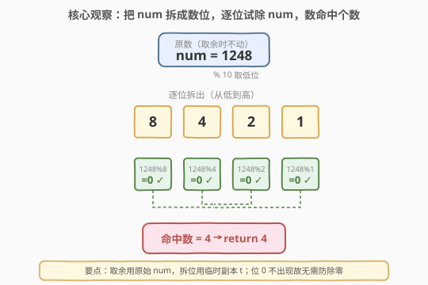
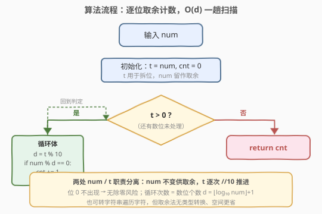
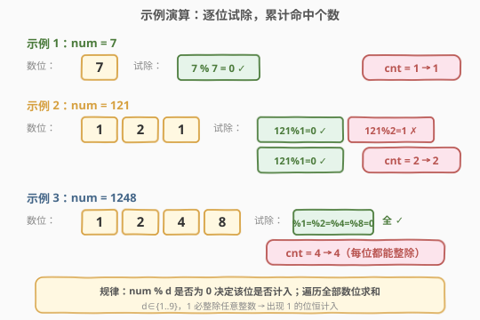

# 统计能整除数字的位数

- **题目名称**：统计能整除数字的位数
- **链接**：[2520. 统计能整除数字的位数](https://leetcode.cn/problems/count-the-digits-that-divide-a-number/)
- **难度**：简单
- **标签**：数学、模拟

## 1. 题目概述

给你一个整数 `num`，返回 `num` 中能整除 `num` 的**数位**的数目。

若 `num % val == 0`，则认为整数 `val` 可以整除 `num`。

**示例 1**：

```text
输入：num = 7
输出：1
解释：7 被自己整除，因此答案是 1。
```

**示例 2**：

```text
输入：num = 121
输出：2
解释：121 可以被 1 整除，但无法被 2 整除。由于 1 出现两次，所以返回 2。
```

**示例 3**：

```text
输入：num = 1248
输出：4
解释：1248 可以被它每一位上的数字整除，因此答案是 4。
```

**约束条件**：

- $1 \le \text{num} \le 10^9$
- `num` 的数位中**不含** $0$

> 💡 关键细节：「数位」是 `num` 十进制表示中的每一位数字（取值 $1\sim 9$，题目保证不含 $0$），而**整除的对象是整个 `num`** 而非「数位自身」。因此判断式是 $\text{num} \bmod d == 0$，不是 $d \bmod \text{某量} == 0$。另外题目允许**同值数位重复计入**（如示例 2 的两个 $1$ 都算），故只需逐位独立判定、累加命中数。

---

## 2. 解题思路

### 2.1 暴力思路：转字符串逐字符判定

最直观的实现是**把 `num` 转成字符串**，遍历每个字符：

- 把字符转回数字 $d$；
- 判断 $\text{num} \bmod d == 0$ 是否成立，成立则计数加一。

由于数位个数 $d \le 10$（$\text{num} \le 10^9$ 至多 10 位），逐位遍历为 $O(\log_{10}\text{num})$ 步，每步一次取余，完全可 AC。

> ⚠️ 转字符串引入了类型转换与额外 $O(\log_{10}\text{num})$ 的字符串空间。对位数的提取其实可以用纯整数运算 `% 10` / `// 10` 完成，无需借助字符串，下文给出更省的取余法。两种实现**判定逻辑完全一致**，差别只在「如何拿到每一位」。

### 2.2 核心观察：取余拆位，逐位试除



**关键直觉**：问题本质是一次**逐位扫描 + 条件计数**，没有可优化的代数结构（答案取决于 `num` 对其各数位的整除关系，只能逐个判定）。重点在于正确地**分离「拆位用的副本」与「取余用的原值」**。

设 $t$ 为拆位用的临时变量（初值 $= \text{num}$），$\text{cnt}$ 为命中计数：

- **拆位**：$d = t \bmod 10$ 取最低位，随后 $t \leftarrow \lfloor t / 10 \rfloor$ 推进到下一位；
- **试除**：判定 $\text{num} \bmod d == 0$，成立则 $\text{cnt} \leftarrow \text{cnt} + 1$；
- **终止**：$t = 0$ 表示所有数位已处理完毕。

> 💡 **为什么必须另设 $t$ 而不直接动 `num`？** 因为取余判定用的是**原始 `num`**：若边拆边把 `num` 自除以 10，后续位的试除就变成了「缩水后的部分值」对数位取余，语义全错。故 $t$ 负责「前进」、`num` 保持「不动」，二者职责分离。这和「在数组里找一个数、却用同一指针既遍历又比较」的混淆是同一类陷阱。

**关于除零**：约束保证数位不含 $0$，故 $d \in \{1,\dots,9\}$，`num % d` 无除零风险。若题目放宽允许 $0$ 数位，需在取余前加 `d != 0` 守卫（$0$ 不能整除任何数，也不参与计数）。

验证三个示例：

| `num` | 数位 | 各位试除 `num % d` | 命中 | 输出 |
|-------|------|--------------------|------|------|
| $7$ | $\{7\}$ | $7\%7=0$ ✓ | $1$ | $1$ |
| $121$ | $\{1,2,1\}$ | $121\%1=0$✓、$121\%2=1$✗、$121\%1=0$✓ | $2$ | $2$ |
| $1248$ | $\{1,2,4,8\}$ | $1248\%1{=}0$✓、$\%2{=}0$✓、$\%4{=}0$✓、$\%8{=}0$✓ | $4$ | $4$ |

### 2.3 算法流程图



流程是一趟 while 循环：

1. 初始化 $t = \text{num}$，$\text{cnt} = 0$；
2. 当 $t > 0$：取 $d = t \bmod 10$；若 $\text{num} \bmod d == 0$ 则 $\text{cnt}{+}{+}$；$t \leftarrow \lfloor t/10 \rfloor$；
3. 循环结束返回 $\text{cnt}$。

> 💡 循环次数等于 `num` 的十进制位数 $d = \lfloor\log_{10}\text{num}\rfloor + 1$。对 $\text{num} \le 10^9$，$d \le 10$，最多 10 次迭代。

### 2.4 示例演算



- **示例 1** `num = 7`：唯一数位 $7$，$7 \bmod 7 = 0$ ✓ $\to$ $\text{cnt}=1$，返回 $1$。
- **示例 2** `num = 121`：数位 $1,2,1$。$121\bmod1=0$ ✓（$\text{cnt}=1$）、$121\bmod2=1$ ✗（不计）、$121\bmod1=0$ ✓（$\text{cnt}=2$），返回 $2$。注意 $1$ 整除任意整数，故出现 $1$ 的位恒计入。
- **示例 3** `num = 1248`：数位 $1,2,4,8$。$1248$ 是 $1,2,4,8$ 的公倍数（$1248 = 2^5 \times 3 \times 13$，含因子 $2^5$ 故被 $2,4,8$ 整除，又被 $1$ 整除），四位全中 $\to$ $\text{cnt}=4$，返回 $4$。

---

## 3. 参考代码

### C++

```cpp
class Solution {
public:
    int countDigits(int num) {
        int cnt = 0;
        for (int t = num; t > 0; t /= 10) {
            int d = t % 10;
            if (num % d == 0) ++cnt;
        }
        return cnt;
    }
};
```

> 💡 `for (int t = num; t > 0; t /= 10)` 把「初始化副本 / 循环条件 / 推进」压进一行，`num` 原值不动供取余。`d` 由 `t % 10` 取出，因约束保证无 $0$ 位故无需守卫。若需兼容含 $0$ 位，加 `if (d != 0 && num % d == 0)`。

### Python

```python
class Solution:
    def countDigits(self, num: int) -> int:
        cnt = 0
        t = num
        while t > 0:
            d = t % 10
            if num % d == 0:
                cnt += 1
            t //= 10
        return cnt
```

> 💡 Python 整除用 `//=`。也可走字符串版：`return sum(num % int(c) == 0 for c in str(num))`，一行但含类型转换、空间 $O(d)$；取余版纯整数、$O(1)$ 额外空间。`num % 1` 恒为 $0$，故含 $1$ 的位天然计入，无需特判。

---

## 4. 复杂度分析

| 维度 | 复杂度 | 说明 |
|------|--------|------|
| **时间复杂度** | $O(\log_{10}\text{num})$ | 循环次数 = 十进制位数 $d$，每步一次取余一次整除，$d \le 10$ |
| **空间复杂度** | $O(1)$ | 仅 $t, d, \text{cnt}$ 三个整型变量 |
| 对照：转字符串版 | $O(d)$ 时间 / $O(d)$ 空间 | 额外开辟长度为 $d$ 的字符串 |

> 💡 本题无可优化的代数结构——答案取决于 `num` 对其各位的整除关系，必须逐位判定，$O(d)$ 已是最优。常数极小（$\le 10$ 次取余），实践中近乎瞬时。

---

## 5. 扩展：含 0 数位与多位计数变体

**含 $0$ 数位**：若约束放宽允许数位为 $0$，则 $0$ 不能作除数（`num % 0` 未定义），且按定义「$0$ 整除 `num`」不成立（整除要求除数非零）。故含 $0$ 位的实现需加守卫 `d != 0 && num % d == 0`，$0$ 位直接跳过不计。

**「数位之和整除 num」的逆向变体**：若题目改为「判断 `num` 的数位之和能否整除 `num`」（即 Harshad 数判定），则只需 $s = \sum d$，再判 `num % s == 0`，单次取余。这揭示了「逐位独立计数」与「逐位求和再判定」两种模式：前者每个数位各自参与判定，后者先把数位聚合再判定。

> 💡 推广模板：任何「对 `num` 各数位做逐位独立判定并计数」的问题，都套用本例的 `t = num; while t: d = t % 10; <判定>; t //= 10` 骨架。把 `<判定>` 换成不同条件即得新题，如「统计大于某阈值的数位」「统计偶数位」「统计数位平方和」等。

---

## 6. 面试要点

1. **「整除的对象是 `num` 不是数位自身」，如何避免写反判定式？**

   > 判定式是 `num % d == 0`（`num` 作被除数、数位 `d` 作除数），问的是「数位能否整除整个 `num`」。易错写成 `d % num == 0`（仅当 `num` 为 $1$ 时成立，语义完全不同）或 `num % d` 漏判 `== 0`。读题时圈出「整除 num」这一对象，落代码时把 `num` 放在被除数位置。

2. **为什么需要临时变量 $t$ 而不直接修改 `num`？**

   > 取余判定依赖原始 `num` 的完整值。若用 `num` 自身做 `num /= 10` 推进拆位，后续位的试除就变成「被截断的部分值」对数位取余，结果失真。设 $t$ 专司拆位、`num` 专司取余，是「读侧不动、写侧前进」的职责分离。这与「在原数组找值又用同一指针遍历」的混淆同理。

3. **同值数位是否重复计入？**

   > 是。题目示例 2 中两个 $1$ 都计入得 $2$。因为判定是**逐位独立**的：每个数位 $d$ 单独问「`num % d == 0`」，与该值出现几次无关，命中一次就计一次。故直接遍历全部数位、逐个累加，无需去重。

4. **数位含 $0$ 时如何处理？**

   > 本题约束保证无 $0$ 位。若放宽，$0$ 不能作除数，`num % 0` 会触发除零异常/未定义行为。处理：取余前加守卫 `d != 0`，$0$ 位既不参与取余也不计入。按整除定义「$a$ 整除 $b$ 要求存在整数 $k$ 使 $b = ka$」也蕴含 $a \ne 0$，故 $0$ 位天然不计入。

5. **取余法与转字符串法的取舍？**

   > 两者判定逻辑一致，差别在「如何取到每一位」。取余法 `%10 // 10` 纯整数运算、$O(1)$ 额外空间、无类型转换；转字符串法 `str(num)` 直观但开 $O(d)$ 字符串空间。面试可先给字符串版说清思路，再优化为取余版展示对底层运算的把控。约束极小（$d \le 10$）下两者性能无实质差异。

> 💡 **一句话总结**：设 $t=\text{num}$ 作拆位副本，`while t: d=t%10; cnt += (num%d==0); t//=10`，逐位试除原 `num` 累计命中数；$O(d)$ 时间、$O(1)$ 空间，约束保证无 $0$ 位故免守卫。

---

## 7. 同类练习题

- [1281. 整数的各位积和之差](https://leetcode.cn/problems/subtract-the-product-and-sum-of-digits-of-an-integer/)（[题解](../1201-1300/1281_整数各位积和之差.md)）：同用 `%10 // 10` 逐位拆数，分别累乘与累加再作差，对照「逐位聚合」骨架
- [2119. 反转两次的数字](https://leetcode.cn/problems/a-number-after-a-double-reversal/)（[题解](../2101-2200/2119_反转两次的数字.md)）：数位反转判定与原数是否相等，承接「整数的数位操作」一族
- [9. 回文数](https://leetcode.cn/problems/palindrome-number/)（[题解](../0001-0100/9_回文数.md)）：反转一半数位与剩余半边比较，把「逐位取余」用于构造而非计数，对照同一拆位技巧的不同用法
- [7. 整数反转](https://leetcode.cn/problems/reverse-integer/)（[题解](../0001-0100/7_整数反转.md)）：逐位 `%10` 取出再 `*10+` 拼接成反转数，数位拆取的母题，处理溢出边界
