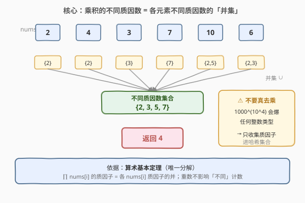
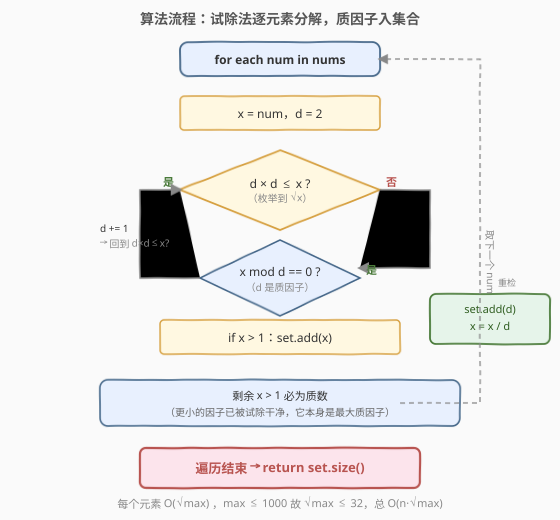

# 数组乘积中的不同质因数数目

- **题目名称**：数组乘积中的不同质因数数目
- **链接**：[2521. 数组乘积中的不同质因数数目](https://leetcode.cn/problems/distinct-prime-factors-of-product-of-array/)
- **难度**：中等
- **标签**：数组、哈希表、数学、数论、质因数分解

## 1. 题目概述

给你一个正整数数组 `nums`，对 `nums` 所有元素求积之后，找出并返回乘积中**不同质因数**的数目。

> **注意**：质数指大于 $1$ 且仅能被 $1$ 及自身整除的数字；若 $\text{val}_2 / \text{val}_1$ 为整数，则 $\text{val}_1$ 是 $\text{val}_2$ 的因数。

**示例 1**：

```text
输入：nums = [2,4,3,7,10,6]
输出：4
解释：乘积 = 2 * 4 * 3 * 7 * 10 * 6 = 10080 = 2⁵ * 3² * 5 * 7
      共有 4 个不同的质因数，返回 4。
```

**示例 2**：

```text
输入：nums = [2,4,8,16]
输出：1
解释：乘积 = 2 * 4 * 8 * 16 = 1024 = 2¹⁰，只有 1 个不同质因数，返回 1。
```

**约束条件**：

- $1 \le \text{nums.length} \le 10^4$
- $2 \le \text{nums}[i] \le 1000$

> 💡 关键约束是 $\text{nums}[i] \le 1000$：它意味着每个元素试除只需枚举到 $\sqrt{1000} \approx 32$，单元素分解极快；同时「不同质因数」只问**种类**不问**重数**，哈希集合天然去重。

---

## 2. 解题思路

### 2.1 暴力思路：先乘积再分解

最直白的做法是先把所有元素乘起来得到大整数 $P = \prod \text{nums}[i]$，再对 $P$ 分解质因数、数不同质因子。

问题在于 $P$ 的规模：$n = 10^4$、$\text{nums}[i] \le 1000$ 时，$P \le 1000^{10000} = 10^{30000}$，是一个 **30000 位**的数，任何 32/64 位整数类型都装不下（`long long` 上限约 $9.2 \times 10^{18}$，19 位）。即便用大整数类硬算，光是把 $10^4$ 个数乘成 $10^{30000}$ 位的大数就已是 $O(n \cdot \text{位数})$ 的开销，分解它更是天文数字。

> ⚠️ 这条路不仅慢，而且**毫无必要**。题目要的是「不同质因数的**数目**」，而非乘积本身。一旦意识到「质因子来自哪里」，就能避开大数乘法。

### 2.2 核心观察：乘积的质因子 = 各元素质因子的并集



**关键直觉**来自**算术基本定理（唯一分解定理）**：每个正整数 $>1$ 都能唯一地分解为质数的乘积。把每个 $\text{nums}[i]$ 单独分解：

$$\text{nums}[i] = p_{i,1}^{a_{i,1}} \cdot p_{i,2}^{a_{i,2}} \cdots$$

那么乘积 $P = \prod \text{nums}[i]$ 的质因子集合，就是把所有 $\text{nums}[i]$ 的质因子集合**取并集**——重数累加，但种类（不同质因子）只是并集：

$$\{\,\text{质因子}(P)\,\} = \bigcup_{i} \{\,\text{质因子}(\text{nums}[i])\,\}$$

> 💡 **为什么是并集？** 因为 $P = \prod \text{nums}[i]$，乘法就是把各因子的质分解「拼」在一起。某个质数 $p$ 只要出现在**任一** $\text{nums}[i]$ 的分解里，就会出现在 $P$ 的分解里；至于它在多少个元素里出现、各出现几次（重数），对「不同质因数数目」毫无影响——这正是哈希集合**唯一性**所保证的。

于是算法一句话：**对每个元素做试除分解，把质因子丢进一个哈希集合，最后返回集合大小**。全程不碰大数乘法。

> ⚠️ **重数被天然丢弃**：例如示例 1 里 $4=2^2$、$6=2\times3$、$10=2\times5$，质因子 $2$ 反复出现，但集合只存一份。这正是「不同」二字的体现——集合的语义即「不计重数」。

### 2.3 算法流程图



对每个 `num`，用**试除法**找它的质因子：

1. 令 $d$ 从 $2$ 起，只要 $d \times d \le \text{num}$：
   - 当 $\text{num}$ 能被 $d$ 整除时，反复除：把 $d$ 加入集合，$\text{num} \gets \text{num}/d$；
   - $d \gets d+1$。
2. 循环结束后若剩余 $\text{num} > 1$，它本身就是**最后一个（最大）质因子**，加入集合。
3. 遍历完所有元素，返回集合大小。

> 💡 **两处要点**：(1) **为什么枚举到 $\sqrt{\text{num}}$ 即可？** 若 $\text{num}$ 有 $>\sqrt{\text{num}}$ 的质因子，则至多一个（两个这种因子乘积已 $>\text{num}$），它会被步骤 2 的「剩余 $>1$」那行捕获。(2) **为什么 $d$ 步进 $1$ 不跳过合数也正确？** 因为遇到 $d$ 时，更小因子（含 $d$ 的质因子）早已被除尽，于是合数 $d$ 永远无法整除剩余值——不浪费正确性，只多几次无效取模（$d \le 32$ 规模下可忽略）。

### 2.4 示例演算

![示例演算：nums=[2,4,3,7,10,6]，集合逐步累并为 {2,3,5,7}](../images/distinct_prime_product_walkthrough.svg)

以示例 1 `nums = [2,4,3,7,10,6]` 为例，逐元素分解并观察集合增长：

| 元素 | 分解 | 并入后集合 | 新增 |
|------|------|-----------|------|
| 2 | 2（质数） | {2} | +2 |
| 4 | 2 × 2 | {2} | — |
| 3 | 3（质数） | {2, 3} | +3 |
| 7 | 7（质数） | {2, 3, 7} | +7 |
| 10 | 2 × 5 | {2, 3, 5, 7} | +5 |
| 6 | 2 × 3 | {2, 3, 5, 7} | — |

最终集合 $\{2,3,5,7\}$，返回 $4$ ✓。校验：乘积 $= 2^5 \cdot 3^2 \cdot 5 \cdot 7 = 10080$，不同质因子确为 $\{2,3,5,7\}$ 四个。

> 💡 **重复质因子被自动忽略**：$4=2^2$、$6=2\times3$ 的质因子 $\{2,3\}$ 已在集合里，并入后集合不变——集合的「去重」语义即「不同质因数」的语义。

`nums = [2,4,8,16]`（示例 2）：所有元素都是 $2$ 的幂，分解出的质因子全是 $2$，集合恒为 $\{2\}$，返回 $1$ ✓。

---

## 3. 参考代码

### C++

```cpp
class Solution {
public:
    int distinctPrimeFactors(vector<int>& nums) {
        unordered_set<int> primes;
        for (int num : nums) {
            int d = 2;
            for (; (long long)d * d <= num; ++d) {   // 试除到 √num
                while (num % d == 0) {
                    primes.insert(d);                 // d 是质因子，入集合
                    num /= d;                         // 除尽 d 的重数
                }
            }
            if (num > 1) primes.insert(num);           // 剩余本身是最大质因子
        }
        return primes.size();
    }
};
```

> 💡 `(long long)d * d` 防止 32 位下 `d * d` 溢出（本题 $\text{num} \le 1000$ 实际不溢出，是稳妥写法）。注意 `for` 的循环条件 `d*d <= num` 用的是**被除后的 num**：每除尽一个因子 num 就缩小，上界同步收紧，是天然的剪枝。

### Python

```python
class Solution:
    def distinctPrimeFactors(self, nums: List[int]) -> int:
        primes = set()
        for num in nums:
            d = 2
            while d * d <= num:          # 试除到 √num
                while num % d == 0:
                    primes.add(d)         # d 是质因子，入集合
                    num //= d            # 除尽 d 的重数
                d += 1
            if num > 1:                   # 剩余本身是最大质因子
                primes.add(num)
        return len(primes)
```

> 💡 两版逻辑一致：试除分解 + 集合去重。Python 大整数无需操心溢出，`d * d` 直接写即可。`num //= d` 在内层 `while` 里反复除，保证把 $d$ 的重数一次清干净再进下一个 $d$。

---

## 4. 复杂度分析

| 维度 | 复杂度 | 说明 |
|------|--------|------|
| **时间复杂度** | $O(n \cdot \sqrt{M})$ | $n$ 个元素，每个试除到 $\sqrt{M}$（$M = \max\,\text{nums}[i] \le 1000$，$\sqrt{M} \le 32$），总计 $\le 10^4 \times 32 \approx 3.2\times10^5$ 次 |
| **空间复杂度** | $O(\pi(M))$ | 集合最多存 $\le 1000$ 内所有质数个数 $\pi(1000) = 168$ 个 |
| 对照：先乘积再分解 | 不可行 | 乘积达 $10^{30000}$ 位，大数乘法与分解都是天文开销 |

> 💡 $\sqrt{M} \le 32$ 是本题能如此轻巧的根源。若 $\text{nums}[i]$ 放宽到 $10^9$，单元素试除变 $O(\sqrt{10^9}) \approx 31623$，$n=10^4$ 时约 $3\times10^8$ 次仍勉强可过；若再大或查询密集，则需改用第 5 节的最小质因子筛预表加速。

---

## 5. 扩展：最小质因子筛（SPF）预表加速

**场景**。当 $\text{nums}[i]$ 的值域更大（如 $10^6$）或同一批值被反复查询分解时，逐个试除不再是优选。可先用**线性筛**（埃氏筛亦可）预计算 $\le M$ 每个数 $v$ 的**最小质因子** $\text{spf}[v]$，之后分解任意 $v$ 只需反复「读 $\text{spf}[v]$、除以它」，$O(\log v)$ 完成，比 $O(\sqrt v)$ 快一个量级。

```python
class Solution:
    def distinctPrimeFactors(self, nums: List[int]) -> int:
        M = max(nums)
        spf = list(range(M + 1))          # spf[v] = v 的最小质因子
        i = 2
        while i * i <= M:
            if spf[i] == i:                # i 是质数
                for j in range(i * i, M + 1, i):
                    if spf[j] == j:
                        spf[j] = i         # 标记合数的最小质因子
            i += 1

        primes = set()
        for v in nums:
            while v > 1:
                primes.add(spf[v])         # 每次取最小质因子入集合
                v //= spf[v]
        return len(primes)
```

> 💡 **选型对照**：本题 $M \le 1000$，筛表预处理 $O(M\log\log M) \approx 1000$ 次、每元素分解 $O(\log v)$，总复杂度更低但常数不占优；试除法代码更短、无额外预表，是本题的**首选**。SPF 写法适合「值域 $M$ 不大但元素多/查询密」的进阶场景，也常作为 [204. 计数质数](../0201-0300/204_计数质数.md) 筛法的延伸应用。

---

## 6. 面试要点

1. **为什么不直接算乘积？**

   > $n = 10^4$、$\text{nums}[i] \le 1000$ 时乘积 $\le 10^{30000}$，是 30000 位的大数，任何整数类型都溢出。即便用大整数类，光是构造和分解它就极其昂贵。题目只要「不同质因数数目」，算乘积是把简单问题复杂化的典型陷阱。

2. **「乘积的质因子 = 各元素质因子并集」的依据是什么？**

   > 算术基本定理（唯一分解）。每个 $\text{nums}[i]$ 唯一分解为质数之积，乘积 $P = \prod \text{nums}[i]$ 的分解就是把各元素分解「拼接」。某质数 $p$ 出现在任一元素分解里就出现在 $P$ 里，故不同质因子恰为各元素质因子集合的并集；重数累加但不影响种类。

3. **试除法为什么枚举到 $\sqrt{\text{num}}$ 就够？合数 $d$ 会不会误判？**

   > 若 $\text{num}$ 有 $>\sqrt{\text{num}}$ 的质因子，至多一个（两个这种因子乘积已 $>\text{num}$），它被循环后「剩余 $>1$」那行捕获。合数 $d$ 不会误判：遇到 $d$ 前，其更小质因子已被反复除尽，故 $\text{num} \bmod d \ne 0$ 恒成立，合数 $d$ 自然跳过。所以 $d$ 步进 $1$ 既正确又简单。

4. **剩余 `num > 1` 一定是质数吗？为什么直接加入集合？**

   > 是。循环结束后，剩余值所有 $\le \sqrt{\text{原值}}$ 的因子都已被试除干净；若它仍 $>1$ 且是合数，则它必有 $\le \sqrt{\text{它}}$ 的质因子——但该因子理应在循环里被除掉，矛盾。故剩余必是质数，即为最大质因子，直接加入集合即可。

5. **时间复杂度为何是 $O(n\sqrt M)$ 而非 $O(n\sqrt{P})$（$P$ 为乘积）？**

   > 我们对**每个元素单独**试除到 $\sqrt{\text{nums}[i]} \le \sqrt{M}$，而非对乘积 $P$ 试除。$M \le 1000$ 使 $\sqrt M \le 32$，每个元素只花常数级代价；若误对 $P$ 试除则 $\sqrt P$ 是天文数字。这一步把「分解巨大乘积」降为「分解一堆小数」，是复杂度的核心优化。

> 💡 **一句话总结**：2521 = 「乘积的不同质因子 = 各元素质因子的并集」。由算术基本定理，对每个元素试除分解、质因子丢进哈希集合，集合大小即答案——全程避开大数乘法，$O(n\sqrt M)$ 时间、$O(\pi(M))$ 空间出解。

---

## 7. 同类练习题

- [2507. 使用质因数之和替换后可以取到的最小值](https://leetcode.cn/problems/smallest-value-after-replacing-with-sum-of-prime-factors/)（[题解](../2501-2600/2507_使用质因数之和替换后可以取到的最小值.md)）：同一段「试除法分解质因数」骨架的最直接兄弟题，本题只取种类、那题要带重数求和并迭代到不动点
- [172. 阶乘后的零](https://leetcode.cn/problems/factorial-trailing-zeroes/)（[题解](../0101-0200/172_阶乘后的零.md)）：另一道「乘积（阶乘）的质因子计数」题，用勒让德公式统计因子 $5$ 的重数，与本题「只数种类」形成「重数 vs 种类」对照
- [204. 计数质数](https://leetcode.cn/problems/count-primes/)（[题解](../0201-0300/204_计数质数.md)）：质数/数论母题，埃氏筛。本题第 5 节 SPF 预表加速即筛法的延伸应用
- [263. 丑数](https://leetcode.cn/problems/ugly-number/)（[题解](../0201-0300/263_丑数.md)）：反复试除指定质因子判定能否归一，与「试除法分解质因数」同源
- [952. 按公因数计算最大组件大小](https://leetcode.cn/problems/largest-component-size-by-common-factor/)（[题解](../0901-1000/952_按公因数计算最大组件大小.md)）：把每个数分解质因子后用并查集按「共享质因子」连边求最大组件——质因子并集思想在图连通上的延伸应用
