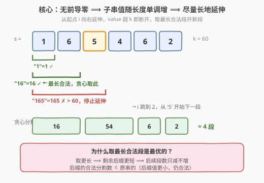
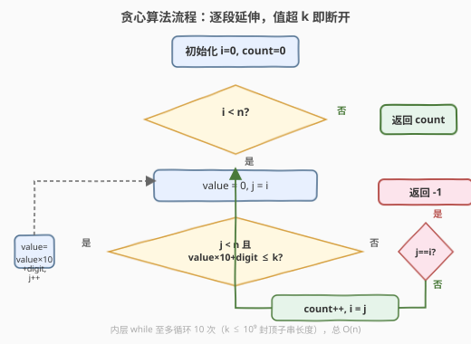
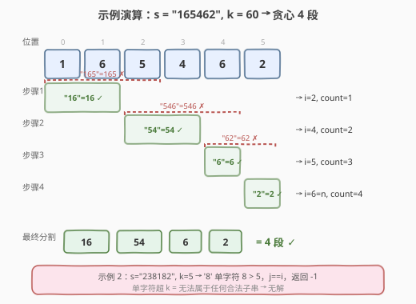

# 将字符串分割成值不超过 K 的子字符串

- **题目名称**：将字符串分割成值不超过 K 的子字符串
- **链接**：[2522. 将字符串分割成值不超过 K 的子字符串](https://leetcode.cn/problems/partition-string-into-substrings-with-values-at-most-k/)
- **难度**：中等
- **标签**：贪心、字符串、动态规划

## 1. 题目概述

给你一个字符串 `s`，每一位都是 `1` 到 `9` 之间的数字，同时给你一个整数 `k`。

如果一个字符串 `s` 的分割满足以下条件，称它是一个**好**分割：

- `s` 中每个数位**恰好**属于一个子字符串。
- 每个子字符串的值都 $\le k$。

返回 `s` 所有好分割中子字符串的**最少**数目。若不存在好分割，返回 $-1$。

> 💡 **子字符串的值**：该子字符串对应的整数，如 `"123"` 的值为 $123$。

**示例 1**：

```text
输入：s = "165462", k = 60
输出：4
解释：分割为 "16","54","6","2"，各值 16,54,6,2 均 ≤ 60，且 4 是最少分割数。
```

**示例 2**：

```text
输入：s = "238182", k = 5
输出：-1
解释：'8' 单独的值 8 > 5，无法放入任何合法子串。
```

**约束条件**：

- $1 \le \text{s.length} \le 10^5$
- $\text{s}[i]$ 是 `'1'` 到 `'9'` 之间的数字
- $1 \le k \le 10^9$

---

## 2. 解题思路

### 2.1 暴力思路：枚举所有分割点

字符串长 $n$，有 $n-1$ 个间隙，每个间隙「切/不切」共 $2^{n-1}$ 种分割。对每种分割验证每段值 $\le k$ 并计数，取最小。$n = 10^5$ 时指数爆炸，不可行。

### 2.2 核心观察：贪心 —— 尽量长地延伸当前子串



**关键性质**：`s` 只含 $1$–$9$（无前导零），所以子串**越长值越大**。从位置 $i$ 出发，子串值随右端点 $j$ 单调递增，故「值 $\le k$」在 $j$ 上是一段**前缀区间** $[i,\, j']$，$j'$ 就是能取到的**最长合法右端**。

**贪心策略**：每个位置取**最长合法子串** $s[i..j']$，然后从 $j'+1$ 继续。理由是——

> ⚠️ **贪心为什么对？交换论证**：设最优解第一段取 $s[i..j]$（$j \le j'$），剩 $m-1$ 段分完 $s[j{+}1..n{-}1]$。贪心取 $s[i..j']$ 后剩 $s[j'{+}1..n{-}1]$，它是 $s[j{+}1..n{-}1]$ 的**后缀**。设 $j'{+}1$ 落在最优解某段 $t_p = s[a..b]$ 内（$a \le j'{+}1 \le b$），则 $s[j'{+}1..b]$ 是 $t_p$ 的后缀，值更小（位数更少）$\Rightarrow$ 仍 $\le k$。于是 $s[j'{+}1..n{-}1]$ 可用 $s[j'{+}1..b] + t_{p+1} + \cdots + t_m$ 分成 $\le m - 1$ 段。故贪心总段数 $\le 1 + (m-1) = m$，不会比最优差。

**无解判定**：若贪心某步连单个字符 $\text{s}[i] > k$ 都不满足（$j' = i$，即 $j$ 没动），则该位无法属于任何合法子串，返回 $-1$。

> 💡 **位数封顶**：$k \le 10^9$（10 位），故每个子串至多 10 个字符，内层 while 至多循环 10 次，总复杂度 $O(10n) = O(n)$。

### 2.3 算法流程图



1. 初始化 `i = 0`，`count = 0`。
2. **外循环**：`i < n` 时执行——
   - `value = 0`，`j = i`。
   - **内循环**：`j < n` 且 `value * 10 + (s[j] - '0') ≤ k` 时，`value = value * 10 + (s[j] - '0')`，`j++`。
   - **无解**：若 `j == i`（单个字符就超 $k$），返回 $-1$。
   - `count++`，`i = j`。
3. 返回 `count`。

> ⚠️ **溢出防护**：`value * 10 + digit` 在 `value ≤ k ≤ 10^9` 时最大约 $10^{10}$，超 32 位但安全落在 64 位（`long long` / Python 大整数）内。条件判断在赋值之前，所以 `value` 一旦 $\le k$ 被更新后下一步就检查，不会无限增长。

### 2.4 示例演算



以 `s = "165462"`、$k=60$ 演算：

| 步骤 | 起点 $i$ | 尝试延伸 | 选中子串 | 值 | 下一个 $i$ | 段数 |
|------|---------|---------|---------|-----|------------|------|
| 1 | 0 | `1`→1 ✓, `16`→16 ✓, `165`→165 ✗ | `"16"` | 16 | 2 | 1 |
| 2 | 2 | `5`→5 ✓, `54`→54 ✓, `546`→546 ✗ | `"54"` | 54 | 4 | 2 |
| 3 | 4 | `6`→6 ✓, `62`→62 ✗ | `"6"` | 6 | 5 | 3 |
| 4 | 5 | `2`→2 ✓（到末尾） | `"2"` | 2 | 6 | 4 |

$i = 6 = n$，结束。返回 $4$ ✓。

> ⚠️ **示例 2** `s = "238182", k = 5`：第 1 步 `"2"`(2✓, 23✗) → $i{=}1$；第 2 步 `"3"`(3✓, 38✗) → $i{=}2$；第 3 步 `'8'` 单字符 $8 > 5$，`j` 未动，返回 $-1$ ✓。

---

## 3. 参考代码

### C++

```cpp
class Solution {
public:
    int minimumPartition(string s, int k) {
        int n = s.size(), count = 0;
        for (int i = 0; i < n; ) {
            long long value = 0;
            int j = i;
            while (j < n && value * 10 + (s[j] - '0') <= k) {
                value = value * 10 + (s[j] - '0');
                ++j;
            }
            if (j == i) return -1;       // 单字符就超 k，无解
            ++count;
            i = j;
        }
        return count;
    }
};
```

> ⚠️ **易错点**：(1) `value` 用 `long long`，`value * 10 + digit` 在 `value ≤ 10^9` 时可达 $10^{10}$，超 `int`。(2) 判断 `j == i` 必须在 `count++` 之前，否则会把不合法的单字符段计入。(3) 内层 while 条件里就做溢出检查（先算再比），保证 `value` 不会无限增长。

### Python

```python
class Solution:
    def minimumPartition(self, s: str, k: int) -> int:
        n, cnt, i = len(s), 0, 0
        while i < n:
            value, j = 0, i
            while j < n and value * 10 + int(s[j]) <= k:
                value = value * 10 + int(s[j])
                j += 1
            if j == i:                    # 单字符就超 k
                return -1
            cnt += 1
            i = j
        return cnt
```

> 💡 Python 大整数无溢出，`value * 10 + int(s[j])` 天然安全；其余逻辑与 C++ 镜像。

---

## 4. 复杂度分析

| 维度 | 复杂度 | 说明 |
|------|--------|------|
| 时间复杂度 | $O(n)$ | 外层指针 $i$ 单调前进；内层 while 每步至多延伸 $\lfloor\log_{10} k\rfloor + 1 \le 10$ 次（$k \le 10^9$），摊还 $O(1)$ |
| 空间复杂度 | $O(1)$ | 仅用 `value`、`i`、`j`、`count` 等常数变量 |
| 对照：暴力枚举 | $O(2^n)$ | 枚举所有分割点组合，$n=10^5$ 指数爆炸 |

> 💡 **位数封顶是关键**：$k \le 10^9$ 限制了子串最大长度 $\le 10$，使贪心内循环常数级。若 $k$ 无上限（子串可任意长），则需改用 DP + 滚动哈希等方式。

---

## 5. 扩展：DP 解法

贪心能做是因为「无前导零 + 子串值随长度单调增」使最长合法子串天然最优。也可用 DP 验证：

$$\text{dp}[i] = \min_{j \in [i,\, i+9],\ \text{val}(s[i..j]) \le k} \big(\text{dp}[j+1] + 1\big)$$

- $\text{dp}[n] = 0$，$\text{dp}[i] = +\infty$ 表示不可达。
- 答案 $= \text{dp}[0]$，若为 $+\infty$ 则 $-1$。
- 同样利用位数封顶 $j$ 至多枚举 10 个，$O(10n)$。

```cpp
// DP 版（滚动填表，倒序）
int minimumPartition(string s, int k) {
    int n = s.size();
    vector<int> dp(n + 1, INT_MAX);
    dp[n] = 0;
    for (int i = n - 1; i >= 0; --i) {
        long long value = 0;
        for (int j = i; j < n && j < i + 10; ++j) {
            value = value * 10 + (s[j] - '0');
            if (value > k) break;
            if (dp[j + 1] != INT_MAX)
                dp[i] = min(dp[i], dp[j + 1] + 1);
        }
    }
    return dp[0] == INT_MAX ? -1 : dp[0];
}
```

> 💡 **贪心 vs DP**：两者都是 $O(n)$，但贪心 $O(1)$ 空间且实现极简。DP 的优势在于**可扩展性**——若题目加约束（如「子串长度有额外上限」「最少段数同时要求某段最大值最小」等），DP 更易改造。

---

## 6. 面试要点

1. **贪心为什么是对的？能用一句话说清吗？**

   > 子串只含 1–9（无前导零），值随长度单调递增，所以从当前位置能延伸到的最长合法子串是唯一的。取最长 ⟹ 剩余后缀最短 ⟹ 后续所需段数只减不增（后缀的合法分割数 $\le$ 原串的），故贪心不会比任何方案差。

2. **什么时候返回 $-1$？**

   > 当且仅当某位字符 `s[i]` 的数值 $> k$，该位无法属于任何合法子串（任何包含它的子串值 $\ge \text{s}[i] > k$）。贪心中表现为内层 while 一次都没执行（`j == i`）。

3. **`value` 用 `int` 会出什么问题？**

   > `k \le 10^9`，`value * 10 + 9` 可达 $10^{10}$，溢出 32 位 `int`（最大约 $2.1 \times 10^9$），导致条件误判（负数/回绕 $\le k$），漏掉无解或产生错误分割。必须用 `long long`（C++）或 Python 大整数。

4. **内层 while 不会退化成 $O(n)$ 吗？**

   > 不会。每次延伸使 `j` 前进，且 `value` 随位数指数增长。$k \le 10^9 \Rightarrow$ 子串至多 10 位，`value` 超过 $k$ 必在 10 步内终止。外层 `i` 跳到 `j`，总前进量 $= n$，故 $O(10n) = O(n)$。

5. **如果 $k$ 可以是 $10^{18}$（64 位），算法还成立吗？**

   > 贪心逻辑仍然成立（单调性不变），但子串最大长度升至 19（$\lfloor\log_{10} 10^{18}\rfloor + 1$），内层循环至多 19 次，$O(19n)$ 仍 $O(n)$。只需确保 `value` 用 `__int128` 或 Python 大整数防溢出。

> 💡 **一句话总结**：无前导零 ⟹ 子串值随长度单调增 ⟹ 贪心取最长合法段最优；$k \le 10^9$ 封顶子串长度 $\le 10$ ⟹ $O(n)$ 时间 $O(1)$ 空间；单字符超 $k$ 即无解。

---

## 7. 同类练习题

- [132. 分割回文串 II](https://leetcode.cn/problems/palindrome-partitioning-ii/)（[题解](../0101-0200/132_分割回文串II.md)）：同样是「最少分割数」结构，但合法性约束是回文而非数值上界，需预处理回文表 + DP
- [2767. 将字符串分割为最美丽的子字符串](https://leetcode.cn/problems/partition-string-into-minimum-beautiful-substrings/)：最少分割数 + 子串需为 5 的幂，贪心不适用（约束非单调），DP 枚举分割点
- [139. 单词拆分](https://leetcode.cn/problems/word-break/)（[题解](../0101-0200/139_单词拆分.md)）：前缀可行性 DP，对照本题的贪心可直接取最长段（单词集合非单调故需 DP）
- [1011. 在 D 天内送达包裹的能力](https://leetcode.cn/problems/capacity-to-ship-packages-within-d-days/)（[题解](../1001-1100/1011_在D天内送达包裹的能力.md)）：贪心分段（连续和 $\le$ 上界），但求「能否分 $\le D$ 段」用二分答案，对照本题直接求最少段数
