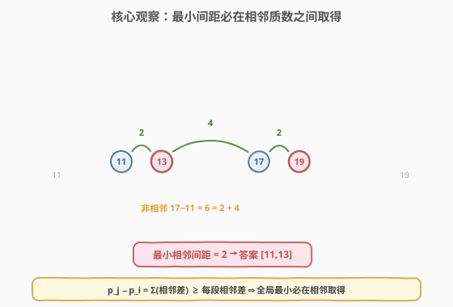
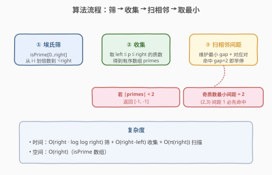
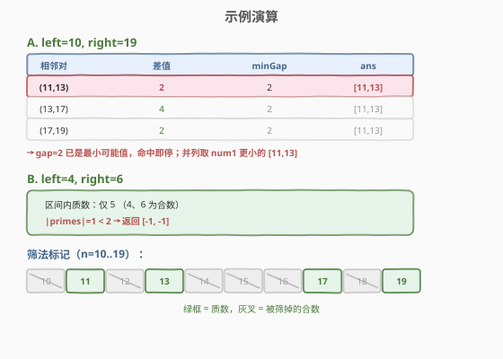

# 范围内最接近的两个质数

- **题目名称**：范围内最接近的两个质数
- **链接**：[2523. 范围内最接近的两个质数](https://leetcode.cn/problems/closest-prime-numbers-in-range/)
- **难度**：中等
- **标签**：数学、数论、埃氏筛、数组

## 1. 题目概述

给定两个正整数 `left` 和 `right`，在闭区间 $[\text{left}, \text{right}]$ 内找到两个质数 $\text{num1} < \text{num2}$，使得差值 $\text{num2} - \text{num1}$ 是所有满足条件的质数对中**最小的**。若有多个质数对差值相同，返回 $\text{num1}$ 最小的那对。若区间内质数少于 $2$ 个，返回 $[-1, -1]$。

**示例 1**：

```text
输入：left = 10, right = 19
输出：[11,13]
解释：10 到 19 之间的质数为 11, 13, 17, 19。
      质数对的最小差值是 2，[11,13] 和 [17,19] 都能得到最小差值 2。
      由于 11 比 17 小，返回第一个质数对 [11,13]。
```

**示例 2**：

```text
输入：left = 4, right = 6
输出：[-1,-1]
解释：给定范围内只有质数 5 一个，不足两个，无法满足条件。
```

**约束条件**：

- $1 \le \text{left} \le \text{right} \le 10^6$

> 💡 本题是「**筛法求质数 + 相邻扫描**」的组合题。核心是把"任意两两质数对"塌缩成"相邻质数对"——与 [2517. 礼盒的最大甜蜜度](../2501-2600/2517_礼盒的最大甜蜜度.md) 中"任意两两糖果差塌缩为相邻差"是**同一个观察**。筛法模板直接承接 [204. 计数质数](../0201-0300/204_计数质数.md)。

---

## 2. 解题思路

### 2.1 暴力思路：逐个判断 + 两两枚举

最直观的做法：对 $[\text{left}, \text{right}]$ 内每个数用试除法判断是否为质数，收集成列表后再两两枚举所有质数对、维护最小差值。

```text
for i in [left, right]:
    if isPrime(i):  # 试除到 √i
        primes.append(i)
for each pair (p_i, p_j), i < j:
    ans = min(ans, p_j - p_i)
```

单个判断 $O(\sqrt{\text{right}})$，区间长 $O(\text{right})$ 时筛共 $O(\text{right}\sqrt{\text{right}})$；当 $\text{right}=10^6$ 时约 $10^9$ 次试除，必然超时。问题根因有二：**合数被反复试除**做重复功（与 204 同），以及**两两枚举质数对**本可塌缩为相邻扫描。

### 2.2 核心观察：埃氏筛 + 只看相邻质数对



两个观察层层递进：

1. **用筛代替试除**：与其逐个数去"验证"是否为质数，不如用**埃氏筛**主动把合数标记掉——质数 $p$ 的所有倍数 $2p, 3p, \ldots$ 必为合数。从 $2$ 起，每遇到未划掉的数即为质数，再划其倍数。内层从 $i \cdot i$ 起、外层只到 $\sqrt{\text{right}}$，总复杂度 $O(n \log \log n)$（$n=\text{right}$），承接 [204](../0201-0300/204_计数质数.md) 的两个优化。

2. **最小差必在相邻质数取得**：把区间内质数按升序排成 $p_1 < p_2 < \cdots < p_k$。对任意**非相邻**对 $p_i, p_j\ (j > i+1)$，其差值
$$p_j - p_i = (p_{i+1}-p_i) + (p_{i+2}-p_{i+1}) + \cdots + (p_j - p_{j-1})$$
是若干**相邻差之和**，故 $p_j - p_i \ge$ 其中每一段相邻差 $\ge$ 全局最小相邻差。因此全局最小间距 $=$ 相邻质数对中的最小差，只需扫一遍相邻对，无需 $\binom{k}{2}$ 枚举。

> 💡 **识别信号**：题面"范围内取两个、最小化差值" + 数据有序（质数天然升序） $\Rightarrow$ 想"**相邻扫描**"。这与 2517「排序后只看相邻差」、[611. 有效三角形的个数](../0401-0500/611_有效三角形的个数.md)「固定一端 + 双指针」同属"有序区间只看相邻/两端"的化简范式。

### 2.3 算法流程图



1. **埃氏筛**：`isPrime[0..right]` 预置 `true`，置 `0,1` 为 `false`；`i` 从 $2$ 到 $\sqrt{\text{right}}$，若 `isPrime[i]` 仍真，则从 $j=i\cdot i$ 起步长 $i$ 划掉。
2. **收集**：遍历 $i \in [\text{left}, \text{right}]$，把 `isPrime[i]` 为真的收集成有序数组 `primes`。
3. **守卫**：若 `len(primes) < 2`，返回 $[-1, -1]$。
4. **扫相邻**：`minGap=∞, ans=[-1,-1]`；对 $i=0..k-2$，记 $g = \text{primes}[i+1]-\text{primes}[i]$，若 $g < \text{minGap}$ 则更新 `minGap` 与 `ans`。

### 2.4 示例演算



以示例 1 `left=10, right=19` 为例。筛后区间内质数为 $[11,13,17,19]$，相邻差依次为 $2,4,2$。扫描过程如上表：第一对 $(11,13)$ 差为 $2$，命中后 `minGap=2, ans=[11,13]`；后续 $(13,17)$ 差 $4$、$(17,19)$ 差 $2$ 均不严格更小，`ans` 不变。由于 $2$ 已是奇质数可能的**最小间距**，命中即可早停（见第 5 节）。并列取 $\text{num1}$ 更小者 $[11,13]$，与示例一致 ⭐。

> ⚠️ **"并列取 num1 最小"为何天然成立？** 扫描按升序进行，且仅在 $g < \text{minGap}$（**严格更小**）时更新。故同一最小差值下，保留的是**首次**遇到的那对，即 $\text{num1}$ 最小者，无需额外处理并列。

---

## 3. 参考代码

### C++

```cpp
class Solution {
public:
    vector<int> closestPrimes(int left, int right) {
        vector<bool> isPrime(right + 1, true);
        isPrime[0] = isPrime[1] = false;
        for (int i = 2; (long long)i * i <= right; ++i) {  // 只筛到 √right
            if (!isPrime[i]) continue;
            for (int j = i * i; j <= right; j += i) {       // 从 i*i 起划倍数
                isPrime[j] = false;
            }
        }
        // 收集 [left, right] 内的质数
        vector<int> primes;
        for (int i = left; i <= right; ++i) {
            if (isPrime[i]) primes.push_back(i);
        }
        if (primes.size() < 2) return {-1, -1};

        int minGap = INT_MAX;
        vector<int> ans = {-1, -1};
        for (int i = 0; i + 1 < (int)primes.size(); ++i) {
            int g = primes[i + 1] - primes[i];
            if (g < minGap) {
                minGap = g;
                ans = {primes[i], primes[i + 1]};
                if (g == 2) break;   // 奇质数最小间距为 2；(2,3) 间距 1 已在更前命中
            }
        }
        return ans;
    }
};
```

### Python

```python
class Solution:
    def closestPrimes(self, left: int, right: int) -> List[int]:
        is_prime = [True] * (right + 1)
        is_prime[0] = is_prime[1] = False
        i = 2
        while i * i <= right:                  # 只筛到 √right
            if is_prime[i]:
                for j in range(i * i, right + 1, i):  # 从 i*i 起划倍数
                    is_prime[j] = False
            i += 1
        primes = [i for i in range(left, right + 1) if is_prime[i]]
        if len(primes) < 2:
            return [-1, -1]

        min_gap = float('inf')
        ans = [-1, -1]
        for i in range(len(primes) - 1):
            g = primes[i + 1] - primes[i]
            if g < min_gap:
                min_gap = g
                ans = [primes[i], primes[i + 1]]
                if g == 2:                    # 已是最小可能间距，提前结束
                    break
        return ans
```

> 💡 **三处细节**：
> 1. **`(long long)i * i` 防溢出**：$\text{right}=10^6$ 时 $\sqrt{\text{right}}\approx 1000$，`i*i` 最大 $10^6$ 不溢出 `int`；但写成 `(long long)i*i <= right` 是更稳的通用习惯（承接 [204](../0201-0300/204_计数质数.md) 的边界讨论）。
> 2. **早停 `g == 2`**：除 $(2,3)$ 外，所有质数都是奇数，两奇数之差为偶数 $\ge 2$，故奇质数最小间距恰为 $2$。而 $(2,3)$ 间距 $1$ 只在 $\text{left}\le 2\le 3\le \text{right}$ 时出现，作为升序首对必先被命中，所以一旦见到 $g=2$ 即可停。此优化只省常数，不影响正确性。
> 3. **筛数组长度 `right+1`**：下标 $0..\text{right}$ 含端点 `right`，因为要判断 `right` 本身是否为质数（注意与 204 "小于 n"的半开区间区别）。

---

## 4. 复杂度分析

| 维度 | 复杂度 | 说明 |
|------|--------|------|
| **时间** | $O(n \log \log n + n)$ | $n=\text{right}$。筛法 $O(n\log\log n)$；收集 $O(n)$；扫描 $O(\pi(n))\le O(n)$。三者相加仍 $O(n\log\log n)$ |
| **空间** | $O(n)$ | `isPrime` 数组占 $n+1$ 个标记位（C++ `vector<bool>` 约 $n/8$ 字节） |
| 对照：暴力试除 + 两两枚举 | $O(n\sqrt n + k^2)$ | $n=10^6$ 时约 $10^9$ 次试除，超时 |

> 💡 $n=10^6$ 时 $\log\log n \approx 2.6$，筛法实际操作约 $2.6\times 10^6$ 次，远低于时限。$\pi(10^6)=78498$，扫描相邻对约 $7.8\times 10^4$ 步，可忽略。

---

## 5. 扩展：早停的理论依据与更紧界

### 5.1 奇质数最小间距为 2

除 $2$ 以外的质数都是奇数。两个不同奇数之差为正偶数，最小正偶数为 $2$，故**任意两个都大于 $2$ 的质数之差 $\ge 2$**。唯一的例外是 $(2,3)$：$2$ 是唯一的偶质数，$3-2=1$。

由此得到早停规则：

- 若扫描中遇到 $g=1$，只可能是 $(2,3)$，必为全局最小，立即停（它也是升序首对，会被最先命中）。
- 若遇到 $g=2$（且此前未遇 $g=1$），说明后续不可能更小，立即停。

> ⚠️ 早停只是常数优化。最坏情形（区间内质数稀疏、无孪生质数对）仍需扫完所有相邻对，但相邻对总数 $\pi(n)\le n$，不影响 $O(n\log\log n)$ 的总复杂度。

### 5.2 孪生质数猜想与区间内必有的界

进一步问：区间 $[\text{left},\text{right}]$ 内是否一定存在差为 $2$ 的孪生质数对？答案**未必**。孪生质数猜想（已证明有无穷多对，但分布稀疏）只保证整体存在性，不保证任意小段内都有。当区间较短且落在质数稀疏处时，最小差可能远大于 $2$，此时早停不触发、需扫完全部相邻对。这正是算法保留"完整扫描"兜底、把早停当可选优化的原因。

### 5.3 与 2517「相邻差」范式的对照

| 维度 | 2523（本题） | 2517（礼盒最大甜蜜度） |
|------|------|------|
| 数据来源 | 埃氏筛出质数（天然升序） | 显式排序得升序 |
| 化简依据 | 非相邻差 = 相邻差之和 $\ge$ 每段相邻差 | 任意两两差 = 相邻差之和 $\ge$ 最小相邻差 |
| 求解目标 | 最小化相邻差 | 最大化相邻差（二分答案） |
| 扫描方式 | 单遍线性扫相邻 + 早停 | 二分答案 + 贪心 check 选 $k$ 个 |

两者共享"**有序区间只看相邻**"的化简内核，区别仅在于一个求最小、一个求最大从而走不同算法路线。

---

## 6. 面试要点

1. **为什么最小差必在相邻质数对取得？**

   > 把区间质数升序排成 $p_1<\cdots<p_k$。非相邻对 $p_i,p_j\ (j>i+1)$ 的差 $=\sum_{t=i}^{j-1}(p_{t+1}-p_t)$，是若干相邻差之和，故 $\ge$ 其中每一段 $\ge$ 全局最小相邻差。所以全局最小差 $=$ 相邻对中最小差，只需 $O(k)$ 扫一遍，无需 $\binom{k}{2}$ 枚举。

2. **为什么用筛而不用试除？**

   > 试除逐个数判断，单数 $O(\sqrt n)$，区间共 $O(n\sqrt n)$，$n=10^6$ 约 $10^9$ 次必超时。埃氏筛"主动划掉合数"把合数只标一次（约 $n\log\log n$ 次），且一次性得到 $[0,\text{right}]$ 内所有质数标记，后续收集 $O(n)$。筛是区间批量求质数的标准手段。

3. **筛的两个优化（从 $i\cdot i$ 起、外层到 $\sqrt n$）为什么对？**

   > 从 $i\cdot i$：更小倍数 $2i,\ldots,(i-1)i$ 已被 $i$ 的更小质因子划过。外层到 $\sqrt n$：任何 $\le n$ 的合数都有 $\le\sqrt n$ 的质因子，已被更小的 $i$ 划掉；$i\cdot i\ge n$ 时无可划目标。二者去掉重复标记，复杂度从 $O(n\log n)$ 降到 $O(n\log\log n)$。

4. **并列时取 num1 最小是怎么保证的？**

   > 扫描按升序、且仅在 $g<\text{minGap}$（严格更小）时更新。同一最小差值下，保留的是**首次**遇到的对，而首次即 $\text{num1}$ 最小者。所以无需单独处理并列，扫描逻辑天然满足"取 num1 最小"。

5. **早停 `g==2` 安全吗？会漏掉更优解吗？**

   > 安全。除 $(2,3)$ 外所有质数都是奇数，两奇数之差 $\ge 2$，故 $g=2$ 已是奇质数对的最小可能差。而 $(2,3)$ 差 $1$ 只在 $\text{left}\le 2\le 3\le \text{right}$ 时存在，且作为升序首对必先于任何 $g=2$ 被命中。所以一旦见到 $g=2$（此前未遇 $g=1$），后续不可能更小，停得正确。

> 💡 **一句话总结**：2523 = 「埃氏筛出区间质数 + 相邻扫描取最小差」。筛把"逐个验证"塌缩为 $O(n\log\log n)$ 的批量标记；相邻差之和的论证把"两两枚举"塌缩为"只看相邻"；严格更小才更新 + 升序扫描天然满足并列取 num1 最小。

---

## 7. 同类练习题

- [204. 计数质数](https://leetcode.cn/problems/count-primes/)（[站内题解](../0201-0300/204_计数质数.md)）：筛法母题，本题筛的优化（从 $i\cdot i$ 起、只筛到 $\sqrt n$）直接承接此题
- [2517. 礼盒的最大甜蜜度](https://leetcode.cn/problems/maximum-tastiness-of-candy-basket/)（[站内题解](../2501-2600/2517_礼盒的最大甜蜜度.md)）：共享"非相邻差 = 相邻差之和 $\Rightarrow$ 只看相邻"的化简内核，对照最小化 vs 最大化两种走向
- [762. 二进制表示中质数个计算置位](https://leetcode.cn/problems/prime-number-of-set-bits-in-binary-representation/)：小规模筛/查表判定质数，筛法的微型应用
- [264. 丑数 II](https://leetcode.cn/problems/ugly-number-ii/)（[站内题解](../0201-0300/264_丑数II.md)）：三指针按倍数生成序列，与筛法"按质数倍数推进"思想相通
- [611. 有效三角形的个数](https://leetcode.cn/problems/valid-triangle-numbers/)（[站内题解](../0401-0500/611_有效三角形的个数.md)）：有序数组上"固定一端 + 扫相邻/双指针"化简两两枚举，与本题相邻扫描同范式
