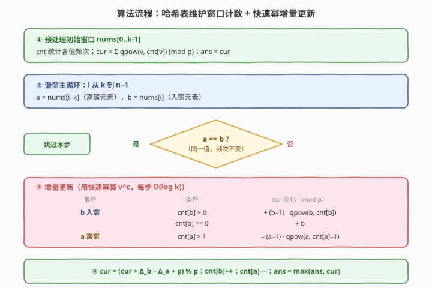

# 子数组的最大频率分数

- **题目名称**：子数组的最大频率分数
- **链接**：[2524. 子数组的最大频率分数](https://leetcode.cn/problems/maximum-frequency-score-of-a-subarray/)
- **难度**：困难
- **标签**：数组、哈希表、滑动窗口、数学、快速幂

## 1. 题目概述

给定一个整数数组 `nums` 和一个**正**整数 $k$。

数组的**频率得分**是数组中**不同**值的**幂次**之和，并将和对 $10^9 + 7$ **取模**。即对每个不同值 $v$，设它在数组中出现 $\textit{cnt}[v]$ 次，则贡献 $v^{\textit{cnt}[v]}$，得分 $=\sum_v v^{\textit{cnt}[v]} \bmod (10^9+7)$。

例如，数组 $[5,4,5,7,4,4]$ 的频率得分为 $(4^3 + 5^2 + 7^1) \bmod (10^9+7) = 64+25+7 = 96$。

返回 `nums` 中长度为 $k$ 的**子数组**的**最大**频率得分。需要返回**取模后的最大值**，而不是实际最大值再取模。

**示例 1**：

```text
输入：nums = [1,1,1,2,1,2], k = 3
输出：5
解释：子数组 [2,1,2] 的频率得分 = 2² + 1¹ = 4 + 1 = 5，为所有长度为 3 的子数组中的最大值。
```

**示例 2**：

```text
输入：nums = [1,1,1,1,1,1], k = 4
输出：1
解释：所有长度为 4 的子数组都只含 1，频率得分均为 1⁴ = 1。
```

**约束条件**：

- $1 \le k \le \text{nums.length} \le 10^5$
- $1 \le \text{nums}[i] \le 10^6$

> 💡 **关键观察**：得分只依赖窗口内**每个值的频次**，与位置无关。窗口每右移一格，「移出一个 $a$、移入一个 $b$」只改变 $a$、$b$ 两个值的频次（各 $\pm 1$），其余值频次不变、贡献不变。因此**只需对这两个值做增量更新**，配合快速幂 $O(\log k)$ 算 $v^c$，每步 $O(\log k)$，无需重算整个窗口的 $O(k)$。

---

## 2. 解题思路

### 2.1 暴力思路：逐窗口重算得分

最直白的做法是枚举每个长度为 $k$ 的子数组，对每个子数组统计频次表 $\textit{cnt}$，再用快速幂求和：

```text
ans = 0
for i in 0..n-k:
    cnt = freq(nums[i : i+k])
    cur = sum(pow(v, cnt[v], p) for v in cnt) % p
    ans = max(ans, cur)
return ans
```

每个窗口建频次表 $O(k)$、求和 $O(\text{不同值数} \cdot \log k)$，共 $n-k+1$ 个窗口，总计 $O(n \cdot k)$。$n \le 10^5$、$k$ 也可达 $10^5$，最坏 $10^{10}$，远超承受，必 TLE。

> ⚠️ 暴力的根病在于「逐窗口独立重算」——相邻两个窗口只差一个进、一个出，却把 $k$ 个元素全部重新统计、所有值贡献全部重算，重复工作量极大。一旦利用「相邻窗口差一个元素」的局部性，把重算压成增量，复杂度立降。

### 2.2 核心观察：滑窗增量 + 幂次差分


三个观察层层递进：

1. **得分 = Σ 各值 $v^{\textit{cnt}[v]}$**：得分与元素**位置**无关，只与每个值的**频次**有关。同一值出现 $c$ 次就贡献 $v^c$ 一次（不是 $c$ 个 $v$ 相加）。故维护一张频次表 $\textit{cnt}$ 即可表达任意窗口的得分。

2. **相邻窗口只改两个频次**：窗口 $[i, i+k-1]$ 右移到 $[i+1, i+k]$，等于「移出 $a=\textit{nums}[i]$、移入 $b=\textit{nums}[i+k]$」。这只会让 $\textit{cnt}[a]$ 减 $1$、$\textit{cnt}[b]$ 加 $1$，**其余值的频次与贡献都不变**。所以新得分 $=$ 旧得分 $+\Delta_b-\Delta_a$，其中 $\Delta$ 只需对这两个值计算。

3. **幂次差分：$v^c \to v^{c+1}$ 的增量是 $(v-1)\cdot v^c$**。当一个值 $v$ 的频次由 $c$ 变 $c+1$，它的贡献从 $v^c$ 变 $v^{c+1}$，增量
$$\Delta = v^{c+1} - v^c = v^c\,(v-1).$$
   用快速幂 $O(\log c)$ 算出 $v^c$，乘 $(v-1)$ 即得增量，无需重算整个和。两个边界特例：
   - $c=0$（新值入窗）：贡献 $0 \to v^1$，$\Delta = v$（公式里 $v^0=1$、$(v-1)\cdot 1=v-1$，差 $1$，故需特判直接用 $v$）；
   - $c=1 \to 0$（旧值离窗）：贡献 $v \to 0$，$\Delta = -v$（同理特判）。

> 💡 **一句话直觉**：相邻窗口只差一进一出，得分变化只来自这两个值。把「重算 $k$ 个」塌缩成「算两个增量」，每个增量用幂次差分 + 快速幂 $O(\log k)$ 搞定，整体 $O(n\log k)$。

> ⚠️ **「取模后的最大值」**：题面明确要求返回**各窗口取模后得分**的最大值，而不是「实际最大值再取模」。因此全程把 `cur` 维护在 $[0, p)$ 内、`ans` 直接取 `cur` 的最大即可——这恰好与增量更新天然契合（增量也都在模 $p$ 下做）。若题面要求「实际最大值再取模」，则需高精度比较，本题刻意回避。

### 2.3 算法流程图



四步：

1. **预处理**：建初始窗口 $\textit{nums}[0..k-1]$ 的频次表 $\textit{cnt}$，令 $\textit{cur}=\sum_v \textit{qpow}(v, \textit{cnt}[v]) \bmod p$，$\textit{ans}=\textit{cur}$；
2. **滑窗主循环**：$i$ 从 $k$ 到 $n-1$，记 $a=\textit{nums}[i-k]$（离窗）、$b=\textit{nums}[i]$（入窗）；
3. **增量更新**：若 $a=b$，频次不变，跳过；否则按四个情形算 $\Delta_b$（加入 $b$）与 $\Delta_a$（移除 $a$）；
4. **收尾**：$\textit{cur}=(\textit{cur}+\Delta_b-\Delta_a+p)\bmod p$，更新 $\textit{cnt}[b]\mathrel{+}=1$、$\textit{cnt}[a]\mathrel{-}=1$，$\textit{ans}=\max(\textit{ans},\textit{cur})$。

四个增量情形（$\Delta$ 指该值贡献的变化量）：

| 事件 | 条件 | $\textit{cur}$ 变化（$\bmod\ p$） |
|------|------|-----------------------------------|
| $b$ 入窗 | $\textit{cnt}[b] > 0$ | $+\,(b-1)\cdot \textit{qpow}(b,\textit{cnt}[b])$ |
| $b$ 入窗 | $\textit{cnt}[b] = 0$ | $+\,b$ |
| $a$ 离窗 | $\textit{cnt}[a] > 1$ | $-\,(a-1)\cdot \textit{qpow}(a,\textit{cnt}[a]-1)$ |
| $a$ 离窗 | $\textit{cnt}[a] = 1$ | $-\,a$ |

> 💡 **更新顺序**：先用**旧的** $\textit{cnt}$ 算增量（$\textit{cnt}[b]$ 是加入前的频次、$\textit{cnt}[a]$ 是移除前的频次），算完再 $\textit{cnt}[b]\mathrel{+}=1$、$\textit{cnt}[a]\mathrel{-}=1$。若先改频次再用，指数会错位一格。

### 2.4 示例演算

![示例演算：nums = [1,1,1,2,1,2]，k = 3 → 最大频率得分 5](../images/mfs_example_walkthrough.svg)

以示例 1 $\textit{nums}=[1,1,1,2,1,2]$、$k=3$ 为例。初始窗口 $[1,1,1]$（下标 $0\ldots2$）：$\textit{cnt}=\{1:3\}$，$\textit{cur}=1^3=1$，$\textit{ans}=1$。

- **$i=3$**：$a=\textit{nums}[0]=1$，$b=\textit{nums}[3]=2$，$a\ne b$。
  - $b=2$ 入窗：$\textit{cnt}[2]=0$（新值）→ $\Delta_b=+2$；
  - $a=1$ 离窗：$\textit{cnt}[1]=3>1$ → $\Delta_a=-(1-1)\cdot 1^{2}=0$（$1$ 的贡献 $1^3\to 1^2$，仍是 $1$，差 $0$）。
  - $\textit{cur}=1+2-0=3$，$\textit{cnt}=\{1:2,2:1\}$，$\textit{ans}=3$ ✓（窗口 $[1,1,2]$，得分 $1^2+2^1=3$）。
- **$i=4$**：$a=\textit{nums}[1]=1$，$b=\textit{nums}[4]=1$，$a=b$ → 跳过，$\textit{cnt}$ 与 $\textit{cur}$ 不变。窗口 $[1,2,1]$，$\textit{cnt}=\{1:2,2:1\}$，得分仍 $1^2+2^1=3$ ✓。
- **$i=5$**：$a=\textit{nums}[2]=1$，$b=\textit{nums}[5]=2$，$a\ne b$。
  - $b=2$ 入窗：$\textit{cnt}[2]=1>0$ → $\Delta_b=+(2-1)\cdot 2^1=+2$（$2$ 的贡献 $2^1\to 2^2$，$2\to 4$，差 $+2$）；
  - $a=1$ 离窗：$\textit{cnt}[1]=2>1$ → $\Delta_a=-(1-1)\cdot 1^1=0$。
  - $\textit{cur}=3+2-0=5$，$\textit{cnt}=\{1:1,2:2\}$，$\textit{ans}=5$ ✓（窗口 $[2,1,2]$，得分 $1^1+2^2=5$）。

$\textit{cur}$ 走势 $1\to 3\to 3\to 5$，$\textit{ans}=5$ ✓。

> 💡 注意本例里 $1$ 的贡献始终是 $1$（因为 $1^c=1$ 对任意 $c$ 都成立），$\Delta_a$ 恒为 $0$——这正是「$v=1$ 时 $v-1=0$、增量恒 $0$」的体现，公式自动退化，无需特判 $v=1$。真正变化的是 $2$：从无到有 $+2$，从 $1$ 次到 $2$ 次 $+2$，两次 $\Delta_b$ 都恰好是 $2$，但来源不同（前者是新值入窗的特例 $+b$，后者是幂次差分 $(b-1)\cdot b^c$）。

---

## 3. 参考代码

### C++

```cpp
class Solution {
public:
    int maxFrequencyScore(vector<int>& nums, int k) {
        using ll = long long;
        const int mod = 1e9 + 7;
        auto qpow = [&](ll a, ll n) {
            ll res = 1;
            for (; n; n >>= 1) {
                if (n & 1) res = res * a % mod;
                a = a * a % mod;
            }
            return res;
        };
        unordered_map<int, int> cnt;
        for (int i = 0; i < k; ++i) cnt[nums[i]]++;
        ll cur = 0;
        for (auto& [v, c] : cnt) cur = (cur + qpow(v, c)) % mod;
        ll ans = cur;
        for (int i = k; i < (int)nums.size(); ++i) {
            int a = nums[i - k], b = nums[i];
            if (a != b) {
                cur += cnt[b] ? (ll)(b - 1) * qpow(b, cnt[b]) % mod : b;
                cur -= cnt[a] > 1 ? (ll)(a - 1) * qpow(a, cnt[a] - 1) % mod : a;
                cur = (cur % mod + mod) % mod;
                cnt[b]++; cnt[a]--;
                ans = max(ans, cur);
            }
        }
        return (int)ans;
    }
};
```

> 💡 增量先于频次更新：`cnt[b]`、`cnt[a]` 都取**加入/移除前**的旧值参与计算，算完再 `cnt[b]++; cnt[a]--;`。`cur` 减法可能为负，用 `(cur % mod + mod) % mod` 兜回非负。`qpow` 处理 $n=0$（$v^0=1$），故新值入窗的特例 `+b` 也可写成 `+ qpow(b, 0) * (b-1) + 1`，但直接 `+b` 更清晰且省一次乘法。

### Python

```python
class Solution:
    def maxFrequencyScore(self, nums: List[int], k: int) -> int:
        mod = 10**9 + 7
        cnt = Counter(nums[:k])
        cur = sum(pow(v, c, mod) for v, c in cnt.items()) % mod
        ans = cur
        for i in range(k, len(nums)):
            a, b = nums[i - k], nums[i]
            if a != b:
                cur += (b - 1) * pow(b, cnt[b], mod) if cnt[b] else b
                cur -= (a - 1) * pow(a, cnt[a] - 1, mod) if cnt[a] > 1 else a
                cur %= mod
                cnt[b] += 1
                cnt[a] -= 1
                ans = max(ans, cur)
        return ans
```

> 💡 Python 内置三参数 `pow(b, c, mod)` 即带模快速幂，C/Java 标准库没有，需手写 `qpow`。`Counter` 访问不存在的键返回 $0$，故 `cnt[b]` 为 $0$（falsy）时走 `+b` 分支。两版逻辑一致，$O(n\log k)$ 时间、$O(\min(n, k))$ 空间（频次表至多 $\min(n,k)$ 个不同值）。

---

## 4. 复杂度分析

| 维度 | 复杂度 | 说明 |
|------|--------|------|
| **时间复杂度** | $O(n\log k)$ | 初始窗口求和 $O(k\log k)$；滑窗 $n-k$ 步，每步至多两次快速幂各 $O(\log k)$，合计 $O(n\log k)$。$\log k \le \log(10^5)\approx 17$ |
| **空间复杂度** | $O(\min(n, k))$ | 频次表 $\textit{cnt}$ 至多存 $\min(n, k)$ 个不同值；其余 $O(1)$ |
| 对照：逐窗口重算 | $O(n\cdot k)$ | 每个窗口重建频次表 $O(k)$ 并重算所有贡献，$n=k=10^5$ 时约 $10^{10}$，必 TLE |
| 对照：朴素增量无快速幂 | $O(n\cdot k)$ | 若增量靠「遍历到该值的所有出现位置」数频次而非维护哈希表，退化为 $O(k)$ 每步 |

> 💡 两次降阶：①「相邻窗口差一个元素」把 $O(k)$ 重算压成 $O(\log k)$ 增量；②「幂次差分 $v^{c+1}-v^c=(v-1)v^c$」把更新单个值贡献的 $O(c)$ 重算压成一次快速幂 $O(\log c)$。二者叠加，$O(nk)\to O(n\log k)$。

---

## 5. 扩展：幂次差分与边界特例

**幂次差分的代数来源**。把 $v^{c+1}-v^c$ 提取公因式 $v^c$：$v^c(v-1)$。这正是等比数列相邻项之差的通项——频次每 $+1$，贡献就「再叠一份 $v-1$」。抓住这条差分链，任意 $c\to c+d$ 的总增量都是等比数列前 $d$ 项和 $\dfrac{v^{c+d}-v^c}{v-1}\cdot(v-1)$，但滑动窗口每步只 $d=\pm 1$，故只需单步差分，用一次快速幂即可。

**两个边界特例为何不能套公式**。公式 $\Delta=(v-1)\cdot v^c$ 描述「该值贡献从 $v^c$ 变 $v^{c+1}$」；但 $c=0$ 时该值**根本不在窗口里、贡献是 $0$ 而非 $v^0=1$**，从 $0$ 到 $v^1$ 的增量是 $v$，不是 $(v-1)\cdot 1=v-1$，差了 $1$。对称地，$c=1\to 0$ 时贡献从 $v^1$ 到 $0$（不是到 $v^0=1$），增量是 $-v$ 而非 $-(v-1)$，也差 $1$。**特例的根源是「频次为 $0$ 时贡献为 $0$，而非 $v^0=1$」**——题面只对窗口内出现的值求和。

**$v=1$ 的退化**。当 $v=1$，$v-1=0$，差分 $(v-1)\cdot v^c=0$，即 $1$ 的贡献恒为 $1$、随频次变化增量为 $0$。公式自动正确，无需特判。示例 1 里 $1$ 的 $\Delta$ 全为 $0$ 即此体现。这也说明：含大量 $1$ 的窗口，得分主要来自**其他高次值**，最大化得分往往倾向于**聚拢非 $1$ 的同值**。

**为何返回「取模后的最大值」可线性做**。题面刻意要求「取模后最大值」，使每个窗口得分天然落在 $[0,p)$ 内可直接比较，增量更新全程在模 $p$ 下闭环，无需高精度。若改要求「实际最大值再取模」，则模 $p$ 下的大小关系不再反映真实大小（可能发生「绕回」），需用大整数或额外判定，本题回避了这点。

> 💡 **变体联想**：若得分定义改为「各值频次的**阶乘**和」「各值频次的**平方**和」等，差分结构是否还在？频次平方和：$c\to c+1$ 时贡献 $c^2\to (c+1)^2$，增量 $2c+1$，**与值 $v$ 无关**，更简单、$O(1)$ 每步、无需快速幂。频次阶乘则增量涉及比值，需维护。可见「幂次」是最贴合快速幂的一类定义。

---

## 6. 面试要点

1. **为什么相邻窗口的得分可以增量更新，且只涉及两个值？**

   > 窗口 $[i,i+k-1]$ 右移一格到 $[i+1,i+k]$，元素集合的差是「移出 $\textit{nums}[i]$、移入 $\textit{nums}[i+k]$」。得分只依赖每个值的**频次**，这一进一出只让 $a=\textit{nums}[i]$ 的频次 $-1$、$b=\textit{nums}[i+k]$ 的频次 $+1$，其余值频次不变、贡献不变。故新得分 $=$ 旧得分 $+\Delta_b-\Delta_a$，只需对 $a,b$ 两个值算增量，不必碰整个窗口。

2. **增量公式 $(v-1)\cdot v^c$ 怎么来的？两个特例为什么不能直接套？**

   > 频次 $c\to c+1$ 时贡献 $v^c\to v^{c+1}$，提取公因式 $v^c$ 得 $\Delta=v^c(v-1)$，用快速幂算 $v^c$ 即可。特例：$c=0$ 时该值不在窗口、贡献是 $0$（不是 $v^0=1$），从 $0$ 到 $v^1$ 增量是 $v$ 而非 $v-1$；$c=1\to 0$ 同理增量是 $-v$ 而非 $-(v-1)$。根源是「频次为 $0$ 贡献为 $0$」这一题面约定，故频次跨越 $0$ 的边界需特判。

3. **更新时为什么必须先用旧频次算增量、再改频次表？顺序反了会怎样？**

   > $\Delta_b$ 要用 $b$ **加入前**的频次 $\textit{cnt}[b]$（贡献 $v^{\textit{cnt}[b]}\to v^{\textit{cnt}[b]+1}$），$\Delta_a$ 要用 $a$ **移除前**的频次 $\textit{cnt}[a]$（贡献 $v^{\textit{cnt}[a]}\to v^{\textit{cnt}[a]-1}$）。若先 $\textit{cnt}[b]\mathrel{+}=1$ 再算，指数会多用 $+1$ 后的值，把增量算成「$c+1\to c+2$」而非「$c\to c+1$」，整整体偏移一格。正确顺序：算增量 → 改频次。

4. **「取模后的最大值」与「实际最大值再取模」有何区别？本题是哪一种、为何能线性做？**

   > 本题要求前者：比较各窗口**取模后**的得分取最大。由于每个得分天然落在 $[0,p)$ 内，可直接比较，增量更新全程在模 $p$ 下闭环，$O(n\log k)$ 即可。若是后者（实际最大再取模），则模 $p$ 下的大小不反映真实大小（大数取模可能变小），需大整数或额外判定，无法纯模运算线性完成。题面这一约定刻意降低了实现难度。

5. **$a=b$ 时为什么可以直接跳过、连 `ans` 都不用更新？**

   > $a=b$ 意味着移出与移入的是**同一个值**，该值频次先 $-1$ 再 $+1$ 净变化为 $0$，其余值频次也不变，故窗口元素的多重集（频次表）与上一窗口**完全相同**，得分 $\textit{cur}$ 不变。既然 $\textit{cur}$ 没变，$\max(\textit{ans},\textit{cur})$ 也不会变大，跳过 `ans` 更新无损正确性，还省一次比较。

> 💡 **一句话总结**：得分 $=\sum v^{\textit{cnt}[v]}\bmod p$，相邻窗口只差一进一出 → 只更新两个值的增量；幂次差分 $v^{c+1}-v^c=(v-1)v^c$ + 快速幂，每步 $O(\log k)$；特判频次跨 $0$ 的边界（$+b$ / $-a$）；全程模 $p$ 维护 `cur` 取最大，$O(n\log k)$ / $O(\min(n,k))$。

---

## 7. 同类练习题

- [3. 无重复字符的最长子串](https://leetcode.cn/problems/longest-substring-without-repeating-characters/)（[题解](../0001-0100/3_无重复字符的最长子串.md)）：定长/变长滑窗维护频次表的母题，对照「窗口移动只改两端频次」的骨架
- [713. 乘积小于 K 的子数组](https://leetcode.cn/problems/subarray-product-less-than-k/)（[题解](../0701-0800/713_乘积小于K的子数组.md)）：滑窗维护窗口乘积并做**乘除增量**（移除即除以 $a$），与本题「移除即减去 $(v-1)v^{c-1}$」同为增量维护的范式
- [50. Pow(x, n)](https://leetcode.cn/problems/powx-n/)：快速幂模板，本题 $O(\log k)$ 增量的原子操作，承接其位运算折半写法
- [2537. 统计好子数组的数目](https://leetcode.cn/problems/count-the-number-of-good-subarrays/)：滑动窗口 + 哈希频次表统计「同值对数」，与本题同属「窗口频次表维护 + 增量」家族，对照计数 vs 求最值
- [1248. 统计「优美子数组」](https://leetcode.cn/problems/count-number-of-nice-subarrays/)（[题解](../1201-1300/1248_统计「优美子数组」.md)）：定长滑窗频次维护的计数型变体，对照「至多 K 转化」与本题「幂次差分增量」两种增量技巧
