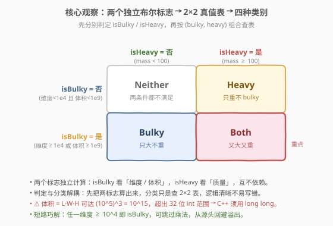
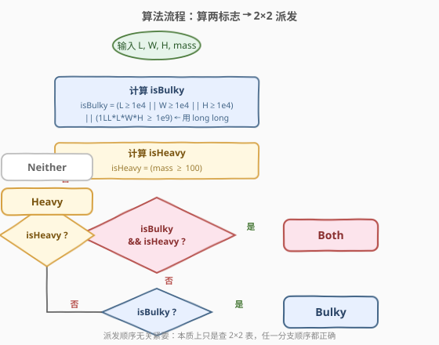
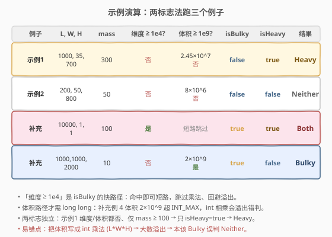

# LeetCode 根据规则将箱子分类 题解

## 1. 题目概述

- **标题 / 题号**：根据规则将箱子分类（#2525，easy）
- **链接**：https://leetcode.cn/problems/categorize-box-according-to-criteria/
- **难度**：简单
- **标签**：数学、条件判定、溢出处理、布尔标志

**题意**：给定箱子的四个整数 `length`、`width`、`height`、`mass`，按以下规则返回其类别字符串：

- **Bulky**（大）：① 至少有一个维度 $\ge 10^4$；或 ② 体积 $V = L \cdot W \cdot H \ge 10^9$。满足任一即 Bulky。
- **Heavy**（重）：`mass >= 100` 即 Heavy。
- 再按两标志的组合派发最终类别：

| isBulky | isHeavy | 返回 |
|---------|---------|------|
| 是 | 是 | `"Both"` |
| 是 | 否 | `"Bulky"` |
| 否 | 是 | `"Heavy"` |
| 否 | 否 | `"Neither"` |

**示例 1**：

```text
输入：length = 1000, width = 35, height = 700, mass = 300
输出："Heavy"
解释：维度均 < 10^4；体积 = 2.45×10^7 < 10^9 → 不 Bulky；mass=300 ≥ 100 → Heavy。
```

**示例 2**：

```text
输入：length = 200, width = 50, height = 800, mass = 50
输出："Neither"
解释：维度均 < 10^4；体积 = 8×10^6 < 10^9 → 不 Bulky；mass=50 < 100 → 不 Heavy → Neither。
```

**约束**：

- $1 \le \text{length}, \text{width}, \text{height} \le 10^5$
- $1 \le \text{mass} \le 10^3$

> ⚠️ **隐性陷阱——体积溢出**：三维度最大各 $10^5$，体积上界为 $(10^5)^3 = 10^{15}$，远超 32 位有符号 `int` 上界 $\approx 2.1 \times 10^9$。若直接写 `length * width * height`（C++ 中三 `int` 相乘仍按 `int` 计算），大数会先溢出再与 $10^9$ 比较，把本该 Bulky 的箱子误判成 Neither。**这是本题唯一真正的考点。**

## 2. 解题思路

### 2.1 暴力思路：一长串 if-else 直译规则

最直觉的写法是把题目那串「如果…那么…」原样翻译成一连串条件，把「判定」和「分类」揉在一起：

```text
if (dim >= 1e4 || volume >= 1e9) && mass >= 100: return "Both"
elif (dim >= 1e4 || volume >= 1e9):              return "Bulky"
elif mass >= 100:                                  return "Heavy"
else:                                              return "Neither"
```

逻辑没错，但每一行都重复写 `(dim >= 1e4 || volume >= 1e9)`——Bulky 条件被复制三遍，既冗长又易在改阈值时漏改某一行。它的根本问题是**没有先抽取「Bulky」「Heavy」这两个语义**，而是把判定式直接埋进了分类分支里。

> ⚠️ 这种写法最容易踩的坑仍是 `volume` 的类型：`(dim >= 1e4 || volume >= 1e9)` 里若 `volume` 是 `int` 乘法结果，溢出会让整段判定失效——与是否抽标志无关，是独立的类型问题。

### 2.2 核心观察：两个独立布尔标志 → 2×2 真值表



把问题拆成两步：

1. **判定**：先算出两个独立的布尔标志。
   - `isBulky = (任一维度 ≥ 10^4) || (体积 ≥ 10^9)` —— 维度条件是「快路径」，可短路掉体积乘法。
   - `isHeavy = (mass ≥ 100)`。
2. **分类**：按 $(\text{isBulky}, \text{isHeavy})$ 两位组合查 $2 \times 2$ 真值表，对应 `Both / Bulky / Heavy / Neither`。

> 💡 **本质洞察**：两个判定**互不依赖**——`isBulky` 只看维度与体积，`isHeavy` 只看质量。把它们先各自算成一个 `bool`，「判定」与「分类」就解耦了：分类只剩查表，逻辑清晰且改阈值时只动一处。这其实是把「4 条并列规则」压缩成「2 位编码 + 查表」——**条件数翻倍时标志法只需加 1 位，而直译法要把 if-else 链复制翻倍**。

关于溢出，安全写法是把体积提到 64 位：`1LL * length * width * height`。`1LL` 把首个操作数提升为 `long long`，链式相乘全程按 64 位进行，$(10^5)^3 = 10^{15}$ 安然落在 `long long` 上界 $9.2 \times 10^{18}$ 内。

> 💡 **短路巧解（可选）**：由于「任一维度 $\ge 10^4$」即 Bulky，可先查维度，命中则 `isBulky=true` 跳过乘法；未命中时三维度均 $< 10^4$，体积上界 $< 10^{12}$，仍需 `long long` 但范围更小。此法从源头回避溢出，但**不如直接 `1LL` 直观**，面试写 `1LL` 版即可。

### 2.3 算法流程图



**完整步骤**：

1. 计算 `isBulky`：`length >= 10000 || width >= 10000 || height >= 10000 || 1LL * length * width * height >= 1000000000LL`。
2. 计算 `isHeavy`：`mass >= 100`。
3. 按真值表派发：`Both`（皆真）→ `Bulky`（仅 bulky）→ `Heavy`（仅 heavy）→ `Neither`（皆假）。

> 💡 派发顺序不影响正确性——本质上只是查 $2 \times 2$ 表，先查哪一格都行。下文代码用 `if (bulky && heavy) ... else if (bulky) ... else if (heavy) ... else ...` 的顺序，与题目 bullet 顺序一致、最易读。

### 2.4 示例演算



除了题给两个例子，补两个**触发边界**的例子以覆盖四种类别：

| 例子 | $L,W,H$ | mass | 维度$\ge10^4$? | 体积$\ge10^9$? | isBulky | isHeavy | 结果 |
|------|---------|------|----------------|----------------|---------|---------|------|
| 示例1 | 1000, 35, 700 | 300 | 否 | $2.45\times10^7$ 否 | false | true | **Heavy** |
| 示例2 | 200, 50, 800 | 50 | 否 | $8\times10^6$ 否 | false | false | **Neither** |
| 补充 | 10000, 1, 1 | 100 | **是** | 短路跳过 | true | true | **Both** |
| 补充 | 1000, 1000, 2000 | 10 | 否 | $2\times10^9$ **是** | true | false | **Bulky** |

- **补充例 3（Both）**：维度 $10000 \ge 10^4$ 直接命中 bulky 的快路径，乘法被短路；同时 mass $=100 \ge 100$ → Heavy；两者皆真 → Both。
- **补充例 4（Bulky，体积路径）**：三维度均 $< 10^4$，走体积分支；$1000 \times 1000 \times 2000 = 2 \times 10^9 \ge 10^9$ → bulky；但 mass $=10 < 100$ → 非 heavy → Bulky。注意 $2 \times 10^9$ **已超 `INT_MAX`**，若用 `int` 乘法会溢出为负或截断，错判成 Neither——这正是 `1LL` 的用武之地。

> 💡 **覆盖性**：四个例子恰好枚举真值表的四格，每格至少一例。补例 3、4 分别触发 isBulky 的两条子条件（维度快路径 / 体积阈值），把短路分支与乘法分支都跑到了。

## 3. 参考代码

### C++

```cpp
class Solution {
public:
    string categorizeBox(int length, int width, int height, int mass) {
        bool isBulky = length >= 10000 || width >= 10000 || height >= 10000 ||
                       1LL * length * width * height >= 1000000000LL;
        bool isHeavy = mass >= 100;
        if (isBulky && isHeavy) return "Both";
        if (isBulky)            return "Bulky";
        if (isHeavy)            return "Heavy";
        return "Neither";
    }
};
```

### Python

```python
class Solution:
    def categorizeBox(self, length: int, width: int, height: int, mass: int) -> str:
        is_bulky = (length >= 10000 or width >= 10000 or height >= 10000
                    or length * width * height >= 10**9)
        is_heavy = mass >= 100
        if is_bulky and is_heavy:
            return "Both"
        if is_bulky:
            return "Bulky"
        if is_heavy:
            return "Heavy"
        return "Neither"
```

> 💡 **语言细节**：
> - **C++ 的 `1LL`** 不可省：`length * width * height` 三 `int` 相乘按 `int` 溢出，必须靠 `1LL *` 把链式提升到 `long long`。阈值常量写 `1000000000LL` 同样是 `long long`，比较时两侧类型一致更稳妥。
> - **`||` 短路**：`length >= 10000 || ... || <乘法>` —— 前三维任一命中即跳过乘法，对超大维度天然免溢出（即便漏写 `1LL`，维度命中时也不算乘法；但未命中时仍会溢出，故 `1LL` 不能省）。
> - **Python 无溢出**：整数任意精度，`10**9` 直接比即可；`or` 同样短路。

## 4. 复杂度分析

| 维度 | 复杂度 | 说明 |
|------|--------|------|
| **时间复杂度** | $O(1)$ | 仅几次比较 + 至多一次三数乘法，常数步 |
| **空间复杂度** | $O(1)$ | 只用两个 `bool` 局部变量 |

> 💡 输入只有四个标量，无循环、无数据结构，必然 $O(1)/O(1)$。本题考点不在复杂度，而在**溢出意识**与**判定/分类解耦的代码组织**。

## 5. 扩展：直译法 vs 标志法——条件分类的两种范式

2525 是「多条件分类」的最简代表。这类问题有两种写法，对应两种工程取向：

| 范式 | 代表写法 | 思维核心 | 特点 |
|------|----------|----------|------|
| **直译法** | 2.1 一长串 if-else 复制判定式 | 「规则有几条就写几个 if」 | 直觉、上手快，但判定式被复制，改阈值易漏 |
| **标志法** | 2.2 先抽两 `bool` 再查真值表 | 「先编码状态，再按状态派发」 | 判定与分类解耦，扩展条件只需加标志位 |

> 💡 **何时该用哪种？** 条件少（2–3 个）时直译法够用且更短；条件多、有组合、或阈值需多处复用时，标志法把判定收敛到一处，可维护性更高。本题两条件，标志法与直译法代码量相当，但标志法把「Bulky 判定」只写一遍，是更稳的工程习惯。

> ⚠️ **范式不解决类型问题**：两种写法都受溢出影响——`volume` 是 `int` 乘法时，无论抽不抽标志都会溢出错判。范式管「代码组织」，类型管「数值安全」，二者正交、都要顾。

## 6. 面试要点

1. **本题最容易翻车的点是什么？**

   > 体积溢出。$L, W, H$ 各可达 $10^5$，体积上界 $10^{15}$，超出 32 位 `int`。C++ 中若写 `length * width * height`，三 `int` 相乘按 `int` 算会溢出，导致与 $10^9$ 的比较失真。必须 `1LL * length * width * height` 提升到 64 位。

2. **为什么 `1LL *` 能防溢出，写一个 `1LL` 够吗？**

   > 够。`*` 左结合，`1LL * length` 先把结果提升为 `long long`，后续 `* width * height` 全程按 `long long` 运算。只需在链首放一个 `1LL`；放链中或链尾都来不及——溢出发生在更早的 `int` 相乘阶段。

3. **`length >= 10000 || ... || 1LL * length * width * height >= 1e9` 里，短路对溢出有帮助吗？**

   > 有但**不能替代 `1LL`**。`||` 短路使得前三维任一命中即跳过乘法，对「某维度巨大」的输入天然免算体积。但当三维度均 $< 10^4$ 仍可能体积超 $10^9$（如 $1000 \times 1000 \times 2000$），此时必须走乘法分支，少了 `1LL` 照样溢出。故短路是优化、`1LL` 是安全底线。

4. **为什么不直接用「维度 $\ge 10^4$」当 Bulky 的充分条件，跳过体积？**

   > 因为题目是「维度 $\ge 10^4$ **或** 体积 $\ge 10^9$」，体积可达阈值而三维度都 $< 10^4$（如补充例 4）。只看维度会漏判这类「大体积、中维度」的箱子。两者是「或」关系，缺一不可。

5. **派发四类的 `if` 顺序能换吗？**

   > 能。本质上只是查 $2 \times 2$ 真值表，四格互斥且穷尽，先查哪格都正确。实践中按「Both → Bulky → Heavy → Neither」（与题目 bullet 顺序一致）最易读；只要每条 `if` 用互斥条件（如 `isBulky && isHeavy`、`isBulky`、`isHeavy`、`else`），顺序无关。

> 💡 **一句话总结**：2525 = 「两独立标志查 2×2 表 + 体积防溢」。口诀：**判定分类先解耦，两 bool 算完再查表；维度十的四可短路，体积十的九要 long long**。

## 同类练习题

| # | 题目 | 与本题的关联 |
|---|------|-------------|
| 2042 | [检查句子中的数字是否递增](https://leetcode.cn/problems/check-if-numbers-are-ascending-in-a-sentence/) | 简单条件判定题，对照本题「先抽标志再判定」与「逐项直译」的写法差异 |
| 7 | [整数反转](https://leetcode.cn/problems/reverse-integer/) | 经典 32 位 `int` 溢出处理题，承接本题对 `long long` / 溢出边界的意识 |
| 29 | [两数相除](https://leetcode.cn/problems/divide-two-integers/) | 用位运算在 32 位范围内模拟除法并主动防溢出，是本题「溢出意识」的进阶版 |
| 8 | [字符串转换整数 (atoi)](https://leetcode.cn/problems/string-to-integer-atoi/) | 在边界处显式夹紧到 32 位范围，承接本题「体积可能超 int」的溢出处理意识 |
