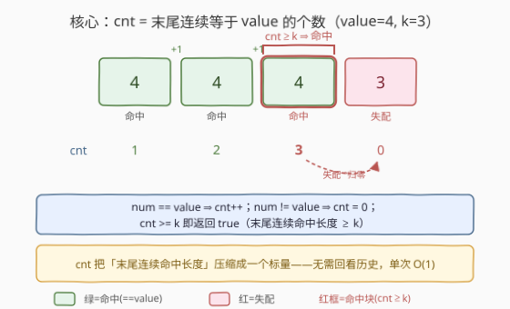
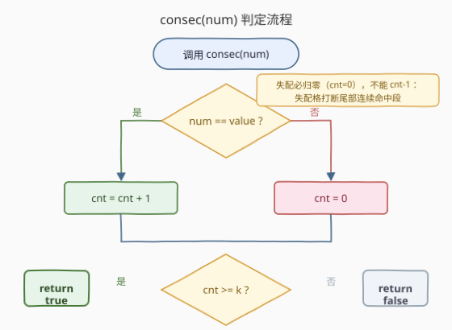
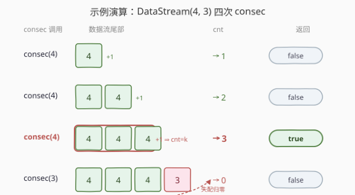

# 找到数据流中的连续整数

- **题目名称**：找到数据流中的连续整数
- **链接**：[2526. 找到数据流中的连续整数](https://leetcode.cn/problems/find-consecutive-integers-from-a-data-stream/)
- **难度**：中等
- **标签**：设计、流、计数

## 1. 题目概述

实现一个 `DataStream` 类，检查整数数据流中**最后 $k$ 个整数**是否都**等于**给定值 `value`。

- `DataStream(int value, int k)`：用 `value` 与 `k` 初始化一个空的整数数据流。
- `boolean consec(int num)`：将 `num` 加入数据流；若数据流最后 $k$ 个整数都等于 `value` 返回 `true`，否则返回 `false`。若整数不足 $k$ 个，条件不满足，返回 `false`。

**示例**：

```text
输入：
["DataStream", "consec", "consec", "consec", "consec"]
[[4, 3], [4], [4], [4], [3]]
输出：
[null, false, false, true, false]
```

解释（`value = 4`，`k = 3`）：

```text
consec(4)  // 流中仅 1 个整数，<k，返回 false
consec(4)  // 流中 2 个整数，<k，返回 false
consec(4)  // 最后 3 个整数都等于 value，返回 true
consec(3)  // 最后 k 个整数为 [4,4,3]，3 ≠ value，返回 false
```

**约束条件**：

- $1 \le \text{value},\ \text{num} \le 10^9$
- $1 \le k \le 10^5$
- `consec` 至多调用 $10^5$ 次

> 💡 **关键约束读法**：`consec` 调用至多 $10^5$ 次、$k$ 可达 $10^5$。若每次都回头检查末尾 $k$ 个整数，最坏 $10^5 \times 10^5 = 10^{10}$ 必超时。必须把单次判定的开销压到 $O(1)$——这正是下文「用增量状态替代回看历史」的动机。

---

## 2. 解题思路

### 2.1 暴力思路：存全部元素，每次回看末尾 k 个

最直接：用一个 `vector`/`list` 收录整个数据流，每次 `consec` 先 `push_back(num)`，再检查末尾 $k$ 个元素是否都等于 `value`：

```text
consec(num):
    stream.append(num)
    if len(stream) < k: return False
    for i in len(stream)-k .. len(stream)-1:
        if stream[i] != value: return False
    return True
```

正确，但 `consec` 每次 $O(k)$，$10^5$ 次调用 $\to 10^{10}$ 超时；空间也需 $O(\text{调用次数})$ 把全部历史存下来。

> ⚠️ 暴力法的浪费：每次都从零扫末尾 $k$ 格，相邻两次 `consec` 的检查区间高度重叠——上一次已经累计的「尾部连续命中长度」信息被丢弃、下次又重算。

### 2.2 核心观察：只维护「结尾连续命中计数 cnt」，单次 O(1)



把「回看末尾 $k$ 格」换成维护一个标量 `cnt` = 「当前数据流**末尾**连续等于 `value` 的整数个数」：

- `consec(num)`：
  - 若 $\text{num} == \text{value}$：`cnt += 1`（命中延续）
  - 若 $\text{num} != \text{value}$：`cnt = 0`（失配打断）
  - 返回 `cnt >= k`

为什么这就等价于暴力？暴力每次扫末尾 $k$ 格来判「是否都等于 value」；而「末尾 $k$ 格都等于 value」当且仅当「末尾连续等于 value 的个数 $\ge k$」。`cnt` 正是把「末尾连续命中长度」作为状态在调用之间传递：命中则 +1、失配则归零，任意时刻 `cnt` 都精确反映「到这里为止尾部连了多少个 value」，无需回看历史。于是 $O(k)$ 被压成 $O(1)$，空间也从 $O(\text{调用次数})$ 压到 $O(1)$。

> 💡 **不足 $k$ 个怎么办？** 当累计元素不足 $k$ 个时，`cnt` 即便因命中而增长也 $< k$，`cnt >= k` 自然返回 `false`——与题目「少于 $k$ 个返回 false」的要求一致。故无需单独记录元素总数：「连续命中长度 $\ge k$」在逻辑上已蕴含「元素至少 $k$ 个」，`cnt` 既是尾部连续命中长度又隐含判定了是否够 $k$ 个。

### 2.3 算法流程图



逻辑极短，核心是「命中 +1 / 失配归零」与「`cnt >= k` 比较」：

```text
consec(num):
    if num == value:
        cnt += 1            # 命中：尾部连续 +1
    else:
        cnt = 0             # 失配：打断，归零
    return cnt >= k
```

构造时只需记录 `value`、`k`，`cnt` 初始为 0。

> ⚠️ **失配必须立即归零**：`num != value` 时直接 `cnt = 0`，而非 `cnt -= 1`。因为「末尾连续命中」一旦被打断，长度清零——这一格本身就不是 value，不可能是任何尾部连续命中段的一部分。若只做 `cnt -= 1`，会把「中断后仍残留正数」误判为命中。

### 2.4 示例演算



沿用题目示例 `DataStream(4, 3)`：

| 步骤 | 调用 | num==value? | cnt 变化 | cnt>=k? | 返回 | 数据流尾部 |
|------|------|-------------|----------|---------|------|------------|
| 1 | consec(4) | 是 (4==4) | 0→1 | 1>=3 否 | false | [4] |
| 2 | consec(4) | 是 | 1→2 | 2>=3 否 | false | [4,4] |
| 3 | consec(4) | 是 | 2→3 | 3>=3 是 | true | [4,4,4] |
| 4 | consec(3) | 否 (3≠4) | 3→0 | 0>=3 否 | false | [4,4,4,3] |

- **第 3 步**：`cnt` 从 2 涨到 3，恰好达到 $k=3$，返回 `true`。
- **第 4 步**：`num=3 ≠ value=4`，`cnt` 立即归零（即便上一步已满 3），返回 `false`——印证失配打断。

> 💡 **关键一步在第 4 步**：上一步 `cnt` 已达 3 满足条件返回 true，但只要下一格失配，`cnt` 立即清零。这说明 `cnt` 永远只追踪「**末尾**」的连续命中，与更早的历史无关；暴力法若不维护状态，需在第 4 步回看末尾 3 格 `[4,4,3]` 才发现失配，而本算法用 $O(1)$ 即判定。

---

## 3. 参考代码

### C++

```cpp
class DataStream {
    int value, k, cnt = 0;
public:
    DataStream(int value, int k) : value(value), k(k) {}

    bool consec(int num) {
        if (num == value) ++cnt;   // 命中：尾部连续 +1
        else              cnt = 0; // 失配：打断，归零
        return cnt >= k;
    }
};
```

> 💡 **实现细节**：① `cnt` 在类内直接初始化为 0，构造函数只存 `value`、`k`，无需预处理。② 判定用 `cnt >= k` 而非 `==`：命中长度可能超过 $k$（连续多个 value 之后仍继续命中），`==` 会在 $cnt > k$ 时误返回 false。③ `num == value` 与 `num != value` 二分支不存在「中间状态」——失配必归零。

### Python

```python
class DataStream:
    def __init__(self, value: int, k: int):
        self.value = value
        self.k = k
        self.cnt = 0

    def consec(self, num: int) -> bool:
        if num == self.value:
            self.cnt += 1           # 命中：尾部连续 +1
        else:
            self.cnt = 0            # 失配：打断，归零
        return self.cnt >= self.k
```

> 💡 **对照 C++**：逻辑完全一致。Python 中 `cnt` 在 `__init__` 显式置 0；若想更紧凑可写 `self.cnt += num == self.value` 利用布尔转整型，但可读性差，不推荐。`consec` 单次 $O(1)$，$10^5$ 次调用毫无压力。

---

## 4. 复杂度分析

| 维度 | 复杂度 | 说明 |
|------|--------|------|
| `consec` 时间 | $O(1)$ | 一次比较 + `cnt` 自增或归零 + 一次比较返回，常数步 |
| 构造时间 | $O(1)$ | 仅记录 `value`、`k`，`cnt` 置 0 |
| 空间 | $O(1)$ | 仅三个标量 `value`、`k`、`cnt`，不存储数据流历史 |
| 对照：暴力 | $O(k)$ 每次 / $O(n)$ 空间 | 每次 `consec` 回扫末尾 $k$ 格，$n$ 次调用需 $O(nk)$；存全部历史占 $O(n)$ 空间 |

> 💡 **总量估算**：$10^5$ 次调用 $\times\ O(1) = 10^5$ 次常数操作，远低于时限。这是「**用增量状态替代回看历史**」把 $O(k)$ 压成 $O(1)$ 的典型——只追踪与判定相关的标量，丢弃无关历史。

---

## 5. 扩展：从「后缀计数」到「结尾型增量」——更一般的连续判定

本题「末尾连续命中 $\ge k$」是「**后缀型**」连续判定：只需一个标量 `cnt`。它属于更广的「**以当前元素结尾的最长合法段长度**」范式——状态只依赖前一格，命中则 +1、失配则清零/跳变：

| 题型 | 状态 | 单次复杂度 | 关键变量 |
|------|------|-----------|----------|
| 末尾连续命中 $\ge k$（本题） | 标量 `cnt` | $O(1)$ | `cnt`（命中+1 / 失配归零） |
| 末尾恰好 $k$ 个命中 | `cnt` + 上限 | $O(1)$ | `cnt`，命中超 $k$ 时返回 false |
| 全局最长连续相同段 | `cnt` + `best` | $O(1)$ | `cnt`、`best = max(best, cnt)` |

> 💡 **与滑动窗口/单调队列的对照**：`cnt` 可视作「以当前元素结尾的最长 value 连续段长度」——与 [3. 无重复字符的最长子串](../0001-0100/3_无重复字符的最长子串.md) 中「以 $i$ 结尾的最长无重子串长度」、[674. 最长连续递增序列](../0601-0700/674_最长连续递增序列.md) 中「以 $i$ 结尾的最长连续递增长度」同属「**结尾型 DP / 增量计数**」范式：本题特例化为「只需判 `cnt >= k` 是否达成」，故连 `best` 都不必维护。

---

## 6. 面试要点

1. **为什么用 `cnt >= k` 而非 `cnt == k`？**

   > 连续命中后 `cnt` 可超过 $k$（如 $k=3$、连续 5 个 value 时 `cnt` 涨到 4、5）。题目要求「最后 $k$ 个都等于 value」，只要末尾连续命中长度 $\ge k$ 即满足；用 `==` 会在 `cnt > k` 时误返回 false。

2. **失配为什么直接 `cnt = 0` 而非 `cnt -= 1`？**

   > `cnt` 追踪的是「末尾连续等于 value 的个数」。失配格本身不是 value，它打断了一切尾部连续命中段，长度必须归零（这格不可能属于任何 value 连续段）。`cnt -= 1` 会保留残余正数，把「已打断」误判为「仍在命中」。

3. **不足 $k$ 个元素时为何无需单独判断？**

   > `cnt` 是「末尾连续命中长度」；若累计元素不足 $k$ 个，则 `cnt`（即使全是命中）也 $< k$，`cnt >= k` 自然返回 false。连续命中长度 $\ge k$ 在逻辑上已蕴含「元素至少 $k$ 个」，故不必另存元素总数。

4. **为什么本题只需 $O(1)$ 空间而暴力要 $O(n)$？**

   > 判定「末尾 $k$ 个都等于 value」只依赖「末尾连续命中长度」这一个标量，与更早的历史无关。暴力存全部历史是因为它「不维护状态、每次回看」，而维护 `cnt` 后历史信息被压缩进一个标量——这是「**只保留与判定相关的最小状态**」的范例。

5. **若把题面改为「末尾连续 $k$ 个都等于某个**变化的**目标值」，还能 $O(1)$ 吗？**

   > 仍可 $O(1)$，但状态从单标量升级为二元组 `(cur_val, len)`：记录当前末尾连续相同的值及其长度。命中（`num == cur_val`）则 `len + 1`，失配则切换为 `(num, 1)`；再判断 `len >= k 且 cur_val == 目标值`。若目标值**随每次调用动态变化**，则单标量不够，需此二元组或退化为存末尾 $k$ 元素的队列。

> 💡 **一句话总结**：维护标量 `cnt` = 末尾连续等于 `value` 的个数，命中 +1、失配归零，返回 `cnt >= k`；单次 `consec` $O(1)$、空间 $O(1)$，靠「增量计数替代回看历史」把暴力 $O(k)$ 压掉。

---

## 7. 同类练习题

- [674. 最长连续递增序列](https://leetcode.cn/problems/longest-continuous-increasing-subsequence/)（[题解](../0601-0700/674_最长连续递增序列.md)）：维护「以 $i$ 结尾的最长连续递增长度」，命中（递增）+1 / 失配归零，与本题 `cnt` 维护同构
- [1446. 连续字符](https://leetcode.cn/problems/consecutive-characters/)（[题解](../1401-1500/1446_连续字符.md)）：维护「末尾连续相同字符长度」，命中 +1 / 失配归零，本题的字符版
- [485. 最大连续 1 的个数](https://leetcode.cn/problems/max-consecutive-ones/)（[题解](../0401-0500/485_最大连续1的个数.md)）：维护「末尾连续 1 长度」，失配归零，结尾型增量计数的最简形态
- [3. 无重复字符的最长子串](https://leetcode.cn/problems/longest-substring-without-repeating-characters/)（[题解](../0001-0100/3_无重复字符的最长子串.md)）：同样维护「以 $i$ 结尾的最长合法段长度」增量状态、失配跳变——结尾型 DP/计数的范式代表
- [918. 最大环形子数组的和](https://leetcode.cn/problems/maximum-sum-circular-subarray/)（[题解](../0901-1000/918_最大环形子数组和.md)）：Kadane 的「以 $i$ 结尾的最大子段和」命中延续 / 失配重启，与 `cnt` 同为「结尾型增量状态」思想
