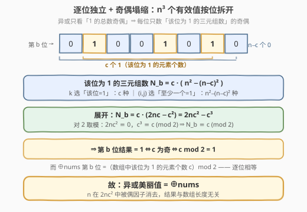
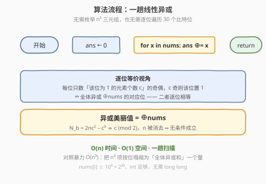
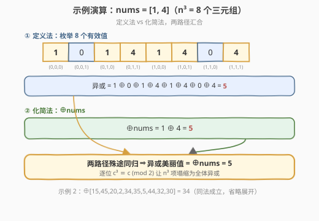

# 查询数组异或美丽值

- **题目名称**：查询数组异或美丽值
- **链接**：[2527. 查询数组异或美丽值](https://leetcode.cn/problems/find-xor-beauty-of-array/)
- **难度**：中等
- **标签**：位运算、数组、脑筋急转弯、数学

## 1. 题目概述

给你一个下标从 0 开始的整数数组 `nums`（长度 $n$）。三个下标 $i, j, k$ 的**有效值**定义为 $((\text{nums}[i] \;|\; \text{nums}[j]) \;\&\; \text{nums}[k])$。数组的**异或美丽值**是所有满足 $0 \le i, j, k < n$ 的三元组 $(i, j, k)$ 的有效值之**异或**。请返回 `nums` 的异或美丽值。

**示例 1**：

```text
输入：nums = [1,4]
输出：5
解释：8 个三元组的有效值依次为 1,0,1,4,1,4,0,4，
      其异或 1 ^ 0 ^ 1 ^ 4 ^ 1 ^ 4 ^ 0 ^ 4 = 5。
```

**示例 2**：

```text
输入：nums = [15,45,20,2,34,35,5,44,32,30]
输出：34
```

**约束条件**：

- $1 \le \text{nums.length} \le 10^5$
- $1 \le \text{nums}[i] \le 10^9$

> ⚠️ 朴素地枚举 $n^3$ 个三元组、逐个算有效值再异或必然超时（$n \le 10^5$ 时三元组数高达 $10^{15}$）。突破口在于认清「异或」的本质是**按位独立的奇偶判定**：把目标按位拆开，每一位只需统计「该位为 1 的三元组个数」的奇偶，而该统计量会惊人地塌缩成「数组中该位为 1 的元素个数」的奇偶——即 $\bigoplus \text{nums}$ 的对应位。

---

## 2. 解题思路

### 2.1 暴力思路：枚举全部三元组

三重循环枚举 $(i, j, k)$，把 $((\text{nums}[i] \;|\; \text{nums}[j]) \;\&\; \text{nums}[k])$ 累异或进答案：

```text
ans = 0
for i in range(n):
    for j in range(n):
        for k in range(n):
            ans ^= (nums[i] | nums[j]) & nums[k]
```

时间 $O(n^3)$，$n \le 10^5$ 时 $n^3 \approx 10^{15}$，必然超时。瓶颈在于把「按位异或」当成黑盒逐个三元组计算，没有利用它**按位独立**与**只看奇偶**的结构。

### 2.2 核心观察：逐位拆解 + 奇偶塌缩



异或的关键性质：**结果在每一位 $b$ 上是否为 1，只取决于「该位上 1 的总数是否为奇数」**，与其余位无关。因此可把 $n^3$ 个有效值按位拆开，**逐位独立分析**。

固定某一位 $b$。记 $c$ = `nums` 中第 $b$ 位为 1 的元素个数，$n-c$ 为该位为 0 的个数。一个三元组有效值的第 $b$ 位为 1，当且仅当

$$
(\text{nums}[i] \;|\; \text{nums}[j])_b = 1 \;\;\text{且}\;\; (\text{nums}[k])_b = 1.
$$

- $k$ 必须取该位为 1 的元素：$c$ 种选法；
- $(i, j)$ 至少一个该位为 1：全部 $n^2$ 对减去「两者都为 0」的 $(n-c)^2$ 对，即 $n^2 - (n-c)^2$ 种。

故**该位为 1 的三元组总数**为

$$
N_b \;=\; c \cdot \bigl(n^2 - (n-c)^2\bigr).
$$

> ⚠️ **易错点**：$k$ 控制 $\&$ 的右操作数，要求该位为 1；$(i,j)$ 控制 $|$ 的左操作数，要求「至少一个为 1」。两者条件不同，别混为一谈。展开 $n^2-(n-c)^2 = 2nc - c^2$ 后，$c$ 与 $n$ 的角色才清晰分离。

现在只需关心 $N_b$ 的**奇偶**（异或只看奇偶）。展开：

$$
N_b \;=\; c \cdot (2nc - c^2) \;=\; 2n c^2 - c^3.
$$

对 $2$ 取模：$2n c^2 \equiv 0$，而 $c^3 \equiv c \pmod 2$（任何整数与其自身的奇数次幂同奇偶）。于是

$$
N_b \;\equiv\; c \pmod 2.
$$

即「该位结果为 1」当且仅当 $c$ 为奇。而 $\bigoplus \text{nums}$ 在第 $b$ 位上的值，正是「`nums` 中该位为 1 的元素个数 $c$」的奇偶——即 $c \bmod 2$。两者逐位相等，故

$$
\boxed{\,\text{异或美丽值} \;=\; \bigoplus_{x \in \text{nums}} x\,}
$$

> 💡 **一句话总结**：$n^3$ 个有效值的异或，按位塌缩后每位只取决于「数组中该位为 1 的元素个数」的奇偶，恰好等于全体元素的异或和。答案就是 $\bigoplus \text{nums}$。

> 💡 **为何 $c^3 \equiv c \pmod 2$**：$c^2 - c = c(c-1)$ 是两个相邻整数之积，必为偶数，故 $c^2 \equiv c$，立得 $c^3 = c \cdot c^2 \equiv c \cdot c = c^2 \equiv c$。这步把 $N_b$ 中的 $n$ 彻底消去——这就是结果**与 $n$ 的奇偶无关**、无条件等于 $\bigoplus \text{nums}$ 的根因（对照 2425 成对异或中 $n$ 的奇偶仍残留）。

### 2.3 算法流程图



算法极简，一趟线性扫描：

1. 初始化 `ans = 0`；
2. 遍历 `nums` 中每个 $x$，执行 `ans ^= x`；
3. 返回 `ans`。

> ⚠️ 注意无需枚举任何三元组、也无需逐位遍历 30 个比特位——2.2 的推导已把 $n^3$ 项压缩为「全体异或和」一个量。

### 2.4 示例演算

以示例 1 `nums = [1, 4]`（$n=2$）为例，对照「定义法」与「化简法」：



- **定义法**：8 个三元组有效值依次为 $1,0,1,4,1,4,0,4$，异或 $= 1 \oplus 0 \oplus 1 \oplus 4 \oplus 1 \oplus 4 \oplus 0 \oplus 4 = 5$；
- **化简法**：$\bigoplus \text{nums} = 1 \oplus 4 = 5$；
- 两路径殊途同归，结果一致 $= 5$。

对照示例 2 `nums = [15,45,20,2,34,35,5,44,32,30]`：$\bigoplus \text{nums} = 34$（$n^3 = 1000$ 个三元组的有效值异或同样为 $34$），与输出一致。

---

## 3. 参考代码

### C++

```cpp
class Solution {
  public:
    int xorBeauty(vector<int>& nums) {
        int ans = 0;
        for (int x : nums) ans ^= x;
        return ans;
    }
};
```

### Python

```python
class Solution:
    def xorBeauty(self, nums: List[int]) -> int:
        ans = 0
        for x in nums:
            ans ^= x
        return ans
```

> 💡 **为何如此之短？** 由 2.2，异或美丽值逐位等于 $\bigoplus \text{nums}$ 的对应位，全体求和即得 $\bigoplus \text{nums}$。$\text{nums}[i] \le 10^9 < 2^{30}$，结果不超过 30 位，`int` 足够，无需 `long long`。

---

## 4. 复杂度分析

| 维度 | 逐位塌缩法 | 暴力枚举三元组 |
|------|-----------|---------------|
| **时间复杂度** | $O(n)$（一趟线性异或） | $O(n^3)$（三重循环逐个计算） |
| **空间复杂度** | $O(1)$（仅一个累加变量） | $O(1)$（边算边累加，不存三元组） |
| **是否枚举三元组** | 否，靠按位独立 + 奇偶塌缩消去 | 是，逐个算 $((a_i\|a_j)\&a_k)$ |

> 💡 **为何 $O(n)$ 而非 $O(n^3)$？** 关键在 2.2 把「$n^3$ 个有效值的异或」按位拆开：每位只需统计「为 1 的三元组数」$N_b = c\cdot(n^2-(n-c)^2)$ 的奇偶，而 $N_b \equiv c \pmod 2$ 与 $n$ 无关地塌缩为「数组该位 1 的个数」的奇偶——正是 $\bigoplus \text{nums}$ 的对应位。逐位求和即全体异或，三元组个数不再进入复杂度。

---

## 5. 扩展：与「成对异或」的对比与逐位框架

2.2 的推导实质是**逐位奇偶计数**这一通用框架的特例：异或在第 $b$ 位上的结果 $=$ 「该位为 1 的项数 $\bmod 2$」。只要能写出「该位为 1 的项数」的公式并取模，即可绕开展开全部项。

把它与本仓库 [2425. 所有数对的异或和](../2401-2500/2425_所有数对的异或和.md) 对照，能看清「为何 2527 无条件等于 $\bigoplus \text{nums}$，而 2425 却要带长度奇偶」：

- **2425（两数组、成对、$a_i \oplus b_j$）**：第 $k$ 位为 1 的数对数 $= (n-c_1)c_2 + c_1(m-c_2) \equiv n c_2 + m c_1 \pmod 2$。$n, m$ 的奇偶**残留**在公式里，故结果 $= (m\text{ 奇}?\;\bigoplus\text{nums1}:0) \oplus (n\text{ 奇}?\;\bigoplus\text{nums2}:0)$。
- **2527（单数组、三元、$((a_i|a_j)\&a_k)$）**：第 $b$ 位为 1 的三元组数 $= c\cdot(n^2-(n-c)^2) = 2nc^2 - c^3 \equiv c \pmod 2$。$n$ 在 $2nc^2$ 中被「偶因子」消去，$c^3 \equiv c$ 又把 $n$ 之外的 $c$ 的高次项折叠回 $c$，故结果**无条件** $= \bigoplus \text{nums}$。

> 💡 **本质差异**：异或能塌缩，靠的是「自反性 $a\oplus a=0$」在逐位层面表现为「偶次抵消 / 奇偶判定」。2425 中每个元素重复次数由「另一数组长度」决定，故长度奇偶入场；2525 中 $n$ 被 $2nc^2$ 的偶因子吞没，奇偶不再相关。换作「所有三元组有效值之**和**」或「之**或**」，此路不通——加法无自反性、或运算单调不降，需另谋他法（如逐位计数求和、或集合上取最值）。

---

## 6. 面试要点

1. **为什么异或可以「按位独立」分析，而加法/或运算不行？**

   - 异或的第 $b$ 位结果只依赖各操作数第 $b$ 位，且只看「1 的总数奇偶」——没有进位、没有跨位传播。加法有进位链、或运算的单调性使「至少一个 1」无法用奇偶折叠，故唯有异或（及模 2 意义下的运算）能逐位独立塌缩。

2. **$N_b = c\cdot(n^2-(n-c)^2)$ 这一步是怎么来的？**

   - 有效值第 $b$ 位 $= (a_i|a_j)_b \wedge (a_k)_b$。要它为 1，需 $a_k$ 第 $b$ 位 $=1$（$c$ 种）且 $(a_i,a_j)$ 至少一个第 $b$ 位 $=1$（$n^2-(n-c)^2$ 种，全集减两皆 0）。两者独立相乘即得。

3. **为什么 $N_b \bmod 2 = c \bmod 2$，与 $n$ 无关？**

   - $N_b = c(2nc - c^2) = 2nc^2 - c^3$。$2nc^2$ 含因子 2 故 $\equiv 0$；$c^3 \equiv c \pmod 2$（因 $c^2\equiv c$）。所以 $N_b \equiv c \pmod 2$，$n$ 被偶因子消去，结果与数组长度无关，无条件等于 $\bigoplus \text{nums}$。

4. **和 2425「所有数对的异或和」相比，为何那里要判长度奇偶、这里不用？**

   - 2425 中第 $k$ 位为 1 的数对数 $\equiv nc_2 + mc_1 \pmod 2$，$n,m$ 奇偶残留，故需「长度奇才把对应数组异或和计入」。2527 中 $n$ 进入 $2nc^2$ 的偶因子被消去，无需任何长度判定，直接 $\bigoplus \text{nums}$。

5. **`int` 会溢出吗？需要 `long long` 吗？**

   - 不需要。$\text{nums}[i] \le 10^9 < 2^{30}$，全体异或的结果每位不超过两操作数对应位之或，仍 $< 2^{30}$，32 位有符号 `int`（上限 $\approx 2.1 \times 10^9$）绰绰有余。

> 💡 **一句话总结**：异或美丽值 $= \bigoplus \text{nums}$。因为逐位来看，每位为 1 的三元组数 $N_b = c(n^2-(n-c)^2) \equiv c \pmod 2$，恰等于 $\bigoplus \text{nums}$ 该位（数组中该位 1 的个数 $c$ 的奇偶）。一趟线性异或，$O(n)$ 时间、$O(1)$ 空间。

---

## 7. 同类练习题

- [2425. 所有数对的异或和](https://leetcode.cn/problems/bitwise-xor-of-all-pairings/)（[题解](../2401-2500/2425_所有数对的异或和.md)）：同为「用代数性质把 $nm$ 项异或塌缩」的脑筋急转弯；对照体会「成对异或需判长度奇偶」vs「三元异或无条件等于 $\bigoplus\text{nums}$」的根因（$n$ 被偶因子消去）
- [1486. 数组异或操作](https://leetcode.cn/problems/xor-operation-in-an-array/)（[题解](../1401-1500/1486_数组异或操作.md)）：异或累积的入门题，体会 $a \oplus a = 0$ 的抵消规律，与本题「全体异或」同源
- [1310. 子数组异或查询](https://leetcode.cn/problems/xor-queries-of-a-subarray/)（[题解](../1301-1400/1310_子数组异或查询.md)）：前缀异或 $\text{pref}[r]\oplus\text{pref}[l-1]$，与「逐位奇偶」「重复抵消」同源于自反性
- [1442. 形成两个异或相等数组的三元组数目](https://leetcode.cn/problems/count-triplets-that-can-form-two-arrays-of-equal-xor/)（[题解](../1401-1500/1442_形成两个异或相等数组的三元组数目.md)）：同为「三元组 + 异或」题材，$a=b \iff a\oplus b=0$ 即偶次抵消为 0 的判等应用
- [1720. 解码异或后的数组](https://leetcode.cn/problems/decode-xored-array/)（[题解](../1701-1800/1720_解码异或后的数组.md)）：异或的逆运算，由 $\text{encoded}[i]=\text{arr}[i]\oplus\text{arr}[i+1]$ 反推，异或基本性质入门
