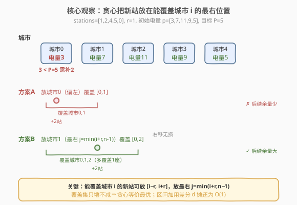
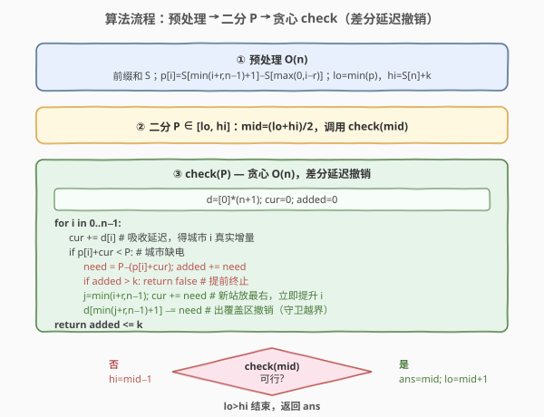

# LeetCode 最大化城市的最小电量 题解

## 1. 题目概述

- **标题 / 题号**：最大化城市的最小电量（#2528，hard）
- **链接**：https://leetcode.cn/problems/maximize-the-minimum-powered-city/
- **难度**：困难
- **标签**：数组、二分查找、二分答案、贪心、差分、滑动窗口、前缀和

**题意**：给定下标从 0 开始、长度为 `n` 的整数数组 `stations`，`stations[i]` 表示第 `i` 座城市已有的供电站数目。每座供电站可向范围 `r` 内（满足 $|i-j|\le r$）的所有城市各供应 $1$ 单位电力。一座城市的**电量** $=$ 所有能给它供电的供电站数目。

政府批准额外建造 `k` 座供电站（可建在任意城市，含已建城市），需以最优策略选址，使**所有城市电量的最小值尽可能大**。返回该最大化的最小电量。

**示例 1**：

```text
输入：stations = [1,2,4,5,0], r = 1, k = 2
输出：5
解释：最优方案之一是把 2 座供电站都建在城市 1，供电站数目变为 [1,4,4,5,0]。
     各城市电量：城市0=1+4=5；城市1=1+4+4=9；城市2=4+4+5=13；
                 城市3=4+5=9；城市4=5+0=5。最小电量为 5，无法更优。
```

**示例 2**：

```text
输入：stations = [4,4,4,4], r = 0, k = 3
输出：4
解释：r=0 时供电站只给自己城市供电。k=3 座最多把 3 座城市提到 5，
     第 4 座恒为 4，故最优最小电量仍是 4。
```

**约束**：

- $n == \text{stations.length}$
- $1 \le n \le 10^5$
- $0 \le \text{stations[i]} \le 10^5$
- $0 \le r \le n-1$
- $0 \le k \le 10^9$

> 💡 本题是「最大化最小值」二分答案的经典困难题：**二分目标电量 $P$** + **贪心 $O(n)$ 验证**，难点在 `check` 要用**差分延迟数组**把"每次给一段区间加值"摊还成 $O(1)$，使整轮验证线性。是 [875](../0801-0900/875_爱吃香蕉的珂珂.md)/[1011](../1001-1100/1011_在D天内送达包裹的能力.md) 这类一维二分答案的进阶版——把"逐点计数"升级为"逐点决策 + 区间延迟撤销"。

## 2. 解题思路

### 2.1 暴力思路

枚举 `k` 座供电站的所有放置位置组合（$n^k$ 种），每种放置后 $O(n)$ 重算每座城市电量取最小，再取最大。$n=10^5$、$k$ 可达 $10^9$，组合数与 $k$ 成指数，完全不可行。

> ⚠️ 暴力的根因在于把"放置 $k$ 座"当成**组合搜索**。但放置的"好坏"只看能否让每座城市电量 $\ge P$——这是**判定问题**而非**枚举问题**。一旦把目标从"求最大值"翻转为"给定 $P$ 判定可行性"，搜索空间就从 $n^k$ 塌缩为对 $P$ 的二分。

### 2.2 核心观察：二分答案 + 贪心区间覆盖



三个观察层层递进：

1. **目标电量的二段性**：设 $f(P)=$ "能否用 $\le k$ 座新增站使每座城市电量 $\ge P$"。$P$ 越小越宽松、越易满足。存在分界点 $P^*$：$P \le P^*$ 可行、$P > P^*$ 不可行，答案即最大可行 $P^*$。这是标准二分所需的单调性 $\Rightarrow$ **二分答案**。

2. **贪心决策：新站放在能覆盖当前城市的最右位置**：从左到右扫描，遇到城市 $i$ 电量不足时，必须补站。能覆盖城市 $i$ 的新站可放在 $[i-r,\ i+r]$（夹到 $[0,n-1]$）中任意城市。放得**越靠右**（即 $j=\min(i+r,\ n-1)$）覆盖的后续城市越多，越省站 $\Rightarrow$ **贪心等价于最优**（交换论证：把任何靠左的放置右移到 $j$，覆盖集只增不减，不会使任何已满足城市掉队，却给后续更多余量）。

3. **$O(n)$ check 的关键：差分延迟撤销**：每次在 $j$ 加 `need` 座站，会给 $[j-r,\ j+r]$ 整段区间各 $+1\cdot\text{need}$（每座站贡献 $1$）。朴素区间加是 $O(n)$/次、共 $n$ 次会退化到 $O(n^2)$。但只要用一个**延迟数组 `d`**：在区间右端 $+1$ 处记 `d[j+r+1] -= need`，扫描时维护 `cur += d[i]` 累积当前增量，就能把每次区间加摊还成 $O(1)$，整轮 `check` 降到 $O(n)$。

> 💡 **识别信号**：题面含「最大化最小值」+ 能 $O(n)$ 验证候选 $\Rightarrow$ 二分答案；验证中含「每次给固定长度区间加值」$\Rightarrow$ 差分数组摊还。这两个套路叠加是 2528 的招牌。

### 2.3 算法流程图



**预处理（$O(n)$）**：用 `stations` 的前缀和 $S$，城市 $i$ 初始电量 $p[i]=S[\min(i+r,n-1)+1]-S[\max(0,i-r)]$（覆盖它的供电站总数）。

**二分**：`lo = min(p)`（`k=0` 时已可达，必可行），`hi = S[n] + k`（每座城市电量 $\le$ 总站数 $+$ 新增，故最小值不会更高）。每轮 `mid` 调 `check(mid)`：可行 $\Rightarrow$ `ans=mid; lo=mid+1`（向右找更大）；不可行 $\Rightarrow$ `hi=mid-1`。

**`check(P)`（$O(n)$）**：维护 `cur`（当前城市从已加站获得的增量）、`added`（累计新增数）、差分数组 `d`。对 $i=0..n-1$：

- `cur += d[i]`（吸收延迟，进入城市 $i$ 的真实增量）
- 若 `p[i] + cur < P`：`need = P - (p[i]+cur)`，`added += need`，超 $k$ 即返假
- 新站放在 $j=\min(i+r,\ n-1)$：`cur += need`（立即提升 $i$），在 `right = min(j+r, n-1)` 之后撤销：`d[right+1] -= need`（若 `right+1 < n`）
- 扫完返回 `added <= k`

### 2.4 示例演算

![示例演算：stations=[1,2,4,5,0], r=1, k=2，二分 P=5 可行 / P=6 不可行](../images/maxcity_walkthrough.svg)

以示例 1 `stations=[1,2,4,5,0]`、`r=1`、`k=2` 为例。前缀和算得初始电量 $p=[3,7,11,9,5]$，`min(p)=3`，故 `lo=3, hi=12+2=14`。

- **`P=5` 可行**：$i=0$ 电量 $3<5$ 需补 $2$，`added=2`，放 $j=\min(0+1,4)=1$，覆盖右端 $\min(1+1,4)=2$，`d[3]-=2`；$i=1$ `cur=2`，电量 $9\ge5$ 跳过；$i=2$ `cur=2`，$13\ge5$ 跳过；$i=3$ `cur+=d[3]=0`，$9\ge5$ 跳过；$i=4$ `cur=0`，$5\ge5$ 跳过。`added=2\le k` ✓
- **`P=6` 不可行**：$i=0$ 电量 $3<6$ 需补 $3$，`added=3 > k=2` 立即返假 ✗

故答案 $=5$。注意 $i=0$ 时新站放 $j=1$（能覆盖城市 0 的最右位置），与官方解释"建在城市 1"完全一致——贪心天然命中最优选址。

## 3. 参考代码

### C++

```cpp
class Solution {
public:
    long long maxPower(vector<int>& stations, int r, int k) {
        int n = stations.size();
        vector<long long> S(n + 1, 0);
        for (int i = 0; i < n; ++i) S[i + 1] = S[i] + stations[i];
        vector<long long> p(n);
        long long lo = LLONG_MAX, hi = S[n] + k;   // 上界：总站数 + 新增
        for (int i = 0; i < n; ++i) {
            int L = max(0, i - r), R = min(n - 1, i + r);
            p[i] = S[R + 1] - S[L];               // 城市 i 的初始电量
            lo = min(lo, p[i]);
        }
        long long ans = lo;
        while (lo <= hi) {
            long long mid = lo + (hi - lo) / 2;
            if (check(p, r, k, mid)) {
                ans = mid;       // 可行，向右找更大
                lo = mid + 1;
            } else {
                hi = mid - 1;    // 不可行，向左收紧
            }
        }
        return ans;
    }
private:
    bool check(const vector<long long>& p, int r, int k, long long P) {
        int n = p.size();
        vector<long long> d(n + 1, 0);           // 差分延迟：d[i] 在扫描时累积到 cur
        long long cur = 0, added = 0;
        for (int i = 0; i < n; ++i) {
            cur += d[i];                          // 吸收延迟，得到城市 i 的真实增量
            long long total = p[i] + cur;
            if (total < P) {
                long long need = P - total;
                added += need;
                if (added > k) return false;       // 提前终止
                int j = min(i + r, n - 1);          // 新站放能覆盖 i 的最右城市
                cur += need;                        // 立即提升城市 i
                int right = min(j + r, n - 1);       // 这批站的覆盖右端
                if (right + 1 < n) d[right + 1] -= need;  // 出覆盖区撤销
            }
        }
        return added <= k;
    }
};
```

### Python

```python
class Solution:
    def maxPower(self, stations: List[int], r: int, k: int) -> int:
        n = len(stations)
        S = [0] * (n + 1)
        for i in range(n):
            S[i + 1] = S[i] + stations[i]
        p = [0] * n
        lo, hi = 1 << 60, S[n] + k
        for i in range(n):
            L, R = max(0, i - r), min(n - 1, i + r)
            p[i] = S[R + 1] - S[L]
            lo = min(lo, p[i])

        def check(P: int) -> bool:
            d = [0] * (n + 1)                # 差分延迟数组
            cur = added = 0
            for i in range(n):
                cur += d[i]                   # 吸收延迟
                if p[i] + cur < P:
                    need = P - (p[i] + cur)
                    added += need
                    if added > k:
                        return False            # 提前终止
                    j = min(i + r, n - 1)       # 新站放能覆盖 i 的最右城市
                    cur += need                  # 立即提升城市 i
                    right = min(j + r, n - 1)
                    if right + 1 < n:
                        d[right + 1] -= need     # 出覆盖区撤销
            return added <= k

        ans = lo
        while lo <= hi:
            mid = (lo + hi) // 2
            if check(mid):
                ans = mid       # 可行，向右找更大
                lo = mid + 1
            else:
                hi = mid - 1    # 不可行，向左收紧
        return ans
```

> ⚠️ **三个易错点**：
> 1. **`j` 取 $\min(i+r,\ n-1)$ 而非 $i+r$**：靠近右端时 $i+r$ 越界，必须夹到 $n-1$。这同时保证覆盖右端 `right`、撤销点 `right+1` 都合法。
> 2. **差分撤销点用 `right+1` 而非 `j+r+1`**：当 $j$ 被夹到 $n-1$ 时，`right = min(j+r, n-1) = n-1`，`right+1 = n` 越界，需用 `right+1 < n` 守卫。若误用 `j+r+1` 会写出界且语义错误（实际覆盖右端是 $n-1$ 不是 $j+r$）。
> 3. **`cur += need` 紧跟在 `d` 写入之前**：城市 $i$ 必须立刻吃到新站增量才能判 `total`，否则 `total` 仍按旧值。注意 `cur` 已在循环开头 `+= d[i]`，此处再 `+= need` 是叠加当轮新加站对 $i$ 自身的贡献。

## 4. 复杂度分析

| 维度 | 复杂度 | 说明 |
|------|--------|------|
| **时间** | $O(n \log M)$ | 预处理前缀和 $O(n)$；二分 $O(\log M)$ 次（$M=\text{S[n]}+k \le 10^{10}+10^9$，约 $34$ 次），每次 `check` $O(n)$ |
| **空间** | $O(n)$ | 前缀和 `S`、初始电量 `p`、`check` 内差分数组 `d`，各 $O(n)$ |
| 对照：朴素区间加 check | $O(n^2 \log M)$ | 每次 `check` 内每座城市做 $O(r)$ 区间加，退化为 $O(n^2)$，$n=10^5$ 必超时 |

> 💡 $M \le 1.1\times10^{10}$ 时二分约 $34$ 轮，$n=10^5$ ⇒ 总操作约 $3.4\times10^6$，远低于时限。若把 `d` 复用为成员变量并在每轮只 `fill(0)` 可省分配开销，但实测本题分配开销可忽略。

## 5. 扩展：贪心正确性证明与上界讨论

### 5.1 贪心选址的最优性（交换论证）

设某合法方案将补给城市 $i$ 的 `need` 座站放在 $j' < j=\min(i+r,n-1)$（即偏左）。把这部分站从 $j'$ 右移到 $j$：

- **覆盖集只增不减**：$j$ 的覆盖区间 $[j-r,\ j+r] \supseteq [j'-r,\ j'+r]$ 的右半段（因 $j > j'$），且 $j-r \le i$（$j\le i+r \Rightarrow j-r\le i$），故城市 $i$ 仍在覆盖内；右移后覆盖右端 $j+r \ge j'+r$，给后续城市的帮助只多不少。
- **已满足城市不掉队**：右移不影响城市 $i$ 及其右侧已判城市的增量（它们要么仍被覆盖、要么已处理完）；城市 $i$ 仍被覆盖到 `need`，电量达标不变。

故任何偏左放置都能无损右移到 $j$，即贪心选址 $\ge$ 任意合法方案的后继余量 $\Rightarrow$ 贪心可行 $\Leftrightarrow$ 存在合法方案。配合"从左到右、能不补就不补"（推迟消耗），整体 `check` 与最优解等价。

### 5.2 上界 $\text{S[n]}+k$ 的合法性

每座城市电量 $=$ 覆盖它的供电站数 $\le$ 供电站总数（初始 $+$ 新增）$= \text{S[n]}+k$。故最小电量 $\le \text{S[n]}+k$，即答案 $\le \text{S[n]}+k$，`hi` 合法。当 $r=n-1$ 时所有站覆盖所有城市，答案恰 $= \text{S[n]}+k$（每座城市电量同为总数），二分能精确命中上界。

### 5.3 下界 $\min(p)$ 的可行性

$k=0$ 时答案恰为 $\min(p)$；$k\ge0$ 时只增不减，答案 $\ge \min(p)$。`check(min(p))` 中每座城市 `p[i] >= min(p)`，`need=0`，`added=0 <= k` 恒真 $\Rightarrow$ `lo` 起点 `check` 必真，二分不变式 `check(lo)=true` 始终成立。

### 5.4 与「最小化最大值」的对照

| 维度 | 2528（最大化最小值） | 1011/410（最小化最大值） |
|------|------|------|
| 求解 | 最大可行下界 $P^*$ | 最小可行上界 $C^*$ |
| 单调方向 | $f(P)$ 随 $P$ 递减 | $g(C)$ 随 $C$ 递减 |
| 可行分支 | `ans=mid; lo=mid+1`（向右扩） | `ans=mid; hi=mid-1`（向左缩） |
| check 形态 | 贪心补缺 + 区间延迟撤销 | 贪心划分/装填不超过限额 |
| 区间加摊还 | 差分数组（核心难点） | 通常无需（逐段累加即可） |

## 6. 面试要点

1. **为什么能二分？二段性来自哪？**

   > $f(P)=$"能否用 $\le k$ 座新增站使每座城市电量 $\ge P$"随 $P$ 单调递减（$P$ 越大越难）。存在分界 $P^*$：$\le P^*$ 可行、$>P^*$ 不可行，答案即最大可行 $P^*$。二分定位 $P^*$ 即可。

2. **贪心为何把新站放在 $j=\min(i+r,n-1)$？**

   > 能覆盖城市 $i$ 的新站可放在 $[i-r,i+r]$ 任一城市。放得越靠右，覆盖的后续城市越多、给后继余量越大，而城市 $i$ 仍被覆盖。交换论证：任何偏左放置都能无损右移到 $j$，故贪心 $\ge$ 任意合法方案余量 $\Rightarrow$ 等价。

3. **`check` 怎么做到 $O(n)$ 而不是 $O(nr)$？**

   > 每次在 $j$ 加 `need` 座站会给 $[j-r,j+r]$ 整段各 $+\text{need}$。朴素区间加 $O(r)$/次共 $n$ 次是 $O(nr)$。用差分数组 `d`：只在区间右端 $+1$ 处记 `d[right+1] -= need`，扫描时 `cur += d[i]` 累积当前增量，每次区间加摊还为 $O(1)$，整轮 $O(n)$。

4. **`cur += d[i]` 与 `cur += need` 的先后含义？**

   > 循环开头 `cur += d[i]` 是吸收"之前别轮加站对城市 $i$ 的延迟增量"（进入新城市时结算）；判 `total < P` 后 `cur += need` 是"本轮新加站对城市 $i$ 自身的立即贡献"（$j$ 覆盖 $i$，必须立刻计入否则判错）。两者职责不同，缺一不可：漏前者会丢历史增量，漏后者会多算 `need`。

5. **`right+1 < n` 守卫若漏掉会怎样？**

   > 靠近右端时 $j$ 被夹到 $n-1$，`right = n-1`，`right+1 = n` 越界写 `d[n]`。`d` 大小 $n+1$ 时虽不崩（写最后一个元素，但循环不读 `d[n]` 所以无害），若 `d` 只开 $n$ 则越界崩溃。统一用 `right+1 < n` 守卫既安全又语义清晰：覆盖到末城时无需撤销（循环结束自然失效）。

> 💡 **一句话总结**：2528 = 「二分答案 + 贪心区间覆盖 + 差分延迟撤销」。目标电量单调给出二段性 $\Rightarrow$ 二分；新站放最右覆盖最多后续 $\Rightarrow$ 贪心等价最优；区间加用差分摊还 $\Rightarrow$ `check` 线性。三者叠加把 $O(n^k)$ 的组合搜索塌缩为 $O(n\log M)$。

## 同类练习题

| # | 题目 | 与本题的关联 |
|---|------|-------------|
| 875 | [爱吃香蕉的珂珂](https://leetcode.cn/problems/koko-eating-bananas/)（[题解](../0801-0900/875_爱吃香蕉的珂珂.md)） | 二分答案母题，对照「最小化最大值」方向与朴素 $O(n)$ check，本题是其区间加进阶 |
| 1011 | [在 D 天内送达包裹的能力](https://leetcode.cn/problems/capacity-to-ship-packages-within-d-days/)（[题解](../1001-1100/1011_在D天内送达包裹的能力.md)） | 二分答案 + 贪心验证，对照「最小化最大值」的 check 形态（贪心划分而非区间覆盖） |
| 2517 | [礼盒的最大甜蜜度](../2501-2600/2517_礼盒的最大甜蜜度.md) | 同为「最大化最小值」二分答案，但 check 是"选满 k 个相邻差 $\ge d$"的计数判定，对照本题"区间加值补缺"的 check 形态 |
| 1552 | [两球之间的磁力](https://leetcode.cn/problems/magnetic-force-between-two-balls/) | 与 2517 完全同构的「最大化最小值」二分答案，可作为该套路的多题对照 |
| 410 | [分割数组的最大值](https://leetcode.cn/problems/split-array-largest-sum/)（[题解](../0401-0500/410_分割数组的最大值.md)） | 「最小化最大值」二分答案 + 贪心划分，与 1011 同构，便于对照两种收缩方向 |
