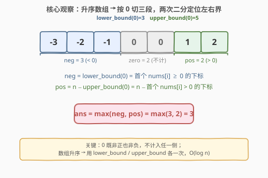
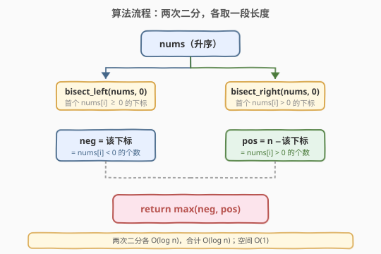
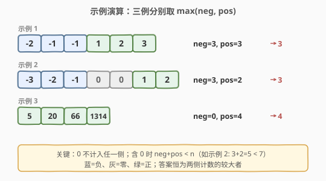

# LeetCode 正整数和负整数的最大计数 题解

## 1. 题目概述

- **标题 / 题号**：正整数和负整数的最大计数（#2529，easy）
- **链接**：https://leetcode.cn/problems/maximum-count-of-positive-integer-and-negative-integer/
- **难度**：简单
- **标签**：数组、二分查找

**题意**：给定一个按**非递减顺序**（升序，允许相等）排列的整数数组 `nums`，返回其中**正整数的个数**与**负整数的个数**的**较大者**。

记正数个数为 $\text{pos}$、负数个数为 $\text{neg}$，返回 $\max(\text{pos}, \text{neg})$。

> ⚠️ **`0` 既非正也非负**：题目明确 `0` 不计入任一侧。因此当数组含 `0` 时 $\text{pos}+\text{neg} < n$，两侧之和会小于数组长度，需把 `0` 段单独识别、跳过。

**示例 1**：

```text
输入：nums = [-2,-1,-1,1,2,3]
输出：3
解释：负数 3 个（-2,-1,-1），正数 3 个（1,2,3），max(3,3) = 3。
```

**示例 2**：

```text
输入：nums = [-3,-2,-1,0,0,1,2]
输出：3
解释：负数 3 个（-3,-2,-1），正数 2 个（1,2），0 不计入，max(3,2) = 3。
```

**示例 3**：

```text
输入：nums = [5,20,66,1314]
输出：4
解释：负数 0 个，正数 4 个，max(0,4) = 4。
```

**约束**：

- $1 \le \text{nums.length} \le 2000$
- $-2000 \le \text{nums[i]} \le 2000$
- `nums` 已按**非递减顺序**排列

**进阶**：能否在 $O(\log n)$ 时间复杂度内解决？

> 💡 「已升序」是本题能做 $O(\log n)$ 的**唯一支点**。若无序，逐元素判定不可省，只能 $O(n)$。一旦升序，负/零/正三段天然连续排布，定位两段边界即可用二分降到 $O(\log n)$。

## 2. 解题思路

### 2.1 暴力思路：一次遍历计数

最直观的实现是**单趟扫描**：遍历 `nums`，对每个元素分类计数——`x < 0` 则 `neg++`，`x > 0` 则 `pos++`，`x == 0` 跳过；最后返回 `max(neg, pos)`。

```python
neg = pos = 0
for x in nums:
    if x < 0:   neg += 1
    elif x > 0: pos += 1
return max(neg, pos)
```

时间 $O(n)$、空间 $O(1)$，对 $n \le 2000$ 完全可 AC。但它**未利用「升序」**这一关键性质——答案只取决于两段长度，而升序让两段边界可被二分直接定位，无需逐元素看。

### 2.2 核心观察：升序 → 三段划分，两次二分定位 0 的左右界



**关键直觉**：升序数组可被值 $0$ 切成至多三段连续区间——**负数段**（`< 0`）、**零段**（`== 0`）、**正数段**（`> 0`）。三段在数组里左右排列、互不交错。因此两侧个数等价于两段长度，而段长 = 边界下标之差，**边界用二分即可在 $O(\log n)$ 内取得**。

具体地，定义两个标准二分：

- $\text{lower\_bound}(0)$：首个满足 $\text{nums}[i] \ge 0$ 的下标。由于负数段全 $<0$、其后即 $\ge 0$，该下标恰好等于**负数段的长度** $\text{neg}$。
- $\text{upper\_bound}(0)$：首个满足 $\text{nums}[i] > 0$ 的下标。它落在零段之后、正数段开头，故**正数段长度** $\text{pos} = n - \text{upper\_bound}(0)$。

$$
\text{neg} = \text{lower\_bound}(0), \qquad \text{pos} = n - \text{upper\_bound}(0), \qquad \text{ans} = \max(\text{neg}, \text{pos})
$$

> 💡 **为什么用 `0` 做切分值？** 因为 `0` 是「正/负」的分界：负数 `< 0`、正数 `> 0`、零 `== 0`。`lower_bound(0)` 用 $\ge 0$ 划出「非负」起点（= 负数段终点 +1），`upper_bound(0)` 用 $> 0$ 划出「正」起点（= 零段终点 +1）。两次二分各取一个边界，正好把三段都框出来。`0` 自身被两界「夹」在中间段，天然不计入任一侧——这正是「`0` 不计」要求的几何体现。

验证三个示例：

| `nums` | $n$ | $\text{lower\_bound}(0)$ | $\text{neg}$ | $\text{upper\_bound}(0)$ | $\text{pos}=n-\text{upper}$ | $\max$ |
|--------|-----|--------------------------|--------------|--------------------------|------------------------------|--------|
| $[-2,-1,-1,1,2,3]$ | $6$ | $3$（首个 $\ge0$ 在下标 3） | $3$ | $3$（首个 $>0$ 也在下标 3） | $6-3=3$ | $3$ |
| $[-3,-2,-1,0,0,1,2]$ | $7$ | $3$（首个 $\ge0$ 在下标 3） | $3$ | $5$（首个 $>0$ 在下标 5） | $7-5=2$ | $3$ |
| $[5,20,66,1314]$ | $4$ | $0$（无 $\ge0$ 前的负数） | $0$ | $0$（首个 $>0$ 在下标 0） | $4-0=4$ | $4$ |

> ⚠️ 示例 2 是最易错情形：数组含 `0`。此时 $\text{lower\_bound}(0) = 3$（首个 $\ge0$ 即首个 `0`），但 $\text{upper\_bound}(0) = 5$（首个 $>0$ 越过两个 `0`），两者之差 $5-3=2$ 正是零段长度。可见 `lower` 与 `upper` 之差给出零段长度，二者分别给出负、正段长度——三段长度之和 $= n$。

### 2.3 算法流程图



流程是对称的两路二分 + 一次取 max：

1. 在升序 `nums` 上做 $\text{lower\_bound}(0)$，得下标 $l$，则 $\text{neg} = l$；
2. 做 $\text{upper\_bound}(0)$，得下标 $r$，则 $\text{pos} = n - r$；
3. 返回 $\max(\text{neg}, \text{pos})$。

> 💡 两次二分**相互独立**，没有依赖关系（都直接对原数组、对值 `0` 查找），故可任意先后。`lower_bound` 用「$\ge$ 目标」判定、`upper_bound` 用「$>$ 目标」判定——同一目标值 `0`、同一升序数组，仅判定符号不同即得两个不同边界，这是标准库 `std::lower_bound` / `std::upper_bound` 与 Python `bisect_left` / `bisect_right` 的设计原意。

### 2.4 示例演算



- **示例 1** `[-2,-1,-1,1,2,3]`：无 `0`，负段长 3、正段长 3，零段长 0。$\text{lower}=3 \to \text{neg}=3$；$\text{upper}=3 \to \text{pos}=6-3=3$；$\max(3,3)=3$。
- **示例 2** `[-3,-2,-1,0,0,1,2]`：含两个 `0`，三段长度 $3/2/2$。$\text{lower}=3 \to \text{neg}=3$；$\text{upper}=5 \to \text{pos}=7-5=2$；$\max(3,2)=3$。注意 $\text{lower}<\text{upper}$ 的差 $5-3=2$ 恰为零段长度，`0` 被两端夹在中间不计入。
- **示例 3** `[5,20,66,1314]`：全正，负段长 0。$\text{lower}=0 \to \text{neg}=0$（首个 $\ge0$ 就在下标 0，前面没有负数）；$\text{upper}=0 \to \text{pos}=4-0=4$；$\max(0,4)=4$。

## 3. 参考代码

### C++（二分，$O(\log n)$）

```cpp
class Solution {
public:
    int maximumCount(vector<int>& nums) {
        int n = nums.size();
        int neg = lower_bound(nums.begin(), nums.end(), 0) - nums.begin();
        int pos = nums.end() - upper_bound(nums.begin(), nums.end(), 0);
        return max(neg, pos);
    }
};
```

> 💡 `std::lower_bound` 返回首个 $\ge$ 目标值的迭代器，`upper_bound` 返回首个 $>$ 目标值的迭代器。两迭代器与 `begin()`/`end()` 的差即下标/长度：`lower - begin()` 得负段长度 $\text{neg}$，`end() - upper` 得正段长度 $\text{pos}$（`end - upper` = $n - r$）。两者都用值 `0` 作目标，仅「$\ge$ 与 $>$」一字之差。

### Python（bisect，$O(\log n)$）

```python
from bisect import bisect_left, bisect_right

class Solution:
    def maximumCount(self, nums: List[int]) -> int:
        neg = bisect_left(nums, 0)
        pos = len(nums) - bisect_right(nums, 0)
        return max(neg, pos)
```

> 💡 `bisect_left` ≡ `std::lower_bound`（返回插入点左侧，即首个 $\ge$ 目标的下标）；`bisect_right` ≡ `std::upper_bound`（首个 $>$ 目标的下标）。`bisect_left(nums, 0)` 直接得 $\text{neg}$；`len(nums) - bisect_right(nums, 0)` 得 $\text{pos}$。两函数底层均为二分，$O(\log n)$。

### 对照：线性版（$O(n)$）

```python
class Solution:
    def maximumCount(self, nums: List[int]) -> int:
        neg = sum(x < 0 for x in nums)
        pos = sum(x > 0 for x in nums)
        return max(neg, pos)
```

> ⚠️ 进阶要求 $O(\log n)$，线性版虽能 AC（$n \le 2000$）但不满足。面试给出二分版以示对「升序」性质的利用；线性版可作为「先说清思路再优化」的引子。

## 4. 复杂度分析

| 维度 | 复杂度 | 说明 |
|------|--------|------|
| **时间（二分版）** | $O(\log n)$ | 两次独立二分，各 $O(\log n)$，合计 $O(\log n)$；满足进阶要求 |
| **空间（二分版）** | $O(1)$ | 仅 `neg`/`pos` 两个整型，二分为迭代实现不递归 |
| 对照：线性版 | $O(n)$ 时间 / $O(1)$ 空间 | 单趟扫描逐元素分类计数，未利用升序 |

> 💡 本题答案只取决于两段长度，升序使长度可由边界下标差表达、而边界可二分——这是「有序 + 求段长 → 二分」的典型范式。$O(\log n)$ 已是信息下界：至少要二分确定「正负交界」位置，少于 $O(\log n)$ 次比较无法区分最坏情形。

## 5. 扩展：边界退化与模板复用

**全负 / 全正 / 全零**：三种极端输入都被二分天然正确处理——

- 全负（如 `[-5,-3,-1]`）：$\text{lower\_bound}(0)=n$（无 $\ge0$ 元素，落到末尾），$\text{neg}=n$；$\text{upper\_bound}(0)=n$，$\text{pos}=n-n=0$；$\max(n,0)=n$。
- 全正（如 `[1,2,3]`）：$\text{lower\_bound}(0)=0$（首元素即 $\ge0$），$\text{neg}=0$；$\text{upper\_bound}(0)=0$（首元素即 $>0$），$\text{pos}=n-0=n$；$\max(0,n)=n$。
- 全零（如 `[0,0,0]`）：$\text{lower}=0,\text{neg}=0$；$\text{upper}=n,\text{pos}=n-n=0$；$\max(0,0)=0$。✓ 与「`0` 不计」一致。

无需任何特判，标准库的「插入点」语义（找不到时返回端点）自动覆盖所有退化情形。这是用库函数而非手写二分的隐性好处——边界由库语义统一保证。

**模板复用**：「有序数组 + 按值切分 + 求段长」的骨架可移植到任意分界值 $v$：把 `0` 换成 $v$，`neg`/`pos` 语义改为「$< v$ 的个数」与「$> v$ 的个数」。例如「统计有序数组中严格小于 $k$ 与严格大于 $k$ 的元素数之较大者」可直接套用 `bisect_left(k)` 与 `n - bisect_right(k)`。

> 💡 进阶可问：若数组**未排序**怎么办？则两段不再连续，无法用边界下标表达长度，必须逐元素判定，回到 $O(n)$。这反过来说明「升序」是 $O(\log n)$ 解法的充分必要支点。

## 6. 面试要点

1. **为什么能做 $O(\log n)$？升序起了什么作用？**

   > 升序使「$<0$」「$=0$」「$>0$」三类元素各成连续段、左右排列不交错。答案（两侧个数）= 两段长度，而段长可由段边界下标差表达，边界可二分。若无序，三类元素随机散布，无法用边界定位，只能逐元素计数 $O(n)$。故「升序」是 $O(\log n)$ 的唯一支点，也是进阶要求能成立的根因。

2. **`lower_bound(0)` 和 `upper_bound(0)` 分别给出什么？为什么差值是零段长度？**

   > `lower_bound(0)` = 首个 $\ge 0$ 的下标 = 负数段终点 $+1$ = 负段长度 $\text{neg}$。`upper_bound(0)` = 首个 $>0$ 的下标 = 零段终点 $+1$。二者之差 $\text{upper}-\text{lower}$ 是「$\ge0$ 且 $\le0$」即 $==0$ 的元素区间长度，恰为零段长度。正段长度则为 $n-\text{upper}$。

3. **如何处理 `0` 既非正也非负？需要特判吗？**

   > 不需特判。`0` 被 `lower` 与 `upper` 两界夹在中间段：它既 $\ge0$（故在 `lower` 之右、不计入负段）又不 $>0$（故在 `upper` 之左、不计入正段），天然从两侧排除。含零时 $\text{neg}+\text{pos} < n$ 正是此机制体现，与题意一致。

4. **全正/全负/全零这些边界情形会被二分正确处理吗？**

   > 会，无需特判。标准库二分的「插入点」语义保证：找不到 $\ge0$ 时 `lower` 落到 $n$（全负→$\text{neg}=n$）；首元素即 $>0$ 时 `upper` 落到 $0$（全正→$\text{pos}=n$）；全零时 $\text{lower}=0,\text{upper}=n,\max(0,0)=0$。用库函数而非手写二分可让边界由库语义统一兜底，免去 `l < r`/`l <= r` 模板的边界调试。

5. **二分版与线性版的取舍？面试该怎么答？**

   > 进阶明确要求 $O(\log n)$，故主答二分版。可先给线性版讲清「分类计数」思路（30 秒），再点明「未用升序」并升级为二分版，体现从 $O(n)$ 到 $O(\log n)$ 的优化意识。数据规模 $n\le2000$ 下两者实测无差，但面试考的是对「有序→可二分」性质的识别，故二分版是评分点。

> 💡 **一句话总结**：升序 `nums` 上做 $\text{lower\_bound}(0)$ 得 $\text{neg}$、$\text{upper\_bound}(0)$ 得 $\text{pos}=n-r$，返回 $\max(\text{neg},\text{pos})$；`0` 被两界夹在中间不计入，全正/全负/全零由库语义自动兜底；$O(\log n)$ 时间、$O(1)$ 空间。

## 同类练习题

| # | 题目 | 与本题的关联 |
|---|------|-------------|
| 34 | [在排序数组中查找元素的第一个和最后一个位置](https://leetcode.cn/problems/find-first-and-last-position-of-element-in-sorted-array/)（[题解](../0001-0100/34_在排序数组中查找元素的第一个和最后一个位置.md)） | 同一对 `lower_bound` + `upper_bound` 的招牌题，本题是其在「统计两端长度」上的简化应用 |
| 35 | [搜索插入位置](https://leetcode.cn/problems/search-insert-position/)（[题解](../0001-0100/35_搜索插入位置.md)） | `lower_bound` 母题，返回首个 $\ge$ 目标的插入点，本题的「负段长度」即此插入点 |
| 278 | [第一个错误的版本](https://leetcode.cn/problems/first-bad-version/)（[题解](../0201-0300/278_第一个错误的版本.md)） | 单调布尔序列找首个 true，`lower_bound` 的谓词版，与本题「首个 $\ge0$」同构 |
| 704 | [二分查找](https://leetcode.cn/problems/binary-search/)（[题解](../0701-0800/704_二分查找.md)） | 闭区间二分母题，一切 `lower/upper_bound` 的根基 |
| 977 | [有序数组的平方](https://leetcode.cn/problems/squares-of-a-sorted-array/)（[题解](../0901-1000/977_有序数组的平方.md)） | 同样按符号把升序数组切负/正两段，但目标是用双指针合并平方值，对照「切分」的不同用法 |
