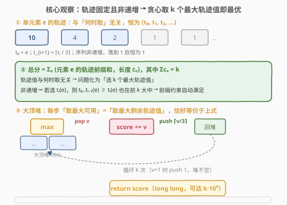
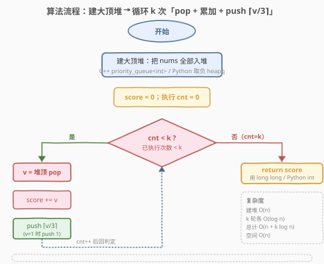

# 执行K次操作后的最大分数

- **题目名称**：执行K次操作后的最大分数
- **链接**：[2530. 执行K次操作后的最大分数](https://leetcode.cn/problems/maximal-score-after-applying-k-operations/)
- **难度**：中等
- **标签**：贪心、堆、优先队列

## 1. 题目概述

给定下标从 $0$ 开始的整数数组 `nums` 与整数 $k$，起始分数为 $0$。每步**操作**：

1. 选一个下标 $i$（$0 \le i < \text{nums.length}$）；
2. 分数 **增加** $\text{nums}[i]$；
3. 将 $\text{nums}[i]$ **替换**为 $\lceil \text{nums}[i] / 3 \rceil$（向上取整）。

返回**恰好执行 $k$ 次**操作后可获得的**最大分数**。$\lceil \text{val} \rceil$ 为不小于 $\text{val}$ 的最小整数。

**示例 1**：

```text
输入：nums = [10,10,10,10,10], k = 5
输出：50
解释：对每个元素各操作一次，分数 = 10+10+10+10+10 = 50。
```

**示例 2**：

```text
输入：nums = [1,10,3,3,3], k = 3
输出：17
解释：
  第 1 步：取 i=1，分数 +10，nums → [1,4,3,3,3]
  第 2 步：取 i=1，分数 +4 ，nums → [1,2,3,3,3]
  第 3 步：取 i=2，分数 +3 ，nums → [1,2,1,3,3]
  最终分数 = 10 + 4 + 3 = 17。
```

**约束条件**：

- $1 \le \text{nums.length},\ k \le 10^5$
- $1 \le \text{nums}[i] \le 10^9$

> 💡 关键细节：被取走的元素并非消失，而是**变小后回到数组继续参与后续选择**。因此这不是「一次性选 $k$ 个最大值」的简单 Top-K，而是「反复挑当前最大、再把它削弱放回」的过程。分数最坏可达 $k \cdot 10^9 \approx 10^{14}$，**必须用 64 位整数**累加。

---

## 2. 解题思路

### 2.1 暴力思路：每步线性扫描找最大

最直白的实现是**每步线性扫一遍 `nums`，找最大值 $v$ 的下标 $i$，累加后原地写回 $\lceil v/3 \rceil$**，循环 $k$ 次。

设 $n = \text{nums.length}$。每步扫描 $O(n)$，共 $k$ 步，总复杂度 $O(n \cdot k)$。取 $n, k$ 均为 $10^5$，约 $10^{10}$ 次比较，**严重超时**。

> ⚠️ 枚举暴露的事实：每步都在重复「在一群随时被改写的数里找最大」。这正是**优先队列（大顶堆）**的标准战场——把「反复找最大」从 $O(n)$ 摊到 $O(\log n)$，弹出后把削弱值压回堆里即可。下面先证明「每步取最大」确实最优，再上堆。

### 2.2 核心观察：轨迹固定且非递增 → 贪心取 k 个最大轨迹值即最优



证明贪心最优的关键，是先把问题**换一个角度看**——它其实与「取元素的顺序」无关。

**第一步：单元素轨迹是固定的。** 对任意元素 $e$，定义其轨迹 $t_0(e) = e$，$t_{i+1}(e) = \lceil t_i(e) / 3 \rceil$。注意一个惊人的事实：**无论你在第几步去取 $e$、中间是否穿插取别的元素，第 $j$ 次取 $e$ 得到的值恒为 $t_j(e)$**。因为轨迹只依赖「$e$ 被取了几次」，与何时被取毫无关系。例如 $e = 10$：$t = (10, 4, 2, 1, 1, \ldots)$，序列非递增，落到 $1$ 后恒为 $1$（因 $\lceil 1/3 \rceil = 1$）。

**第二步：总分只依赖每个元素被取的次数。** 设元素 $e$ 共被取 $c_e$ 次，则其贡献为 $\sum_{i=0}^{c_e - 1} t_i(e)$（轨迹的一段前缀和），且 $\sum_e c_e = k$。于是

$$
\text{score} = \sum_e \sum_{i=0}^{c_e - 1} t_i(e), \qquad \sum_e c_e = k,\ c_e \ge 0.
$$

**问题彻底化为**：在所有「轨迹值」$\{t_i(e) : e \in \text{nums},\ i \ge 0\}$ 里选 $k$ 个使总和最大，但要满足**前缀约束**——选了 $t_i(e)$ 就必须也选 $t_0(e), \ldots, t_{i-1}(e)$。

**第三步：非递增让前缀约束自动满足。** 由于每个轨迹序列非递增，若最优解选中了 $t_i(e)$，那么 $t_0(e) \ge t_1(e) \ge \cdots \ge t_{i-1}(e) \ge t_i(e)$，这些更大的值「不可能」被排除在前 $k$ 大之外（否则 $t_i(e)$ 也不该入选，矛盾）。因此 **「选 $k$ 个最大的轨迹值」天然满足前缀约束**，不必额外管它。

**结论**：最优解 $=$ 取所有轨迹值里最大的 $k$ 个。而大顶堆每步弹出的「当前最大可用值」恰好 $=$ 「最大剩余轨迹值」（被前缀挡住的更大值都已被取走，故最大的剩余轨迹值正好暴露在某个堆顶），于是 **「每步取堆顶」等价于「每步取最大剩余轨迹值」**，逐步取出的就是全体最大的 $k$ 个轨迹值——最优。

> 💡 这一步是本题的灵魂：把「顺序相关的过程」拆解为「顺序无关的计数选择」，贪心的正确性就从一个含糊的「感觉该取最大」变成了「必然取最大」。同样的「轨迹—计数归约」能解释一类「反复取数并削弱」的贪心题（见第 7 节）。

### 2.3 算法流程图



四步：

1. **建堆**：把 `nums` 全部塞进大顶堆（C++ `priority_queue<int>` 默认大顶堆；Python `heapq` 是小顶堆，存 $-x$ 模拟），$O(n)$ 建堆；
2. 取堆顶 $v$（当前最大），弹出；
3. `score += v`；再把 $\lceil v/3 \rceil$ 压回堆里；
4. 重复 $k$ 次后返回 `score`。

> 💡 **向上取整的整数写法**：$v \ge 1$ 时 $\lceil v/3 \rceil = (v + 2) / 3$（整数除法向下取整）。验证：$v=10 \to 4$、$v=4 \to 2$、$v=3 \to 1$、$v=1 \to 1$。当 $v=1$ 时压回的是 $1$，堆**永不空**，循环 $k$ 次始终有元素可取。

### 2.4 示例演算

![示例演算：nums=[1,10,3,3,3], k=3，逐步弹出 10/4/3，回写 4/2/1，最终 score=17](../images/maxscorek_example_walkthrough.svg)

以示例 2 为例（红 $=$ 取出累加，绿 $=$ 削弱后回堆）：

| 步 | 取出 $v$ | score | push $\lceil v/3 \rceil$ | 堆内剩余（降序） |
|----|----------|-------|---------------------------|------------------|
| 初始 | — | 0 | — | $\{10, 3, 3, 3, 1\}$ |
| 1 | 10 | 10 | 4 | $\{4, 3, 3, 3, 1\}$ |
| 2 | 4 | 14 | 2 | $\{3, 3, 3, 2, 1\}$ |
| 3 | 3 | 17 | 1 | $\{3, 3, 2, 1, 1\}$ |

$$\text{score} = 10 + 4 + 3 = 17 \ \checkmark$$

> 💡 第 1 步取 $10$ 后回写 $4$，此时 $4$ 比 $3$ 大，第 2 步自然继续取 $4$ 而非 $3$——堆自动维护「当前最大」，无需手动判断。第 3 步堆顶是 $3$（有三个并列），取其一，回写 $\lceil 3/3 \rceil = 1$。整个过程与示例给出的官方操作序列一一对应。

---

## 3. 参考代码

### C++

```cpp
class Solution {
public:
    long long maxKelements(vector<int>& nums, int k) {
        priority_queue<int> pq(nums.begin(), nums.end()); // 大顶堆，O(n) 建堆
        long long score = 0;
        while (k-- > 0) {
            int v = pq.top();
            pq.pop();
            score += v;
            pq.push((v + 2) / 3);             // ⌈v/3⌉；v=1 时仍 push 1，堆不空
        }
        return score;
    }
};
```

> 💡 `priority_queue<int> pq(begin, end)` 用迭代器区间构造，底层是 Floyd 建堆 $O(n)$，比逐个 `push` 的 $O(n\log n)$ 更优。返回类型 `long long`：最坏 $k \cdot 10^9 \approx 10^{14}$ 超 32 位 `int` 上界。`v` 本身 $\le 10^9$ 用 `int` 装无妨，但累加必须 64 位。

### Python

```python
class Solution:
    def maxKelements(self, nums: List[int], k: int) -> int:
        heap = [-x for x in nums]      # 取负模拟大顶堆
        heapq.heapify(heap)            # 原地建堆 O(n)
        score = 0
        for _ in range(k):
            v = -heapq.heappop(heap)
            score += v
            heapq.heappush(heap, -((v + 2) // 3))   # ⌈v/3⌉ 取负回堆
        return score
```

> 💡 Python 无内置大顶堆，**取负 + `heapq`** 是标准套路：`heappop` 取出最小 $=$ 最负 $=$ 原数最大，取反还原。`heapify` 原地 $O(n)$ 建堆。`(v + 2) // 3` 对正整数 $v$ 等价 $\lceil v/3 \rceil$，注意整除 `//`。Python `int` 任意精度，无溢出之忧。两版逻辑等价，均 $O(n + k\log n)$ 时间、$O(n)$ 空间。

---

## 4. 复杂度分析

| 维度 | 复杂度 | 说明 |
|------|--------|------|
| **时间复杂度** | $O(n + k \log n)$ | Floyd 建堆 $O(n)$；$k$ 次循环各一弹一压，每次 $O(\log n)$ |
| **空间复杂度** | $O(n)$ | 堆存全部 $n$ 个元素（含被削弱后回写的值，总数始终为 $n$） |
| 对照：暴力线性扫 | $O(n \cdot k)$ | 每步 $O(n)$ 找最大，$n \cdot k \approx 10^{10}$，超时 |
| 对照：每步排序 | $O(n \log n + k \cdot n)$ 或更差 | 削弱后整体序被打乱，反复排序毫无意义 |

> 💡 本题 $n, k \le 10^5$，$O(n + k\log n) \approx 10^5 + 10^5 \cdot 17 \approx 1.8\times 10^6$，毫秒级。堆大小恒为 $n$（每次弹一个就压一个，净增为 $0$），故空间 $O(n)$ 稳定。

---

## 5. 扩展：贪心正确性的等价视角与边界

**等价视角：边际收益归约。** 第 2.2 节把「过程」化成「计数」，等价于：每步在所有元素中选择「再取一次的边际收益」最大者；元素 $e$ 第 $j+1$ 次被取的边际收益就是 $t_j(e)$。由于边际收益随 $j$ 单调不增，这正是「可重复取用、边际递减」的贪心模板——**贪心取当前最大边际收益即最优**，因为「攒着不取」不会让边际收益变大，只会让它原位等待或被别人抢先。这一归约可推广到任何「每次取数后以一个单调收缩算子替换」的题目。

**为什么「排序一次 + 双指针」行不通？** 一个常见误区是先把 `nums` 排序，再用指针从头取最大、削弱后插回有序位置。问题在于：削弱后的值可能落到序列中段，需要再插入维持有序——这恰恰是**堆**自动完成的事，手写有序插入只会更慢更易错。堆就是把「动态有序集合 + 反复取极值 + 偶尔改值」三件事打包好的数据结构。

**边界：$v$ 到 $1$ 后的尾部。** 任意 $e \ge 1$ 反复 $\lceil \cdot /3 \rceil$ 最终稳定在 $1$。若 $k$ 远大于「非 $1$ 轨迹值的总数」，后期会持续弹 $1$ 压 $1$——堆顶恒为 $1$，循环仍正常推进，无需特判。本题 $k \le 10^5$ 不必优化这一段；若 $k$ 极大（如 $10^9$），可先统计非 $1$ 部分用堆处理、剩余全是 $1$ 直接 $+1$ 累计，复杂度降到 $O(n\log(\max) + \text{非 1 步数})$。

---

## 6. 面试要点

1. **为什么每步取最大就是最优？请给出证明。**

   > 关键是「**轨迹固定**」：元素 $e$ 第 $j$ 次被取的值恒为 $t_j(e) = \lceil t_{j-1}(e)/3 \rceil$，与何时取无关。于是总分 $= \sum_e (\text{轨迹前缀和，长度 } c_e)$，$\sum c_e = k$，问题化为「选 $k$ 个最大轨迹值，带前缀约束」。轨迹非递增 ⇒ 选了 $t_i(e)$ 则更大的 $t_0..t_{i-1}(e)$ 必也在前 $k$，前缀约束自动满足。故最优 $=$ 取最大 $k$ 个轨迹值，而大顶堆每步弹出的正是「最大剩余轨迹值」。

2. **为什么不能简单地排一次序、然后从头取？**

   > 排序只在初始有效。取走最大并削弱后，新值可能小于后续若干元素，原有序被破坏，必须重新插入维持有序——这等于手写一个堆。堆正是「动态有序集 + 反复取极值 + 改值回插」的封装，手撸排序插入既慢又易错。

3. **向上取整 $\lceil v/3 \rceil$ 在代码里怎么写？**

   > $v \ge 1$ 时 $\lceil v/3 \rceil = (v + 2) / 3$（整数除法向下取整）。验证 $v=10\to4$、$v=4\to2$、$v=3\to1$、$v=1\to1$。Python 用 `//`，C++ 整数 `/` 天然向下取整。也可写 `-(-v // 3)` 或 `math.ceil`，但 `(v+2)//3` 最快且无浮点误差。

4. **分数会溢出吗？用 `int` 还是 `long long`？**

   > 会。最坏每步都取 $10^9$、共 $k=10^5$ 步，分数 $\approx 10^{14}$，超 32 位有符号 `int` 上界 $\approx 2.1\times10^9$。C++ 必须用 `long long` 累加（单个 $v$ 用 `int` 即可，因为 $\le 10^9$）。Python `int` 任意精度，无此问题。

5. **堆会弹空吗？$k$ 很大时怎么办？**

   > 不会。任一 $e \ge 1$ 削弱到 $1$ 后 $\lceil 1/3 \rceil = 1$，回堆的仍是 $1$，堆大小恒为 $n$。故 $k$ 步循环始终有元素可取。若 $k$ 极大，可在堆顶降到 $1$ 后直接 `score += k - 已用步数` 提前退出，避免无意义的 pop/push；本题数据规模不必如此优化。

> 💡 **一句话总结**：轨迹固定 $\Rightarrow$ 总分只依赖每个元素被取次数 $\Rightarrow$ 选 $k$ 个最大轨迹值即最优（非递增保证前缀约束自动满足）；大顶堆每步弹出最大剩余轨迹值，$O(n + k\log n)$ 出解，分数用 64 位。

---

## 7. 同类练习题

- [1167. 连接木棍的最低费用](https://leetcode.cn/problems/minimum-cost-to-connect-sticks/)（[题解](../1101-1200/1167_连接木棍的最低费用.md)）：小顶堆「反复取极值 + 合并后回堆」的镜像题，方向相反但同属「堆维护动态极值」范式
- [2182. 构造限制重复的字符串](https://leetcode.cn/problems/construct-string-with-repeat-limit/)（[题解](../2101-2200/2182_构造限制重复的字符串.md)）：大顶堆按字符频率取最大、削一次后回堆，与本题「pop max + push 削弱值」结构同构
- [767. 重构字符串](https://leetcode.cn/problems/reorganize-string/)（[题解](../0701-0800/767_重构字符串.md)）：大顶堆按频率取两最大交替放置，频率取负模拟，承接本题 Python 取负技巧
- [502. IPO](https://leetcode.cn/problems/ipo/)（[题解](../0501-0600/502_IPO.md)）：贪心 + 大顶堆，按资本解锁项目后每轮取最大利润，与本题「反复取最大」同源
- [2512. 奖励最顶尖的K名学生](https://leetcode.cn/problems/reward-top-k-students/)（[题解](../2501-2600/2512_奖励最顶尖的K名学生.md)）：Top-K + 自定义排序/堆，对照「堆比较器方向」与「主降次升排序键」的写法
