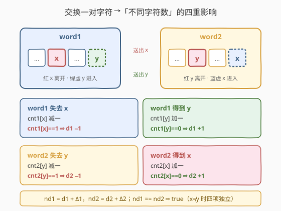
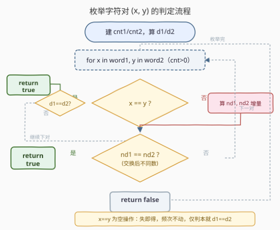
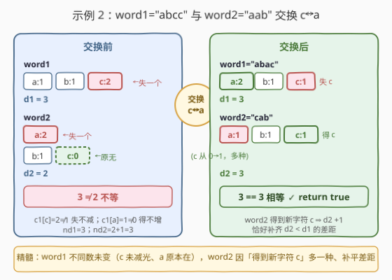

# LeetCode 使字符串中不同字符的数目相等 题解

## 1. 题目概述

- **标题 / 题号**：使字符串中不同字符的数目相等（#2531，medium）
- **链接**：https://leetcode.cn/problems/make-number-of-distinct-characters-equal/
- **难度**：中等
- **标签**：哈希表、字符串、计数、枚举

**题意**：给定两个下标从 $0$ 开始的字符串 `word1` 和 `word2`。一次**移动**：选两个下标 $i$（在 `word1` 中）和 $j$（在 `word2` 中），交换 `word1[i]` 与 `word2[j]`。问能否通过**恰好一次移动**，使 `word1` 与 `word2` 中**不同字符的数目相等**。能返回 `true`，否则 `false`。

**示例**：

```text
示例 1  word1 = "ac", word2 = "b"
输出：false
解释：任意交换后 word1 有 2 个不同字符、word2 有 1 个，永不相等。

示例 2  word1 = "abcc", word2 = "aab"
输出：true
解释：交换 word1[2]='c' 与 word2[0]='a' → word1="abac"(a,b,c 共 3 种)、word2="cab"(a,b,c 共 3 种)。

示例 3  word1 = "abcde", word2 = "fghij"
输出：true
解释：两串各 5 种且无公共字符，各字符频次均为 1，任意交换后两串仍各 5 种。
```

**约束**：

- $1 \le \text{word1.length},\ \text{word2.length} \le 10^5$
- `word1`、`word2` 仅由小写英文字母组成。

> 💡 **关键约束读法**：串长可达 $10^5$，但字符集仅 $26$ 个小写字母。「不同字符数」只依赖**每个字母出现几次**，与位置无关——这把 $10^5 \times 10^5$ 的下标对搜索压缩成 $26 \times 26 = 676$ 个**字符对**枚举，正是下文「只看字符不看位置」的动机。

## 2. 解题思路

### 2.1 暴力思路：枚举所有下标对 (i, j)

最直接：双重循环枚举 $i \in [0, n_1)$、$j \in [0, n_2)$，真正交换 `word1[i]` 与 `word2[j]`，再各扫一遍统计不同字符数是否相等：

```text
for i in 0..n1:
    for j in 0..n2:
        swap(word1[i], word2[j])
        if distinct(word1) == distinct(word2): return true
        swap(word1[i], word2[j])   # 回溯
return false
```

正确，但下标对共 $n_1 n_2$ 个、最坏 $10^5 \times 10^5 = 10^{10}$，每次还要 $O(n_1+n_2)$ 统计不同数，必超时。

> ⚠️ 暴力法的浪费：「不同字符数」只取决于每个字符的频次，与**下标位置**完全无关。把 `word1` 中任意两个同为 `x` 的下标互换结果一样——同一字符对 `(x, y)` 的所有下标组合效果完全相同，被重复枚举了千万次。

### 2.2 核心观察：只枚举「字符对」(x, y)，频次表算增量



把「交换 `word1[i]` 与 `word2[j]`」抽象为「`word1` 交出一个字符 $x$、收进一个字符 $y$；`word2` 反之」。设 `cnt1[c]`、`cnt2[c]` 为两串中字符 $c$ 的频次，$d_1$、$d_2$ 为两串不同字符数。对一对字符 $x \in \text{word1}$、$y \in \text{word2}$（$x \neq y$），交换后两串不同数变为：

$$
\text{nd}_1 = d_1 + \underbrace{[cnt_1[x]=1]\,(-1)}_{\text{失 }x\text{，频次归零则少一种}} + \underbrace{[cnt_1[y]=0]\,(+1)}_{\text{得 }y\text{，原无则多一种}}
$$

$$
\text{nd}_2 = d_2 + \underbrace{[cnt_2[y]=1]\,(-1)}_{\text{失 }y\text{，频次归零则少一种}} + \underbrace{[cnt_2[x]=0]\,(+1)}_{\text{得 }x\text{，原无则多一种}}
$$

四个增量**两两独立**（$x \neq y$ 时失与得落在不同字符桶），各由一个频次判定决定。只要 $\text{nd}_1 = \text{nd}_2$ 即返回 `true`。

**为何只枚举字符对就完备？** 「不同字符数」是频次的函数，与下标无关；任意「交换 `word1[i]` 与 `word2[j]`」等价于「交换字符 $x=$ `word1[i]` 与 $y=$ `word2[j]`」。只要 $cnt_1[x]>0$、$cnt_2[y]>0$，就**一定能找到**对应下标 $i$、$j$ 落地该交换。故遍历 $26 \times 26$ 个字符对即覆盖全部下标对，不重不漏。

> ⚠️ **$x = y$ 必须单独处理**：当交换的两个字符相同时（`word1[i] == word2[j] == c`），`word1` 失一个 $c$ 又得一个 $c$、`word2` 同理，频次与不同数**原封不动**——是一次「空操作」。上述增量公式在 $x=y$ 时会**双重计数**（失 $x$ 与得 $x$ 落在同一桶，不能拆开判 `cnt[c]==1` 与 `cnt[c]==0`）。故 $x=y$ 分支单独判：若本就 $d_1 = d_2$ 则空操作后仍相等、返回 `true`；否则跳过。

### 2.3 算法流程图



```text
预处理：cnt1/cnt2 频次表，d1/d2 不同字符数
for x in 'a'..'z' if cnt1[x]>0:
    for y in 'a'..'z' if cnt2[y]>0:
        if x == y:
            if d1 == d2: return true      # 空操作，本就相等
            continue
        nd1 = d1 + (cnt1[x]==1 ? -1:0) + (cnt1[y]==0 ? +1:0)
        nd2 = d2 + (cnt2[y]==1 ? -1:0) + (cnt2[x]==0 ? +1:0)
        if nd1 == nd2: return true
return false
```

两层循环共 $26 \times 26 = 676$ 次，每次 $O(1)$；瓶颈在初始建频次表 $O(n_1+n_2)$。

> 💡 **$x=y$ 分支不可省**：如 `word1="a"`、`word2="a"` 时唯一可交换的就是同一个字符 `a`，无 $x \neq y$ 对，靠 $x=y$ 空操作分支命中「本就相等」。若把 $x=y$ 也套增量公式会误算（`cnt1[a]==1` 判 −1、`cnt1[a]==0` 判 +1 互相矛盾），故必须分流。

### 2.4 示例演算



以**示例 2** `word1 = "abcc"`、`word2 = "aab"` 演算。建频次表：

| 串 | a | b | c | 不同数 |
|----|---|---|---|--------|
| word1 | 1 | 1 | 2 | $d_1=3$ |
| word2 | 2 | 1 | 0 | $d_2=2$ |

枚举到 $x=$ `c`（$cnt_1[c]=2>0$）、$y=$ `a`（$cnt_2[a]=2>0$），$x \neq y$：

| 增量项 | 判定 | 值 | 说明 |
|--------|------|----|------|
| word1 失 c | $cnt_1[c]=2 \neq 1$ | $0$ | 失一个 c 仍剩 1 个，不同数不减 |
| word1 得 a | $cnt_1[a]=1 \neq 0$ | $0$ | a 原本就在，不同数不增 |
| word2 失 a | $cnt_2[a]=2 \neq 1$ | $0$ | 失一个 a 仍剩 1 个，不同数不减 |
| word2 得 c | $cnt_2[c]=0$ | $+1$ | word2 原无 c，多一种 |

$$
\text{nd}_1 = 3+0+0 = 3,\quad \text{nd}_2 = 2+0+1 = 3 \;\Rightarrow\; 3=3\ \text{返回 true}
$$

交换后 `word1="abac"`（a2 b1 c1，3 种）、`word2="cab"`（a1 b1 c1，3 种），印证相等。

> 💡 **本例精髓**：交换并未改变 `word1` 的不同数（c 没减光、a 原本就在），却让 `word2` 因**得到新字符 c** 多了一种、恰好补齐了原本 $d_2 < d_1$ 的差距。「失字符不一定减、得字符不一定增」——全看频次是否跨过 $0$ 与 $1$ 这两道门槛。

## 3. 参考代码

### C++

```cpp
class Solution {
public:
    bool isItPossible(string word1, string word2) {
        array<int, 26> c1{}, c2{};
        for (char ch : word1) ++c1[ch - 'a'];
        for (char ch : word2) ++c2[ch - 'a'];
        int d1 = 0, d2 = 0;
        for (int i = 0; i < 26; ++i) {
            if (c1[i]) ++d1;
            if (c2[i]) ++d2;
        }
        for (int x = 0; x < 26; ++x) {
            if (!c1[x]) continue;
            for (int y = 0; y < 26; ++y) {
                if (!c2[y]) continue;
                if (x == y) {                       // 空操作：失即得，频次不动
                    if (d1 == d2) return true;
                    continue;
                }
                int nd1 = d1 + (c1[x] == 1 ? -1 : 0) + (c1[y] == 0 ? 1 : 0);
                int nd2 = d2 + (c2[y] == 1 ? -1 : 0) + (c2[x] == 0 ? 1 : 0);
                if (nd1 == nd2) return true;
            }
        }
        return false;
    }
};
```

> 💡 **实现细节**：① 用 `array<int,26>` 而非 `unordered_map`，$O(1)$ 下标访问、常数更小。② `d1`/`d2` 一次预处理、循环内只算**增量**不重扫，保证每对 $O(1)$。③ $x=y$ 分支放在最前 `continue`，避免落入增量公式被双重计数。

### Python

```python
class Solution:
    def isItPossible(self, word1: str, word2: str) -> bool:
        c1 = [0] * 26
        c2 = [0] * 26
        for ch in word1:
            c1[ord(ch) - 97] += 1
        for ch in word2:
            c2[ord(ch) - 97] += 1
        d1 = sum(1 for v in c1 if v)
        d2 = sum(1 for v in c2 if v)
        for x in range(26):
            if not c1[x]:
                continue
            for y in range(26):
                if not c2[y]:
                    continue
                if x == y:                          # 空操作：失即得，频次不动
                    if d1 == d2:
                        return True
                    continue
                nd1 = d1 + (-1 if c1[x] == 1 else 0) + (1 if c1[y] == 0 else 0)
                nd2 = d2 + (-1 if c2[y] == 1 else 0) + (1 if c2[x] == 0 else 0)
                if nd1 == nd2:
                    return True
        return False
```

> 💡 **对照 C++**：逻辑完全一致。频次表用长度 26 的列表；`c1[y]==0` 这种对越界下标天然返回 0（列表内为 0），无需 `Counter` 的 `get`。也可用 `collections.Counter`，但固定 26 桶下标数组更快更直观。

## 4. 复杂度分析

| 维度 | 复杂度 | 说明 |
|------|--------|------|
| 时间 | $O(n_1+n_2+26^2) = O(n_1+n_2)$ | 建两张频次表 $O(n_1+n_2)$；枚举 $26 \times 26$ 对、每对 $O(1)$，常数 $676$ 与串长无关 |
| 空间 | $O(1)$ | 仅两张 $26$ 元频次表与几个标量，与输入规模无关 |
| 对照：暴力 | $O(n_1 n_2 \cdot (n_1+n_2))$ 时间 | 枚举下标对最坏 $10^{10}$、每对再各扫一遍统计不同数 |

> 💡 **压缩的本质**：把「下标对空间」($10^{10}$) 经「字符集只有 26」映射到「字符对空间」($676$)，靠的是**目标量（不同字符数）对位置的无关性**——只关心某字符在不在、在几次，不关心在哪。这是「哈希计数 + 枚举键」类题的通用降维。

## 5. 扩展：增量判定与「空操作」陷阱

本题属于「**对集合做一次元素搬运，判定某聚合量是否相等**」的范式。两个要点可推广：

1. **增量而非重算**：任何「搬运后聚合量」只要满足「聚合量 = 频次的函数」，就可用「失一/得一」的频次增量在 $O(1)$ 内更新，无需搬运后重扫。关键是把聚合量对单字符的变化拆成独立子项——本题拆成「频次跨 $0$ 与跨 $1$」两个布尔判定。

2. **同元素搬运的空操作**：当搬运的两端取到**同一字符** $x=y$，失与得落在同一桶、相互抵消，是空操作。这类情况**必须单独分流**：套用「失一判 $==1$、得一判 $==0$」会因两判定针对同一桶而互相矛盾、双重计数。空操作只用来判定「原本是否已满足」（本题即 $d_1=d_2$）。

> ⚠️ **判 $d_1=d_2$ 不能直接返回 true**：即便两串本就相等，也未必有「保持相等」的交换。如 `word1="ab"`、`word2="ccdd"`（各 2 种、无公共字符，`word1` 各字母频次为 1、`word2` 各为 2），任意 $x \neq y$ 交换后 $\text{nd}_1=2$、$\text{nd}_2=3$ 不等；又无 $x=y$ 公共字符可做空操作——故返回 `false`。可见必须逐对枚举验证，不能凭初始相等短路。

## 6. 面试要点

1. **为什么枚举字符对 (x, y) 而非下标对 (i, j) 就完备？**

   > 「不同字符数」只依赖每个字符的频次，与下标位置无关。任意交换 `word1[i]` 与 `word2[j]` 等价于交换字符 $x=$`word1[i]` 与 $y=$`word2[j]`；只要 $cnt_1[x]>0$、$cnt_2[y]>0$ 必能找到对应下标落地。故 $26 \times 26$ 字符对覆盖全部下标对，不重不漏。

2. **为什么 $x=y$ 要单独分支？**

   > $x=y$ 时 `word1` 失一个 $x$ 又得一个 $x$（`word2` 同理），频次与不同数原封不动，是空操作。若套用 $x \neq y$ 的增量公式，「失 $x$ 判 $cnt[x]==1$」与「得 $x$ 判 $cnt[x]==0$」针对同一桶互相矛盾，会双重计数。故 $x=y$ 单独判「本就 $d_1=d_2$ 则返回 true」。

3. **四个增量为什么两两独立、可直接相加？**

   > $x \neq y$ 时，`word1` 失 $x$、得 $y$ 落在两个不同字符桶，互不影响；`word2` 失 $y$、得 $x$ 同理。每个桶的「不同数是否变化」仅由自身频次是否跨过 $0$（得时）或跨过 $1$（失时）决定，故四项可独立判定后相加。

4. **「失字符频次为 1 才减、得字符频次为 0 才增」的门槛是什么？**

   > 失一个字符 $x$：$cnt[x]$ 从 $1 \to 0$ 才少一种（$cnt[x]>1$ 时减一仍 $\geq1$，种类不变）；得一个字符 $y$：$cnt[y]$ 从 $0 \to 1$ 才多一种（$cnt[y]>0$ 时原已在，种类不变）。门槛就是频次是否跨过「存在/不存在」的 $0$ 边界。

5. **能否不预处理 $d_1$、$d_2$，每次重扫？**

   > 能但无谓：每对重扫 $O(26)$、$676$ 对共 $O(26^3)$ 仍可接受，但预处理一次 $d_1$、$d_2$ 后每对只算增量 $O(1)$ 更优。关键是**增量替代重算**——把「搬运后聚合量」表达成「原聚合量 + 各桶频次判定」，避免重复扫描。

> 💡 **一句话总结**：建两张 26 元频次表与不同数 $d_1$、$d_2$，枚举 $26 \times 26$ 个字符对；$x \neq y$ 时用「失判 $==1$、得判 $==0$」算四项独立增量得 $\text{nd}_1$、$\text{nd}_2$，相等即 true；$x=y$ 为空操作仅判本就相等。$O(n+26^2)$ 时间、$O(1)$ 空间。

## 同类练习题

| # | 题目 | 与本题的关联 |
|---|------|-------------|
| 2506 | [统计相似字符串对的数目](https://leetcode.cn/problems/count-pairs-of-similar-strings/)（[题解](../2501-2600/2506_统计相似字符串对的数目.md)） | 同样把字符串压成 26 位字符存在性集合再做两两判定——本题频次表的「存在性投影」版 |
| 389 | [找不同](https://leetcode.cn/problems/find-the-difference/) | [2531 本题] 与都用频次表做「字符搬运后的差异」判定，389 是单向多出一个字符、本题是双向交换一对 |
| 828 | [统计子串中的唯一字符](https://leetcode.cn/problems/count-unique-characters-of-all-substrings-of-a-given-string/) | 同样基于「字符频次/位置」聚合，把指数级子串搜索压缩到按字符贡献拆解 |
| 242 | [有效的字母异位词](https://leetcode.cn/problems/valid-anagram/) | 频次表比对的入门范式，本题是其「交换一对后比较」的动态变体 |
| 451 | [根据字符出现频率排序](https://leetcode.cn/problems/sort-characters-by-frequency/) | 同样建频次表再按频次聚合，强调「字符 → 频次」映射的复用 |
