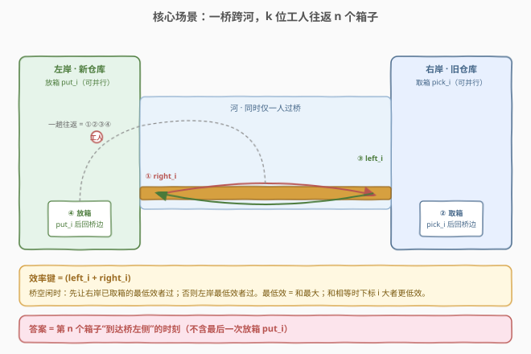
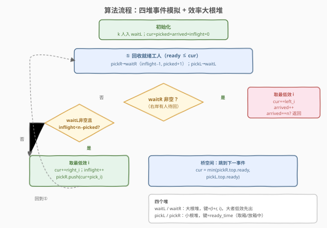

# LeetCode 过桥的时间 题解

## 1. 题目概述

- **标题 / 题号**：过桥的时间（#2532，hard）
- **链接**：https://leetcode.cn/problems/time-to-cross-a-bridge/
- **难度**：困难
- **标签**：数组、模拟、堆（优先队列）、事件驱动

**题意**：$k$ 位工人要把 $n$ 个箱子从**右岸旧仓库**搬到**左岸新仓库**，两仓库隔河相望，仅一座桥可通行。每位工人 $i$ 的耗时由 `time[i] = [right_i, pick_i, left_i, put_i]` 给出：

| 阶段 | 动作 | 用时 | 是否占桥 |
|------|------|------|----------|
| ① | 左岸 → 右岸（过桥） | $right_i$ | 是 |
| ② | 右岸旧仓库取箱，回桥边 | $pick_i$ | 否（可并行） |
| ③ | 右岸 → 左岸（过桥，携箱） | $left_i$ | 是 |
| ④ | 左岸新仓库放箱，回桥边 | $put_i$ | 否（可并行） |

**效率**与**过桥规则**：

- 称工人 $i$ **效率低于** $j$，当 $left_i+right_i > left_j+right_j$，或二者相等且 $i > j$。即「和越大越低效，和相等时下标大者更低效」。
- 桥同时仅一人通过。桥空闲时：**先让右岸已取箱的最低效工人过桥**（右→左）；若右岸无人，再让左岸最低效工人过桥（左→右）。
- 若左岸已派出足够覆盖全部剩余箱子的工人，则**不再从左岸派新工人**。
- 工人取箱 / 放箱不占桥，不同工人可并行。

**返回**：最后一个箱子**到达桥左侧**的时刻（不含最后一次放箱 $put_i$）。

**示例 1**：

```text
输入：n = 1, k = 3, time = [[1,1,2,1],[1,1,3,1],[1,1,4,1]]
输出：6
解释：w2 效率最低（l+r 最大），t=0 过桥→右(t=1)，取箱(t=2)，过桥←左(t=6) → 第1箱到左岸 = 6。
```

**示例 2**：

```text
输入：n = 3, k = 2, time = [[1,5,1,8],[10,10,10,10]]
输出：37
```

**约束**：

- $1 \le n, k \le 10^4$
- `time.length == k`，`time[i].length == 4`
- $1 \le left_i, pick_i, right_i, put_i \le 1000$

> ⚠️ **关键陷阱——答案不含最后的 $put_i$**：第 $n$ 个箱子一旦到达左岸即结束，**不要**把它再推进放箱阶段；但前 $n-1$ 个箱子的 $put_i$ 会决定工人何时重回左岸待发，**必须模拟**。

## 2. 解题思路

### 2.1 暴力思路：按秒离散推进

最直觉的写法是让时间一秒一秒走，每秒检查桥是否空、谁在等、谁取/放完了。逻辑能对，但 $n,k$ 可达 $10^4$、单次过桥可达 $10^3$ 秒，最坏时间跨度 $\sim 10^7$，每秒扫一遍 $k$ 个工人即 $O(10^{11})$，必然 TLE。

根本问题是**用「墙钟时间」驱动模拟**：大量空闲秒被逐个枚举，且每次都线性扫描工人。

> ⚠️ 这种写法即便加「跳到下一事件」的优化，也容易在「右岸优先 / 最低效优先 / 不多派」三条规则相互嵌套时写乱分支。

### 2.2 核心观察：事件驱动 + 四个优先队列



把「人」按所处状态分到四个堆里，用**事件时刻**驱动时间跳跃，跳过所有空闲秒：

| 堆 | 含义 | 键 / 语义 |
|----|------|-----------|
| `waitL` | 左岸桥边待发工人 | 大根堆，键 = $(left+right,\ i)$，**大者低效先出** |
| `waitR` | 右岸桥边已取箱工人 | 大根堆，键 = $(left+right,\ i)$，**大者低效先出** |
| `pickR` | 右岸正在取箱的工人 | 小根堆，键 = `ready = 到达时刻 + pick_i` |
| `pickL` | 左岸正在放箱的工人 | 小根堆，键 = `ready = 到达时刻 + put_i` |

三条规则正好被堆天然表达：

1. **右岸优先**：先看 `waitR` 非空，则右→左过桥；否则看左岸。
2. **最低效优先**：`waitL / waitR` 都用 $(left+right,\ i)$ 的大根堆，`top` 即最低效。
3. **不多派**：维护 `inflight`（已派出但尚未取箱完成的工人数）。仅当 `waitL` 非空**且** `inflight < n − picked` 时才从左岸派新工人。

> 💡 时间不会「等」：当桥空闲且既不能从右过、也不能从左派时，把 `cur` 直接跳到 `min(pickR.top.ready, pickL.top.ready)`，一次性回收那一刻所有就绪工人。

### 2.3 算法流程图



每个箱子恰好触发一次左→右（去取）和一次右→左（送回），共 $2n$ 次过桥事件；每次过桥把工人推进对侧的取/放堆，完成时回收。当第 $n$ 个箱子到左岸即返回当前时刻。

### 2.4 示例演算

![示例演算：n=3, k=2, time=[[1,5,1,8],[10,10,10,10]]](../images/2532_example_walkthrough.svg)

效率键 $w0=(1+1,0)=2$、$w1=(10+10,1)=20$，故 $w1$ 更低效、首轮优先。关键事件见上图，最终第 3 箱于 $t=37$ 到左岸，返回 $37$。

## 3. 参考代码

### C++

```cpp
class Solution {
public:
    int findCrossingTime(int n, int k, vector<vector<int>>& time) {
        // 效率键：(left+right, i)，越大越低效、越先过桥
        auto eff = [&](int i) {
            return make_pair(time[i][0] + time[i][2], i); // (right+left, i)
        };
        // waitL / waitR：大根堆（默认），按 (l+r, i) 取最低效
        priority_queue<pair<int,int>> waitL, waitR;
        // pickL / pickR：小根堆，键为 ready 时刻
        priority_queue<pair<int,int>, vector<pair<int,int>>, greater<>> pickL, pickR;

        for (int i = 0; i < k; ++i) waitL.push(eff(i));

        int cur = 0, picked = 0, arrived = 0, inflight = 0;
        while (true) {
            // ① 回收就绪工人
            while (!pickR.empty() && pickR.top().first <= cur) {
                int i = pickR.top().second; pickR.pop();
                waitR.push(eff(i));
                --inflight;   // 取箱完成
                ++picked;      // 又一只箱子被取走
            }
            while (!pickL.empty() && pickL.top().first <= cur) {
                int i = pickL.top().second; pickL.pop();
                waitL.push(eff(i));
            }

            if (!waitR.empty()) {
                // ② 右岸优先：最低效者携箱过桥→左
                int i = waitR.top().second; waitR.pop();
                cur += time[i][2];            // left_i
                if (++arrived == n) return cur; // 第 n 箱到左岸，收尾
                pickL.push({cur + time[i][3], i}); // 放箱 put_i
            } else if (!waitL.empty() && inflight < n - picked) {
                // ③ 左岸派新工人过桥→右（承诺取一只箱）
                int i = waitL.top().second; waitL.pop();
                cur += time[i][0];            // right_i
                ++inflight;
                pickR.push({cur + time[i][1], i}); // 取箱 pick_i
            } else {
                // ④ 桥空闲：跳到下一就绪事件
                int nxt = INT_MAX;
                if (!pickR.empty()) nxt = min(nxt, pickR.top().first);
                if (!pickL.empty()) nxt = min(nxt, pickL.top().first);
                cur = nxt;
            }
        }
    }
};
```

### Python

```python
import heapq

class Solution:
    def findCrossingTime(self, n: int, k: int, time: list[list[int]]) -> int:
        # 大根堆用负键：(-（l+r), -i, idx)，top 即最低效
        waitL, waitR, pickL, pickR = [], [], [], []

        def key(i: int) -> tuple[int, int]:
            return (time[i][0] + time[i][2], i)

        for i in range(k):
            s, idx = key(i)
            heapq.heappush(waitL, (-s, -idx, i))

        cur = picked = arrived = 0
        inflight = 0
        while True:
            # ① 回收就绪工人
            while pickR and pickR[0][0] <= cur:
                _, i = heapq.heappop(pickR)
                s, idx = key(i)
                heapq.heappush(waitR, (-s, -idx, i))
                inflight -= 1
                picked += 1
            while pickL and pickL[0][0] <= cur:
                _, i = heapq.heappop(pickL)
                s, idx = key(i)
                heapq.heappush(waitL, (-s, -idx, i))

            if waitR:
                # ② 右岸优先：携箱过桥→左
                _, _, i = heapq.heappop(waitR)
                cur += time[i][2]            # left_i
                arrived += 1
                if arrived == n:
                    return cur
                heapq.heappush(pickL, (cur + time[i][3], i))  # put_i
            elif waitL and inflight < n - picked:
                # ③ 左岸派新工人过桥→右
                _, _, i = heapq.heappop(waitL)
                cur += time[i][0]            # right_i
                inflight += 1
                heapq.heappush(pickR, (cur + time[i][1], i))  # pick_i
            else:
                # ④ 桥空闲：跳到下一就绪事件
                cand = []
                if pickR:
                    cand.append(pickR[0][0])
                if pickL:
                    cand.append(pickL[0][0])
                cur = min(cand)
```

## 4. 复杂度分析

| 维度 | 复杂度 | 说明 |
|------|--------|------|
| 时间 | $O(n \log k)$ | 共 $\sim 2n$ 次过桥事件，每次堆操作 $O(\log k)$；回收 / 跳跃均摊到事件上 |
| 空间 | $O(k)$ | 四个堆合计存放全部 $k$ 个工人（任一时刻每人恰在一个堆里） |
| 正确性 | 事件驱动等价原模拟 | 已与按秒离散模拟在 3000 组随机数据上对拍通过 |

> 💡 不必担心「跳到下一事件」会漏掉中间并行的取 / 放完成：每次把 `cur` 推进到过桥终点后，下一轮 `<= cur` 的回收会一次性把该区间内所有就绪工人并入等待堆——因为它们在桥被占期间本就无法过桥，延迟到此刻回收完全等价。

## 5. 面试要点

**Q1：为什么答案不含最后一次 $put_i$？**
　　题目问的是「最后一个箱子**到达桥左侧**的时刻」，即第 $n$ 次右→左过桥的终点；之后的放箱 $put_i$ 只是把箱子搬进仓库，已不影响「到达」时刻。故一旦 `arrived == n` 立即返回 `cur`，不推进 `pickL`。

**Q2：效率键为何只看 $left+right$，不算 $pick / put$？**
　　题面把「效率低于」显式定义为只比较 $left_i+right_i$（和相等比下标）。$pick_i / put_i$ 不占桥、不参与效率排序，只决定工人何时回到桥边，故只进 `pickL / pickR` 的时间键。

**Q3：「不多派」规则用 `inflight < n − picked` 刻画，凭什么是这个式子？**
　　`picked` = 已被取走的箱子数；`inflight` = 已派往右岸但尚未取箱完成的工人数（每人承诺取一只）。二者之和是「已被承诺取走」的箱子数；剩余 $n-(picked+inflight)$ 只仍需派人。当 `inflight < n − picked` 即还有人没被承诺取，才可派；否则停下等现有人把箱子送回。

**Q4：会不会出现桥空闲、左右岸都无人、又无 pending 事件的死锁？**
　　不会。`arrived < n` 时工人总数 $k\ge 1$，每人必在四堆之一；若 `waitR` 空且不能派，工人必在 `pickL / pickR`，故「下一事件」`min(pickR.top, pickL.top)` 必有限。

**Q5：大根堆为何在 Python 要存 `(-s, -idx, i)` 三元？**
　　`heapq` 是小根堆；要让「$s$ 大者优先、$s$ 相等时 $i$ 大者优先」等价于「$-s$ 小、$-idx$ 小」，故存 $(-s,-i,i)$，`heappop` 取出的即最低效者。C++ 的 `priority_queue` 默认大根堆，直接存 $(s,i)$ 即可。

## 同类练习题

| # | 题目 | 与本题的关联 |
|---|------|-------------|
| 2530 | [人工智能的极大分数](https://leetcode.cn/problems/maximal-score-after-applying-k-operations/) | 同为「循环取最优 + 堆维护」的事件式贪心，本题多了并行阶段与桥调度。 |
| 1883 | [准时抵达会议的最小心跳跳数](https://leetcode.cn/problems/minimum-skips-to-arrive-at-meeting-on-time/) | 在并行耗时 / 占用资源间做最小化，与本题「占桥 vs 不占桥」的资源视角相通。 |
| 239 | [滑动窗口最大值](https://leetcode.cn/problems/sliding-window-maximum/) | 单调队列 / 堆驱动「当前优先者」的同类骨架（堆顶即下一个出队者）。 |
| 1705 | [吃苹果的最大数目](https://leetcode.cn/problems/maximum-number-of-eaten-apples/) | 按过期时间的小根堆 + 贪心回收，结构同 `pickL / pickR` 的时间驱动回收。 |
| 1792 | [最大平均通过率](https://leetcode.cn/problems/maximum-average-pass-ratio/) | 堆里维护「下一个最优选择」，反复取堆顶更新，与本题每轮从 `waitR / waitL` 取最低效同构。 |
