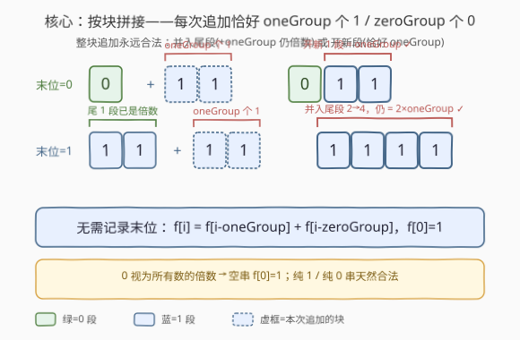
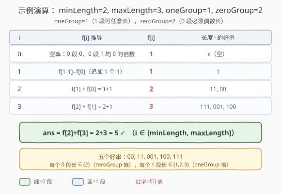

# LeetCode 好二进制字符串的数量 题解

## 1. 题目概述

- **标题 / 题号**：好二进制字符串的数量（#2533，medium）
- **链接**：https://leetcode.cn/problems/number-of-good-binary-strings/
- **难度**：中等
- **标签**：动态规划

**题意**：给定四个正整数 `minLength`、`maxLength`、`oneGroup` 和 `zeroGroup`。一个**好**二进制字符串满足：

- 字符串长度在 $[\textit{minLength},\ \textit{maxLength}]$ 之间；
- **每一块连续的 `1`** 的个数都是 `oneGroup` 的整数倍；
- **每一块连续的 `0`** 的个数都是 `zeroGroup` 的整数倍。

> 💡 **“块”指极大连续段**：例如 `00110111` 中，连续 `1` 的块分别是 `11`（长度 2）与 `111`（长度 3）；连续 `0` 的块是 `00`（长度 2）。题目要求每个 `1`-块长度 $\equiv 0 \pmod{\textit{oneGroup}}$，每个 `0`-块长度 $\equiv 0 \pmod{\textit{zeroGroup}}$。

返回好二进制字符串的个数。答案很大，对 $10^9+7$ 取余。

> ⚠️ **注意**：题目特别说明 **`0` 可以被认为是所有数字的倍数**。这条注记很关键——它意味着“长度为 0 的块”天然合法，于是“纯 `1` 串”（没有 `0`-块，即 `0` 个 `0`，是 `zeroGroup` 的 0 倍）和“纯 `0` 串”都不违反对方字符的约束，也为下文把空串作为合法基底 $f[0]=1$ 提供依据。

**示例 1**：

```text
输入：minLength = 2, maxLength = 3, oneGroup = 1, zeroGroup = 2
输出：5
解释：5 个好二进制字符串为 "00", "11", "001", "100", "111"。
```

**示例 2**：

```text
输入：minLength = 4, maxLength = 4, oneGroup = 4, zeroGroup = 3
输出：1
解释：唯一的好二进制字符串是 "1111"（1-块长 4 = 1×oneGroup；无 0-块）。
```

**约束**：

- $1 \le \textit{minLength} \le \textit{maxLength} \le 10^5$
- $1 \le \textit{oneGroup},\ \textit{zeroGroup} \le \textit{maxLength}$

> 💡 **关键约束读法**：`maxLength` 可达 $10^5$，而二进制串总数是 $2^{\textit{maxLength}}$ 级——枚举全部串完全不可行。必须找到只随长度线性增长的计数方式，这正是下文“按块拼接 DP”的动机。

## 2. 解题思路

### 2.1 暴力思路：枚举所有二进制串逐个校验

最直接：枚举长度 $\in [\textit{minLength},\textit{maxLength}]$ 的所有二进制串，对每个串扫描一遍，统计其中每个 `0`-块、`1`-块的长度，检验是否分别为 `zeroGroup`、`oneGroup` 的倍数。

```text
ans = 0
for L in minLength .. maxLength:
    for mask in 0 .. 2^L - 1:        # 枚举长度 L 的所有 01 串
        if each_run_length_is_multiple(mask, L): ans += 1
return ans
```

正确，但串数是 $\sum_{L} 2^L = O(2^{\textit{maxLength}})$ 级，`maxLength = 10^5` 时连“枚举”这一步都无从谈起；空间也爆炸。

> ⚠️ 暴力法的浪费：它把“块长度必须是倍数”这一**结构性约束**留到最后才校验，而非在“拼接生成”阶段就只用合法的块。正确做法是把视角从“先造串、再校验”转为“只拿合法的块去拼”。

### 2.2 核心观察：按块拼接——整块追加永远合法



把构造过程看作“在末尾追加**恰好 `oneGroup` 个 `1`** 或**恰好 `zeroGroup` 个 `0`**的一整块”。关键观察是：**这种“整块追加”无论前一个字符是 `0` 还是 `1`，都保持串合法**：

- 若末位是 `0`，追加 `oneGroup` 个 `1` → **开一个新 `1`-块**，长度恰好 `oneGroup`（$=1\times\textit{oneGroup}$）✓；
- 若末位是 `1`，追加 `oneGroup` 个 `1` → 这 `oneGroup` 个 `1` **并入尾部 `1`-块**，该块长度从 $k\cdot\textit{oneGroup}$ 变为 $(k+1)\cdot\textit{oneGroup}$，**仍是 `oneGroup` 的倍数** ✓。

追加 `1` 块时不会触碰任何 `0`-块，故 `0`-块的合法性不受影响；对称地，追加 `zeroGroup` 个 `0` 也总是安全。于是“每段长度为倍数”这条约束被“**只追加整数块**”这一操作**天然维持**，**无需记录末位字符**——状态从二维 $\text{DP}(i,\ \text{末位})$ 压成一维 $f[i]$：

$$
f[i] = f[i-\textit{oneGroup}] + f[i-\textit{zeroGroup}],\qquad f[0]=1.
$$

- $f[i]$：长度恰为 $i$ 的好串个数；
- $f[i-\textit{oneGroup}]$：末尾追加一块 `oneGroup` 个 `1`；
- $f[i-\textit{zeroGroup}]$：末尾追加一块 `zeroGroup` 个 `0`；
- $f[0]=1$：空串合法（`0` 个 `0`-块与 `0` 个 `1`-块均“0 的倍数”，呼应题目注记），是任何纯 `1`/纯 `0` 串的递推起点。

> 💡 **为什么不重不漏？** 每个好串有唯一的“极大连续块”划分；把每个块（长度 $k\cdot\textit{group}$）拆成 $k$ 次“追加一整块”，就得到唯一的追加序列。故 $f$ 计数的每条追加序列对应唯一好串，反之亦然——加法转移既不重也不漏。

> ⚠️ **与“分段 DP / 前缀和”路线的对照**：官方提示给的是 $\text{DP}(i,x)$（$x$=末位）+ 前缀和优化到 $O(\textit{maxLength})$。本式 $f[i]=f[i-\textit{oneGroup}]+f[i-\textit{zeroGroup}]$ 是它的**一维压扁**：意识到“整块追加对末位不敏感”后，直接丢弃 $x$ 维，省去前缀和，仍是 $O(\textit{maxLength})$。

### 2.3 算法流程图

![算法流程：初始化 f[0]=1，逐位递推 f[i]，最后对 [minLength,maxLength] 求和](../images/ngbs_algorithm_flow.svg)

逻辑极简，核心是“两个条件加法 + 取模”与“区间求和”：

```text
f[0] = 1,  f[1..maxLength] = 0
for i in 1 .. maxLength:
    if i - oneGroup  >= 0:  f[i] += f[i - oneGroup]     # 追加一块 oneGroup 个 1
    if i - zeroGroup >= 0:  f[i] += f[i - zeroGroup]    # 追加一块 zeroGroup 个 0
    f[i] %= MOD
ans = sum(f[i] for i in minLength .. maxLength) mod MOD
return ans
```

> ⚠️ **下标越界保护**：`i - oneGroup >= 0` / `i - zeroGroup >= 0` 必须显式判断，否则在 $i$ 小于组大小时会访问负下标。`f[0]=1` 已把“整串就是一块”的情形（即 $i$ 恰为组大小的倍数）通过递推自然带回——无需对纯 `1`/纯 `0` 串做特判。

### 2.4 示例演算



以示例 1（`minLength=2, maxLength=3, oneGroup=1, zeroGroup=2`）逐位推演（`oneGroup=1` ⇒ `1`-块可任意长；`zeroGroup=2` ⇒ `0`-块必须偶数长）：

| $i$ | $f[i]$ 推导 | $f[i]$ | 长度 $i$ 的好串 |
|-----|-------------|--------|----------------|
| 0 | 空串：`0` 个 0-块、`0` 个 1-块均 0 的倍数 | 1 | $\varepsilon$（空） |
| 1 | $f[1-1]=f[0]$（追加 1 个 `1`） | 1 | `1` |
| 2 | $f[1]+f[0]=1+1$（追加 `1` 或追加 `00`） | 2 | `11`, `00` |
| 3 | $f[2]+f[1]=2+1$ | 3 | `111`, `001`, `100` |

$$
\text{ans}=f[2]+f[3]=2+3=5.
$$

- **$i=2$**：`11`（`1`-块长 2，是 `oneGroup=1` 的倍数 ✓）、`00`（`0`-块长 2，是 `zeroGroup=2` 的倍数 ✓）；`01`/`10` 的 `0`-块长 1 不是 `zeroGroup` 倍数 ✗。
- **$i=3$**：`111`（`1`-块长 3 ✓）、`001`（`0`-块长 2 ✓，`1`-块长 1 ✓）、`100`（`1`-块长 1 ✓，`0`-块长 2 ✓）；其余如 `011`/`110` 的 `0`-块长 1 ✗。

> 💡 **关键一步在“并入 vs 开新”**：`11` 被算作 $f[2]$ 中“`1` + `1`”两次追加——第二次追加 `oneGroup` 个 `1` 时并入尾 `1`-块（长 1→2），这正是“整块追加对末位不敏感”的直接体现；暴力法若枚举则需把 `11` 当一个 `1`-块单独校验，而本 DP 用递推自动完成。

## 3. 参考代码

### C++

```cpp
class Solution {
  public:
    int goodBinaryStrings(int minLength, int maxLength, int oneGroup, int zeroGroup) {
        const int MOD = 1e9 + 7;
        vector<int> f(maxLength + 1, 0);
        f[0] = 1;
        for (int i = 1; i <= maxLength; ++i) {
            if (i - oneGroup >= 0)  f[i] = (f[i] + f[i - oneGroup]) % MOD;   // 追加一块 1
            if (i - zeroGroup >= 0) f[i] = (f[i] + f[i - zeroGroup]) % MOD;  // 追加一块 0
        }
        int ans = 0;
        for (int i = minLength; i <= maxLength; ++i)
            ans = (ans + f[i]) % MOD;
        return ans;
    }
};
```

> 💡 **实现细节**：① 用 `vector<int>` 而非 VLA，可移植且避免栈溢出（`maxLength=10^5` 时栈上大数组有风险）。② 每次加法后立即取模，两项之和 $\le 2(\text{MOD}-1) < 2.1\times10^9$ 不溢 `int`，无需 `long long`。③ 求和区间是 $[\textit{minLength},\textit{maxLength}]$，不是 $[0,\textit{maxLength}]$——长度不足 `minLength` 的好串不计入答案。

### Python

```python
class Solution:
    def goodBinaryStrings(self, minLength: int, maxLength: int, oneGroup: int, zeroGroup: int) -> int:
        MOD = 10**9 + 7
        f = [1] + [0] * maxLength
        for i in range(1, maxLength + 1):
            if i - oneGroup >= 0:
                f[i] += f[i - oneGroup]
            if i - zeroGroup >= 0:
                f[i] += f[i - zeroGroup]
            f[i] %= MOD
        return sum(f[minLength:]) % MOD
```

> 💡 **对照 C++**：逻辑完全一致。Python 大整数无溢出，但仍在循环内取模以控制数值规模、加速后续加法。求和用切片 `sum(f[minLength:])` 等价于 $\sum_{i=\textit{minLength}}^{\textit{maxLength}} f[i]$，最后整体取一次模即可（Python 的 `sum` 不溢出）。

## 4. 复杂度分析

| 维度 | 复杂度 | 说明 |
|------|--------|------|
| 时间 | $O(\textit{maxLength})$ | 单层循环到 `maxLength`，每步两次加法 + 一次取模，常数级 |
| 空间 | $O(\textit{maxLength})$ | 一个长度 `maxLength+1` 的 `f` 数组 |
| 对照：暴力枚举 | $O(2^{\textit{maxLength}}\cdot\textit{maxLength})$ | 枚举全部串并逐个校验，指数级，不可行 |

> 💡 **总量估算**：`maxLength = 10^5` ⇒ 约 $10^5$ 次常数操作，毫秒级完成。若把状态保留为二维 $\text{DP}(i,\text{末位})$ 且朴素枚举“上一段的长度”，会退化到 $O(\textit{maxLength}\cdot\max(\textit{oneGroup},\textit{zeroGroup}))$，最坏 $10^{10}$ 超时；本式靠“整块追加对末位不敏感”直接压成一维 $O(\textit{maxLength})$。

## 5. 扩展：从二维分段 DP 到一维块拼接

官方提示给出的另一条路线能帮助理解“为什么一维就够了”。设 $\text{DP}(i,x)$ = 长度 $i$、末位为 $x$（$x\in\{0,1\}$）的好串数。从 $\text{DP}(i,0)$ 只能转移到 $\text{DP}(j,1)$，其中 $(j-i)\bmod \textit{oneGroup}=0$（追加一段长度为 `oneGroup` 倍数的 `1`）；$\text{DP}(i,1)$ 对称转移到 $\text{DP}(j,0)$。朴素枚举段长 $O(\textit{maxLength}\cdot\max(\textit{oneGroup},\textit{zeroGroup}))$，可用**同余前缀和**优化到 $O(\textit{maxLength})$。

| 路线 | 状态 | 单步复杂度 | 关键 |
|------|------|-----------|------|
| 分段 DP（提示法） | $\text{DP}(i,\text{末位})$ 二维 | $O(\textit{maxLength})$（前缀和后） | 按同余类维护前缀和 |
| **块拼接 DP（本解）** | $f[i]$ 一维 | $O(\textit{maxLength})$ | “整块追加对末位不敏感” ⇒ 丢末位维 |

> 💡 **降维的本质**：$\text{DP}(i,0)+\text{DP}(i,1)$ 的和恰是 $f[i]$；而由于“追加 `oneGroup` 个 `1`”无论从末位 0 还是末位 1 出发都合法，两路转移对“末位”的依赖被合并——故 $f[i]=f[i-\textit{oneGroup}]+f[i-\textit{zeroGroup}]$ 一式即可承载，分段 DP 的同余前缀和也随之隐式包含在“逐块累加”里。

## 6. 面试要点

1. **为什么不需要记录“末位字符”？**

   > 因为“追加恰好 `oneGroup` 个 `1`”对末位不敏感：末位是 `1` 则并入尾 `1`-块（$k\to k+1$ 倍），末位是 `0` 则开新 `1`-块（$1$ 倍），两者均合法。故 `1`-块的“倍数性”由“只追加整数块”自动维持，不必区分末位——一维 $f[i]$ 足够。

2. **$f[0]=1$ 的依据是什么？空串会污染计数吗？**

   > 依据是题目注记“`0` 是所有数的倍数”：空串含 `0` 个 `0`-块和 `0` 个 `1`-块，长度 0 是任何数的倍数，故合法。它只在最终求和区间 $[\textit{minLength},\textit{maxLength}]$（`minLength ≥ 1`）之外作为递推起点出现，不计入答案，不会污染计数。

3. **两个转移项为什么不会重复计数同一字符串？**

   > 每个好串有唯一的极大连续块划分；把每个长度为 $k\cdot\textit{group}$ 的块拆成 $k$ 次“追加一整块”，得到唯一的追加序列。$f$ 的加法转移枚举的是“最后一步追加了 `1` 块还是 `0` 块”，由串末位唯一决定——末位是 `1` 则最后一步必是追加 `1` 块，是 `0` 则必是追加 `0` 块，二者互斥，故不重不漏。

4. **若 `oneGroup` 与 `zeroGroup` 相等（设为 $g$），会发生什么？**

   > 此时 $f[i]=2\cdot f[i-g]$（两块大小相同，两个加法项相等）。好串就是把长度按 $g$ 分块、每块自由选 `0^g` 或 `1^g`：长度 $i=mg$ 的好串数为 $2^m$，非 $g$ 倍数的长度为 $0$。递推自动体现这一规律，无需特判。

5. **若把题面改成“每段长度**恰好**等于 `oneGroup`/`zeroGroup`（而非倍数）”，本 DP 还成立吗？**

   > 仍成立但意义变了：当不允许并入（即连续两块同字符必须保持为两段而非合并），需要额外约束“追加 `1` 块时末位不能是 `1`”。此时退化为二维 $\text{DP}(i,\text{末位})$，转移只在末位不同时累加。本题因“倍数”允许并入，才得以压成一维——这是“倍数”语义带来的关键简化。

> 💡 **一句话总结**：把好串视作“每次追加恰好 `oneGroup` 个 `1` 或 `zeroGroup` 个 `0` 一整块”拼接而成，整块追加对末位不敏感 ⇒ $f[i]=f[i-\textit{oneGroup}]+f[i-\textit{zeroGroup}]$、$f[0]=1$，$O(\textit{maxLength})$ 一遍递推后对 $[\textit{minLength},\textit{maxLength}]$ 求和取模。

## 同类练习题

| # | 题目 | 与本题的关联 |
|---|------|-------------|
| 518 | [零钱兑换 II](https://leetcode.cn/problems/coin-change-ii/)（[题解](../0501-0600/518_零钱兑换II.md)） | $f[i]\mathrel{+}=f[i-\textit{coin}]$ 的完全背包求组合数，与本题转移同形（差别仅在硬币面额集合 vs 两个固定块大小） |
| 377 | [组合总和 IV](https://leetcode.cn/problems/combination-sum-iv/)（[题解](../0301-0400/377_组合总和IV.md)） | $f[i]\mathrel{+}=f[i-\textit{num}]$，外层金额内层硬币求排列数——同族加法计数 DP |
| 70 | [爬楼梯](https://leetcode.cn/problems/climbing-stairs/)（[题解](../0001-0100/70_爬楼梯.md)） | $f[i]=f[i-1]+f[i-2]$，加法递推计数的母题，本题是其“块大小可调”的泛化 |
| 322 | [零钱兑换](https://leetcode.cn/problems/coin-change/)（[题解](../0301-0400/322_零钱兑换.md)） | 完全背包求最值，对照 518 的计数版，理解“取 min”与“求和”两种转移的差别 |
| 509 | [斐波那契数](https://leetcode.cn/problems/fibonacci-number/)（[题解](../0501-0600/509_斐波那契数.md)） | $f[i]=f[i-1]+f[i-2]$ 的最简加法递推，本题块大小为 1 与任意 $g$ 时即其泛化 |
