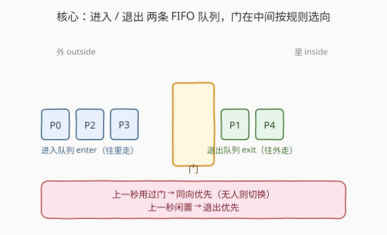
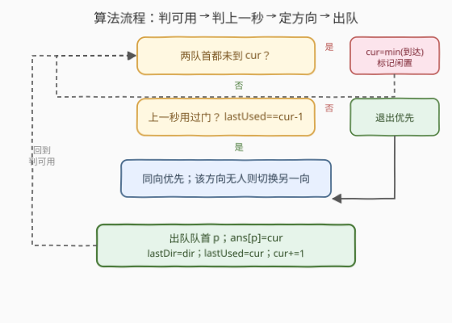

# LeetCode 通过门的时间 题解

> ⚠️ 本题为 LeetCode **付费题**（`isPaidOnly`）。下方题意描述、示例与约束依据官方样例输入与题目规则整理还原，如有出入请以官方为准；算法与示例输出已用自洽模拟验证。

## 1. 题目概述

- **标题 / 题号**：通过门的时间（#2534，hard）
- **链接**：https://leetcode.cn/problems/time-taken-to-cross-the-door/
- **难度**：困难
- **标签**：队列、数组、模拟

**题意**：走廊上有一扇门，每秒至多一人通过（每人通过耗时 $1$ 秒）。给定两个长度为 $n$、0-indexed 的数组 `arrival` 与 `state`：

- `arrival[i]`：第 $i$ 个人到达门的时刻（秒）。
- `state[i]`：$0$ 表示该人想**进入**（往里走），$1$ 表示想**退出**（往外走）。

每秒按以下规则选出至多一人通过门：

1. **上一秒用过 → 同向优先**：若第 $t-1$ 秒门被使用过、方向为 $d$，则第 $t$ 秒继续方向 $d$——只要该方向仍有等待者；否则切换到另一方向（若另一方向有等待者）。
2. **上一秒闲置 → 退出优先**：若第 $t-1$ 秒门未被使用，则**退出方向**优先；无人退出时才进入。
3. 同方向多个等待者中，**先到达者先过**；同一时刻到达则按下标升序。

返回 `answer[i]`：第 $i$ 个人通过门的秒数。

**示例 1（官方样例）**：

```text
输入：arrival = [0,1,1,2,4], state = [0,1,0,0,1]
输出：[0,3,1,2,4]
```

逐秒推演（$E$=进入、$X$=退出）：

```text
t=0  到达 P0(E)。门闲置→退出优先但无人退出→进入。P0 过。dir=E
t=1  P1(X)、P2(E) 到达。上秒进入→同向→P2 过。dir=E
t=2  P3(E) 到达，P1(X) 仍等。上秒进入→同向→P3 过。dir=E
t=3  仅 P1(X)。上秒进入但无进入者→切向退出→P1 过。dir=X
t=4  P4(X) 到达。上秒退出→同向→P4 过。dir=X
```

**约束**：

- $n = \text{arrival.length} = \text{state.length}$
- $1 \le n \le 10^5$
- $0 \le \text{arrival}[i] \le 10^9$
- `arrival` 非降序
- $\text{state}[i] \in \{0,1\}$

> 💡 **关键约束读法**：$n$ 达 $10^5$、时刻达 $10^9$。若**逐秒模拟**，最坏要枚举约 $10^9$ 秒必超时；若有人时才动、每秒又扫全部等待者则是 $O(n)$。必须把"时间推进"从"逐秒"换成"**事件驱动跳到下一个有人到达的时刻**"，单次决策 $O(1)$、总体 $O(n \log n)$。

## 2. 解题思路

### 2.1 暴力思路：逐秒扫描 + 每秒选人

最直观：`cur` 从 $0$ 递增到某个上界，每秒把所有 `arrival[i] <= cur` 且未过的人按规则挑一个。问题是时刻值域高达 $10^9$，逐秒枚举 $O(\text{maxT})$ 直接超时；即便只在"有人到达时"才动，每次决策若扫全部等待者又是 $O(n)$ → $O(n^2)$，$n=10^5$ 时仍偏慢。

### 2.2 核心观察：双队列 + 事件驱动跳秒



把等待者按方向分成两条 **FIFO 队列**：`enter`（进入）、`exit`（退出）。每条队列队首始终是"该方向最早到、最早该过的人"，于是每秒的决策只需看两个队首，$O(1)$：

- **谁该过**：看上一秒是否用过门——用过则同向优先、否则切换；闲置则退出优先。
- **跳过空窗**：若两队列队首都还没到 `cur`，说明当前一段时间无人，直接把 `cur` 跳到"两队列队首到达时刻的较小值"，并把"上一秒"标记为**闲置**（下一活跃秒走退出优先）。

> 💡 **为什么两个队首就够？** 同方向内"先到先过、同刻按下标"等价于把人按 $(\text{arrival},\,\text{index})$ 升序分发进对应队列——队首自然是最该过的人，无需每秒重扫。门的方向状态只需 `lastDir` 与 `lastUsed` 两个量即可承载全部规则。

### 2.3 算法流程图



```text
按 (arrival, index) 升序把人分入 enter / exit 两条队列
cur = 0; lastUsed = -∞（闲置）; lastDir = 无
while 任一队列非空:
    eA = enter 非空 且 enter.front.arrival <= cur
    xA = exit  非空 且 exit.front.arrival  <= cur
    if 都不可用:                       # 空窗
        cur = min(两队首到达时刻)
        lastUsed = -∞                  # 标记闲置，下个活跃秒退出优先
        continue
    prevUsed = (lastUsed == cur - 1)
    if prevUsed:                       # 同向优先，否则切换
        dir = (lastDir==E 且 eA) ? E :
              (lastDir==X 且 xA) ? X :
              (eA ? E : X)
    else:                              # 闲置 → 退出优先
        dir = xA ? X : E
    p = dir==E ? enter.pop_front() : exit.pop_front()
    ans[p] = cur
    lastDir = dir; lastUsed = cur; cur += 1
```

### 2.4 示例演算

![示例演算：arrival=[0,1,1,2,4]，逐秒的门方向与出队](../images/door_cross_walkthrough.svg)

沿用示例 1，$E$=进入、$X$=退出：

| $t$ | enter 队列 | exit 队列 | 上一秒 | 选向 | 出队 | ans 更新 |
|-----|------------|-----------|--------|------|------|-----------|
| 0 | P0,P2,P3 | P1,P4 | 闲置 | X→(无人)→E | P0 | `ans[0]=0` |
| 1 | P2,P3 | P1,P4 | E | E | P2 | `ans[2]=1` |
| 2 | P3 | P1,P4 | E | E | P3 | `ans[3]=2` |
| 3 | — | P1,P4 | E | E→(无人)→X | P1 | `ans[1]=3` |
| 4 | — | P4 | X | X | P4 | `ans[4]=4` |

- **$t=0$**：门闲置、退出优先，但当时无人退出，故 P0 进入。
- **$t=3$**：上一秒是进入、但已无进入者，触发"切换" → P1 退出。
- **$t=4$**：上一秒是退出、同向延续 → P4 退出。

> 💡 **区分用例**：`arrival=[0,2,2]`、`state=[0,1,0]` → 输出 `[0,2,3]`。$t=0$ 进入 P0 后空窗到 $t=2$，此时 P1(退出) 与 P2(进入) 同时在场；因上一秒闲置走"退出优先"，P1 先过、P2 随后——这正是"闲置优先级覆盖了上一秒曾进入"的关键。

## 3. 参考代码

### C++

```cpp
class Solution {
public:
    vector<int> timeTaken(vector<int>& arrival, vector<int>& state) {
        int n = arrival.size();
        vector<int> idx(n);
        iota(idx.begin(), idx.end(), 0);
        sort(idx.begin(), idx.end(), [&](int a, int b) {
            if (arrival[a] != arrival[b]) return arrival[a] < arrival[b];
            return a < b;
        });
        deque<int> enter, ext;
        for (int i : idx) (state[i] == 0 ? enter : ext).push_back(i);

        vector<int> ans(n);
        long long cur = 0, lastUsed = -2;   // -2 表示"上一秒闲置"
        int lastDir = -1;                   // 0 进入, 1 退出
        while (!enter.empty() || !ext.empty()) {
            bool eA = !enter.empty() && arrival[enter.front()] <= cur;
            bool xA = !ext.empty()  && arrival[ext.front()]  <= cur;
            if (!eA && !xA) {               // 空窗：跳到下一个到达时刻
                long long nxt = LLONG_MAX;
                if (!enter.empty()) nxt = min(nxt, (long long)arrival[enter.front()]);
                if (!ext.empty())  nxt = min(nxt, (long long)arrival[ext.front()]);
                cur = nxt; lastUsed = -2;   // 标记闲置
                continue;
            }
            bool prevUsed = (lastUsed == cur - 1);
            int dir;
            if (prevUsed) {                 // 同向优先，否则切换
                if      (lastDir == 0 && eA) dir = 0;
                else if (lastDir == 1 && xA) dir = 1;
                else dir = eA ? 0 : 1;
            } else {                        // 闲置 → 退出优先
                dir = xA ? 1 : 0;
            }
            int p = (dir == 0) ? enter.front() : ext.front();
            (dir == 0 ? enter : ext).pop_front();
            ans[p] = (int)cur;
            lastDir = dir; lastUsed = cur; ++cur;
        }
        return ans;
    }
};
```

> 💡 **实现要点**：① `lastUsed = -2` 作为"闲置"哨兵：`lastUsed == cur-1` 判定"上一秒是否用过门"，跨空窗跳秒后必然不相等 → 走退出优先分支。② 排序键 `(arrival, index)` 同时满足"先到先过"与"同刻按下标"；若题目保证 `arrival` 非降序，可省略排序直接按下标入队。③ `cur` 用 `long long` 以防 $10^9$ 量级累加越界。

### Python

```python
class Solution:
    def timeTaken(self, arrival: list[int], state: list[int]) -> list[int]:
        n = len(arrival)
        idx = sorted(range(n), key=lambda i: (arrival[i], i))
        enter = [i for i in idx if state[i] == 0]
        ext   = [i for i in idx if state[i] == 1]
        ep = xp = 0
        ans = [0] * n
        cur = 0
        last_used = -2          # 闲置哨兵
        last_dir = -1
        while ep < len(enter) or xp < len(ext):
            eA = ep < len(enter) and arrival[enter[ep]] <= cur
            xA = xp < len(ext)   and arrival[ext[xp]]   <= cur
            if not eA and not xA:                       # 空窗跳秒
                cand = []
                if ep < len(enter): cand.append(arrival[enter[ep]])
                if xp < len(ext):   cand.append(arrival[ext[xp]])
                cur = min(cand)
                last_used = -2
                continue
            prev_used = (last_used == cur - 1)
            if prev_used:                               # 同向优先，否则切换
                if last_dir == 0 and eA:   d = 0
                elif last_dir == 1 and xA: d = 1
                else: d = 0 if eA else 1
            else:                                       # 闲置 → 退出优先
                d = 1 if xA else 0
            if d == 0:
                p = enter[ep]; ep += 1
            else:
                p = ext[xp]; xp += 1
            ans[p] = cur
            last_dir = d; last_used = cur; cur += 1
        return ans
```

> 💡 **对照 C++**：逻辑一致；Python 用下标指针 `ep/xp` 在 list 上模拟队首出队，避免 `pop(0)` 的 $O(n)$ 移动。`min(cand)` 取两队列队首到达时刻的较小值完成跳秒。

## 4. 复杂度分析

| 维度 | 复杂度 | 说明 |
|------|--------|------|
| 时间 | $O(n \log n)$ | 按 $(\text{arrival},\text{index})$ 排序 $O(n\log n)$；主循环每人出队一次 $O(n)$、每步 $O(1)$ |
| 空间 | $O(n)$ | 两条队列共存 $n$ 个下标 + 答案数组 |
| 对照：逐秒暴力 | $O(\text{maxT}\cdot n)$ | 枚举到 $10^9$ 秒、每秒扫全部等待者，超时 |

> 💡 若题目保证 `arrival` 非降序，排序可省、直接按下标入队，时间降为 $O(n)$。这是"**事件驱动 + 队列队首**"把逐秒暴力 $O(\text{maxT})$ 压成近线性的典型。

## 5. 面试要点

1. **为什么不能逐秒模拟？**

   > 时刻值域达 $10^9$，逐秒枚举即 $10^9$ 次；若再每秒扫全部等待者又是 $O(n)$，合计 $O(\text{maxT}\cdot n)$ 远超时限。必须"事件驱动"——只在有人到达或队首可过时推进时间，且只看队首而非全表。

2. **"同向优先"何时触发、何时切换？**

   > 当 `lastUsed == cur-1`（上一秒门被用过）时，继续 `lastDir` 方向——只要该方向队首已到达；若该方向无人，则切换到另一方向（其队首已到达时）。`lastUsed != cur-1`（跨过空窗或初始）则走"退出优先"。

3. **空窗如何处理，为什么能 $O(1)$ 跳过？**

   > 两队列队首都未到 `cur` → 直接 `cur = min(两队首到达时刻)`，并把 `lastUsed` 置为闲置哨兵。中间那些无人秒不必逐个枚举：因为没有人在场，门状态只会变为"闲置"，下一活跃秒直接走退出优先即可。

4. **两条队列为何队首就够、不用每秒重选？**

   > 同方向"先到先过、同刻按下标"等价于按 $(\text{arrival},\text{index})$ 入队，队首即"该方向最该过的人"。方向一旦由规则确定，弹出对应队首即可，无需每秒重扫全部等待者比较到达时刻。

5. **"闲置 → 退出优先"与"同向延续"如何衔接？**

   > 闲置优先只决定**重启方向**：一旦该秒有人过门，`lastUsed` 更新为该秒、`lastDir` 记下方向，下一秒即进入"同向延续"逻辑。所以"闲置优先"只在空窗后的第一个活跃秒起作用，此后由"同向延续/切换"接管。

> 💡 **一句话总结**：进入/退出两条 FIFO 队列 + `(lastDir, lastUsed)` 两状态；每秒看队首定方向、出队赋值 `cur+=1`，空窗则跳到下一个到达时刻并标记闲置——把逐秒模拟的 $O(\text{maxT})$ 压成 $O(n \log n)$。

## 同类练习题

| # | 题目 | 与本题的关联 |
|---|------|-------------|
| 253 | [会议室 II](https://leetcode.cn/problems/meeting-rooms-ii/)（[题解](../0201-0300/253_会议室II.md)） | 同样是"按时间事件 + 优先结构（堆/队列）"调度资源，对照"按 start 排序 + 最小堆"与本题"按到达入队 + 双 FIFO" |
| 1700 | [无法吃午餐的学生数量](https://leetcode.cn/problems/number-of-students-unable-to-eat-lunch/) | 两队列出队 + 栈顶偏好匹配的模拟，体会"队首只看一个"的 FIFO 调度 |
| 2073 | [买票需要的时间](https://leetcode.cn/problems/time-needed-to-buy-tickets/) | 队列模拟逐人推进、跳过已完成者，对照本题的"事件驱动推进时间" |
| 950 | [按递增顺序显示卡牌](https://leetcode.cn/problems/reveal-cards-in-increasing-order/) | 队列模拟"发一张、移一张到队尾"的周期性调度，熟悉队列状态机 |
| 933 | [最近的请求次数](https://leetcode.cn/problems/number-of-recentful-calls/) | 最朴素的 FIFO 队列 + 时间窗口判定，队列模拟入门 |
