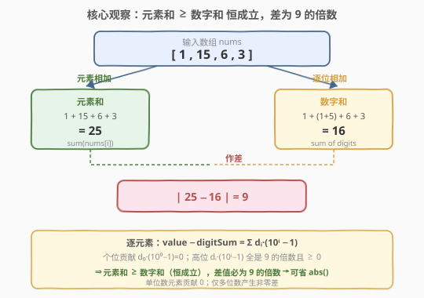
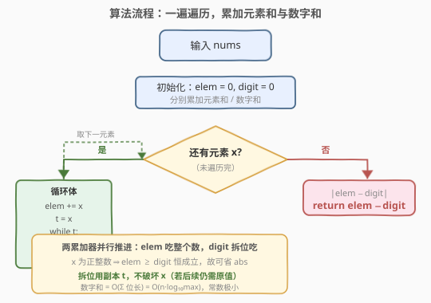
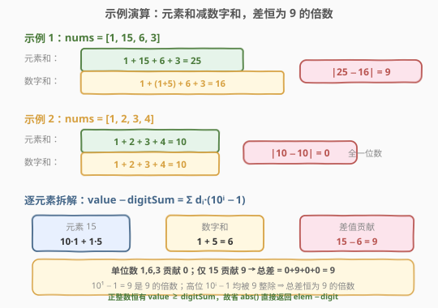

# 数组元素和与数字和的绝对差

- **题目名称**：数组元素和与数字和的绝对差
- **链接**：[2535. 数组元素和与数字和的绝对差](https://leetcode.cn/problems/difference-between-element-sum-and-digit-sum-of-an-array/)
- **难度**：简单
- **标签**：数组、数学

## 1. 题目概述

给定一个正整数数组 `nums`。

- **元素和**：`nums` 中所有元素相加求和。
- **数字和**：`nums` 中每一个元素的每一数位（重复数位需多次求和）相加求和。

返回**元素和**与**数字和**的**绝对差** $|\,\text{元素和} - \text{数字和}\,|$。

**示例 1**：

```text
输入：nums = [1,15,6,3]
输出：9
解释：元素和 = 1 + 15 + 6 + 3 = 25；数字和 = 1 + 1 + 5 + 6 + 3 = 16；|25 - 16| = 9。
```

**示例 2**：

```text
输入：nums = [1,2,3,4]
输出：0
解释：元素和 = 10；数字和 = 10；|10 - 10| = 0。
```

**约束条件**：

- $1 \le \text{nums.length} \le 2000$
- $1 \le \text{nums[i]} \le 2000$

> 💡 关键细节：「元素和」把每个 `nums[i]` 当作一个整体相加；「数字和」则把每个 `nums[i]` **拆成十进制各位**再相加。二者之差的来源在于：一个数与其各位数字和的差，恰好来自「十位及以上」的位——个位 $d_0 \cdot (10^0 - 1) = 0$ 不产生差，高位 $d_i \cdot (10^i - 1)$ 才产生差。

---

## 2. 解题思路

### 2.1 暴力思路：分别累加再作差

最直观的实现是**两趟累加**：

- 一趟遍历 `nums`，对每个 `x` 累加到 `elem`（元素和）；
- 同步把 `x` 的各位数字拆出来累加到 `digit`（数字和）——拆位用 `x % 10` 取最低位、`x // 10` 推进；
- 最后返回 $|\text{elem} - \text{digit}|$。

每个 $nums[i] \le 2000$ 至多 4 位，拆位循环 $\le 4$ 次，总复杂度 $O(n)$，对 $n \le 2000$ 完全可 AC。

> ⚠️ 注意拆位时**不要直接动 `nums[i]`**：若循环后续还需要 `nums[i]` 的原值（本题主循环结束后不再用，故可直接破坏；但为可读性建议拷贝一份 `t = x`）。另外题目保证 `nums[i] \ge 1$ 为正整数，无 $0$ 元素，故「数字和」拆位天然终止于 `t == 0`，无需特判空输入。

### 2.2 核心观察：正整数恒有「元素和 ≥ 数字和」，差为 9 的倍数



**关键直觉**：对一个十进制数 $x = \sum_i d_i \cdot 10^i$（$d_i$ 为第 $i$ 位数字，$d_0$ 为个位），其「数值」与「数字和」之差为

$$
x - \sum_i d_i \;=\; \sum_i d_i \cdot (10^i - 1).
$$

- **个位**：$i = 0$，$10^0 - 1 = 0$，贡献恒为 $0$；
- **高位**（$i \ge 1$）：$10^i - 1$ 是一串 $9$（如 $10^1 - 1 = 9$、$10^2 - 1 = 99$、$10^3 - 1 = 999$），**全是 9 的倍数**，且因 $d_i \ge 0$ 故每个高位贡献 $\ge 0$。

于是对**每个正整数元素**，$x \ge \text{digitSum}(x)$ 恒成立，且 $x - \text{digitSum}(x)$ 是 9 的倍数。把所有元素求和，**整体元素和 $\ge$ 整体数字和** 仍成立，差值也仍是 9 的倍数。

> 💡 **推论**：因为 $\text{elem} \ge \text{digit}$ 恒成立，绝对值可直接去掉——$\text{ans} = \text{elem} - \text{digit}$，无需 `abs()`。这同时解释了示例 2「全一位数 → 差为 0」：单位数 $x = d_0$，只有个位贡献 $d_0 \cdot (10^0 - 1) = 0$，差恒为 $0$。

验证两个示例：

| `nums` | $\text{elem}$ | $\text{digit}$ | 逐元素差 $x - \text{digitSum}(x)$ | $\text{elem}-\text{digit}$ | 输出 |
|--------|----------------|------------------|--------------------------------------|----------------------------|------|
| $[1,15,6,3]$ | $25$ | $16$ | $0,\;9,\;0,\;0$ | $9$ | $9$ |
| $[1,2,3,4]$ | $10$ | $10$ | $0,\;0,\;0,\;0$ | $0$ | $0$ |

> ⚠️ 示例 1 中只有 $15$ 是多位数：$15 - (1+5) = 9 = 1 \cdot (10^1 - 1)$，恰为 9 的倍数；其余单位数贡献 $0$，故总差为 $9$。

### 2.3 算法流程图



流程是一趟 `for` 遍历 + 嵌套拆位 `while`：

1. 初始化 $\text{elem} = 0$，$\text{digit} = 0$；
2. 对每个 $x \in \text{nums}$：$\text{elem} \mathrel{+}= x$；令 $t = x$，当 $t > 0$：$\text{digit} \mathrel{+}= t \bmod 10$，$t \leftarrow \lfloor t/10 \rfloor$；
3. 返回 $\text{elem} - \text{digit}$（正整数保证非负，省 `abs`）。

> 💡 拆位循环总次数 $= \sum_x \lfloor\log_{10} x\rfloor + 1 \le 4n$（$x \le 2000$ 至多 4 位），常数极小。两累加器 `elem` 与 `digit` 在同一主循环内并行推进，无需两趟扫描。

### 2.4 示例演算



- **示例 1** `[1,15,6,3]`：$\text{elem} = 1+15+6+3 = 25$；$\text{digit} = 1+(1+5)+6+3 = 16$。逐元素差：$1-1=0$、$15-6=9$、$6-6=0$、$3-3=0$，总和 $9$。返回 $25-16 = 9$。其中 $15$ 拆为 $10\cdot1 + 1\cdot5$，与数字和 $1+5$ 之差 $= 1\cdot(10-1) + 5\cdot(1-1) = 9$，是 9 的倍数。
- **示例 2** `[1,2,3,4]`：全部为单位数，每位贡献 $d_0\cdot(10^0-1)=0$，$\text{elem}=\text{digit}=10$，返回 $0$。

---

## 3. 参考代码

### C++

```cpp
class Solution {
public:
    int differenceOfSum(vector<int>& nums) {
        int elem = 0, digit = 0;
        for (int x : nums) {
            elem += x;
            for (int t = x; t; t /= 10) {
                digit += t % 10;
            }
        }
        return elem - digit;
    }
};
```

> 💡 `for (int t = x; t; t /= 10)` 用拷贝 `t` 推进拆位，`x` 原值不动（本例 `x` 在本轮后不再用，但拷贝习惯便于阅读）。`t` 为正整数时循环条件 `t` 等价于 `t > 0`，到 `0` 自然终止。返回 `elem - digit`：正整数保证 `elem >= digit`，故无需 `abs`（写 `abs(elem - digit)` 亦同结果，多一次零开销调用）。

### Python

```python
class Solution:
    def differenceOfSum(self, nums: List[int]) -> int:
        elem = digit = 0
        for x in nums:
            elem += x
            t = x
            while t:
                digit += t % 10
                t //= 10
        return elem - digit
```

> 💡 Python 整除用 `//=`。也可走字符串版：`digit = sum(int(c) for x in nums for c in str(x))`，一行但含类型转换、空间 $O(\sum \text{位长})$；取余版纯整数、$O(1)$ 额外空间。`elem` 亦可一行 `sum(nums)`，但与拆位合并到一个循环可省一趟遍历。

---

## 4. 复杂度分析

| 维度 | 复杂度 | 说明 |
|------|--------|------|
| **时间复杂度** | $O(n \cdot \overline{d})$ | 主循环 $n$ 次，每次拆位 $\le \lfloor\log_{10}\text{nums[i]}\rfloor + 1$ 次；$\text{nums[i]} \le 2000$ 故 $\overline{d} \le 4$，即 $O(n)$ |
| **空间复杂度** | $O(1)$ | 仅 `elem`/`digit`/`t` 三个整型变量 |
| 对照：转字符串版 | $O(n\cdot d)$ 时间 / $O(n\cdot d)$ 空间 | 额外生成各元素字符串 |

> 💡 本题无可省的代数捷径——必须逐元素读入并拆位求和，$O(n)$ 已是最优。但因 $d \le 4$ 常数极小，实践中近乎瞬时。利用「差恒为 9 倍数」可加一道断言自检，但不降复杂度。

---

## 5. 扩展：数字根与 9 的倍数

「数值 − 数字和 是 9 的倍数」这一事实，正是**同余定理**的直接推论：$10 \equiv 1 \pmod 9$，故 $10^i \equiv 1 \pmod 9$，于是 $x = \sum d_i 10^i \equiv \sum d_i \pmod 9$，即 $x$ 与其数字和模 9 同余。它们的差 $x - \text{digitSum}(x) \equiv 0 \pmod 9$。

由此可联系两个经典结论：

- **数字根（Digital Root）**：反复求数字和直至一位，结果 $= 1 + ((x - 1) \bmod 9)$（$x>0$ 时）。即 $x$ 的数字根等于 $x \bmod 9$（除 0 取 9 的约定）。
- **9 的倍数判定**：一个数能被 9 整除，当且仅当其数字和能被 9 整除。

> 💡 本题只做一次数字和，不求到一位的「根」。但「差恒为 9 倍数」给了我们一个**正确性自检**：若实现算出 $\text{elem}-\text{digit}$ 不是 9 的倍数，则必然有 bug（如拆位漏了某位、或 `abs` 用反方向）。这是面试里可主动提及的「不变量」。

若题目放宽允许 `nums[i] = 0`：$0$ 是正整数约束外的边界，其数值 $0$、数字和 $0$，贡献差 $0$，不影响结论；拆位循环 `while t` 对 $t=0$ 一次不执行，天然跳过，无需特判。

---

## 6. 面试要点

1. **为什么正整数恒有「元素和 ≥ 数字和」？差为何是 9 的倍数？**

   > 对 $x = \sum d_i 10^i$，$x - \text{digitSum}(x) = \sum d_i(10^i - 1)$。个位 $10^0-1=0$ 不贡献；高位 $10^i-1\;(i\ge1)$ 形如 $9,99,999$ 全是 9 的倍数且 $\ge 0$，每位贡献 $\ge 0$ 且为 9 倍数。求和后整体 $\text{elem}\ge\text{digit}$，差为 9 倍数。本质上 $10\equiv1\pmod9$ 给出同余 $x\equiv\text{digitSum}(x)\pmod9$。

2. **能否省掉 `abs()`？这么做安全吗？**

   > 能。因每个正整数 $x\ge\text{digitSum}(x)$，求和保持不等号，故 $\text{elem}-\text{digit}\ge0$ 恒成立，`abs` 是多余的。写 `abs(elem-digit)` 结果相同（多一次调用），但可读性上更显式贴合题意「绝对差」。面试可先写带 `abs` 版对齐题面，再点明「正整数保证非负，可省」展示分析。

3. **拆位时为何要拷贝 `t = x` 而不直接修改 `x`？**

   > 职责分离：`x` 在主循环本轮负责「贡献给 `elem`」，若同时被 `//10` 破坏，后续逻辑（如还需用 `x`）会出错。本题本轮后不再用 `x`，理论上可直接改，但拷贝 `t` 是安全通用习惯，避免「读侧与写侧共用一变量」的混淆，与 [2520](../2501-2600/2520_统计能整除数字的位数.md) 设 `t` 拆位同一范式。

4. **含 `0` 元素或 `nums[i]` 更大时如何处理？**

   > 若允许 `nums[i]=0`：拆位 `while t:` 对 `0` 不执行，数字和贡献 $0$、元素和贡献 $0$，差为 $0$，结论不受影响，无需特判。若 `nums[i]` 放宽到任意大（如 $10^{18}$），拆位位数从 4 升到约 18，复杂度仍 $O(n\cdot d)$，只是常数变大；可改用字符串 `str(x)` 遍历避免整数溢出（C++ 需 `long long`）。

5. **取余拆位与转字符串拆位如何取舍？**

   > 判定逻辑一致，差别在「如何取到每位」。取余 `%10 //10` 纯整数、$O(1)$ 额外空间、无类型转换；转字符串 `str(x)` 直观但开 $O(d)$ 字符串空间。面试可先给字符串版讲清思路，再优化为取余版展示对底层运算的把控。本题 $d\le4$ 两者性能无差。

> 💡 **一句话总结**：一遍遍历并行累加 `elem`（吃整个数）与 `digit`（`%10 //10` 拆位吃），正整数保证 `elem ≥ digit` 故省 `abs` 直接返回 `elem - digit`；$O(n)$ 时间、$O(1)$ 空间，差恒为 9 的倍数（同余 $10\equiv1\pmod9$）。

---

## 7. 同类练习题

- [1281. 整数的各位积和之差](https://leetcode.cn/problems/subtract-the-product-and-sum-of-digits-of-an-integer/)（[题解](../1201-1300/1281_整数各位积和之差.md)）：同用 `%10 //10` 逐位拆数，对照「逐位聚合」骨架，本题是其在数组上的求和变体
- [2520. 统计能整除数字的位数](https://leetcode.cn/problems/count-the-digits-that-divide-a-number/)（[题解](../2501-2600/2520_统计能整除数字的位数.md)）：同一 `t = x; while t: t%10; t//=10` 拆位模板，对照拆位技巧的不同用法
- [258. 各位相加](https://leetcode.cn/problems/add-digits/)：反复求数字和至一位即数字根，承接本文「数字根与 9 的倍数」扩展
- [1085. 最小元素各数位之和](https://leetcode.cn/problems/sum-of-digits-in-the-minimum-number/)：对最小元素做数字和，同属「数组 + 拆位求和」一族
