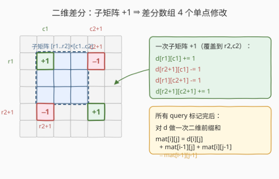
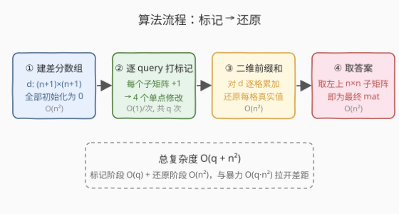
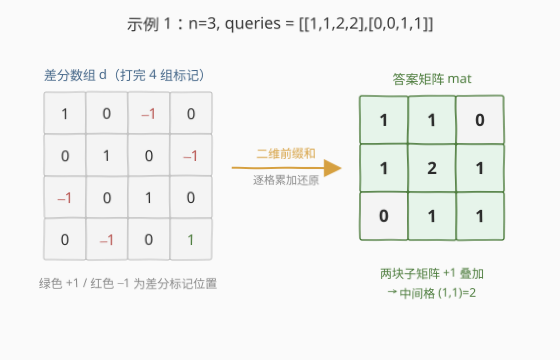

# LeetCode 子矩阵元素加 1 题解

## 1. 题目概述

- **标题 / 题号**：子矩阵元素加 1（#2536，medium）
- **链接**：https://leetcode.cn/problems/increment-submatrices-by-one/
- **难度**：中等
- **标签**：数组、二维差分、前缀和、矩阵

**题意**：给定一个正整数 `n`，初始有一个 `n × n`、下标从 **0** 开始、元素全为 `0` 的整数矩阵 `mat`。再给定一个二维整数数组 `queries`，其中 `queries[i] = [row1i, col1i, row2i, col2i]` 表示一个子矩阵的左上角 `(row1i, col1i)` 与右下角 `(row2i, col2i)`。对每个查询，把该子矩阵内的**每个元素**加 `1`。返回执行完所有查询后的矩阵 `mat`。

**示例 1**：

```text
输入：n = 3, queries = [[1,1,2,2],[0,0,1,1]]
输出：[[1,1,0],[1,2,1],[0,1,1]]
解释：
- 第 1 个操作：子矩阵 (1,1)~(2,2) 每个元素 +1
- 第 2 个操作：子矩阵 (0,0)~(1,1) 每个元素 +1
两块子矩阵重叠在 (1,1)，故该格为 2。
```

**示例 2**：

```text
输入：n = 2, queries = [[0,0,1,1]]
输出：[[1,1],[1,1]]
解释：整个矩阵每个元素 +1。
```

**约束**：

- $1 \leq n \leq 500$
- $1 \leq \text{queries.length} \leq 10^4$
- $0 \leq \text{row1i} \leq \text{row2i} < n$
- $0 \leq \text{col1i} \leq \text{col2i} < n$

> ⚠️ 注意规模读法：单次子矩阵加最多覆盖 $n^2 \approx 2.5 \times 10^5$ 个格子，而查询数最多 $10^4$ 次，朴素逐格累加可达 $10^4 \times 2.5 \times 10^5 = 2.5 \times 10^9$ 次操作，必超时。必须把"一次子矩阵加"从 $O(\text{面积})$ 压到 $O(1)$。

## 2. 解题思路

### 2.1 暴力思路：逐格累加

最直观的做法：对每个查询 `[r1,c1,r2,c2]`，用双重循环遍历该子矩阵的所有格子逐个 `+1`。所有查询处理完直接返回矩阵。

- 单次查询成本 $O\big((r_2-r_1+1)(c_2-c_1+1)\big)$，最坏 $O(n^2)$；
- $q$ 次查询合计 $O(q \cdot n^2)$，代入上界约 $2.5 \times 10^9$，**超时**。

瓶颈在于"子矩阵整体加"这个操作太贵——我们需要把它降到 $O(1)$。

### 2.2 核心观察：二维差分

这是一维差分（区间加 → 两端打标记，最后前缀和还原）在二维的自然推广。**关键观察**：

> 一次"把子矩阵 $[r_1,r_2]\times[c_1,c_2]$ 整体 $+1$"，等价于在**差分数组** $d$ 上做 **4 个单点修改**；所有查询标记完后，对 $d$ 做**一次二维前缀和**即可还原出真实矩阵。

构造一个 $(n+1)\times(n+1)$ 的差分数组 $d$（多留一行一列存放"刚好贴边"时的右下角标记）。对查询 $[r_1,c_1,r_2,c_2]$（均为 0-indexed，$r_2,c_2 < n$）：

$$
d[r_1][c_1]\ {+}{=}\ 1,\quad d[r_2{+}1][c_1]\ {-}{=}\ 1,\quad d[r_1][c_2{+}1]\ {-}{=}\ 1,\quad d[r_2{+}1][c_2{+}1]\ {+}{=}\ 1
$$

四个标记点：左上角 $+1$、左下角下方 $-1$、右上角右侧 $-1$、右下角对角 $+1$。由于 $r_2+1 \leq n$、$c_2+1 \leq n$，$(n+1)\times(n+1)$ 的数组刚好容得下这些边界标记，不会越界。



> 💡 **为什么四个角就够？** 二维差分是"先按行做一维差分、再按列做一维差分"的复合。一维差分里，区间 $[l,r]$ 加 1 等价于 $d[l]{+}{=}1,\ d[r{+}1]{-}{=}1$，前缀和后只在 $[l,r]$ 内贡献 $+1$。二维上把行、列两次一维差分叠加，张量积恰好给出四个角的 $\{+1,-1,-1,+1\}$ 标记——二维前缀和后贡献恰好填满子矩阵矩形。

### 2.3 算法流程

整体三步，标记阶段 $O(q)$、还原阶段 $O(n^2)$：

1. **建差分数组**：$d$ 开 $(n+1)\times(n+1)$，全 0。
2. **逐查询打标记**：对每个 `[r1,c1,r2,c2]` 做 4 个单点修改，每次 $O(1)$。
3. **二维前缀和还原**：在结果矩阵 `mat` 上逐格累加，$\text{mat}[i][j] = d[i][j] + \text{mat}[i-1][j] + \text{mat}[i][j-1] - \text{mat}[i-1][j-1]$（边界按 0 处理）。取左上 $n\times n$ 即为答案。



### 2.4 示例演算

以**示例 1**（$n=3$，`queries = [[1,1,2,2],[0,0,1,1]]`）演示。$d$ 为 $4\times4$（行/列 $0\sim3$）：

- 查询 1 `[1,1,2,2]`：$d[1][1]{+}{=}1,\ d[3][1]{-}{=}1,\ d[1][3]{-}{=}1,\ d[3][3]{+}{=}1$
- 查询 2 `[0,0,1,1]`：$d[0][0]{+}{=}1,\ d[2][0]{-}{=}1,\ d[0][2]{-}{=}1,\ d[2][2]{+}{=}1$

打完标记后 $d$：

| | c0 | c1 | c2 | c3 |
|---|---|---|---|---|
| **r0** | 1 | 0 | −1 | 0 |
| **r1** | 0 | 1 | 0 | −1 |
| **r2** | −1 | 0 | 1 | 0 |
| **r3** | 0 | −1 | 0 | 1 |

做二维前缀和后取左上 $3\times3$，得 `[[1,1,0],[1,2,1],[0,1,1]]`，与期望一致。两块子矩阵在 $(1,1)$ 重叠，故该格为 $2$。



> 💡 **对比例 2**：`n=2, queries=[[0,0,1,1]]` 只有一组标记 $d[0][0]{+}{=}1,\ d[2][0]{-}{=}1,\ d[0][2]{-}{=}1,\ d[2][2]{+}{=}1$，前缀和后四格均为 $1$，即 `[[1,1],[1,1]]`。

## 3. 参考代码

### C++

```cpp
class Solution {
public:
    vector<vector<int>> rangeAddQueries(int n, vector<vector<int>>& queries) {
        // (n+1)x(n+1) 差分数组，多留一行一列存放 r2+1 / c2+1 的边界标记
        vector<vector<int>> d(n + 1, vector<int>(n + 1, 0));
        for (auto& q : queries) {
            int r1 = q[0], c1 = q[1], r2 = q[2], c2 = q[3];
            d[r1][c1]         += 1;
            d[r2 + 1][c1]     -= 1;
            d[r1][c2 + 1]     -= 1;
            d[r2 + 1][c2 + 1] += 1;
        }
        // 二维前缀和还原，直接写到 n x n 答案矩阵
        vector<vector<int>> mat(n, vector<int>(n, 0));
        for (int i = 0; i < n; i++)
            for (int j = 0; j < n; j++) {
                mat[i][j] = d[i][j];
                if (i > 0) mat[i][j] += mat[i - 1][j];
                if (j > 0) mat[i][j] += mat[i][j - 1];
                if (i > 0 && j > 0) mat[i][j] -= mat[i - 1][j - 1];
            }
        return mat;
    }
};
```

### Python

```python
class Solution:
    def rangeAddQueries(self, n: int, queries: List[List[int]]) -> List[List[int]]:
        # (n+1)x(n+1) 差分数组，多留一行一列存放 r2+1 / c2+1 的边界标记
        d = [[0] * (n + 1) for _ in range(n + 1)]
        for r1, c1, r2, c2 in queries:
            d[r1][c1]         += 1
            d[r2 + 1][c1]     -= 1
            d[r1][c2 + 1]     -= 1
            d[r2 + 1][c2 + 1] += 1
        # 二维前缀和还原，直接写到 n x n 答案矩阵
        mat = [[0] * n for _ in range(n)]
        for i in range(n):
            for j in range(n):
                mat[i][j] = d[i][j]
                if i > 0:
                    mat[i][j] += mat[i - 1][j]
                if j > 0:
                    mat[i][j] += mat[i][j - 1]
                if i > 0 and j > 0:
                    mat[i][j] -= mat[i - 1][j - 1]
        return mat
```

> ⚠️ **差分数组为何开 $(n{+}1)\times(n{+}1)$？** 查询子矩阵右下角 $(r_2,c_2)$ 满足 $r_2,c_2 < n$，故 $r_2{+}1 \leq n$、$c_2{+}1 \leq n$。差分数组下标范围 $0\sim n$，开 $(n{+}1)\times(n{+}1)$ 刚好覆盖到边界标记 $d[n][\cdot]$、$d[\cdot][n]$，不越界。还原时只取左上 $n\times n$（下标 $0\sim n{-}1$）作为答案。

## 4. 复杂度分析

| 维度 | 复杂度 | 说明 |
|------|--------|------|
| 时间 | $O(q + n^2)$ | 标记阶段每个查询 $O(1)$，共 $q$ 次；还原阶段二维前缀和遍历 $n^2$ 格 |
| 空间 | $O(n^2)$ | 差分数组 $d$ 与答案矩阵 `mat`，各 $O(n^2)$；$d$ 可直接当答案复用至 $O(1)$ 额外空间 |
| 对照：逐格累加 | $O(q \cdot n^2)$ | 每查询 $O(n^2)$，$q$ 次合计最坏 $2.5\times10^9$，超时 |

> 💡 $n \leq 500$、$q \leq 10^4$，$O(q+n^2) \approx 2.6\times10^5$ 量级，毫秒级完成。差分把"区间加"从与面积成正比压成常数，是本题的关键加速。

## 5. 扩展：差分数组复用与降维类比

**写法一：差分数组原地还原。** 上面把结果写进新的 `mat`。若想省去额外矩阵，可在 $d$ 上**就地**做二维前缀和：先按行做一维前缀和（`d[i][j] += d[i][j-1]`），再按列做一维前缀和（`d[i][j] += d[i-1][j]`），两趟扫描等价于二维前缀和。最后 `d[i][j]`（$0\leq i,j<n$）即为答案，省掉 `mat`，额外空间降到 $O(1)$。注意就地修改后 $d$ 的边界行/列也被累加，但答案只取左上 $n\times n$，不受影响。

**写法二：与一维差分对照。** 本题是一维差分"区间加 $[l,r]$ ⇒ $d[l]{+}{=}1,\ d[r{+}1]{-}{=}1$，末尾一次前缀和还原"的直接二维推广：行方向做一次、列方向再做一次。理解了一维差分的"两端打标记 + 前缀和还原"，二维只是同样的套路叠加一遍。一维模板见 [1109. 航班预订统计](../1101-1200/1109_航班预订统计.md)。

## 6. 面试要点

1. **为什么逐格累加会超时、差分能过？**

   > 逐格累加单次查询 $O(n^2)$，$q$ 次合计 $O(qn^2)\approx2.5\times10^9$ 超时。差分把每次"子矩阵加"压成 4 个 $O(1)$ 单点修改，最后一次性 $O(n^2)$ 前缀和还原，总 $O(q+n^2)$。

2. **四个标记点为什么是 $\{+1,-1,-1,+1\}$，且在四个角？**

   > 二维差分是行、列两次一维差分的复合。一维差分区间 $[l,r]$ 加 1 用 $d[l]{+}{=}1,\ d[r{+}1]{-}{=}1$，前缀和后只在 $[l,r]$ 贡献 $+1$。行、列两次叠加的张量积，就得到四角的 $\{+1,-1,-1,+1\}$——二维前缀和后贡献恰好填满子矩阵矩形、矩形外为 0。

3. **差分数组为什么开 $(n+1)\times(n+1)$ 而不是 $n\times n$？**

   > 子矩阵右下角 $r_2,c_2 < n$，边界标记落在 $r_2{+}1$、$c_2{+}1$ 处，最大为 $n$。开 $(n{+}1)\times(n{+}1)$（下标 $0\sim n$）才能放下这些标记而不越界；若只开 $n\times n$，贴边查询的 $r_2{+}1=n$ 会越界。

4. **还原时边界怎么处理，为什么不会算错？**

   > 二维前缀和公式 $\text{mat}[i][j] = d[i][j] + \text{mat}[i-1][j] + \text{mat}[i][j-1] - \text{mat}[i-1][j-1]$ 在 $i=0$ 或 $j=0$ 时会用到越界项。代码用 `if (i>0)`/`if (j>0)` 把越界项当 0 跳过，等价于在矩阵外圈补零，逻辑无误。

5. **能否就地还原省掉答案矩阵？**

   > 可以。在 $d$ 上先按行做一维前缀和、再按列做一维前缀和，两趟扫描等价于二维前缀和，$d[i][j]$（$i,j<n$）即为答案，额外空间降到 $O(1)$。答案只取左上 $n\times n$，$d$ 多出的边界行/列被累加也无妨。

> 💡 **一句话总结**：二维差分把"子矩阵整体加"从 $O(\text{面积})$ 压成 4 个 $O(1)$ 单点修改，所有查询标记完后一次二维前缀和还原——总复杂度 $O(q+n^2)$，是一维差分"两端打标记 + 前缀和还原"的直接二维推广。

## 同类练习题

| # | 题目 | 与本题的关联 |
|---|------|-------------|
| 1109 | [航班预订统计](https://leetcode.cn/problems/corporate-flight-bookings/)（[题解](../1101-1200/1109_航班预订统计.md)） | 一维差分模板，本题二维差分的降维前身，理解"两端打标记 + 前缀和还原"是基础 |
| 304 | [二维区域和检索 - 数组不可变](https://leetcode.cn/problems/range-sum-query-2d-immutable/)（[题解](../0301-0400/304_二维区域和检索 - 数组不可变.md)） | 二维前缀和模板，与差分"打标记后还原"用同一套二维前缀和代码 |
| 2132 | [用邮票贴满网格图](https://leetcode.cn/problems/stamping-the-grid/)（[题解](../2101-2200/2132_用邮票贴满网格图.md)） | 二维差分应用（标记邮票覆盖），把本题的"打标记"环节放进更复杂的判定流程 |
| 1526 | [形成目标数组的子数组最少增加次数](https://leetcode.cn/problems/minimum-number-of-increments-on-subarrays-to-form-a-target-array/)（[题解](../1501-1600/1526_形成目标数组的子数组最少增加次数.md)） | 一维差分思想求"用区间加构造目标数组的最少次数"，反向运用差分 |
| 2158 | [每天绘制新区域的数量](https://leetcode.cn/problems/amount-of-new-area-painted-each-day/) | 二维差分标记 + 还原的又一应用，与本题主流程高度同构 |
