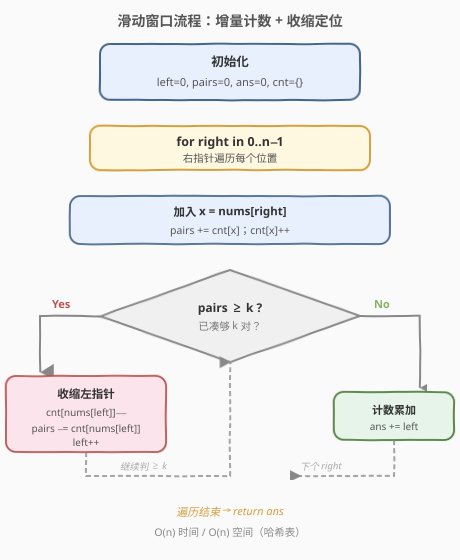
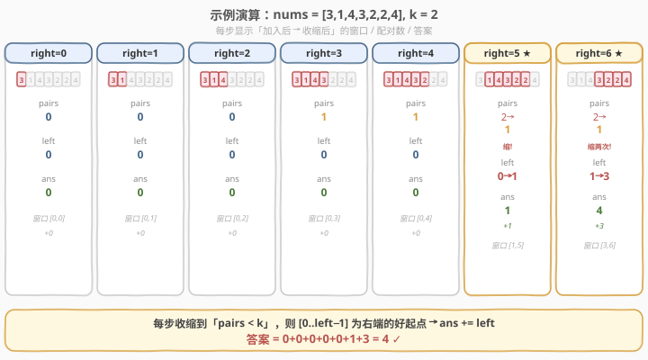

# 统计好子数组的数目

- **题目名称**：统计好子数组的数目
- **链接**：[2537. 统计好子数组的数目](https://leetcode.cn/problems/count-the-number-of-good-subarrays/)
- **难度**：中等
- **标签**：数组、哈希表、滑动窗口

## 1. 题目概述

给你一个整数数组 `nums` 和一个整数 `k`。一个子数组 `arr` 若有**至少** `k` 对下标 `(i, j)` 满足 `i < j` 且 `arr[i] == arr[j]`，则称它是一个**好子数组**。请返回 `nums` 中好子数组的**数目**。

子数组是原数组中一段连续非空的元素序列。

**示例 1**：

```text
输入：nums = [1,1,1,1,1], k = 10
输出：1
解释：唯一的好子数组是这个数组本身（5 个 1 共 C(5,2)=10 对）。
```

**示例 2**：

```text
输入：nums = [3,1,4,3,2,2,4], k = 2
输出：4
解释：共有 4 个不同的好子数组：
- [3,1,4,3,2,2]   有 2 对
- [3,1,4,3,2,2,4] 有 3 对
- [1,4,3,2,2,4]   有 2 对
- [4,3,2,2,4]     有 2 对
```

**约束条件**：

- $1 \le \text{nums.length} \le 10^5$
- $1 \le \text{nums[i]},\, k \le 10^9$

> 💡 **只数「同值对」**：题目不关心元素大小，只关心「窗口里有多少对相等的下标」。当窗口内某个值 $v$ 出现 $c$ 次，它贡献 $\binom{c}{2}=\frac{c(c-1)}{2}$ 对。$n$ 达 $10^5$，枚举所有 $O(n^2)$ 个子数组再逐个数对必然超时，必须找增量关系。

---

## 2. 解题思路

### 2.1 暴力思路

枚举所有子数组 `[i, j]`，对每个子数组用哈希表统计各值频次，再累加 $\binom{c}{2}$ 判断是否 $\ge k$。两重循环 + 计数共 $O(n^2)$（或 $O(n^3)$ 若朴素数对），$n = 10^5$ 时远超时限。

### 2.2 核心观察：增量配对计数 + 「至少 K」单调前缀


把「配对数」当作可增量维护的量，配上一条滑动窗口：

**① 增量配对计数**：当右指针右移、把 $x = \text{nums}[\text{right}]$ 纳入窗口时，新元素会与窗口内**每一个已存在的同值 $x$** 各成一对。设加入前窗口里 $x$ 已有 $c$ 个，则配对数增量恰为 $c$：

$$
\Delta\text{pairs} = \text{cnt}[x]_{\text{加入前}}
$$

于是 `pairs += cnt[x]` 后再 `cnt[x]++` 即可 $O(1)$ 维护窗口配对总数。同理，左端移走 `nums[left]` 时，先 `cnt[nums[left]]--`，再 `pairs -= cnt[nums[left]]`（移除后剩余的同值个数，正是该元素曾贡献的对数）。

**② 「至少 K」的单调前缀**：固定右端 `right`，随左端 `left` 增大（窗口缩小、丢掉元素），配对数**单调不增**——因为丢元素只会减少或不变配对数，永不增加。所以满足 $\text{pairs} \ge k$ 的 `left` 必然是一段**连续前缀** $[0,\,L)$，其中 $L$ 是首个使配对数跌破 $k$ 的起点。

> 💡 **为什么是「至少」可直接滑窗，而「恰好」要绕道？** 「至少 $k$」下，窗口一旦够 $k$ 对，把它**再放大**（左端往左挪）只会让对数更多，仍满足——满足条件是个前缀，可直接 `ans += left` 计数。而 [1248](../1201-1300/1248_统计优美子数组.md) 那种「恰好 $k$」没有这种前缀性，才需 `atMost(K) − atMost(K−1)` 转化。

**③ 计数公式**：对每个 `right`，我们把 `left` 尽可能右移（收缩），直到 `pairs < k` 为止。此时窗口 `[left, right]` 已不足 $k$ 对，但**再放大一格**的 `[left−1, right]` 刚好 $\ge k$，且由单调性 $[0,\text{right}],\dots,[\text{left−1},\text{right}]$ 全部 $\ge k$——共 `left` 个好子数组：

$$
\text{ans} \mathrel{+}= \text{left}
$$

### 2.3 算法流程图



```text
left = 0; pairs = 0; ans = 0; cnt = {}
for right in 0..n-1:
    x = nums[right]
    pairs += cnt[x]        # 新元素与窗口内同值各成一对
    cnt[x] += 1
    while pairs >= k:      # 够 k 对就收缩，定位首个跌破 k 的起点
        cnt[nums[left]] -= 1
        pairs -= cnt[nums[left]]   # 移走 nums[left] 损失这些对
        left += 1
    ans += left            # [0..left-1] 为右端的好起点数
return ans
```

> ⚠️ **收缩顺序不能反**：移除 `nums[left]` 时必须**先** `cnt--` **再** `pairs -= cnt`。因为被移除元素只与「移除后仍留在窗口里的同值元素」成对，个数正是 `cnt` 自减后的值。顺序写反会多算/漏算。

### 2.4 示例演算

以 `nums = [3,1,4,3,2,2,4], k = 2` 为例（★ 表示该步发生了收缩）：



| right | 加入 | pairs（加入后） | 收缩？ | 收缩后 left | 收缩后 pairs | ans += left | ans |
|-------|------|------------------|--------|-------------|--------------|-------------|-----|
| 0 | 3 | 0 | 否 | 0 | 0 | 0 | 0 |
| 1 | 1 | 0 | 否 | 0 | 0 | 0 | 0 |
| 2 | 4 | 0 | 否 | 0 | 0 | 0 | 0 |
| 3 | 3 | 1（与首个 3 成对） | 否 | 0 | 1 | 0 | 0 |
| 4 | 2 | 1 | 否 | 0 | 1 | 0 | 0 |
| 5 | 2 | 2（与首个 2 成对） ★ | 是，移 3 | 1 | 1 | 1 | 1 |
| 6 | 4 | 2（与首个 4 成对） ★ | 是，移 1、移 4 | 3 | 1 | 3 | 4 |

- **right=5**：加入第二个 `2` 使 `pairs` 升到 $2 \ge k$，触发收缩；移走 `nums[0]=3` 后 `pairs` 回到 1，`left` 到 1。于是以 `right=5` 结尾的好子数组有 `left=1` 个：`[1,4,3,2,2]`。
- **right=6**：加入第二个 `4` 使 `pairs` 升到 2，连续收缩两次（移 `1`、移 `4`）后 `left=3`、`pairs=1`。以 `right=6` 结尾的好子数组有 3 个：`[3,1,4,3,2,2,4]`、`[1,4,3,2,2,4]`、`[4,3,2,2,4]`。

合计 $0+0+0+0+0+1+3=4$，与示例一致 ✓。

> 💡 **例 1 自检**：`nums=[1,1,1,1,1], k=10`。前 4 步 `pairs=0,1,3,6` 均 $<10$；`right=4` 加入后 `pairs=10` 触发收缩，移走一个 `1` 后 `pairs=6`，`left=1`。`ans += 1 = 1` ✓——只有整段数组本身凑够 $\binom{5}{2}=10$ 对。

---

## 3. 参考代码

### C++

```cpp
class Solution {
public:
    long long countGoodSubarrays(vector<int>& nums, int k) {
        unordered_map<int, int> cnt;
        long long pairs = 0, ans = 0;
        int left = 0;
        for (int right = 0; right < (int)nums.size(); right++) {
            pairs += cnt[nums[right]];          // 新元素与窗口内同值各成一对
            cnt[nums[right]]++;
            while (pairs >= k) {               // 够 k 对就收缩，定位首个跌破 k 的起点
                cnt[nums[left]]--;
                pairs -= cnt[nums[left]];      // 移走 nums[left] 损失这些对
                left++;
            }
            ans += left;                       // [0..left-1] 为右端的好起点数
        }
        return ans;
    }
};
```

### Python

```python
class Solution:
    def countGoodSubarrays(self, nums: List[int], k: int) -> int:
        from collections import defaultdict
        cnt = defaultdict(int)
        pairs = 0
        ans = 0
        left = 0
        for right, x in enumerate(nums):
            pairs += cnt[x]                    # 新元素与窗口内同值各成一对
            cnt[x] += 1
            while pairs >= k:                  # 够 k 对就收缩
                cnt[nums[left]] -= 1
                pairs -= cnt[nums[left]]       # 移走 nums[left] 损失这些对
                left += 1
            ans += left                        # [0..left-1] 为右端的好起点数
        return ans
```

> 💡 **返回类型**：$n \le 10^5$ 时子数组数可达 $\binom{10^5}{2} \approx 5\times10^9$，超过 32 位整型范围，故返回 `long long`（Python 整型天然无限大无需关心）。`nums[i]` 与 `k` 可达 $10^9$，仅作比较、不参与下标，故用哈希表存频次而非数组。

---

## 4. 复杂度分析

| 维度 | 复杂度 | 说明 |
|------|--------|------|
| 时间 | $O(n)$ | `right` 与 `left` 各自至多遍历数组一次（每个元素进/出窗口各一次），每步哈希操作均摊 $O(1)$ |
| 空间 | $O(n)$ | 哈希表最坏存放 $n$ 个不同值 |
| 对照：枚举子数组 | $O(n^2)$ | 双重循环枚举所有子数组并计数对数，$n=10^5$ 超时 |

> 💡 本题单调性来自「加入元素只会让配对数不增不减地多或不变化（$\Delta\ge0$）」，与元素正负无关——即使数组含负数滑窗也成立。这与 [560](../0501-0600/560_和为K的子数组.md) 「子和」因元素可负而破坏单调、只能上前缀和+哈希，形成鲜明对照。

---

## 5. 扩展：「至少 K」 vs 「恰好 K」的滑窗计数对比

同样是「数满足某阈值条件的子数组个数」，因条件方向不同，滑窗写法分两路：

| 维度 | 「至少 K」（本题 2537） | 「恰好 K」（[1248](../1201-1300/1248_统计优美子数组.md)） |
|------|------------------------|----------------------------------------------------------|
| 满足集形状 | 固定右端时是 `left` 的**连续前缀** $[0,L)$ | 固定右端时只在一个（或零个）`left` 处成立 |
| 收缩方向 | `pairs ≥ k` 时**收缩**左端，缩到刚跌破 $k$ | 难以直接收缩（缩一格可能仍恰好，也可能不足） |
| 计数式 | `ans += left`（前缀长度） | `atMost(K) − atMost(K−1)`（两个「至多」相减） |
| 单调要求 | 加入元素使量**不降**即可（本题恒成立） | 同样需单调，但转化为「至多」后用 `right−left+1` 计数 |

> ⚠️ 本题若改成「**恰好** $k$ 对」，就不能直接 `ans += left` 了——需要 `恰好 = 至少(K) − 至少(K+1)`，或另设计数。这正说明「方向」决定套路：求「至少」往左缩到刚不满足、数前缀；求「至多」往左缩到刚满足、数 `right−left+1`；求「恰好」则两者相减。

---

## 6. 面试要点

1. **为什么用滑动窗口而不是枚举子数组？**

   > 配对数随窗口放大**单调不降**（加元素 $\Delta\text{pairs}=\text{cnt}[x]\ge0$），满足「至少 $k$」的左端是固定右端下的连续前缀。这种单调性 + 前缀性正是滑窗 $O(n)$ 计数的温床，枚举 $O(n^2)$ 完全没用上它。

2. **`ans += left` 为什么就是以 `right` 结尾的好子数组数？**

   > 收缩循环退出时 `[left, right]` 的配对数 $<k$，但**上一格** `[left−1, right]` 还 $\ge k$；由单调性，`[0..left−1, right]` 这 `left` 个左端对应的子数组全部 $\ge k$，恰为好子数组。

3. **加入 / 移除元素时如何 $O(1)$ 维护配对数？**

   > 加入 `x`：`pairs += cnt[x]`（与已存在的每个同值 $x$ 各成一对），再 `cnt[x]++`。移除 `nums[left]`：先 `cnt[nums[left]]--`，再 `pairs -= cnt[nums[left]]`（移除后剩余的同值个数，即该元素曾贡献的对数）。顺序颠倒会错。

4. **本题与 [1248. 统计优美子数组](../1201-1300/1248_统计优美子数组.md) 的关键差异？**

   > 1248 求「恰好 $k$」，不具前缀性，需 `atMost(K) − atMost(K−1)`；本题求「至少 $k$」，满足集是前缀，可直接收缩到刚跌破 $k$ 再 `ans += left`。两者都用单调性 + 增量维护，但计数公式因「方向」而异。

5. **哈希表会不会退化、空间有多大？**

   > 最坏所有元素互不相同，哈希表存 $n$ 个键，空间 $O(n)$；每个元素进出窗口各一次，均摊 $O(1)$。题目不保证元素为小整数（可达 $10^9$），故不能用数组下标存频次，必须用哈希表。

> 💡 **一句话总结**：哈希表增量维护窗口「同值对」总数，`pairs ≥ k` 就收缩左端到刚跌破 $k$，此时以 `right` 结尾的好子数组恰有 `left` 个 → `ans += left`，总体 $O(n)$。

---

## 7. 同类练习题

- [1248. 统计「优美子数组」](https://leetcode.cn/problems/count-number-of-nice-subarrays/)（[题解](../1201-1300/1248_统计优美子数组.md)）：姊妹题，求「恰好 k」需 `atMost` 相减；本题求「至少 k」可直接 `ans += left`，对照两种计数方向
- [713. 乘积小于 K 的子数组](https://leetcode.cn/problems/subarray-product-less-than-k/)（[题解](../0701-0800/713_乘积小于K的子数组.md)）：同为滑窗 + `right−left+1` 计数，对照「至多」方向与本题「至少」方向的收缩时机
- [992. K 个不同整数的子数组](https://leetcode.cn/problems/subarrays-with-k-different-integers/)：「恰好 K 种」经典题，`atMost(K) − atMost(K−1)` 套路，与 1248 同构、对照本题的「至少」直数
- [1358. 包含所有三种字符的子字符串数目](https://leetcode.cn/problems/number-of-substrings-containing-all-three-characters/)：求「至少含全 3 种」，收缩到刚不全后 `ans += left`，与本题「至少 k」计数同模板
- [560. 和为 K 的子数组](https://leetcode.cn/problems/subarray-sum-equals-k/)（[题解](../0501-0600/560_和为K的子数组.md)）：元素可负→单调性破坏→只能前缀和 + 哈希，作为「滑窗失效、改用哈希」的反面对照
