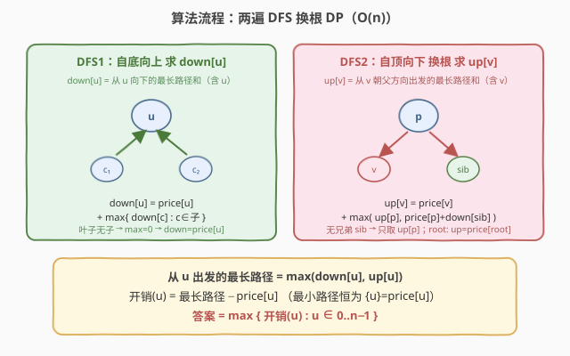
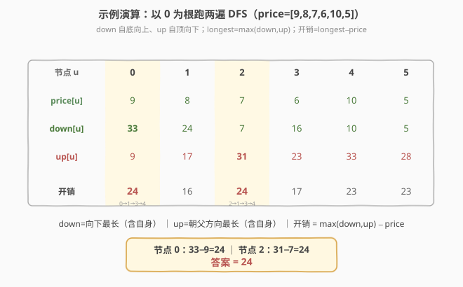

# 最大价值和与最小价值和的差值

- **题目名称**：最大价值和与最小价值和的差值
- **链接**：[2538. 最大价值和与最小价值和的差值](https://leetcode.cn/problems/difference-between-maximum-and-minimum-price-sum/)
- **难度**：困难
- **标签**：树、深度优先搜索、数组、动态规划、树形 DP

## 1. 题目概述

给定一棵 $n$ 个节点的无向树，节点编号 $0$ 到 $n-1$。每个节点 $i$ 有价值 $\text{price}[i]$。一条**路径的价值和**是路径上所有节点价值之和。

可以任选一个节点作为**根** $\text{root}$。以 $\text{root}$ 为根的**开销**定义为：**从 $\text{root}$ 出发的所有路径中**，价值和最大的那条路径与最小的那条路径的差值（「从 root 出发的路径」包含只含 $\text{root}$ 自身的单点路径）。

返回所有选根方案中**最大的开销**。

> 💡 **关键读题**：「从 root 出发的路径」允许只含 $\text{root}$ 一个点（价值和 $=\text{price}[\text{root}]$）。因为所有价值为正，任何更长的路径价值和都更大，故**最小路径恒为 $\{\text{root}\}$，最小价值和恒为 $\text{price}[\text{root}]$**。于是开销(root) $=$ 从 root 出发的最长路径和 $-\ \text{price}[\text{root}]$。

**示例 1**：

```text
输入：n = 6, edges = [[0,1],[1,2],[1,3],[3,4],[3,5]], price = [9,8,7,6,10,5]
输出：24
```

以节点 2 为根：最长路径 $[2,1,3,4]$，价值和 $7+8+6+10=31$；最小路径 $[2]$，价值和 $7$。差值 $31-7=24$，为所有选根中最大。

**示例 2**：

```text
输入：n = 3, edges = [[0,1],[1,2]], price = [1,1,1]
输出：2
```

以节点 0 为根：最长路径 $[0,1,2]$，价值和 $3$；最小路径 $[0]$，价值和 $1$。差值 $3-1=2$。

**约束条件**：

- $1 \le n \le 10^5$
- $\text{edges.length} = n - 1$
- $0 \le a_i, b_i \le n - 1$，`edges` 表示一棵合法的树
- $\text{price.length} = n$
- $1 \le \text{price}[i] \le 10^5$

> ⚠️ **数据规模**：$n$ 达 $10^5$，路径和价值可达 $10^{10}$（$10^5 \times 10^5$），必须用 64 位整型（C++ `long long`）。朴素「枚举每个根各跑一遍 DFS」是 $O(n^2)$，必超时。

---

## 2. 解题思路

### 2.1 暴力思路：枚举根 + 每次 DFS

最直观：对每个节点 $u$，以 $u$ 为根做一次 DFS，求从 $u$ 出发的最长路径和，再减 $\text{price}[u]$ 得开销，取最大。单次 DFS $O(n)$，枚举 $n$ 个根 → $O(n^2)$，$n=10^5$ 时约 $10^{10}$ 必超时。

### 2.2 核心观察：换根 DP

![核心观察：选某节点为根，开销 = 从 root 出发的最长路径 − price[root]](../images/2538_tree_concept.svg)

把「开销」拆解后问题变成：对每个节点 $u$，求**从 $u$ 出发的最长路径和** $f(u)$，答案 $=\max_u \{f(u) - \text{price}[u]\}$。

从 $u$ 出发的路径要么**向下**（进入 $u$ 的子树），要么**向上**（经父节点跑到别的分支）。先以任意点（如 $0$）为根：

- $\text{down}[u]$：从 $u$ **向下**走的最长路径和（含 $u$ 自身，路径终点是 $u$ 的某个后代）。
- $\text{up}[u]$：从 $u$ **朝父方向**出发的最长路径和（含 $u$ 自身，终点不在 $u$ 子树内）。

则 $f(u)=\max(\text{down}[u],\text{up}[u])$。`down` 一遍自底向上 DFS 求得；`up` 借助「换根」一遍自顶向下 DFS 求得，转移时只用父的 `up` 与兄弟的 `down`，故每个节点 $O(1)$，总 $O(n)$。

> 💡 **为什么最小路径恒为 $\{\text{root}\}$？** 题目允许单点路径，且 $\text{price}[i]\ge 1$。从 root 出发的任意多节点路径价值和 $>\text{price}[\text{root}]$，故最小值取在「只含 root」这一条。于是不必真去求最小路径，直接 $-\text{price}[\text{root}]$ 即可。若题目不允许单点路径，最小值就变成「root + 最便宜的相邻一支」，解法要相应改成同时维护最大/最小两条向下路径——**这正是本题把最小路径退化成单点的省力之处**。

### 2.3 算法流程图



**DFS1（自底向上，求 `down`）**：后序遍历，叶子无子则 $\text{down}=\text{price}$。

$$\text{down}[u] = \text{price}[u] + \max\{\,\text{down}[c] : c \in \text{children}(u)\,\}$$

（无子时 $\max$ 取 $0$，即 $\text{down}[\text{leaf}]=\text{price}[\text{leaf}]$。注意 `down[c]` 已含 $\text{price}[c]$，$\text{price}[u]+\text{down}[c]$ 正好是 $u\to c\to\dots$ 的路径和，无重复加。）

**DFS2（自顶向下，求 `up`）**：先序遍历，把根的知识下传给子。对父 $p$ 的子 $v$，从 $v$ 朝父方向走，第一步到 $p$，之后可选：(a) 继续朝 $p$ 的父方向走 $\Rightarrow$ $\text{up}[p]$；(b) 拐进 $p$ 的另一子（$v$ 的兄弟）$\Rightarrow$ $\text{price}[p]+\text{down}[\text{sib}]$。取较大者：

$$\text{up}[v] = \text{price}[v] + \max\Big(\text{up}[p],\ \ \max_{\text{sib}\ne v}\big(\text{price}[p]+\text{down}[\text{sib}]\big)\Big)$$

> 💡 **兄弟怎么 $O(1)$ 取最大？** 给每个父 $p$ 预算其子的 `down` 的**最大与次大**（及最大者的下标）。若 $v$ 恰是最大者则用次大，否则用最大。这样每个子 $O(1)$ 转移。根的 $\text{up}[\text{root}]=\text{price}[\text{root}]$（无父，只有单点路径）。

### 2.4 示例演算



以示例 1 的树（以 $0$ 为根）逐节点演算：

| 节点 $u$ | price | down | up | 最长 $f(u)$ | 开销 $f(u)-$price |
|----------|-------|------|-----|------------|-------------------|
| 0 | 9 | 33 | 9 | 33 | **24** |
| 1 | 8 | 24 | 17 | 24 | 16 |
| 2 | 7 | 7 | 31 | 31 | **24** |
| 3 | 6 | 16 | 23 | 23 | 17 |
| 4 | 10 | 10 | 33 | 33 | 23 |
| 5 | 5 | 5 | 28 | 28 | 23 |

- $\text{down}[0]=9+\text{down}[1]=9+24=33$（路径 $0\to1\to3\to4$）。
- $\text{up}[2]=7+\max(\text{up}[1],\ \text{price}[1]+\text{down}[3])=7+\max(17,\ 8+16)=7+24=31$（路径 $2\to1\to3\to4$，朝父方向绕进兄弟子树）。

最大开销出现在节点 $0$（$33-9=24$）与节点 $2$（$31-7=24$），答案 $=24$。

---

## 3. 参考代码

### C++

```cpp
class Solution {
public:
    long long maxOutput(int n, vector<vector<int>>& edges, vector<int>& price) {
        vector<vector<int>> g(n);
        for (auto& e : edges) { g[e[0]].push_back(e[1]); g[e[1]].push_back(e[0]); }

        vector<int> par(n, -1), order;
        order.reserve(n);
        vector<char> vis(n, 0);
        vector<int> stk = {0};            // 任选 0 为根，迭代 DFS 防止爆栈
        vis[0] = 1;
        while (!stk.empty()) {
            int u = stk.back(); stk.pop_back();
            order.push_back(u);
            for (int v : g[u]) if (!vis[v]) { vis[v] = 1; par[v] = u; stk.push_back(v); }
        }

        vector<long long> down(n), up(n);
        // DFS1：后序（order 逆序）求 down
        for (int i = n - 1; i >= 0; --i) {
            int u = order[i];
            long long best = 0;
            for (int v : g[u]) if (v != par[u]) best = max(best, down[v]);
            down[u] = price[u] + best;
        }
        // DFS2：先序（order 正序）求 up
        up[0] = price[0];                // 根：只有单点路径
        for (int u : order) {
            long long mx1 = -1, mx2 = -1; int c1 = -1;   // 子的 down 的最大 / 次大
            for (int v : g[u]) if (v != par[u]) {
                if (down[v] > mx1) { mx2 = mx1; mx1 = down[v]; c1 = v; }
                else if (down[v] > mx2) mx2 = down[v];
            }
            for (int v : g[u]) if (v != par[u]) {
                long long sib = (v == c1) ? mx2 : mx1;  // -1 表示无兄弟
                long long fromP = up[u];                // 朝父方向走
                if (sib >= 0) fromP = max(fromP, (long long)price[u] + sib);
                up[v] = (long long)price[v] + fromP;
            }
        }

        long long ans = 0;
        for (int u = 0; u < n; ++u)
            ans = max(ans, max(down[u], up[u]) - price[u]);
        return ans;
    }
};
```

> 💡 **实现要点**：① 用显式栈迭代 DFS 拿到 BFS 序 `order`，其逆序即后序（子先于父）、正序即先序（父先于子），一遍遍历服务两遍 DP，规避 $n=10^5$ 递归爆栈。② 兄弟最大用「最大/次大 + 最大者下标」$O(1)$ 取；`-1` 作「无兄弟」哨兵（`down` 恒 $\ge\text{price}\ge1$，不会与真值混淆）。③ 根的 `up` 初始化为 $\text{price}[\text{root}]$，代表单点路径；非根点的 `up` 因必含 $\text{price}[v]+\text{price}[\text{par}]$ 故天然 $>\text{price}[v]$。

### Python

```python
class Solution:
    def maxOutput(self, n: int, edges: List[List[int]], price: List[int]) -> int:
        g = [[] for _ in range(n)]
        for a, b in edges:
            g[a].append(b); g[b].append(a)

        par = [-1] * n
        order = []
        vis = [False] * n
        stk = [0]; vis[0] = True          # 迭代 DFS，规避默认递归上限
        while stk:
            u = stk.pop()
            order.append(u)
            for v in g[u]:
                if not vis[v]:
                    vis[v] = True
                    par[v] = u
                    stk.append(v)

        down = [0] * n
        for u in reversed(order):         # DFS1：后序求 down
            best = 0
            for v in g[u]:
                if v != par[u] and down[v] > best:
                    best = down[v]
            down[u] = price[u] + best

        up = [0] * n
        up[0] = price[0]                  # 根：单点路径
        for u in order:                   # DFS2：先序求 up
            mx1 = mx2 = -1; c1 = -1
            for v in g[u]:
                if v != par[u]:
                    dv = down[v]
                    if dv > mx1:
                        mx2 = mx1; mx1 = dv; c1 = v
                    elif dv > mx2:
                        mx2 = dv
            for v in g[u]:
                if v != par[u]:
                    sib = mx2 if v == c1 else mx1
                    from_p = up[u]
                    if sib >= 0:
                        cand = price[u] + sib
                        if cand > from_p:
                            from_p = cand
                    up[v] = price[v] + from_p

        ans = 0
        for u in range(n):
            longest = down[u] if down[u] > up[u] else up[u]
            diff = longest - price[u]
            if diff > ans:
                ans = diff
        return ans
```

> 💡 **对照 C++**：逻辑一致；Python 不用 `max()` 链而是手写比较，避免在热路径上构造临时元组。若嫌繁琐也可 `sys.setrecursionlimit(200000)` 后写递归版，但迭代版对 $10^5$ 量级更稳。

---

## 4. 复杂度分析

| 维度 | 复杂度 | 说明 |
|------|--------|------|
| 时间 | $O(n)$ | 建图 + 两遍 DFS 各访问每条边两次；兄弟最大用「最大/次大」预算，转移每点 $O(1)$ |
| 空间 | $O(n)$ | 邻接表、`down`/`up`、`order`/`par`/`vis`/栈 |
| 对照：枚举根暴力 | $O(n^2)$ | 每个根各跑一遍 DFS，$n=10^5$ 约 $10^{10}$ 必超时 |

> 💡 本题是**树形 DP + 换根**的招牌题：第一遍后序求「向下」信息，第二遍先序用父的答案把「向上」信息传给子。凡「对每个点求与该点相关的某极值」且朴素 $O(n^2)$ 的题，先想换根。

---

## 5. 扩展：若最小路径不含单点

题目能「单点路径」使最小值退化成 $\text{price}[\text{root}]$，故只需求最长。若改为「路径至少含两点」，则最小路径 $=\text{price}[\text{root}]+(\text{root}$ 到某邻居的最便宜一支$)$，需同时维护每个父**最大/次大**与**最小/次小**的向下路径，转移仍 $O(1)$、总 $O(n)$，思路同构。可见「单点路径」这一设定把「维护 min」省成了「直接减 price」。

---

## 6. 面试要点

1. **为什么最小路径恒为 $\{\text{root}\}$？**

   > 题目允许单点路径，且 $\text{price}[i]\ge 1$。从 root 出发的多节点路径价值和严格大于 $\text{price}[\text{root}]$，故最小取在只含 root 这一条，最小值 $=\text{price}[\text{root}]$。于是开销 $=$ 最长路径 $-\text{price}[\text{root}]$，无需另求最小。

2. **换根 DP 两遍各干什么、为什么是后序再先序？**

   > 第一遍**后序**求 `down`：子先算好，父用子的 `down` 组合，自底向上。第二遍**先序**求 `up`：父先把「朝父方向」的知识传给子，自顶向下。两遍方向相反正对应「向下信息自底来、向上信息自顶来」。

3. **求 `up[v]` 时为什么只看父的 `up` 和兄弟的 `down` 就够？**

   > 从 $v$ 朝父走，第一步到 $p$；之后要么继续朝 $p$ 的父方向（$=\text{up}[p]$，它已涵盖 $p$ 之上所有「不进 $v$ 子树」的走法），要么拐进 $p$ 的另一子（$v$ 的兄弟），到兄弟后只能向下（$=\text{down}[\text{sib}]$，配 $\text{price}[p]$）。两类穷尽了「不进 $v$ 子树」的所有去处。

4. **兄弟最大怎么 $O(1)$ 取、为什么要次大？**

   > 给每个父预算其子的 `down` 的最大与次大及最大者下标。当 $v$ 正是最大者时只能用次大（最大那条在 $v$ 自己子树里，不能用），否则用最大。省去每次扫描全部兄弟，单点转移 $O(1)$。

5. **$n=10^5$ 为什么不用递归、`long long` 在哪溢出？**

   > 树退化成链时递归深度 $10^5$，Python 直接 `RecursionError`，C++ 也可能爆栈，故用显式栈迭代。路径和价值最大 $10^5\times10^5=10^{10}$，超 `int` 上界 $2\times10^9$，须 `long long`；`down/up/ans` 都 64 位。

> 💡 **一句话总结**：两遍 DFS——后序求 `down`（向下最长，含自身）、先序换根求 `up`（朝父方向最长，含自身），开销 $=\max(\text{down},\text{up})-\text{price}$，取最大开销即答案，$O(n)$ 时间。

---

## 7. 同类练习题

- [310. 最小高度树](https://leetcode.cn/problems/minimum-height-tree/)：换根 DP 求每个点为根时的树高，第一遍后序求子树高、第二遍先序把父侧高度传给子，与本题两遍框架同构
- [834. 树中距离之和](https://leetcode.cn/problems/sum-of-distances-in-tree/)：换根 DP 经典题，后序求子树大小/距离和、先序用父答案推子的距离和，体会「向下信息 + 向上信息」两轮传递
- [2246. 边按字母标签分组的最长路径](https://leetcode.cn/problems/longest-path-with-different-adjacent-characters/)：树形 DP 求最长合法路径，维护子链的最大/次大并向上拼路径，对照本题「最大/次大」预算技巧
- [1617. 统计子树中城市之间最大距离](https://leetcode.cn/problems/count-subtrees-with-max-distance/)：在树上枚举子集求直径，涉及树形 DP 与「最长/次长链」组合，扩展对树形极值的理解
- [1376. 通知所有员工所需的时间](https://leetcode.cn/problems/time-needed-to-inform-all-employees/)：单遍树形 DP 求「根到叶最长路径和」，即本题 `down` 的母题，对照换根前的一半
