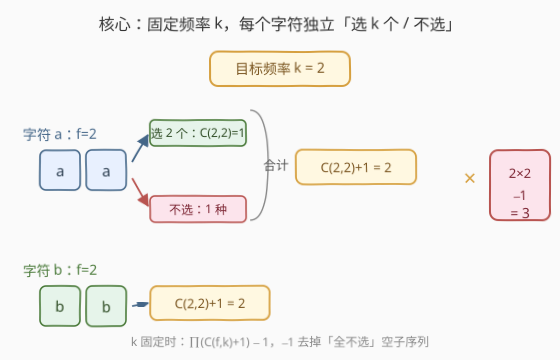
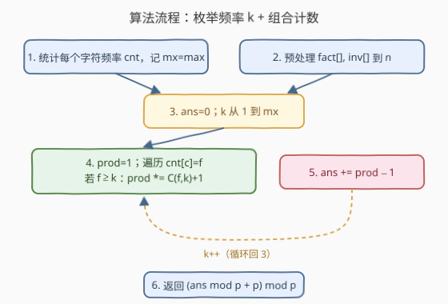
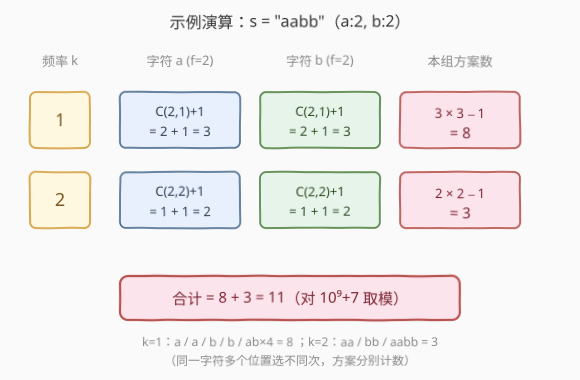

# LeetCode 好子序列的个数 题解

> ⚠️ 本题为 LeetCode **付费题**（`isPaidOnly`）。下方题意描述、示例与约束依据官方样例与题目规则整理还原，如有出入请以官方为准；算法与示例输出已用自洽代码验证。

## 1. 题目概述

- **标题 / 题号**：好子序列的个数（#2539，medium）
- **链接**：https://leetcode.cn/problems/count-the-number-of-good-subsequences/
- **难度**：中等
- **标签**：哈希表、数学、字符串、组合数学、计数

**题意**：给定字符串 `s`，统计其中**好子序列**的数目。一个子序列是「好的」当且仅当：

1. **非空**；
2. 子序列中**每个出现的字符出现次数相同**（即所有出现的字符频率一致）。

例如子序列 `"aabb"` 是好的（'a' 出现 2 次、'b' 出现 2 次）；`"aab"` 不是（'a' 出现 2 次而 'b' 仅 1 次）。子序列由原串删除若干（可为零）字符后保持相对顺序得到。答案可能很大，返回对 $10^9+7$ 取模的结果。

**示例 1**：

```text
输入：s = "aabb"
输出：11
```

**示例 2**：

```text
输入：s = "leet"
输出：12
```

**示例 3**：

```text
输入：s = "abcd"
输出：15
```

**约束**：

- $1 \le \text{s.length} \le 10^4$
- `s` 由小写英文字母组成

> 💡 **关键约束读法**：仅 26 种字符、串长至多 $10^4$，故**单字符最大频次** $mx \le 10^4$、不同字符数 $\Sigma \le 26$。子序列总数随长度指数膨胀不可枚举，必须把「计数」转化成「按公共频率 $k$ 分组 + 组合数连乘」，用预处理阶乘做到单次 $O(1)$ 取组合数。

## 2. 解题思路

### 2.1 暴力思路：枚举所有子序列

最直观是枚举 $2^n$ 个子序列、逐个判好坏。$n=10^4$ 时 $2^{10000}$ 完全不可行。即便只看「好坏」判据，子序列内部字符的频率是否相等也依赖具体选法，无法直接套 DP。必须换一个**计数视角**：不枚举具体子序列，而是按「公共频率」切片。

### 2.2 核心观察：固定频率 k + 字符独立



一个**好子序列**里每个字符都恰好出现 $k$ 次（$k \ge 1$）。于是按 $k$ 切片：固定 $k$ 后，问题变为「**每个字符独立决定是否参加，参加就贡献 $k$ 个**」。

对某个原频次为 $f$ 的字符 $c$：

- 不参加：$1$ 种（什么都不选）；
- 参加：从 $f$ 个位置里选 $k$ 个，$\binom{f}{k}$ 种。

只要 $f \ge k$，该字符就有 $\binom{f}{k}+1$ 种选择；$f<k$ 时只能不参加（贡献 $1$，乘上等于没乘）。各字符**互相独立**，由乘法原理该 $k$ 下的方案数为

$$
\text{ways}(k)=\prod_{c:\,f_c\ge k}\left(\binom{f_c}{k}+1\right).
$$

其中「全部不参加」对应所有因子取 $+1$ 那一支，即空子序列，要减去：$\text{good}(k)=\text{ways}(k)-1$。最终答案对每个 $k=1,2,\dots,mx$ 求和：

$$
\text{ans}=\sum_{k=1}^{mx}\left(\prod_{c:\,f_c\ge k}\left(\binom{f_c}{k}+1\right)-1\right)\bmod p.
$$

> 💡 **为什么这样不重不漏？** 一个好子序列的公共频率 $k$ 是唯一确定的（取任一出现字符的次数即可），故按 $k$ 切片天然**不重**；而每个「该频率下的合法子序列」都对应「每个参加字符选了 $k$ 个、不参加的字符没选」的一组独立选择，故**不漏**。「全不选」一支在每个 $k$ 下被减去，正好剔除空子序列。

### 2.3 算法流程图



```text
1. cnt[0..25] 统计每个字符频次；mx = max(cnt)
2. 预处理 fact[0..n]、inv[0..n]（逆元，用于 O(1) 取 C(f,k)）
3. ans = 0
4. for k = 1 .. mx:
5.     prod = 1
6.     for each c with cnt[c] = f:
7.         if f >= k: prod = prod * (C(f, k) + 1) mod p
8.     ans = (ans + prod - 1) mod p
9. return (ans mod p + p) mod p          # 防止减 1 后变负
```

### 2.4 示例演算



以 `s = "aabb"`（a:2, b:2，$mx=2$）为例：

| $k$ | 字符 a（$f=2$） | 字符 b（$f=2$） | 方案数 |
|-----|----------------|----------------|--------|
| 1 | $\binom{2}{1}+1 = 3$ | $\binom{2}{1}+1 = 3$ | $3\times 3 - 1 = 8$ |
| 2 | $\binom{2}{2}+1 = 2$ | $\binom{2}{2}+1 = 2$ | $2\times 2 - 1 = 3$ |
| 合计 | — | — | $8 + 3 = 11$ |

$k=1$ 时：单个 `a`（2 个位置各一种）、单个 `b`（2 种）、`ab`（选一个 a × 选一个 b = 4 种），共 $2+2+4=8$。
$k=2$ 时：`aa`、`bb`、`aabb`，共 3。

> ⚠️ **「位置不同即不同子序列」**：题目按位置区分子序列（删除的下标集不同即不同），所以 a 的两个位置选任一都算 1 个 `a`；若题目改成「不同子序列值」则需改用「不同子序列」计数套路（见第 6 节练习题 940）。

## 3. 参考代码

### C++

```cpp
class Solution {
    static constexpr int MOD = 1e9 + 7, MX = 10001;
    static long long fact[MX], invf[MX];
    static long long mpow(long long a, long long e, long long m) {
        long long r = 1;
        while (e) { if (e & 1) r = r * a % m; e >>= 1; a = a * a % m; }
        return r;
    }
    static int init() {
        fact[0] = 1;
        for (int i = 1; i < MX; ++i) fact[i] = fact[i - 1] * i % MOD;
        invf[MX - 1] = mpow(fact[MX - 1], MOD - 2, MOD);
        for (int i = MX - 2; i >= 0; --i) invf[i] = invf[i + 1] * (i + 1) % MOD;
        return 0;
    }
    static int dummy;
    static long long C(int n, int k) {
        if (k < 0 || k > n) return 0;
        return fact[n] * invf[k] % MOD * invf[n - k] % MOD;
    }
public:
    int countGoodSubsequences(string s) {
        int cnt[26]{}, mx = 0;
        for (char c : s) { int f = ++cnt[c - 'a']; mx = max(mx, f); }
        long long ans = 0;
        for (int k = 1; k <= mx; ++k) {
            long long prod = 1;
            for (int i = 0; i < 26; ++i)
                if (cnt[i] >= k)
                    prod = prod * (C(cnt[i], k) + 1) % MOD;
            ans = (ans + prod - 1) % MOD;
        }
        return (int)((ans % MOD + MOD) % MOD);
    }
};
long long Solution::fact[Solution::MX];
long long Solution::invf[Solution::MX];
int Solution::dummy = Solution::init();
```

> 💡 **实现要点**：① 用类内 `static` 数组 + `init()` 把阶乘/逆元预处理提前到程序启动时，仅做一次，多次调用 `countGoodSubsequences` 摊还为 $O(1)$。② 逆元用费马小定理 $a^{-1}\equiv a^{p-2}\pmod p$，再**从大到小**递推 `invf[i]=invf[i+1]*(i+1)`，避免对每个 $i$ 调快速幂（$O(n)$ 而非 $O(n\log p)$）。③ 末尾 `(ans%p+p)%p` 把连减可能产生的负数拉回正区间。

### Python

```python
MOD = 10**9 + 7
N = 10001
_fact = [1] * N
for i in range(1, N):
    _fact[i] = _fact[i - 1] * i % MOD
_invf = [1] * N
_invf[N - 1] = pow(_fact[N - 1], MOD - 2, MOD)
for i in range(N - 2, -1, -1):
    _invf[i] = _invf[i + 1] * (i + 1) % MOD


def C(n: int, k: int) -> int:
    if k < 0 or k > n:
        return 0
    return _fact[n] * _invf[k] % MOD * _invf[n - k] % MOD


class Solution:
    def countGoodSubsequences(self, s: str) -> int:
        cnt = [0] * 26
        mx = 0
        for ch in s:
            f = cnt[ord(ch) - 97] = cnt[ord(ch) - 97] + 1
            if f > mx:
                mx = f
        ans = 0
        for k in range(1, mx + 1):
            prod = 1
            for f in cnt:
                if f >= k:
                    prod = prod * (C(f, k) + 1) % MOD
            ans = (ans + prod - 1) % MOD
        return (ans % MOD + MOD) % MOD
```

> 💡 **对照 C++**：逻辑一致；Python 用模块级 `_fact/_invf` 预处理，`pow(..., MOD-2, MOD)` 求最大阶乘的逆元后从右往左线性递推。内层 `for f in cnt` 只遍历 26 个桶，写法更直观。

## 4. 复杂度分析

| 维度 | 复杂度 | 说明 |
|------|--------|------|
| 时间 | $O(n + \Sigma\cdot mx)$ | 频率统计 $O(n)$；双层循环 $\Sigma\le 26$ 个字符 × $mx\le n$ 种 $k$，每次 $O(1)$ 取组合数，合计 $O(\Sigma\cdot mx)$，以 $n$ 为上界即 $O(n)$ |
| 空间 | $O(n)$ | 预处理 `fact/invf` 各 $n+1$ 项；频率数组 26 项常数 |
| 对照：枚举子序列 | $O(2^n)$ | 暴力枚举全部子序列，$n=10^4$ 不可行 |

> 💡 $\Sigma=26$ 是常数，故总复杂度实际为 $O(n)$。预处理只做一次，多次查询摊还为 $O(1)$。

## 5. 面试要点

1. **为什么不能直接枚举子序列？**

   > 子序列总数 $2^n$，$n=10^4$ 时完全不可枚举；好坏判据依赖所选字符的频率是否相等，无法用单一线性 DP 直接刻画。需改为「按公共频率 $k$ 分组」的**组合计数**视角。

2. **为什么按 $k$ 切片不重不漏？**

   > 任一好子序列的公共频率 $k$ 唯一（取任一出现字符的次数），切片天然不重；每个合法子序列都唯一对应「每个参加字符选了 $k$ 个、不参加的没选」这组独立选择，乘法原理覆盖，故不漏。减去的 $1$ 正好剔除「全不选」的空子序列。

3. **每个字符为什么是 $\binom{f}{k}+1$ 而非 $\binom{f}{k}$？**

   > $+1$ 那一支表示「该字符不参加」（只此 1 种）；$\binom{f}{k}$ 表示「参加并从 $f$ 个位置选 $k$ 个」。两者并列才是该字符在固定 $k$ 下的全部选择，故因子为 $\binom{f}{k}+1$。

4. **组合数怎么在模意义下 $O(1)$ 取？**

   > 预处理 $fact[i]=i!\bmod p$ 与逆元 $invf[i]=(i!)^{-1}\bmod p$，则 $\binom{n}{k}=fact[n]\cdot invf[k]\cdot invf[n-k]\bmod p$。逆元用费马小定理 $a^{-1}\equiv a^{p-2}\pmod p$（$p$ 为质数），且只需对 $fact[N-1]$ 做一次快速幂，再从大到小 $invf[i]=invf[i+1]\cdot(i+1)$ 线性递推，整体 $O(n)$。

5. **末尾的 `(ans%p+p)%p` 与内层 `ans=(ans+prod-1)%p` 在防什么？**

   > `prod-1` 在 $prod=0$（极少见，模溢出退化为 0）时变负；C++/Python 中 `%` 对负数行为不一，故每步先模、最后再 `(x+p)%p` 把值拉回 $[0,p)$。这是模计数题防止「减法致负」的通用兜底。

> 💡 **一句话总结**：把「好子序列计数」拆成「按公共频率 $k$ 切片 + 字符独立选/不选连乘 − 空集」，用预处理阶乘 $O(1)$ 取 $\binom{f}{k}$，把 $2^n$ 枚举压成 $O(n)$ 组合计数。

## 同类练习题

| # | 题目 | 与本题的关联 |
|---|------|-------------|
| 2537 | [统计好子数组的数目](https://leetcode.cn/problems/count-the-number-of-good-subarrays/) | 同为「good 子结构计数」，但好子数组按「相等值对数」判据、用滑动窗口而非组合数；对照「连续 vs 不连续」两类 good 计数 |
| 2080 | [区间内查询数字的频率](https://leetcode.cn/problems/range-frequency-queries/)（[题解](../2001-2100/2080_区间内查询数字的频率.md)） | 同样是「按字符/数字频次」的结构，但落到区间查询，体会「频次」概念在不同场景的载体 |
| 940 | [不同的子序列 II](https://leetcode.cn/problems/distinct-subsequences-ii/)（[题解](../0901-1000/940_不同的子序列II.md)） | 子序列计数经典 DP（按「不同值」计数，含去重），对照本题「按位置计数、不去重」的口径差异 |
| 62 | [不同路径](https://leetcode.cn/problems/unique-paths/)（[题解](../0001-0100/62_不同路径.md)） | 组合数学计数的母题，$\binom{m+n-2}{m-1}$，承接本题阶乘预处理 + 模逆元的工具链 |
