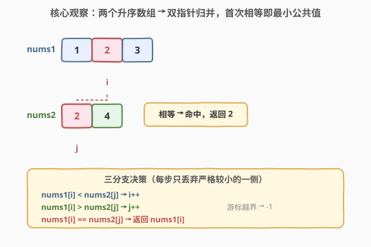
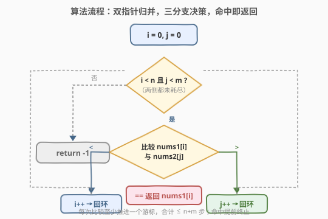
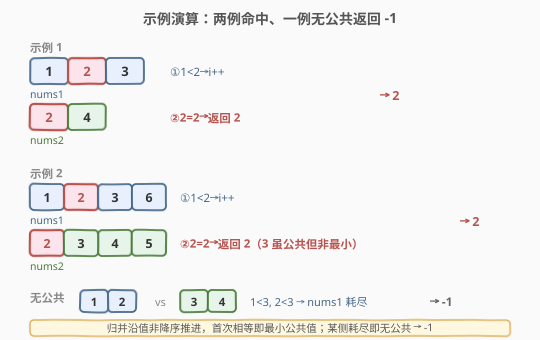

# LeetCode 最小公共值 题解

## 1. 题目概述

- **标题 / 题号**：最小公共值（#2540，easy）
- **链接**：https://leetcode.cn/problems/minimum-common-value/
- **难度**：简单
- **标签**：数组、双指针、二分查找

**题意**：给定两个已按**非降序**（升序，允许相等）排列的整数数组 `nums1` 与 `nums2`，返回它们的**最小公共整数**；若两数组无任何公共整数，返回 `-1`。

一个整数若在 `nums1` 与 `nums2` 中**各至少出现一次**，则称为两数组的公共整数。

**示例 1**：

```text
输入：nums1 = [1,2,3], nums2 = [2,4]
输出：2
解释：唯一公共元素是 2，故返回 2。
```

**示例 2**：

```text
输入：nums1 = [1,2,3,6], nums2 = [2,3,4,5]
输出：2
解释：公共元素为 2 与 3，取较小者 2。
```

**约束**：

- $1 \le \text{nums1.length}, \text{nums2.length} \le 10^5$
- $1 \le \text{nums1[i]}, \text{nums2[j]} \le 10^9$
- `nums1` 与 `nums2` 均已按**非降序**排列

> 💡 「双数组均已升序」是本题的支点。若无视此性质，可用哈希集合做到 $O(n+m)$ 但需 $O(n)$ 额外空间；利用双侧升序则可双指针归并，做到 $O(n+m)$ 时间、$O(1)$ 空间，且**首次命中即为最小值**，无需遍历全部公共元素。

## 2. 解题思路

### 2.1 暴力思路：哈希集合一次遍历

把 `nums1` 全部装入哈希集合，再依序扫描 `nums2`（已升序），遇到第一个存在于集合中的元素即返回——由于 `nums2` 升序，首个命中即最小公共值。

```python
s = set(nums1)
for x in nums2:
    if x in s:
        return x
return -1
```

时间 $O(n+m)$、空间 $O(n)$（$n = |\text{nums1}|$）。对 $10^5$ 规模可 AC，但**完全未利用「`nums2` 也已升序」**，且额外开了 $O(n)$ 哈希空间。既然两数组都升序，可用双指针把空间压到 $O(1)$。

### 2.2 核心观察：双指针归并，首次相等即最小公共值



**关键直觉**：两个升序数组就像两条已排好序的队伍。各取一个游标 $i,j$ 从队首出发，比较 $\text{nums1}[i]$ 与 $\text{nums2}[j]$：

- $\text{nums1}[i] < \text{nums2}[j]$：当前 `nums1` 的值偏小，它在 `nums2` 中不可能再有匹配（`nums2` 之后只会更大），故**丢弃 `nums1[i]`**，$i \mathrel{+}= 1$；
- $\text{nums1}[i] > \text{nums2}[j]$：对称地丢弃 `nums2[j]`，$j \mathrel{+}= 1$；
- $\text{nums1}[i] == \text{nums2}[j]$：**命中**，立即返回该值。

> 💡 **为什么首次相等就一定是最小公共值？** 归并游标沿「值的非降序」推进：每次只丢弃严格较小的一侧。设首次相等发生在值 $v$ 处。在此之前被丢弃的每个值 $u < v$ 都因「比另一侧当前值更小」而被剔除——意味着 $u$ 在另一侧数组里没有出现（否则另一侧游标会先停在某个 $\le u$ 的位置与之匹配）。因此任何 $u < v$ 都不可能同时在两数组出现，$v$ 即最小公共值。这一论证与归并排序求交集同构。

> ⚠️ 重复元素无需特殊处理：相等即返回，不会因连续重复值误判；若想列出**全部**公共值（而非最小），命中后两侧各前进一步继续归并即可（见第 5 节）。

验证两个示例：

| `nums1` | `nums2` | 归并轨迹 | 首次相等 | 输出 |
|---------|---------|----------|----------|------|
| $[1,2,3]$ | $[2,4]$ | $1<2 \to i{+}{+}$；$2=2$ | $2$ | $2$ |
| $[1,2,3,6]$ | $[2,3,4,5]$ | $1<2 \to i{+}{+}$；$2=2$ | $2$ | $2$ |

### 2.3 算法流程图



流程为一个 while 循环内的三分支决策：

1. 初始化 $i = 0, j = 0$；
2. 当 $i < n$ 且 $j < m$：
   - $\text{nums1}[i] < \text{nums2}[j]$ → $i \mathrel{+}= 1$；
   - $\text{nums1}[i] > \text{nums2}[j]$ → $j \mathrel{+}= 1$；
   - 相等 → 返回 $\text{nums1}[i]$；
3. 循环正常结束（某侧耗尽）→ 返回 $-1$。

> 💡 与归并排序的 merge 步骤同构：那里「相等时两侧都前进」以收集重复，这里「相等即返回」因只需最小值。把条件写成严格 $<$ 与 $>$，避免把 $=$ 漏入 $<$ 分支错过命中。

### 2.4 示例演算



- **示例 1** `[1,2,3]` 与 `[2,4]`：$i{=}0(1)\ \text{vs}\ j{=}0(2)$，$1<2$ → $i{=}1$；$i{=}1(2)\ \text{vs}\ j{=}0(2)$，相等 → 返回 $2$。仅需 2 步比较。
- **示例 2** `[1,2,3,6]` 与 `[2,3,4,5]`：$1<2$ → $i{=}1$；$2=2$ → 返回 $2$。虽然 $3$ 也公共，但归并首次相等的 $2$ 即最小值，提前终止。
- **无公共** `[1,2]` 与 `[3,4]`：$1<3$ → $i{=}1$；$2<3$ → $i{=}2$（`nums1` 耗尽）→ 循环结束，返回 $-1$。游标永不命中即说明两数组值域无交集。

## 3. 参考代码

### C++（双指针，$O(n+m)$ / $O(1)$）

```cpp
class Solution {
public:
    int getCommon(vector<int>& nums1, vector<int>& nums2) {
        int i = 0, j = 0, n = nums1.size(), m = nums2.size();
        while (i < n && j < m) {
            if (nums1[i] < nums2[j])      ++i;
            else if (nums1[i] > nums2[j]) ++j;
            else return nums1[i];
        }
        return -1;
    }
};
```

> 💡 三分支 `if / else if / else` 严格对应「$<$、$>$、$=$」三态，$=$ 单列避免漏命中。两游标任一越界即停，此时两数组值域已无交集，返回 $-1$。

### Python（双指针，$O(n+m)$ / $O(1)$）

```python
class Solution:
    def getCommon(self, nums1: List[int], nums2: List[int]) -> int:
        i = j = 0
        n, m = len(nums1), len(nums2)
        while i < n and j < m:
            if nums1[i] < nums2[j]:
                i += 1
            elif nums1[i] > nums2[j]:
                j += 1
            else:
                return nums1[i]
        return -1
```

> 💡 也可写成「短数组二分长数组」版（见第 5 节），在两数组长度悬殊时更快。

## 4. 复杂度分析

| 维度 | 复杂度 | 说明 |
|------|--------|------|
| **时间复杂度** | $O(n+m)$ | 每次比较至少推进一个游标，合计至多 $n+m$ 次；命中即提前终止 |
| **空间复杂度** | $O(1)$ | 仅 $i,j$ 两个游标，常数额外空间 |
| 对照：哈希集合版 | $O(n+m)$ 时间 / $O(n)$ 空间 | 未利用升序，需把 `nums1` 装入集合 |

> 💡 $O(n+m)$ 已是最优：最坏情形两数组值域无交集，必须把较短一方全部扫完才能确认无公共，至少 $\min(n,m)$ 次比较；双指针在此基础上不劣化。空间 $O(1)$ 是利用「双侧升序」相对哈希版的核心收益。

## 5. 扩展：二分变体与「列全部公共值」

**二分变体**：当 $n \ll m$（如 `nums1` 很短、`nums2` 很长）时，逐个二分 `nums2` 更划算：遍历 `nums1` 的不同值，对每个值在 `nums2` 中二分判定存在性，命中即返回。复杂度 $O(n\log m)$，当 $n\log m < n+m$ 即 $\log m < 1 + m/n$ 时更优——即 $n$ 远小于 $m$ 的悬殊场景。

```cpp
for (int x : nums1)
    if (binary_search(nums2.begin(), nums2.end(), x)) return x;
return -1;
```

> 💡 由于 `nums1` 升序，遍历即按值递增，首个命中即最小；`std::binary_search` 返回布尔存在性。若 `nums1` 含重复值，重复遍历同值仍正确（命中即返回），仅多一次二分。

**列全部公共值**：若题改为「返回所有公共整数（去重升序）」，把命中分支从「return」改为「记录后两侧各前进一步」即可：

```python
ans = []
while i < n and j < m:
    if   nums1[i] < nums2[j]: i += 1
    elif nums1[i] > nums2[j]: j += 1
    else:
        if not ans or ans[-1] != nums1[i]:  # 去重
            ans.append(nums1[i])
        i += 1; j += 1
```

这是「有序数组求交集」的标准模板，承接 349/350 交集类问题。

## 6. 面试要点

1. **为什么双指针首次相等就是最小公共值？**

   > 归并游标沿值非降序推进，每次只丢弃严格较小的一侧。被丢弃的值 $u$ 在另一侧「当前及之后」都不会出现（另一侧当前值已 $> u$），故 $u$ 非公共。首次相等的 $v$ 之前所有更小值都被剔除，$v$ 即最小公共值。

2. **重复元素怎么处理？需要去重吗？**

   > 不需。命中即返回，重复值不会造成误判。若题改求全部公共值（去重），命中后两侧各前进一步、并用「与上一答案不同」去重即可。求最小值时无需此步。

3. **何时用二分而非双指针？**

   > 当两数组长度悬殊（$n\log m < n+m$，即 `nums1` 远短于 `nums2`）时，遍历短数组、二分长数组更优。等长或接近时双指针更简洁且 $O(1)$ 空间。面试可先给双指针主解，再点出二分变体体现对数据规模差异的敏感度。

4. **哈希集合版为什么不理想？**

   > 它 $O(n)$ 空间且无视「`nums2` 已升序」的性质。虽时间同为 $O(n+m)$，但额外哈希表在 $10^5$ 规模下有常数与内存开销。双指针利用双侧有序性压到 $O(1)$ 空间，是更优解。

5. **无公共时为何返回 $-1$ 而非报错？**

   > 题目规定无公共返回 $-1$。双指针下，某侧游标越界即说明该侧剩余值都大于另一侧当前值，两数组值域已无交集——循环正常退出即此情形，统一返回 $-1$。注意元素值 $\ge 1$，故 $-1$ 不与任何合法元素冲突，是安全的哨兵。

> 💡 **一句话总结**：两个升序数组各置游标，每次推进较小一侧，**首次相等即最小公共值**立即返回，越界则 $-1$；$O(n+m)$ 时间、$O(1)$ 空间，是「归并求交集取最小」的招牌模板。

## 同类练习题

| # | 题目 | 与本题的关联 |
|---|------|-------------|
| 349 | [两个数组的交集](https://leetcode.cn/problems/intersection-of-two-arrays/)（[题解](../0301-0400/349_两个数组的交集.md)） | 去重求交集，双指针/哈希两套解法，本题「命中即返回」是其「取最小」特例 |
| 350 | [两个数组的交集 II](https://leetcode.cn/problems/intersection-of-two-arrays-ii/)（[题解](../0301-0400/350_两个数组的交集II.md)） | 含重复的交集（不去重），命中后两侧各前进一步，承接第 5 节「列全部公共值」模板 |
| 986 | [区间列表的交集](https://leetcode.cn/problems/interval-list-intersections/)（[题解](../0901-1000/986_区间列表的交集.md)） | 同样双指针归并取交集，对象是区间而非单值，对照「归并求交」的区间版 |
| 977 | [有序数组的平方](https://leetcode.cn/problems/squares-of-a-sorted-array/)（[题解](../0901-1000/977_有序数组的平方.md)） | 双数组双指针归并的另一招牌题（对撞指针合并平方值），同骨架不同目标 |
| 88 | [合并两个有序数组](https://leetcode.cn/problems/merge-sorted-array/)（[题解](../0001-0100/88_合并两个有序数组.md)） | 归并排序 merge 步骤的母题，本题的归并框架即其简化（只比较不写入） |
