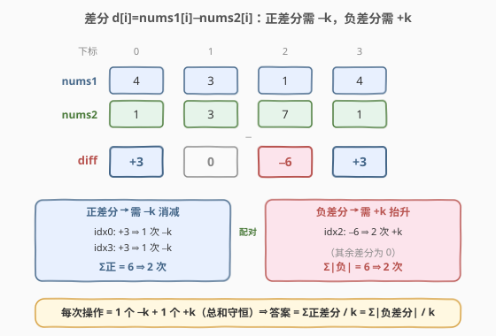
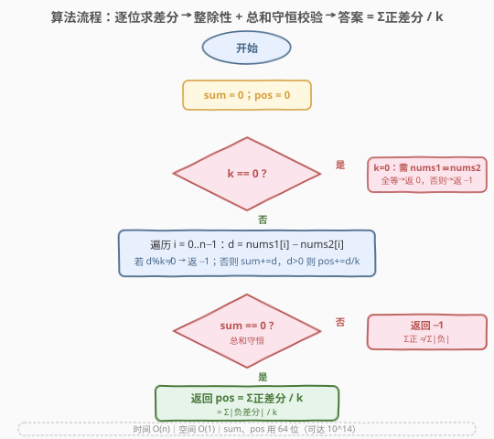

# LeetCode 使数组中所有元素相等的最小操作数 II 题解

## 1. 题目概述

- **标题 / 题号**：使数组中所有元素相等的最小操作数 II（#2541，medium）
- **链接**：https://leetcode.cn/problems/minimum-operations-to-make-array-equal-ii/
- **难度**：中等
- **标签**：贪心、数组、数学

**题意**：给定两个长度均为 $n$ 的整数数组 `nums1` 与 `nums2`，以及整数 $k$。每次**操作**：选择两个下标 $i$ 与 $j$，令 $\text{nums1}[i]$ **增加** $k$、$\text{nums1}[j]$ **减少** $k$，即

$$\text{nums1}[i] \mathrel{+}= k,\qquad \text{nums1}[j] \mathrel{-}= k.$$

若对所有 $0 \le i < n$ 都有 $\text{nums1}[i] = \text{nums2}[i]$，则称 `nums1` **等于** `nums2`。求使 `nums1` 等于 `nums2` 的**最少操作数**；若不可能则返回 $-1$。

**示例 1**：

```text
输入：nums1 = [4,3,1,4], nums2 = [1,3,7,1], k = 3
输出：2
解释：
  操作1：i=2, j=0 → nums1 = [1,3,4,4]
  操作2：i=2, j=3 → nums1 = [1,3,7,1]
```

**示例 2**：

```text
输入：nums1 = [3,8,5,2], nums2 = [2,4,1,6], k = 1
输出：-1
解释：无法使两数组相等。
```

**约束**：

- $n = \text{nums1.length} = \text{nums2.length}$
- $2 \le n \le 10^5$
- $0 \le \text{nums1}[i],\ \text{nums2}[j] \le 10^9$
- $0 \le k \le 10^5$

> 💡 关键细节：一次操作**一加一减各 $k$**，故 `nums1` 的元素**总和不变**（$+k$ 与 $-k$ 相消）。这条不变量直接决定了可行性——若 `nums1` 与 `nums2` 总和本就不等，再多操作也补不回来。最坏答案可达 $\sum |d_i|/k \approx 10^{14}$，**必须用 64 位整数**计数。

## 2. 解题思路

### 2.1 暴力思路：逐操作模拟配对

最直白的做法是**一步步模拟**：每轮在 `nums1` 中找一个仍大于目标的位（需减 $k$）与一个仍小于目标的位（需加 $k$），执行一次操作，直到全部相等或发现卡死。

设 $n = 10^5$、每个位最大需调整 $10^9/k$ 次，总操作数可达 $\sim 10^{14}$ 量级，逐操作模拟显然**不可行**——既超时（步数远超 $10^{14}$）又无法表达「谁能配谁」的全局结构。

> ⚠️ 暴力暴露的事实：我们关心的不是「具体怎么配」，而是「**总共需要多少次 $+k$、多少次 $-k$**」。一旦把视角从「逐操作」抬升到「逐位计数」，操作数就成了差分的简单求和。

### 2.2 核心观察：差分 + 总和守恒 + 整除性 ⇒ 配对计数



定义**差分** $d_i = \text{nums1}[i] - \text{nums2}[i]$，目标是把所有 $d_i$ 归零。一次操作对差分数组的影响是：某位 $+k$、另一位 $-k$。由此推出三条性质：

**① 总和守恒（可行性之一）。** 每次操作给差分数组一加一减各 $k$，$\sum d_i$ 恒定不变。而目标是全零（$\sum d_i = 0$），故**必要条件**：

$$\sum_{i} d_i = 0 \quad (\text{即} \sum \text{nums1}[i] = \sum \text{nums2}[i]).$$

若不满足，直接返回 $-1$。

**② 整除性（可行性之二）。** 每位 $d_i$ 只能按 $\pm k$ 的步长变化，要落到 $0$ 则 $d_i$ 必须是 $k$ 的整数倍。$k \ne 0$ 时：

$$d_i \equiv 0 \pmod{k}\quad \forall i.$$

若有任何一位不满足，返回 $-1$。$k = 0$ 是退化情形：步长为 $0$，无法改变任何位，故**当且仅当 `nums1` 已逐位等于 `nums2`** 时答案为 $0$，否则 $-1$。

**③ 配对计数（答案）。** 在 ①② 都满足的前提下，正差分之和必等于负差分绝对值之和（因 $\sum d_i = 0$）。每次操作恰好提供**一次 $-k$（消减一个正差分）与一次 $+k$（抬升一个负差分）**，一进一出抵消。因此

$$\boxed{\text{答案} = \sum_{d_i > 0} \frac{d_i}{k} = \sum_{d_i < 0} \frac{-d_i}{k}.}$$

（两式相等由 ① 保证。）任意一个正差分位与任意一个负差分位都能配对，无需关心具体配法——只要总量平衡，必能配完。

> 💡 这一步是本题灵魂：把「顺序相关的操作过程」压缩为「顺序无关的差分求和」。可行性靠**两条不变量**（总和守恒、整除性）一票否决，答案靠**配对计数**一步算出，全程 $O(n)$ 单趟扫描。

### 2.3 算法流程图



三阶段扫描，一趟 `for` 即可完成：

1. **$k=0$ 特判**：逐位比较 `nums1[i] == nums2[i]`，全等返 $0$，否则 $-1$。
2. **逐位求差分**：$d_i = \text{nums1}[i] - \text{nums2}[i]$；若 $d_i \bmod k \ne 0$ 立即返 $-1$；否则 `sum += d`，且 $d > 0$ 时 `pos += d / k`。
3. **总和校验**：循环结束若 `sum != 0` 返 $-1$（总和未守恒），否则返回 `pos`。

> 💡 `sum` 与 `pos` 都用 64 位：$\sum d_i$ 最坏 $n \cdot 10^9 = 10^{14}$，超 32 位 `int` 上界 $\approx 2.1\times 10^9$。

### 2.4 示例演算

![示例演算：diff=[+3,0,−6,+3]，两步操作后全归零，答案=Σ正/k=(3+3)/3=2](../images/minops2_example_walkthrough.svg)

以示例 1 为例（橙框 $=$ 本步被改动的位）：

| 阶段 | diff 数组 | 说明 |
|------|-----------|------|
| 初始 | $[+3,\ 0,\ -6,\ +3]$ | $\sum = 0$ ✓，全为 $3$ 的倍数 ✓ |
| 操作1（$i=2$ +$k$，$j=0$ −$k$） | $[0,\ 0,\ -3,\ +3]$ | 消 $1$ 单位正、$1$ 单位负 |
| 操作2（$i=2$ +$k$，$j=3$ −$k$） | $[0,\ 0,\ 0,\ 0]$ | 再消 $1$ 单位正、$1$ 单位负 |

$$\text{答案} = \frac{3 + 3}{3} = 2 \ \checkmark$$

> 💡 负差分 $-6$ 需 $2$ 次 $+k$，正差分 $3+3$ 共需 $2$ 次 $-k$，恰好两两配对。示例 2 中 $\sum d_i = 1+4+4-4 = 5 \ne 0$，**总和未守恒**，故返 $-1$。

## 3. 参考代码

### C++

```cpp
class Solution {
public:
    long long minOperations(vector<int>& nums1, vector<int>& nums2, int k) {
        int n = nums1.size();
        if (k == 0) {                       // 步长为 0：无法改变任何位
            for (int i = 0; i < n; ++i)
                if (nums1[i] != nums2[i]) return -1;
            return 0;
        }
        long long sum = 0, pos = 0;
        for (int i = 0; i < n; ++i) {
            long long d = (long long)nums1[i] - nums2[i];
            if (d % k != 0) return -1;      // 整除性：该位永远到不了 0
            sum += d;                        // 累加差分总和
            if (d > 0) pos += d / k;         // 累加需 −k 的次数
        }
        if (sum != 0) return -1;            // 总和守恒校验
        return pos;                          // = Σ正差分 / k = Σ|负差分| / k
    }
};
```

> 💡 `d` 用 `long long` 接收以避免 `int` 减法溢出（$10^9 - (-\cdot)$ 边界）。`d % k` 对负数取模：能整除时结果为 $0$（如 $-6 \bmod 3 = 0$），不影响判定。`sum`、`pos` 均 64 位。

### Python

```python
class Solution:
    def minOperations(self, nums1: List[int], nums2: List[int], k: int) -> int:
        if k == 0:
            return 0 if all(a == b for a, b in zip(nums1, nums2)) else -1
        pos = 0
        total = 0
        for a, b in zip(nums1, nums2):
            d = a - b
            if d % k != 0:          # 整除性
                return -1
            total += d             # 累加差分总和
            if d > 0:
                pos += d // k       # 累加需 −k 的次数
        return pos if total == 0 else -1
```

> 💡 Python `%` 对负数取模结果符号与除数一致（$-6 \bmod 3 = 0$、$-7 \bmod 3 = 2$），能整除即为 $0$，判定无误。`int` 任意精度无溢出。两版逻辑等价，均 $O(n)$ 时间、$O(1)$ 额外空间。

## 4. 复杂度分析

| 维度 | 复杂度 | 说明 |
|------|--------|------|
| **时间复杂度** | $O(n)$ | 单趟遍历，每步 $O(1)$（取模、加法、除法） |
| **空间复杂度** | $O(1)$ | 仅用 `sum`、`pos` 等常数个变量 |
| 对照：逐操作模拟 | $O(\text{答案} \cdot n)$ | 答案可达 $10^{14}$，不可行 |
| 对照：暴力配对 | $O(n^2)$ | 每轮扫描找正负位，仍远逊于 $O(n)$ |

> 💡 本题 $n \le 10^5$，$O(n)$ 毫秒级出解。核心在于**不模拟过程、只计数总量**，把指数级的操作序列压成一次线性扫描。

## 5. 扩展：可行性为何只需两条不变量？

**为什么「整除 + 总和守恒」就够了？** 可行的关键在于配对的**自由度**：只要正差分总量等于负差分总量，任意一个正差分位都能与任意一个负差分位配对，无需担心「凑不齐」或「卡死」。这是因为：

- 每个 $+k$ 操作的接受位（负差分）与每个 $-k$ 操作的施加位（正差分）彼此**独立**，不存在「必须先 A 后 B」的顺序约束；
- 总量平衡 $\Rightarrow$ 存在一种配对方案把所有正、负差分恰好消完（类似二分图完美匹配，但此处两边点数按 $k$ 为单位计权，权和相等即可全配）。

因此无需构造具体方案，**计数即答案**。这也是为什么本题比 1551（结构化等差数列、目标值固定为 $n$）更普适——1551 的 $O(1)$ 公式依赖数组对称性，而本题面对任意两个数组，只能靠差分线性扫描。

**与 1551 的关系。** 1551「使数组中所有元素相等的最小操作数」是 $k=1$、`nums2` 全为目标值 $n$ 的特例，且 `nums1` 是等差数列故可 $O(1)$ 求解。本题 II 代把 $k$ 参数化、目标数组任意化，丢失了闭式结构，但「搬 $1$ 单位使相等 = 计算总差额」的内核一脉相承。

> ⚠️ 若把操作改为「只能 $+k$ 不能 $-k$」（单向调整），则不再有配对自由度，需另立模型（如按目标值排序 + 前缀和）。本题的双向调整是配对计数成立的前提。

## 6. 面试要点

1. **为什么总和必须相等？不等怎么办？**

   > 一次操作 $+k$ 与 $-k$ 相消，`nums1` 总和不变。若 $\sum \text{nums1} \ne \sum \text{nums2}$，再多操作也补不回差额，直接返 $-1$。这对应差分 $\sum d_i \ne 0$。

2. **为什么每位差分必须被 $k$ 整除？**

   > 每位只能按 $\pm k$ 步长变化，要落到 $0$ 则 $d_i$ 必须是 $k$ 的倍数。若有位不整除，它永远到不了 $0$，返 $-1$。$k=0$ 时步长为 $0$，退化为「必须已相等」。

3. **答案为什么是 $\sum_{d_i>0} d_i/k$ 而非 $\sum |d_i|/k$？**

   > 每次操作同时消 $1$ 单位正差分与 $1$ 单位负差分（一 $-k$ 一 $+k$），故只计正侧（或只计负侧）即可，二者由总和守恒保证相等。若取 $\sum |d_i|/k$ 会重复计算一倍。

4. **`sum`、`pos` 会溢出吗？用什么类型？**

   > 会。$\sum d_i$ 最坏 $n \cdot 10^9 = 10^{14}$，超 32 位 `int`。C++ 用 `long long`；Python `int` 任意精度无虞。单个 $d_i$ 不超 $2\times 10^9$，但为安全用 64 位接收减法结果。

5. **$k=0$ 为何要单独处理？**

   > $k=0$ 时取模 `d % k` 是除零非法。且步长为 $0$ 意味着任何操作都不改变数组，故可行性条件退化为 `nums1` 已逐位等于 `nums2`：是则 $0$ 操作，否则 $-1$。

> 💡 **一句话总结**：双向 $\pm k$ 操作 $\Rightarrow$ 总和守恒（可行性 1）+ 差分整除 $k$（可行性 2）+ 配对自由度（答案 $= \sum_{d_i>0} d_i/k$），一趟 $O(n)$ 扫描、$O(1)$ 空间出解，全程 64 位计数。

## 同类练习题

| # | 题目 | 与本题的关联 |
|---|------|-------------|
| 2449 | [使数组相似的最少操作次数](https://leetcode.cn/problems/minimum-number-of-operations-to-make-arrays-similar/)（[题解](../2401-2500/2449_使数组相似的最少操作次数.md)） | 最贴近的兄弟题，操作 $\pm 2$（$k=2$），因奇偶不变需按奇偶分组后各自差分求和，承接本题「配对计数」思想 |
| 1551 | [使数组中所有元素相等的最小操作数](https://leetcode.cn/problems/minimum-operations-to-make-array-equal/)（[题解](../1501-1600/1551_使数组中所有元素相等的最小操作数.md)） | 本题前作，$k=1$ 且数组为等差数列，利用对称性首尾配对得 $O(1)$ 公式 $\lfloor n^2/4 \rfloor$ |
| 453 | [最小操作次数使数组元素相等](https://leetcode.cn/problems/minimum-moves-to-equal-array-elements/) | 每次让 $n-1$ 个元素 $+1$ 等价于让 $1$ 个元素 $-1$，转化为同款「搬 $1$ 单位」模型，答案 $=$ 总差额 |
| 1775 | [通过最少操作次数使数组的和相等](https://leetcode.cn/problems/equal-sum-arrays-with-minimum-number-of-operations/) | 使两数组和相等的最少操作，按可调整余量贪心配对，与本题「可行性靠守恒、答案靠配对」同构 |
| 462 | [最小操作次数使数组元素相等 II](https://leetcode.cn/problems/minimum-moves-to-equal-array-elements-ii/) | 任意数组每次改 $1$ 单位使全等，目标选中位数最优，对照「目标值选取」与「差额求和」的差异 |
