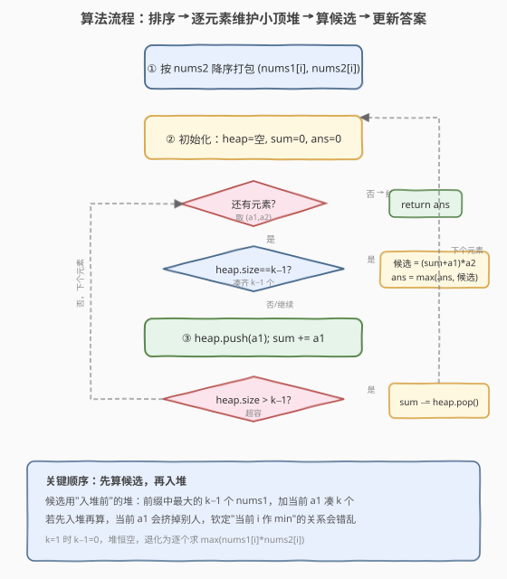

# 最大子序列的分数

- **题目名称**：最大子序列的分数
- **链接**：[2542. 最大子序列的分数](https://leetcode.cn/problems/maximum-subsequence-score/)
- **难度**：中等
- **标签**：贪心、数组、排序、堆（优先队列）

## 1. 题目概述

给定两个长度均为 $n$、下标从 $0$ 开始的整数数组 `nums1` 与 `nums2`，以及正整数 $k$。需从 `nums1` 中选一个长度为 $k$ 的**子序列**（即从 $\{0,1,\dots,n-1\}$ 中选 $k$ 个下标 $i_0,i_1,\dots,i_{k-1}$）。分数定义为：

$$
\text{score} = \Big(\sum_{j=0}^{k-1}\text{nums1}\big[i_j\big]\Big)\;\times\;\min_{j=0}^{k-1}\;\text{nums2}\big[i_j\big]
$$

返回**最大**可能的分数。

**示例 1**：

```text
输入：nums1 = [1,3,3,2], nums2 = [2,1,3,4], k = 3
输出：12
解释：选下标 {0,2,3}：(1+3+2) * min(2,3,4) = 6 * 2 = 12 为最大。
```

**示例 2**：

```text
输入：nums1 = [4,2,3,1,1], nums2 = [7,5,10,9,6], k = 1
输出：30
解释：选下标 {2}：3 * 10 = 30。
```

**约束条件**：

- $n = \text{nums1.length} = \text{nums2.length}$
- $1 \le n \le 10^5$
- $0 \le \text{nums1}[i],\;\text{nums2}[j] \le 10^5$
- $1 \le k \le n$

> ⚠️ **数值规模读法**：$n$ 达 $10^5$，组合数 $\binom{n}{k}$ 是天文数字，**枚举所有 $k$-子序列必然超时**；必须找到能把"选谁当 $\min(\text{nums2})$"与"配哪些 $\text{nums1}$"解耦的单调结构。

---

## 2. 解题思路

### 2.1 暴力思路：枚举所有 $k$-子序列

最直观：在 $n$ 个下标中枚举所有 $\binom{n}{k}$ 个大小为 $k$ 的子集，每个集合 $O(k)$ 求和与最小值。$n=10^5$ 时 $\binom{n}{k}$ 呈指数级，彻底不可行。即便 $k=3$、$n=10^5$ 也有 $\sim 1.6\times 10^{14}$ 个组合，超时。瓶颈在于"选哪 $k$ 个"被当成整体搜索。

### 2.2 核心观察：固定 $\min(\text{nums2})$ + 前缀取 $\text{nums1}$ 之 Top-$(k{-}1)$

![核心观察：按 nums2 降序排列，处理到 i 时之前都已 ≥ nums2[i]，用小顶堆保留前缀里最大的 k-1 个 nums1](../images/maxsubscore_concept.svg)

分数是「$\text{nums1}$ 之和 $\times$ $\text{nums2}$ 之最小」的乘积。把目光盯在**那个 $\min(\text{nums2})$ 来自哪个下标**：

- 若**钦定**第 $i$ 个元素是子序列里 $\text{nums2}$ 最小的，则子序列中其余 $k-1$ 个下标必须满足 $\text{nums2}[\cdot] \ge \text{nums2}[i]$（否则 $i$ 就不是最小了）；
- 在这一约束下，要让 $\text{nums1}$ 之和最大，就应**在所有 $\text{nums2} \ge \text{nums2}[i]$ 的下标里挑 $\text{nums1}$ 最大的 $k-1$ 个**，并固定把 $i$ 自己算进去（共 $k$ 个）。

把下标按 $\text{nums2}$ **降序**排列后扫描：处理到第 $i$ 个时，**已扫描过**的下标 $\text{nums2}$ 都 $\ge \text{nums2}[i]$,它们就是"合法候选"。再用一个**小顶堆**（容量 $k-1$）实时维护"前缀中最大的 $k-1$ 个 $\text{nums1}$"——堆满即得一个候选答案 $\big(\text{sum}_\text{堆}+\text{nums1}[i]\big)\times\text{nums2}[i]$。

> 💡 **为什么是降序而不是升序？** 降序扫描保证"当前 $i$ 是子序列里 $\text{nums2}$ 的最小"——之前扫过的都 $\ge$ 它，所以它们对 $\text{nums2}$ 的 $\min$ 不产生更小的影响，$\min$ 就是 $\text{nums2}[i]$ 自身。这正是"按某个量排序 + 用堆维护前缀 Top"的招牌套路，与 [857. 雇佣 K 名工人的最低成本](https://leetcode.cn/problems/minimum-cost-to-hire-k-workers/)（按 quality 比 降序 + 维护最大 quality 之和）同构。

### 2.3 算法流程图



```text
把 (nums1[i], nums2[i]) 按 nums2 降序打包成数组 seq
heap = 空小顶堆;  sum = 0;  ans = 0
for (a1, a2) in seq:
    if heap.size == k - 1:                  # 凑齐 k-1 个大 nums1
        ans = max(ans, (sum + a1) * a2)      # 当前 a2 即 min(nums2)
    heap.push(a1); sum += a1
    if heap.size > k - 1:                    # 保持容量 k-1，淘汰最小
        sum -= heap.pop()
return ans
```

> ⚠️ **细节**：① 计算候选时用的是**入堆之前**的 `heap`（不含当前 $a_1$），保证"自己 + 前 $k-1$ 个最大"恰好 $k$ 个；算完才把当前 $a_1$ 入堆供后续使用。② $k=1$ 时 $k-1=0$，堆恒空，退化为逐个算 $\text{nums1}[i]\times\text{nums2}[i]$ 取最大，逻辑自洽。③ $\text{nums2}$ 取值可重，降序后相同值之间的相对顺序不影响正确性：任何一个被钦定为 $\min$ 都能用其后的同值候选补充。

### 2.4 示例演算

![示例演算：nums1=[1,3,3,2], nums2=[2,1,3,4], k=3，逐元素入堆并算候选](../images/maxsubscore_example_walkthrough.svg)

按 $\text{nums2}$ 降序排得序列（下标 → $\text{nums1},\text{nums2}$）：$i=3(2,4)\to i=2(3,3)\to i=0(1,2)\to i=1(3,1)$。$k-1=2$。

| 步 | 当前 $(a_1,a_2)$ | 入堆前堆（容量 2） | sum | 候选 $(\text{sum}+a_1)\times a_2$ | 入堆后堆（弹后） |
|----|------------------|--------------------|-----|----------------------------------|------------------|
| 1 | $(2,4)$ | — | 0 | 堆未满，跳过 | $\{2\}$ |
| 2 | $(3,3)$ | $\{2\}$ | 2 | 堆未满，跳过 | $\{2,3\}$ |
| 3 | $(1,2)$ | $\{2,3\}$ | 5 | $(5+1)\times2=\mathbf{12}$ | 入 1 → $\{1,2,3\}$ → 弹 1 → $\{2,3\}$ |
| 4 | $(3,1)$ | $\{2,3\}$ | 5 | $(5+3)\times1=8$ | 入 3 → 弹 2 → $\{3,3\}$ |

最大候选为 $\mathbf{12}$，与示例 1 一致。关键在第 3 步：钦定 $i=0$ 的 $\text{nums2}=2$ 作 $\min$，从前面 $\ge 2$ 的里取 $\text{nums1}$ 最大的两个 $3,3$（来自 $i=2,i=3$）配成 $k=3$ 个。

---

## 3. 参考代码

### C++

```cpp
class Solution {
public:
    long long maxScore(vector<int>& nums1, vector<int>& nums2, int k) {
        int n = nums1.size();
        vector<int> idx(n);
        iota(idx.begin(), idx.end(), 0);
        sort(idx.begin(), idx.end(),
             [&](int a, int b) { return nums2[a] > nums2[b]; });

        priority_queue<int, vector<int>, greater<int>> pq;  // 小顶堆，容量 k-1
        long long sum = 0, ans = 0;
        for (int i : idx) {
            int a1 = nums1[i], a2 = nums2[i];
            if ((int)pq.size() == k - 1) {                 // 凑齐 k-1 个大 nums1
                ans = max(ans, (sum + a1) * a2);
            }
            pq.push(a1);
            sum += a1;
            if ((int)pq.size() > k - 1) {                   // 保持容量 k-1
                sum -= pq.top();
                pq.pop();
            }
        }
        return ans;
    }
};
```

> 💡 **实现要点**：① 用下标数组 `idx` 排序而非重新打包 pair，省一次内存分配；`greater<int>` 把 `priority_queue` 转成小顶堆。② `ans` 用 `long long`：$(\sum\text{nums1})\le 10^5\times 10^5=10^{10}$，再乘 $\text{nums2}\le 10^5$ 理论上界 $\sim 10^{15}$，超 `int` 范围。③ 计算候选**先于**入堆，见 2.3 细节①。

### Python

```python
import heapq

class Solution:
    def maxScore(self, nums1: list[int], nums2: list[int], k: int) -> int:
        n = len(nums1)
        idx = sorted(range(n), key=lambda i: nums2[i], reverse=True)
        pq = []           # 小顶堆，容量 k-1
        s = 0
        ans = 0
        for i in idx:
            a1, a2 = nums1[i], nums2[i]
            if len(pq) == k - 1:                     # 凑齐 k-1 个大 nums1
                ans = max(ans, (s + a1) * a2)
            heapq.heappush(pq, a1)
            s += a1
            if len(pq) > k - 1:                      # 保持容量 k-1
                s -= heapq.heappop(pq)
        return ans
```

> 💡 **对照 C++**：逻辑一致；Python 的 `heapq` 是小顶堆，`heappush/heappop` 各 $O(\log k)$。Python 整数任意精度无溢出之忧，但返回类型按题意为 `int`。

---

## 4. 复杂度分析

| 维度 | 复杂度 | 说明 |
|------|--------|------|
| 时间 | $O(n\log n)$ | 按 $\text{nums2}$ 排序 $O(n\log n)$；扫描一遍每人入堆、出堆各至多一次 $O(n\log k)$，取大者 |
| 空间 | $O(n)$ | 下标数组 $O(n)$；小顶堆 $O(k)$ |
| 对照：枚举子序列 | $O\!\big(\binom{n}{k}\cdot k\big)$ | 组合爆炸，$n=10^5$ 不可行 |

> 💡 当 $k$ 较小（如 $k\le 10^2$）时，堆部分 $O(n\log k)$ 远小于排序 $O(n\log n)$；瓶颈在排序。若数据已按 $\text{nums2}$ 降序，可降到 $O(n\log k)$。

---

## 5. 扩展：同构题 [857. 雇佣 K 名工人的最低成本]

本题与 [857. 雇佣 K 名工人的最低成本](https://leetcode.cn/problems/minimum-cost-to-hire-k-workers/) 结构同构：

- 857：工人有 $\text{quality}$ 与 $\text{wage}$，需选 $k$ 人，每人按 $\text{ratio}=\text{wage}/\text{quality}$ 给薪，总成本 $=\text{ratio}_\max\times\sum\text{quality}$，求**最小**总成本。
- 按 $\text{ratio}$ **升序**扫描，钦定当前 ratio 为最大，用**大顶堆淘汰最大 quality** 维护"前缀中 quality 之和最小的 $k$ 个"——方向相反但套路一致：**排序定极值 + 堆维护前缀 Top**。

| 对照 | 本题 2542 | 857 |
|------|-----------|-----|
| 目标 | **最大化** 分数 | **最小化** 成本 |
| 排序 | $\text{nums2}$ **降序** | $\text{ratio}$ **升序** |
| 钦定的极值 | $\min(\text{nums2})=$ 当前 | $\max(\text{ratio})=$ 当前 |
| 堆方向 | 小顶堆，淘汰**最小** $\text{nums1}$，留最大 $k{-}1$ | 大顶堆，淘汰**最大** $\text{quality}$，留最小 $k$ |
| 答案 | $\max$ over 候选 | $\min$ over 候选 |

把"求 max"翻成"求 min"、"降序"翻成"升序"、"小顶堆"翻成"大顶堆"，即在本题与 857 间互译。

---

## 6. 面试要点

1. **为什么要按 $\text{nums2}$ 降序排序？**

   > 降序保证处理到第 $i$ 个时，之前扫过的下标 $\text{nums2}$ 都 $\ge \text{nums2}[i]$,它们可作"不破坏 $i$ 为最小"的合法候选；当前 $i$ 的 $\text{nums2}$ 恰好是子序列里 $\text{nums2}$ 的最小值。这样把"选谁当 $\min$"与"配哪些 $\text{nums1}$"解耦：前者靠排序顺序，后者靠堆。

2. **小顶堆为什么能维护"前缀里最大的 $k-1$ 个"？**

   > 维护容量 $k-1$ 的小顶堆：堆顶是当前堆内最小者。新来一个数若使堆超容，弹出堆顶（即当前 $k$ 个里最小的），剩下的总是"已见过的最大的 $k-1$ 个"。这是 Top-K 经典套路，$O(\log k)$ 每次。

3. **候选计算与入堆的先后顺序为何要颠倒？**

   > 计算候选用"入堆前的堆"：堆里是前缀（不含当前）的最大 $k-1$ 个 $\text{nums1}$，加当前 $a_1$ 凑成 $k$ 个，$\text{nums2}$ 最小即 $a_2$。若先入堆再算，当前 $a_1$ 可能挤掉别人、堆和不再是"其余 $k-1$ 个最大"，钦定关系错乱。

4. **$k=1$、$k=n$ 的边界？**

   > $k=1$：$k-1=0$，堆恒空，每步算 $a_1\times a_2$ 取最大——等价于对配对取最大乘积。$k=n$：必须全选，$\min(\text{nums2})$ 是全数组最小，和是全数组之和，排序扫描到最后一项堆才有 $n-1$ 个元素，恰好算出唯一候选，正确。

5. **$\text{nums2}$ 有重复值时正确吗？**

   > 正确。降序后相同 $\text{nums2}$ 相邻，任何一个被钦定为 $\min$ 时，其后的同值候选 $\text{nums2}$ 相等 $\ge$ 它（非严格），仍合法；不同钦定点产生的候选里取最大即可，不会漏解也不会重复计数。

> 💡 **一句话总结**：按 $\text{nums2}$ 降序扫，小顶堆维护前缀里最大的 $k-1$ 个 $\text{nums1}$，每个位置算 $(\text{sum}+\text{nums1}[i])\times\text{nums2}[i]$ 取最大——把指数级子序列搜索压成 $O(n\log n)$。

---

## 7. 同类练习题

- [857. 雇佣 K 名工人的最低成本](https://leetcode.cn/problems/minimum-cost-to-hire-k-workers/)：结构同构（排序定极值 + 堆维护前缀 Top），方向相反求最小，详见第 5 节对照
- [1383. 最大的团队表现值](https://leetcode.cn/problems/maximum-performance-of-a-team/)：按效率降序 + 小顶堆维护 speed 之 Top-$(k{-}1)$，几乎与本题一比一镜像
- [23. 合并 K 个升序链表](https://leetcode.cn/problems/merge-k-sorted-lists/)：小顶堆做 K 路归并的"取最小"，熟悉堆作为"实时维护极值/Top-K"的通用工具
- [215. 数组中的第 K 个最大元素](https://leetcode.cn/problems/kth-largest-element-in-an-array/)：小顶堆容量 $k$ 维护 Top-K，本题堆用法的入门版
- [347. 前 K 个高频元素](https://leetcode.cn/problems/top-k-frequent-elements/)：哈希计数 + 小顶堆容量 $k$ 取 Top-K，堆维护前缀/全局 Top 的范式
