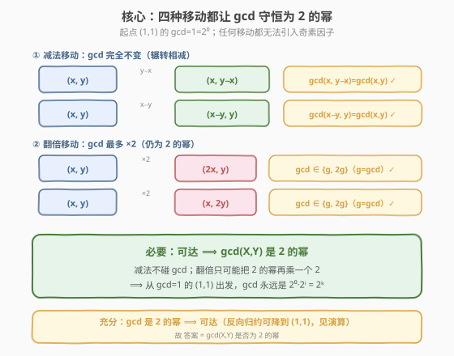
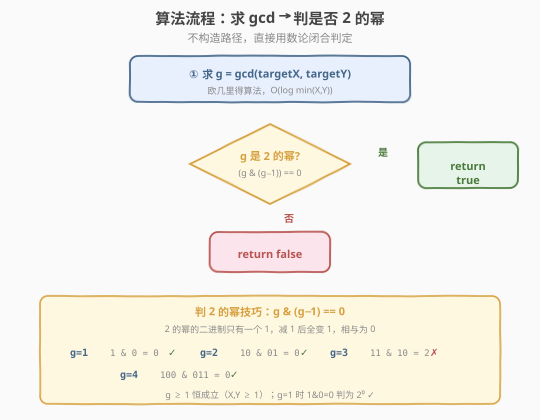
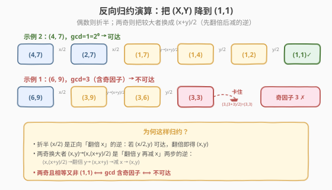

# LeetCode 判断一个点是否可以到达 题解

## 1. 题目概述

- **标题 / 题号**：判断一个点是否可以到达（#2543，hard）
- **链接**：https://leetcode.cn/problems/check-if-point-is-reachable/
- **难度**：困难
- **标签**：数学、数论、辗转相减、最大公约数

**题意**：在一个无穷大的网格图上，初始位于 $(1, 1)$，需要通过有限步移动到达点 $(\text{targetX}, \text{targetY})$。**每一步**可从 $(x, y)$ 转移到下列四点之一：

- $(x,\ y - x)$（把 $x$ 从 $y$ 里减掉）
- $(x - y,\ y)$（把 $y$ 从 $x$ 里减掉）
- $(2x,\ y)$（$x$ 翻倍）
- $(x,\ 2y)$（$y$ 翻倍）

给定 `targetX`、`targetY`，能到达返回 `true`，否则返回 `false`。

**示例 1**：

```text
输入：targetX = 6, targetY = 9
输出：false
解释：没法从 (1,1) 出发到达 (6,9)。
```

**示例 2**：

```text
输入：targetX = 4, targetY = 7
输出：true
解释：(1,1) → (1,2) → (1,4) → (1,8) → (1,7) → (2,7) → (4,7)
```

**约束**：

- $1 \le \text{targetX},\ \text{targetY} \le 10^9$

> ⚠️ 注意三点：① 四种移动里**两种做减法、两种做翻倍**，坐标可增可减，不能简单按「只增」剪枝；② 翻倍会让坐标指数增长，正向搜索分支因子为 $4$，到 $10^9$ 量级会指数膨胀；③ 减法移动会**保持 $\gcd$ 不变**，翻倍移动**最多给 $\gcd$ 乘一个 $2$**——这一不对称正是破题钥匙。

## 2. 解题思路

### 2.1 暴力思路：正向 BFS

最直白的做法：从 $(1, 1)$ 出发正向 BFS，每步枚举四种转移，用 `visited` 集合判重，直到命中 $(\text{targetX}, \text{targetY})$。

问题有二：**分支因子 $4$**，且翻倍让坐标膨胀极快，到 $10^9$ 大约只需 $\sim 30$ 次翻倍，但中途状态数 $4^{30}$ 量级完全不可枚举；减法分支还可能在原点附近反复横跳，`visited` 集合本身也会爆炸。最坏情形搜索完全不可行。

> 💡 正向发散提示我们换视角：不要「从 $(1,1)$ 试着生成 $(X,Y)$」，而要问「$(X,Y)$ 能被生成，需要它**具备什么不变的结构**」。$\gcd$ 恰是贯穿四种移动的不变量——下面先证**必要性**（可达 $\Rightarrow$ $\gcd$ 是 $2$ 的幂），再给**充分性**（反向归约能把 $(X,Y)$ 降到 $(1,1)$）。

### 2.2 核心观察：四种移动让 gcd 守恒为 2 的幂



记 $g = \gcd(x, y)$。逐一考察四种移动对 $g$ 的影响：

**减法移动——$\gcd$ 完全不变。** 由欧几里得恒等式 $\gcd(x, y) = \gcd(x,\ y - x)$（辗转相减的核心），

$$
\gcd(x,\ y - x) = \gcd(x, y), \qquad \gcd(x - y,\ y) = \gcd(x, y).
$$

**翻倍移动——$\gcd$ 最多乘 $2$。** 设 $g = \gcd(x, y)$，写 $x = g a,\ y = g b$，其中 $\gcd(a, b) = 1$。则

$$
\gcd(2x,\ y) = \gcd(2 g a,\ g b) = g \cdot \gcd(2a,\ b).
$$

因 $\gcd(a, b) = 1$，任何同时整除 $2a$ 与 $b$ 的数都必整除 $2$（$b$ 与 $a$ 互素，公共因子只能来自 $2$），故 $\gcd(2a, b) = \gcd(2, b) \in \{1, 2\}$。于是

$$
\gcd(2x,\ y) = g \cdot \{1 \text{ 或 } 2\} = \{g,\ 2g\}.
$$

对称地 $\gcd(x,\ 2y) = \{g,\ 2g\}$。

**必要性的结论。** 起点 $(1, 1)$ 的 $\gcd = 1 = 2^0$。四种移动要么让 $g$ **不变**，要么把 $g$ **乘一个 $2$**——无论怎样，$g$ 始终是 $2$ 的幂。故

$$
\text{可达} \ \Longrightarrow\ \gcd(\text{targetX}, \text{targetY}) \text{ 是 } 2 \text{ 的幂}.
$$

> 💡 直觉：减法是「辗转相减」，不会引入任何新因子；翻倍是「在二进制末尾添一个 $0$」，只能给 $\gcd$ 追加因子 $2$。两种操作都无法制造奇素因子。因此若目标坐标共享一个奇素因子（如 $(6,9)$ 共享 $3$），它就永远无法从全是 $1$ 的起点长出来——这正是示例 1 返回 `false` 的根因。

### 2.3 算法流程图



由 2.2 的不变量分析 + 2.4 的反向归约（充分性），可得闭合判定：

$$
\text{可达} \ \Longleftrightarrow\ \gcd(\text{targetX}, \text{targetY}) \text{ 是 } 2 \text{ 的幂}.
$$

于是算法只有两步：

1. 用欧几里得算法求 $g = \gcd(\text{targetX}, \text{targetY})$；
2. 判 $g$ 是否为 $2$ 的幂：`g & (g - 1) == 0`。

> 💡 **判 $2$ 的幂的位运算技巧**：$2$ 的幂的二进制形如 $100\ldots 0$（只有一个 $1$），减 $1$ 后变为 $011\ldots 1$，两者按位与为 $0$。验证：$g=1(1)\to 1\&0=0$ ✓；$g=2(10)\to 10\&01=0$ ✓；$g=3(11)\to 11\&10=10\ne0$ ✗；$g=4(100)\to 100\&011=0$ ✓。$g \ge 1$ 恒成立（$X, Y \ge 1$），无需额外判 $g > 0$。

### 2.4 示例演算：反向归约



为说明**充分性**（$\gcd$ 是 $2$ 的幂 $\Rightarrow$ 可达），把目标 $(X, Y)$ 用「正向移动的逆」一步步降到 $(1, 1)$——只要归约到的状态可达，原点就可达。

**两条归约规则**（均严格减小 $\max(X,Y)$）：

- **某坐标为偶**：折半。若 $X$ 偶，$(X, Y) \leftarrow (X/2, Y)$（正向「翻倍 $x$」的逆）；$Y$ 偶对称。
- **两坐标皆奇且不相等**：把较大者换成 $(X+Y)/2$。若 $Y > X$，$(X, Y) \leftarrow (X, (X+Y)/2)$——它正是正向「先翻倍 $y$、再用 $x$ 去减」两步的逆：$(X, (X{+}Y)/2) \xrightarrow{\times 2 y} (X, X{+}Y) \xrightarrow{y - x} (X, Y)$。$X > Y$ 时对称。

**示例 2：$(4, 7)$，$\gcd=1=2^0$** ——一路降到 $(1,1)$：

| 状态 | 规则 | 下一状态 | 说明 |
|------|------|----------|------|
| $(4,7)$ | $X$ 偶 | $(2,7)$ | 折半 $x$ |
| $(2,7)$ | $X$ 偶 | $(1,7)$ | 折半 $x$ |
| $(1,7)$ | 两奇、$Y>X$ | $(1,4)$ | $Y \to (1{+}7)/2 = 4$ |
| $(1,4)$ | $Y$ 偶 | $(1,2)$ | 折半 $y$ |
| $(1,2)$ | $Y$ 偶 | $(1,1)$ | 折半 $y$ ✓ |

归约到 $(1,1)$ ⟹ 可达 ✓（正向路径即题面给的 $(1,1)\to(1,2)\to(1,4)\to(1,8)\to(1,7)\to(2,7)\to(4,7)$）。

**示例 1：$(6, 9)$，$\gcd=3$（含奇因子）** ——卡在 $(3,3)$：

| 状态 | 规则 | 下一状态 |
|------|------|----------|
| $(6,9)$ | $X$ 偶 | $(3,9)$ |
| $(3,9)$ | 两奇、$Y>X$ | $(3,6)$（$Y\to(3{+}9)/2=6$） |
| $(3,6)$ | $Y$ 偶 | $(3,3)$ |
| $(3,3)$ | 两奇但相等、非 $(1,1)$ | 卡住 ✗ |

$(3,3)$ 两奇相等且非 $(1,1)$：$(3,(3{+}3)/2) = (3,3)$ 无变化，无法继续归约。这正是 $\gcd$ 含奇因子 $3$ 的体现——由必要性，含奇因子的点不可达，故返回 `false` ✓。

> 💡 归约的不变量是「$\gcd$ 中 $2$ 的幂部分被逐步剥离、奇数部分保持不变」。当 $\gcd$ 是 $2$ 的幂（奇数部分 $=1$），归约必终止于 $(1,1)$；当 $\gcd$ 含奇素因子 $p$，归约终止于 $(p, p) \ne (1,1)$。两种结局恰好对应可达 / 不可达。注意这只是**证明工具**，代码并不运行归约（它最坏线性慢），而是直接算 $\gcd$ 再判 $2$ 的幂。

## 3. 参考代码

### C++

```cpp
class Solution {
public:
    bool isReachable(int targetX, int targetY) {
        int g = gcd(targetX, targetY);
        return (g & (g - 1)) == 0;     // g 是否为 2 的幂
    }
};
```

> 💡 C++17 起标准库提供 `std::gcd`（`<numeric>`），也可手写。`targetX, targetY ≤ 10^9 < 2^31 - 1`，`int` 装得下；`g & (g - 1)` 在 `int` 上安全。`g = 1` 时 `1 & 0 == 0` 判为 $2^0$，正确。

### Python

```python
class Solution:
    def isReachable(self, targetX: int, targetY: int) -> bool:
        g = math.gcd(targetX, targetY)
        return (g & (g - 1)) == 0       # g 是否为 2 的幂
```

> 💡 Python `math.gcd` 返回非负整数，`int` 任意精度无溢出之忧。两版逻辑等价，均 $O(\log \min(X, Y))$ 时间、$O(1)$ 空间。

## 4. 复杂度分析

| 维度 | 复杂度 | 说明 |
|------|--------|------|
| **时间复杂度** | $O(\log \min(X, Y))$ | 欧几里得算法求 $\gcd$ 的次数；$\max = 10^9$ 时约 $30$ 次取模 |
| **空间复杂度** | $O(1)$ | 仅几个整型变量，无递归栈、无集合 |
| 对照：正向 BFS | 指数 / 状态爆炸 | 分支因子 $4$，翻倍到 $10^9$ 需 $\sim 30$ 步，状态数 $4^{30}$ 量级不可行 |
| 对照：反向逐次归约 | 最坏 $O(\max(X,Y))$ | 两奇换 $(X{+}Y)/2$ 在 $\lvert X-Y\rvert=2$ 时每次只让 $\max$ 减 $1$，故只作证明、不作代码 |

> 💡 把「可达性搜索」压成「一次 $\gcd$ + 一次位运算」是本题的精髓：用**数论不变量**代替**状态枚举**。与 [780. 到达终点](../0701-0800/780_到达终点.md) 用「辗转相减取模」把正向搜索压成 $O(\log)$ 同属一族，只是 780 是加法版（倒推前驱唯一），2543 是「减法 + 翻倍」版（用 $\gcd$ 守恒给闭合解）。

## 5. 扩展：充分性证明与为何归约必终止

**充分性命题**：若 $\gcd(X, Y) = 2^k$，则 $(X, Y)$ 可达。

**证明（反向归约）**：对 $(X, Y)$ 反复施 2.4 的两条规则，每步都让结果状态成为「正向可达 $(X,Y)$ 的前驱」——即若结果可达，则 $(X,Y)$ 可达。需证两件事：

1. **每步严格减小 $\max(X,Y)$**：折半把某坐标减半，显然减小；两奇换大者时，$\max$ 从 $\max(X,Y)$ 变为 $(X+Y)/2$，而 $\min(X,Y) < \max(X,Y)$ 保证 $(X+Y)/2 < \max(X,Y)$。故 $\max$ 严格递减，归约必终止。
2. **终止态恰为 $(1,1)$**：终止只能是「无法折半（两奇）且无法换大者（两数相等）」，即两奇相等。设终止于 $(p, p)$。归约保持「$\gcd$ 的奇数部分」不变（折半只动 $2$ 的因子；两奇换 $(X{+}Y)/2$ 时 $\gcd(X, (X{+}Y)/2) = \gcd(X, X{+}Y) = \gcd(X, Y)$，因 $X$ 奇故 $\gcd(X,2)=1$）。已知初始 $\gcd(X,Y)$ 的奇数部分为 $1$，故终止态 $p = 1$，即 $(1,1)$。

由 $(1,1)$ 显然可达（起点本身），沿归约链反向施加正向移动即得 $(X,Y)$ 可达。$\blacksquare$

**反向命题（不可达判定）**：若 $\gcd(X,Y)$ 含奇素因子，由 2.2 的必要性（可达 $\Rightarrow$ $\gcd$ 是 $2$ 的幂）的逆否，直接得不可达。归约会终止于 $(p, p)$（$p$ 为 $\gcd$ 的奇数部分 $>1$），可视化为「卡住」。

> ⚠️ **一个易错点**：两奇换大者的规则只适用于**两奇且不相等**。若两奇相等又非 $(1,1)$（如 $(3,3)$），说明 $\gcd$ 含奇因子，应判不可达；若硬套规则会得到 $(3,(3{+}3)/2)=(3,3)$ 原地不动、陷入死循环。代码里不跑归约故无此坑，但手算时勿误用。

## 6. 面试要点

1. **为什么答案是「$\gcd$ 是 $2$ 的幂」？给出一句话直觉。**

   > 减法移动是辗转相减、$\gcd$ 一动不动；翻倍移动是二进制末尾添 $0$、只能给 $\gcd$ 追加因子 $2$。从 $\gcd=1$ 的 $(1,1)$ 出发，$\gcd$ 永远是 $2$ 的幂；反过来任何 $\gcd$ 为 $2$ 的幂的点都能反向归约回 $(1,1)$。故可达 $\Leftrightarrow$ $\gcd$ 是 $2$ 的幂。

2. **请证明翻倍移动后 $\gcd$ 仍是 $2$ 的幂（若原来是）。**

   > 设 $g = \gcd(x,y) = 2^k$，$x = ga,\ y = gb,\ \gcd(a,b)=1$。则 $\gcd(2x, y) = g \cdot \gcd(2a, b)$。因 $\gcd(a,b)=1$，$\gcd(2a, b) = \gcd(2, b) \in \{1, 2\}$。故 $\gcd(2x,y) \in \{g, 2g\} = \{2^k, 2^{k+1}\}$，仍是 $2$ 的幂。

3. **如何不用位运算判 $2$ 的幂？**

   > 不断除以 $2$ 直到奇数：若最终为 $1$ 则是 $2$ 的幂，若 $>1$ 则含奇因子。但 `g & (g-1) == 0` 是 $O(1)$ 最快写法；也可 `g > 0 && (g & -g) == g`（取最低有效位）。注意 $g \ge 1$ 恒成立，不必判零。

4. **为什么不直接反向归约写代码？**

   > 归约最坏 $O(\max(X,Y))$：两奇换 $(X+Y)/2$ 在 $\lvert X-Y\rvert = 2$ 时每次只让 $\max$ 减 $1$（如 $(3,5)\to(3,4)\to(3,2)\to(3,1)\to(2,1)\to(1,1)$，$\max$ 从 $5$ 降到 $1$ 走了 $5$ 步），$10^9$ 量级会超时。归约只是**充分性证明工具**，代码用 $\gcd$ 一次取模级求解即可。

5. **本题与 780「到达终点」有何异同？**

   > 780 是「加法」版：正向 $(x,y)\to(x+y,y)/(x,x+y)$，逆向每步前驱唯一（较大坐标是被加大的），用取模把辗转相减压成 $O(\log)$，判的是能否精确命中起点。2543 是「减法 + 翻倍」版：正向含减法（逆向变加法，不收敛），故不能套 780 的逆向取模；转而用「$\gcd$ 守恒为 $2$ 的幂」给闭合解。两者都用数论不变量代替搜索，但所求的闭合量不同。

> 💡 **一句话总结**：减法保 $\gcd$、翻倍只可能给 $\gcd$ 乘 $2$ ⟹ 可达点 $\gcd$ 必为 $2$ 的幂；反向归约证明其充分性 ⟹ 答案 $=$ `gcd(X,Y) & (gcd(X,Y)-1) == 0`，$O(\log)$ 出解。

## 同类练习题

| # | 题目 | 与本题的关联 |
|---|------|-------------|
| 780 | [到达终点](https://leetcode.cn/problems/reaching-points/)（[题解](../0701-0800/780_到达终点.md)） | 辗转相减 / 取模母题，加法二变量版，逆向每步前驱唯一；与本题「减法 + 翻倍」版同属「数论代替搜索」一族，但闭合量不同（780 判精确命中、2543 判 $\gcd$ 为 $2$ 的幂） |
| 1250 | [检查「好数组」](https://leetcode.cn/problems/check-if-it-is-a-good-array/) | 用整体 $\gcd = 1$ 判定可达性，与本题「$\gcd$ 是 $2$ 的幂」同属「$\gcd$ 闭合判定」范式 |
| 365 | [水壶问题](https://leetcode.cn/problems/water-and-jug-problem/) | Bézout 定理用 $\gcd$ 整除目标量判可达，把 BFS 压成 $O(\log)$，与本题「不变量代替搜索」同源 |
| 1071 | [字符串的最大公因子](https://leetcode.cn/problems/greatest-common-divisor-of-strings/) | 把「字符串重复结构」归约为整数 $\gcd$，与本题「把坐标转移结构归约为 $\gcd$ 性质」同构 |
| 914 | [卡牌分组](https://leetcode.cn/problems/x-of-a-kind-in-a-deck-of-cards/) | 统计频次后求 $\gcd$，$\gcd \ge 2$ 即可均分，同属欧几里得算法家族的应用 |
