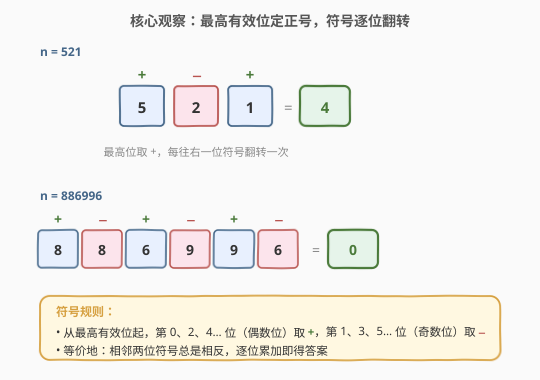
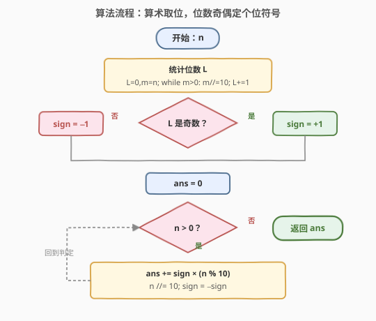
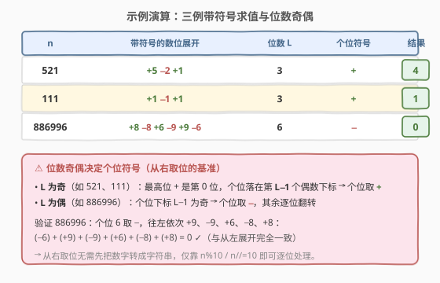

# LeetCode 交替数字和 题解

## 1. 题目概述

- **标题 / 题号**：交替数字和（#2544，easy）
- **链接**：https://leetcode.cn/problems/alternating-digit-sum/
- **难度**：简单
- **标签**：数学、模拟

**题意**：给定一个正整数 $n$。$n$ 的每一位数字按如下规则分配符号：

- **最高有效位**（最左位）上的数字分配到 **正号**；
- 其余每位上数字的符号都与其**相邻（左侧）数字相反**。

返回所有数字连同其对应符号的和。

**示例 1**：

```text
输入：n = 521
输出：4
解释：(+5) + (−2) + (+1) = 4
```

**示例 2**：

```text
输入：n = 111
输出：1
解释：(+1) + (−1) + (+1) = 1
```

**示例 3**：

```text
输入：n = 886996
输出：0
解释：(+8) + (−8) + (+6) + (−9) + (+9) + (−6) = 0
```

**约束**：

- $1 \le n \le 10^9$（即 $n$ 至多 10 位十进制数字）

> 💡 规则一句话：从最高位起给 $+$，之后符号**逐位翻转**（$+\to-\to+\to-\cdots$）。等价地，从左数第 $0,2,4,\ldots$ 位（偶数下标）取 $+$，第 $1,3,5,\ldots$ 位（奇数下标）取 $-$。

## 2. 解题思路

### 2.1 直觉法：转字符串从左扫描，符号逐位翻转

最自然的写法：把 $n$ 转成字符串，从最高位起扫描，用一个 `sign` 变量从 $+1$ 出发，每处理一位后翻转（`sign = -sign`），逐位累加。

```python
def alternateDigitSum(n):
    sign, ans = 1, 0
    for ch in str(n):
        ans += sign * int(ch)
        sign = -sign
    return ans
```

时间 $O(L)$、空间 $O(L)$（$L$ 为位数，$L \le 10$），对 $10^9$ 规模毫无压力。但它**额外开了一段长度为 $L$ 的字符串**，且把「符号该取什么」的判定交给了「从左到右的扫描顺序」——若想完全用算术取位、不分配字符串呢？

### 2.2 核心观察：算术取位 + 位数奇偶定个位符号



**关键直觉**：符号只取决于「该位在从左数第几位」。最高位恒为 $+$，符号向右逐位翻转。换算到**从右**数的视角（即 $n \bmod 10$ 取到的个位）：

- 设总位数为 $L$。最高位是从左数第 $0$ 位，个位是从左数第 $L-1$ 位。
- 个位的符号为 $(-1)^{L-1}$：**$L$ 为奇 $\Rightarrow$ 个位取 $+$；$L$ 为偶 $\Rightarrow$ 个位取 $-$**。

于是无需转字符串：先统计位数 $L$，按 $L$ 奇偶定下**个位的基准符号**，再用 $n \bmod 10$ 从个位起逐位取出，每取一位翻转符号即可。

> 💡 **为什么个位符号恰好是 $(-1)^{L-1}$？** 从左第 $0$ 位符号为 $+$（即 $(-1)^0$），第 $k$ 位符号为 $(-1)^k$。个位是第 $L-1$ 位，故符号 $(-1)^{L-1}$。$L$ 奇则 $L-1$ 偶 $\Rightarrow +$；$L$ 偶则 $L-1$ 奇 $\Rightarrow -$。

> ⚠️ 统计位数时**不要**用 `math.log10`：浮点误差在 $n=10^k$ 这类整十幂处会少算一位（如 $\log_{10}(1000)$ 在某些环境算出 $2.999\ldots$，取整得 2）。用连除 $10$ 的循环计数最稳。

### 2.3 算法流程图



流程为一个「计数 → 定基准符号 → 循环取位」的三段式：

1. **统计位数** $L$：`L=0; m=n; while m>0: m//=10; L+=1`；
2. **定个位基准符号**：$L$ 奇 $\Rightarrow \text{sign}=+1$，$L$ 偶 $\Rightarrow \text{sign}=-1$；
3. **逐位取数累加**：当 $n>0$，执行 `ans += sign*(n%10); n//=10; sign=-sign`；
4. 循环结束（$n=0$）→ 返回 `ans`。

### 2.4 示例演算



| $n$ | 带符号的数位展开 | 位数 $L$ | 个位符号 | 结果 |
|-----|------------------|----------|----------|------|
| $521$ | $+5\ \ -2\ \ +1$ | $3$（奇） | $+$ | $4$ |
| $111$ | $+1\ \ -1\ \ +1$ | $3$（奇） | $+$ | $1$ |
| $886996$ | $+8\ -8\ +6\ -9\ +9\ -6$ | $6$（偶） | $-$ | $0$ |

- **$n=521$（$L=3$ 奇）**：基准符号 $+$。取个位 $1 \to +1$；$n=52$，翻转 $\to -$，取 $2 \to -2$；$n=5$，翻转 $\to +$，取 $5 \to +5$；$n=0$ 结束。$1-2+5=4$。
- **$n=111$（$L=3$ 奇）**：基准 $+$。个位 $1\to+1$，十位 $1\to-1$，百位 $1\to+1$；$1-1+1=1$。
- **$n=886996$（$L=6$ 偶）**：基准 $-$。从右依次 $-6,+9,-9,+6,-8,+8$；求和 $=0$。

> 💡 注意从右取位得到的求值顺序（个位先）与从左展开（最高位先）方向相反，但因**加法可交换**且每位符号由其绝对位置唯一确定，两种顺序结果一致。

## 3. 参考代码

### C++（算术取位，$O(L)$ / $O(1)$）

```cpp
class Solution {
public:
    int alternateDigitSum(int n) {
        int L = 0;
        for (int m = n; m > 0; m /= 10) ++L;          // 统计位数
        int ans = 0;
        int sign = (L & 1) ? 1 : -1;                  // L 奇 -> 个位 +
        for (int x = n; x > 0; x /= 10) {
            ans += sign * (x % 10);
            sign = -sign;
        }
        return ans;
    }
};
```

> 💡 用 `L & 1` 判奇偶；两段循环各扫一遍位数，合计 $2L$ 次除法。若想压成单遍，见第 5 节的「奇偶标志单遍法」。

### Python（算术取位，$O(L)$ / $O(1)$）

```python
class Solution:
    def alternateDigitSum(self, n: int) -> int:
        L = 0
        m = n
        while m > 0:
            m //= 10
            L += 1
        ans = 0
        sign = 1 if L % 2 == 1 else -1
        while n > 0:
            ans += sign * (n % 10)
            n //= 10
            sign = -sign
        return ans
```

> 💡 Python 大整数天然支持，但本题 $n \le 10^9$，无需考虑溢出。若图省事，2.1 的字符串版同样可 AC——只是空间多 $O(L)$。

## 4. 复杂度分析

| 维度 | 复杂度 | 说明 |
|------|--------|------|
| **时间复杂度** | $O(L)$ | 两次各扫 $L$ 位（计数 + 取位），$L = \lfloor \log_{10} n \rfloor + 1 \le 10$；常数级 |
| **空间复杂度** | $O(1)$ | 仅 `L`、`sign`、`ans` 几个整型变量，不分配字符串 |
| 对照：字符串版 | $O(L)$ 时间 / $O(L)$ 空间 | 直觉清晰但额外存了 $n$ 的字符串 |

> 💡 $n \le 10^9$ 时 $L \le 10$，两种写法实测无差别；本解强调**算术取位 + 奇偶定符号**的洞察，是「不依赖字符串也能确定符号」的关键。

## 5. 扩展：单遍扫描的奇偶标志法

2.2 节先计数 $L$ 再取位，扫了两遍。能否**一遍**搞定？可以——只需在从右取位的同时记录**已取位数的奇偶**，最后按总位数的奇偶修正一次符号。

设从右数第 $i$ 位（$i=0$ 为个位）为 $d_i$。若按「个位取 $+$」的约定累加，得到

$$
g(n) = \sum_{i=0}^{L-1} (-1)^i\, d_i = d_0 - d_1 + d_2 - \cdots
$$

而真实答案（最高位为 $+$）为

$$
f(n) = \sum_{i=0}^{L-1} (-1)^{L-1-i}\, d_i = (-1)^{L-1} \sum_{i=0}^{L-1} (-1)^i\, d_i = (-1)^{L-1}\, g(n).
$$

即 $f(n) = g(n)$（$L$ 奇）或 $f(n) = -g(n)$（$L$ 偶）。于是一遍取位算 $g$，并顺手统计位数奇偶，末尾按奇偶决定是否取反：

```python
class Solution:
    def alternateDigitSum(self, n: int) -> int:
        g, sign, cnt = 0, 1, 0
        while n > 0:
            g += sign * (n % 10)      # 个位先取 +
            n //= 10
            sign = -sign
            cnt += 1
        return g if cnt % 2 == 1 else -g   # L 奇 -> g 即答案
```

> 💡 这是把「位数 $L$」的信息压缩进一个奇偶标志，省掉预扫描。但对 $L \le 10$ 的小数据并无实际收益，**可读性优先时仍建议 2.2 的两遍写法**，单遍法留作思路拓展。

> ⚠️ 题目保证 $n \ge 1$，故无需处理 $n=0$ 的空位情形；若推广到 $n=0$，应直接返回 $0$。

## 6. 面试要点

1. **符号到底由什么决定？**

   > 仅由「该位从左数的下标」决定：第 $k$ 位符号为 $(-1)^k$，与数字本身无关。故无论从左扫还是从右取，只要能定位每位的下标，就能定符号——这是脱离字符串、纯算术求解的依据。

2. **从右取位时，个位符号怎么定？**

   > 个位是从左数第 $L-1$ 位，符号 $(-1)^{L-1}$：$L$ 奇为 $+$、$L$ 偶为 $-$。因此先统计位数 $L$、按奇偶定基准符号，再逐位翻转即可。这是 2.2 的核心。

3. **为什么不用 `math.log10` 求位数？**

   > 浮点精度风险：$n=10^k$ 时 $\log_{10}(n)$ 可能算成略小于 $k$ 的值，取整后位数少 1，直接导致个位符号判反。连除 $10$ 的整数计数无此问题，最稳。

4. **单遍法为什么末尾要按 $L$ 奇偶修正一次符号？**

   > 单遍法按「个位 $+$」累加得到 $g(n)=\sum(-1)^i d_i$，但真实答案最高位 $+$，即 $f(n)=(-1)^{L-1}g(n)$。两者差一个 $(-1)^{L-1}$ 因子：$L$ 奇时相等，$L$ 偶时互为相反数，故末尾按 $L$ 奇偶决定是否取反。

5. **这题能衍生出什么变体？**

   > 把「最高位 $+$、逐位翻转」换成「个位 $+$、逐位翻转」，就是反向符号规则，对应 $g(n)$ 直接作为答案；或改为「相邻两位配对相消」$(d_{2k}-d_{2k+1})$ 求和（$L$ 奇时末位单独 $+d_{L-1}$），是同一计算的重组。这类变体考察对「符号 = 位置函数」的灵活刻画。

> 💡 **一句话总结**：最高位定 $+$、符号逐位翻转；从右算术取位时，**位数 $L$ 的奇偶决定个位符号**，先计数 $L$ 再翻转累加即可，$O(L)$ 时间、$O(1)$ 空间。

## 同类练习题

| # | 题目 | 与本题的关联 |
|---|------|-------------|
| 258 | [各位相加](https://leetcode.cn/problems/add-digits/)（[题解](../0201-0300/258_各位相加.md)） | 反复数位求和直到一位数，同为「数位操作」基础母题，可进阶到 $O(1)$ 数字根公式 |
| 9 | [回文数](https://leetcode.cn/problems/palindrome-number/)（[题解](../0001-0100/9_回文数.md)） | 反转一半数字判回文，从右取位 $n\bmod 10$ 重组的经典套路 |
| 2119 | [反转两次的数字](https://leetcode.cn/problems/a-number-after-a-double-reversal/)（[题解](../2101-2200/2119_反转两次的数字.md)） | 反转数字后再次反转，数位拆分重组的另一简单变体 |
| 1134 | [阿姆斯特朗数](https://leetcode.cn/problems/armstrong-number/)（[题解](../1101-1200/1134_阿姆斯特朗数.md)） | 各位数字的幂和判定，数位逐位提取的同骨架不同目标 |
| 2162 | [设置时间的最少代价](https://leetcode.cn/problems/minimum-cost-to-set-cooking-time/)（[题解](../2101-2200/2162_设置时间的最少代价.md)） | 数位拆分与重组在模拟题中的应用，承接数位操作思路 |
