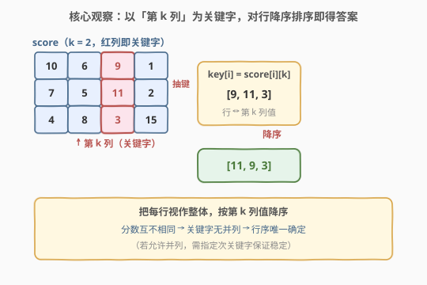
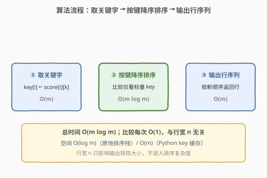
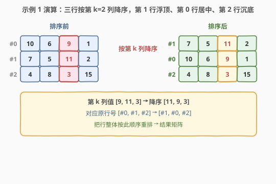

# LeetCode 根据第 K 场考试的分数排序 题解

## 1. 题目概述

- **标题 / 题号**：根据第 K 场考试的分数排序（#2545，medium）
- **链接**：https://leetcode.cn/problems/sort-the-students-by-their-kth-score/
- **难度**：中等
- **标签**：数组、排序、矩阵

**题意**：班里有 $m$ 位学生、$n$ 场考试。给定下标从 0 开始的 $m \times n$ 整数矩阵 `score`，其中 `score[i][j]` 表示第 $i$ 位学生在第 $j$ 场考试取得的分数。矩阵中所有整数**互不相同**。

再给整数 $k$，请按**第 $k$ 场考试分数从高到低**对这些学生（矩阵的行）排序，返回排序后的矩阵。

**示例 1**：

```text
输入：score = [[10,6,9,1],[7,5,11,2],[4,8,3,15]], k = 2
输出：[[7,5,11,2],[10,6,9,1],[4,8,3,15]]
解释：第 2 场考试分数分别为 9、11、3。11 最高 → 第 1 行居首；9 次之 → 第 0 行居次；3 最低 → 第 2 行居末。
```

**示例 2**：

```text
输入：score = [[3,4],[5,6]], k = 0
输出：[[5,6],[3,4]]
解释：第 0 场考试分数分别为 3、5。5 > 3，故第 1 行在前、第 0 行在后。
```

**约束**：

- $m = \text{score.length}$，$n = \text{score}[i].\text{length}$
- $1 \le m, n \le 250$
- $1 \le \text{score}[i][j] \le 10^5$
- `score` 由**不同**的整数组成
- $0 \le k < n$

> 💡 「矩阵每行 = 一位学生的全科成绩单」「按某一列（第 $k$ 场）降序重排行」——本质是**以第 $k$ 列为关键字、对行做比较排序**。又因分数**两两不同**，关键字无并列，行序唯一确定，稳定性不再是问题。

## 2. 解题思路

### 2.1 暴力思路：选择排序逐轮挑最大

最直白的方法是**选择排序**：每轮在剩余行中扫描第 $k$ 列最大值对应的行，加入结果，并在剩余集合里剔除该行；重复 $m$ 轮。

```text
result = []
剩余 = {0,1,...,m-1}
重复 m 次：
    在「剩余」中找第 k 列最大的行 r
    result.add(score[r])；剩余.remove(r)
```

时间 $O(m^2)$（每轮 $O(m)$ 扫描、共 $m$ 轮）、空间 $O(m)$（结果表与已取标记）。$m \le 250$ 时 $m^2 \approx 6.25 \times 10^4$，可 AC，但**每轮都从零扫描**，做了大量重复比较——明明一次比较就能定两行先后，却被选择排序拆成相互独立的轮次。

### 2.2 核心观察：以第 k 列为关键字做比较排序



**关键直觉**：比较任意两行 $i, j$ 时，**只需看 `score[i][k]` 与 `score[j][k]` 这两个标量**——题面保证矩阵所有整数互不相同，故第 $k$ 列的 $m$ 个值构成行的**严格全序**，单凭这一列就能唯一决定任意两行的先后。于是「对 $m$ 行排序」被化简为「对 $m$ 个标量关键字排序」，直接套用任意 $O(m \log m)$ 比较排序。

> 💡 **为什么互不相同是关键？** 若第 $k$ 列允许并列，两行同分时排序结果不唯一，需引入次关键字（如行号、或第 $k+1$ 场分数）并要求排序稳定。题面「不同」消去了并列，比较器只需 `a[k] > b[k]` 一个分支即可严格定序，排序结果唯一。

> ⚠️ **不要逐元素比较整行**：两行只在第 $k$ 列上分高下，其它列的值不影响行序。把比较器写成「逐列比较」既多余又可能改变答案（按字典序排与按第 $k$ 列排是两回事）。

验证两个示例：

| 输入 | 第 $k$ 列值 | 降序后 | 结果矩阵（行序） |
|------|------------|--------|------------------|
| 示例 1，$k=2$ | $[9,11,3]$ | $[11,9,3]$ | 第 1、0、2 行 |
| 示例 2，$k=0$ | $[3,5]$ | $[5,3]$ | 第 1、0 行 |

### 2.3 算法流程图



三步线性流程：

1. **取关键字**：令 $\text{key}[i] = \text{score}[i][k]$，为每行抽取一个标量（$O(m)$）；
2. **按键降序排序**：以 `key` 为比较依据排序，比较仅看标量、每次 $O(1)$（$O(m \log m)$）；
3. **输出行序列**：行按新顺序返回即可；原地排序或交换引用都不需复制整行数据（$O(m)$）。

> 💡 **与 2.1 选择排序的对照**：选择排序每轮独立扫描、$O(m^2)$ 次比较；比较排序用分治/堆把比较次数压到 $O(m \log m)$。对 $m=250$，$m\log m \approx 2000$，比 $m^2 \approx 6.25\times10^4$ 快约 30 倍，但两者在题面规模下都能过——本题考的是**把行排序问题归约为标量排序**的建模，而非复杂度本身。

### 2.4 示例演算



- **示例 1** `[[10,6,9,1],[7,5,11,2],[4,8,3,15]]`，$k=2$：取第 2 列得 $[9,11,3]$（对应原行号 $[\#0,\#1,\#2]$）；降序得 $[11,9,3]$ → 行号 $[\#1,\#0,\#2]$；按此顺序取行 → `[[7,5,11,2],[10,6,9,1],[4,8,3,15]]`。
- **示例 2** `[[3,4],[5,6]]`，$k=0$：第 0 列 $[3,5]$ → 降序 $[5,3]$ → 行号 $[\#1,\#0]$ → `[[5,6],[3,4]]`。
- **边界 $m=n=1$**：单行单列，第 $k=0$ 列即唯一元素，排序结果不变，原样返回。

## 3. 参考代码

### C++（原地排序，$O(m \log m)$ / $O(\log m)$）

```cpp
class Solution {
public:
    vector<vector<int>> sortTheStudents(vector<vector<int>>& score, int k) {
        sort(score.begin(), score.end(),
             [&](const vector<int>& a, const vector<int>& b) {
                 return a[k] > b[k];
             });
        return score;
    }
};
```

> 💡 `std::sort` 原地重排 `vector<vector<int>>`，行间交换是 $O(1)$（交换内部 `vector<int>` 的指针，不拷贝成绩数据）。比较器只读 `a[k]`、`b[k]` 两个标量，每次 $O(1)$，故总 $O(m \log m)$。捕获 `[&]` 把 `k` 按引用带入，避免每行重新查表。

### Python（关键字排序，$O(m \log m)$ / $O(m)$）

```python
class Solution:
    def sortTheStudents(self, score: List[List[int]], k: int) -> List[List[int]]:
        return sorted(score, key=lambda r: r[k], reverse=True)
```

> 💡 Python 的 `sorted(..., key=...)` 是**装饰-排序-去装饰**（Schwartzian transform）：内部对每行**只调用一次** `r[k]` 抽取关键字、缓存为长 $m$ 的键数组，再按键排序，避免比较器每比较一次都重算 `r[k]`。`reverse=True` 直接降序；也可写 `key=lambda r: -r[k]`（数值型取负升序等价降序）。返回的是行引用的新列表，行数据不拷贝。

## 4. 复杂度分析

| 维度 | 复杂度 | 说明 |
|------|--------|------|
| **时间复杂度** | $O(m \log m)$ | 比较排序，比较次数 $O(m \log m)$；每次比较只读第 $k$ 列标量，$O(1)$；行交换 $O(1)$ |
| **空间复杂度** | $O(\log m)$（C++ 原地）/ $O(m)$（Python key 缓存） | 原地排序仅需递归栈；Python 预抽键需 $O(m)$ 辅助 |
| 对照：选择排序 | $O(m^2)$ 时间 / $O(m)$ 空间 | 每轮独立扫描取最大，比较次数 $m^2$，规模小可过但非最优 |

> 💡 行宽 $n$ **不进入排序复杂度**——比较只看第 $k$ 列一个标量，与 $n$ 无关。$n$ 只决定输出矩阵大小（返回 $m \times n$）。$m \le 250$ 时 $m\log m \approx 2000$，极快；即便选择排序 $m^2 \approx 6.25\times10^4$ 也轻松通过，故本题重点是建模而非压复杂度。

## 5. 扩展：比较器 vs 关键字（Schwartzian 变换）

两种「按列排序」写法的本质区别在于**关键字被抽取几次**：

**比较器写法**（C++ `sort` + lambda）：每次比较都调用一次比较器，各执行 `a[k]`、`b[k]` 两次读取。共 $O(m \log m)$ 次比较 → $O(m \log m)$ 次标量读取。当 `a[k]` 是 $O(1)$（向量下标）时与关键字写法同阶；但当「关键字计算昂贵」（如对每行算哈希、长度、复杂函数）时，比较器写法把昂贵计算放大 $\log m$ 倍。

**关键字写法**（Python `key=` / C++ 投影）：先对每行**各算一次**关键字并存表，排序时只比较缓存好的标量。关键字计算 $O(m)$ 次、比较 $O(m \log m)$ 次但每次 $O(1)$。这是**装饰-排序-去装饰**（Schwartzian transform）。

> 💡 本题 `a[k]` 是 $O(1)$ 下标读取，两写法同阶。但工程上推荐关键字写法——语义更清晰（声明「按什么排」而非「怎么比」），且对昂贵关键字天然友好。C++20 起可用投影：`std::ranges::sort(score, std::greater{}, [k](auto& r){ return r[k]; });`。

**若分数允许并列**：比较器 `a[k] > b[k]` 在相等时返回 `false`，而 `std::sort` 非稳定，相对顺序可能被打乱。需加次关键字保稳：`return a[k]!=b[k] ? a[k]>b[k] : i<j;`，或改用 `stable_sort`，或先编入 `(score[i][k], i)` 再排。本题「不同」消去了这一分支。

## 6. 面试要点

1. **为什么只需看第 k 列一个标量就能排序？**

   > 题面保证矩阵所有整数互不相同，故第 $k$ 列的 $m$ 个值两两不同，构成行的严格全序。比较两行 $i,j$ 时，`score[i][k]` 与 `score[j][k]` 的大小**唯一**决定先后，其它列的值不参与。因此排序被归约为「对 $m$ 个标量排序」。

2. **比较器写法和关键字（key）写法有何区别？**

   > 关键字写法（Python `key=`、C++ 投影）先对每行各算一次关键字并缓存，比较时只比标量，属装饰-排序-去装饰；比较器写法（`sort` + lambda）每次比较都重算关键字。当关键字 $O(1)$（如本题下标读取）时同阶；关键字昂贵时关键字写法更优。工程上推荐关键字写法，语义清晰且对昂贵键友好。

3. **行交换是 O(1) 吗？会不会拷贝整行数据？**

   > C++ 中 `std::sort` 交换 `vector<vector<int>>` 的两行，实际交换内部 `vector<int>`（常数个指针/大小字段），$O(1)$，不拷贝 $n$ 个成绩。Python `sorted` 返回行引用的新列表，行对象本身不复制。故行宽 $n$ 不进入排序复杂度。

4. **如果分数允许并列怎么办？**

   > 需指定次关键字（如原始行号保稳定原顺序）或改用稳定排序 `stable_sort`。本题「所有整数互不相同」消去并列，比较器 `a[k] > b[k]` 即严格全序，无需次关键字，稳定性也不成问题。

5. **能否做到优于 O(m log m)？**

   > 比较排序下界 $\Omega(m \log m)$，故基于比较的方法已最优。若利用值域（$\le 10^5$）做桶排序/计数排序，理论上 $O(m + V)$ 可破 $m \log m$，但 $m \le 250$ 远小于 $V$，反而更慢且复杂——本题规模下不值得，比较排序即最佳。

> 💡 **一句话总结**：所有分数互不相同 → 第 $k$ 列构成行的严格全序 → 比较两行只需看 `score[·][k]` 一个标量，用任意 $O(m \log m)$ 比较排序按该关键字降序即可；$O(m \log m)$ 时间、$O(\log m)$~$O(m)$ 空间，是「按列排序矩阵行」的招牌模板。

## 同类练习题

| # | 题目 | 与本题的关联 |
|---|------|-------------|
| 2418 | [按身高排序](https://leetcode.cn/problems/sort-the-people/)（[题解](../2401-2500/2418_按身高排序.md)） | 把名字按身高降序——同构的「平行数组按键排序」，本题的「行=人、第 k 列=身高」特例 |
| 1636 | [按照频率将数组升序排序](https://leetcode.cn/problems/sort-array-by-increasing-frequency/)（[题解](../1601-1700/1636_按照频率将数组升序排序.md)） | 先统计频率作关键字再排序，关键字需计算（装饰-排序-去装饰的典型场景） |
| 1859 | [把句子排序](https://leetcode.cn/problems/sorting-the-sentence/)（[题解](../1801-1900/1859_把句子排序.md)） | 每个单词尾缀数字即其目标位置，按数字关键字重排，同「按标量键排序」骨架 |
| 1331 | [数组序号转换](https://leetcode.cn/problems/rank-transform-of-an-array/)（[题解](../1301-1400/1331_数组序号转换.md)） | 值→名次映射后排序，对照「关键字需预处理」与本题「关键字现成」的差异 |
| 1122 | [数组的相对排序](https://leetcode.cn/problems/relative-sort-array/)（[题解](../1101-1200/1122_数组的相对排序.md)） | 按自定义优先级（外部顺序）排序，扩展到「关键字不是数值大小而是排名」的情形 |
