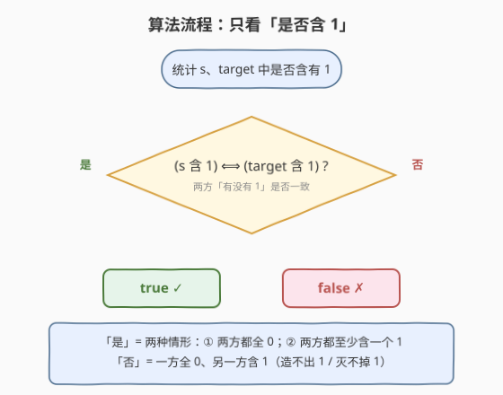
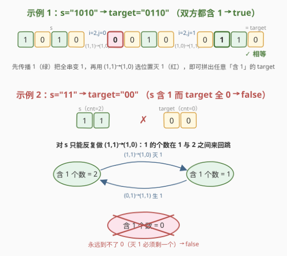

# LeetCode 执行逐位运算使字符串相等 题解

## 1. 题目概述

- **标题 / 题号**：执行逐位运算使字符串相等（#2546，medium）
- **链接**：https://leetcode.cn/problems/apply-bitwise-operations-to-make-strings-equal/
- **难度**：中等
- **标签**：位运算、脑筋急转弯、贪心、数学

**题意**：给定两个长度均为 $n$ 的二进制字符串 $s$ 和 $\text{target}$。每次操作**任选两个不同下标** $i, j$（$0 \le i, j < n$，$i \ne j$），**同时**执行：

- $s[i] \leftarrow s[i] \;\text{OR}\; s[j]$
- $s[j] \leftarrow s[i] \;\text{XOR}\; s[j]$（此处用操作**前**的原 $s[i]$）

问能否经过任意次操作使 $s$ 等于 $\text{target}$。

**示例 1**：

```text
输入：s = "1010", target = "0110"
输出：true
解释：
- 选 i = 2, j = 0：s[0] 1→0、s[2] 仍 1，s = "0010"
- 选 i = 2, j = 1：s[1] 0→1、s[2] 仍 1，s = "0110"
```

**示例 2**：

```text
输入：s = "11", target = "00"
输出：false
解释：任何操作都无法把两个 1 全部清成 0。
```

**约束**：

- $n = |s| = |\text{target}|$
- $2 \le n \le 10^5$
- $s$、$\text{target}$ 仅由 `0`、`1` 构成

> ⚠️ 注意三点：① 两处替换是**同步**的——XOR 用的是操作前的原 $s[i]$，不是 OR 更新后的值；② $i, j$ 必须不同，但**次序敏感**（谁是 OR 位、谁是 XOR 位由下标角色决定）；③ $n$ 高达 $10^5$，任何「模拟具体操作」或 BFS 搜索字符串状态的解法都会超时，必须找**闭合判定**。

## 2. 解题思路

### 2.1 暴力思路：BFS 搜索字符串状态

最直白的做法：把当前 $s$ 当状态，每次枚举所有 $(i, j)$ 对（$O(n^2)$ 种转移）做 BFS，看能否到达 $\text{target}$。

问题有二：**状态空间** $2^n$ 指数爆炸，$n = 10^5$ 完全不可存；**转移数** $n^2$ 每步太贵。即便只记「1 的个数」也会漏掉位置信息（不同的 0/1 排布并非都能互换）。

> 💡 状态爆炸提示我们换视角：不要「试着生成 target」，而要问「能从 $s$ 变到 target，需要 $s$ 与 target **各自具备什么不变结构**」。关键是不去盯具体位置，而盯**操作对整个串里 1 的个数的净影响**——下面把操作的真值表列出来，答案会自己浮出水面。

### 2.2 核心观察：操作对「1 的个数」只有三种净效果

![操作真值表：四种 (s[i],s[j]) 配对的演化——生 1 靠已有 1、灭 1 必剩一个](../images/bmse_concept.svg)

把一对 $(s[i], s[j])$ 的所有取值代入，得**真值表**（OR、XOR 都用操作前原值）：

| $s[i]$ | $s[j]$ | $s[i]\,\text{OR}\,s[j]$ | $s[i]\,\text{XOR}\,s[j]$ | 结果 | 1 的个数变化 |
|:---:|:---:|:---:|:---:|:---:|:---|
| 0 | 0 | 0 | 0 | $(0,0)$ | $0 \to 0$，**无变化** |
| 0 | 1 | 1 | 1 | $(1,1)$ | $1 \to 2$，**+1（生 1）** |
| 1 | 0 | 1 | 1 | $(1,1)$ | $1 \to 2$，**+1（生 1）** |
| 1 | 1 | 1 | 0 | $(1,0)$ | $2 \to 1$，**−1（灭 1）** |

三条硬规律：

1. **生 1 必须靠一个已有的 1 配对**：把一个 $0$ 变成 $1$ 的唯一途径是 $(0,1)$ 或 $(1,0)$，两处都要求**串里已经存在一个 1**。于是若 $s$ 全 0，$(0,0)\to(0,0)$ 啥也干不了——**全 0 永远造不出 1**。
2. **灭 1 必须靠两个 1 配对、且必剩一个**：把一个 $1$ 变成 $0$ 的唯一途径是 $(1,1)\to(1,0)$，要求**两个 1**，操作后剩一个 1。于是 1 的个数能从 2 降到 1、从 $k$ 降到 $k-1$，但**永远降不到 0**。
3. **个数能上能下、区间 $[1, n]$ 任意游走**：$+1$（用 1 喂 0）能把个数推到 $n$；$-1$（两 1 相消）能把个数降到 $1$。只要串里有 $\ge 1$ 个 1，个数可取遍 $1, 2, \ldots, n$ 中任意值。

> 💡 直觉：1 像「火种」——有火种就能点燃任意多个 0（生 1），也能让两个火种相消剩一个（灭 1），但**火种不能无中生有，也不能完全熄灭**。这正是「个数 $\in [1,n]$ 区间连通」的根因。

### 2.3 算法流程图



由 2.2 的三条规律，能拼出**充分性**：若 $s$ 含至少一个 1 且 $\text{target}$ 也含至少一个 1，则

- 先用「生 1」把 $s$ 全部推成 $1\ldots1$（每次拿一个已有的 1 去喂一个 0）；
- 再用「灭 1」$(1,1)\to(1,0)$ **精确选定**位置清 0：要让位置 $j$ 变 0，取另一处 $i$ 仍为 1 作 OR 位，则 $s[i]=1\,\text{OR}\,s[j]=1$、$s[j]=1\,\text{XOR}\,1=0$，恰好把 $j$ 清 0 而 $i$ 保 1。

如此可拼出任意「至少含一个 1」的 $\text{target}$。结合规律 1、2 的**必要性**，得闭合判定：

$$
\text{可达} \ \Longleftrightarrow\ \bigl(\text{“1”} \in s\bigr) \ \Longleftrightarrow\ \bigl(\text{“1”} \in \text{target}\bigr).
$$

即「两方是否含 1 **必须一致**」：要么都全 0，要么都至少含一个 1。

> 💡 换言之，把整串压成一个布尔量 `has1 = ('1' in s)`，操作能任意改变 `has1=True` 串内部的 0/1 排布与个数，却**无法跨越** `True`/`False` 之间的鸿沟——这是本题唯一的不变量。

### 2.4 示例演算



**示例 1：$s=\texttt{"1010"},\ \text{target}=\texttt{"0110"}$** ——两方都含 1，先传播后灭：

| 步骤 | 选 $(i,j)$ | 操作类型 | 变化 | $s$ |
|------|-----------|----------|------|-----|
| 0 | — | — | — | `1010` |
| 1 | $(2, 0)$ | $(1,1)\to(1,0)$ | $s[0]\,1\to0$（灭 1） | `0010` |
| 2 | $(2, 1)$ | $(1,0)\to(1,1)$ | $s[1]\,0\to1$（生 1） | `0110` ✓ |

得到 target ✓（此处按「先做一步灭、再做一步生」演示；等价的「先全推成 1111、再选位清 0」也成立）。

**示例 2：$s=\texttt{"11"},\ \text{target}=\texttt{"00"}$** ——$s$ 含 1、target 全 0：

对 $s=\texttt{"11"}$ 唯一非平凡操作是 $(1,1)\to(1,0)$，得 `10`（或 `01`）；对 `10` 又可 $(1,0)\to(1,1)$ 变回 `11`。1 的个数在 $1$ 与 $2$ 之间反复跳，**永远到不了 0**。由规律 2，含 1 的串最小个数恒为 1，故返回 `false` ✓。

> 💡 这张图说明为何不能只看「个数相等」：示例 1 两方个数都 $=2$，但示例 2 若误判成「个数 $2 \to 0$ 可达」就错了——个数**无法跨越 0 这道坎**。闭合判据看的是「**是否含 1**」这个布尔量是否一致，而非具体数值。

## 3. 参考代码

### C++

```cpp
class Solution {
public:
    bool makeStringsEqual(string s, string target) {
        bool has1_s = s.find('1') != string::npos;
        bool has1_t = target.find('1') != string::npos;
        return has1_s == has1_t;        // 两方「是否含 1」必须一致
    }
};
```

> 💡 `find('1') != npos` 等价于「串中至少有一个 1」，比 `count('1')` 早退出，最坏仍 $O(n)$。返回 `has1_s == has1_t`：两方都全 0（`false==false`）或都含 1（`true==true`）才可达。

### Python

```python
class Solution:
    def makeStringsEqual(self, s: str, target: str) -> bool:
        return ('1' in s) == ('1' in target)   # 两方「是否含 1」必须一致
```

> 💡 Python `'1' in s` 短路求值，$O(n)$ 时间。两版逻辑等价，均 $O(n)$ 时间、$O(1)$ 空间，无需计数具体个数。

## 4. 复杂度分析

| 维度 | 复杂度 | 说明 |
|------|--------|------|
| **时间复杂度** | $O(n)$ | 各扫一遍 $s$、$\text{target}$ 判是否含 1，最坏遍历全长 |
| **空间复杂度** | $O(1)$ | 仅两个布尔变量，无额外结构 |
| 对照：BFS 搜状态 | 指数 / 状态爆炸 | 状态空间 $2^n$、转移 $n^2$，$n=10^5$ 完全不可行 |
| 对照：模拟具体操作 | 至少 $O(n)$ 且需构造 | 能构造但多此一举——闭合判定已一步出解 |

> 💡 把「可达性搜索」压成「两次布尔判定」是本题精髓：用**操作对 1 的个数的净效果**这一不变量代替**状态枚举**。和 [2543. 判断一个点是否可以到达](../2501-2600/2543_判断一个点是否可以到达.md) 用「$\gcd$ 是 2 的幂」把坐标搜索压成一次 $\gcd$ 同属一族——都是找跨越不了的鸿沟。

## 5. 扩展：充分性构造的正确性

**命题**：若 $s$ 与 $\text{target}$ 都至少含一个 1，则 $s$ 可经有限步操作变为 $\text{target}$。

**构造证明**（分两阶段）：

1. **传播阶段——把 $s$ 推成全 1 串**。对 $s$ 中每个为 0 的位置 $p$，取某个已有 1 的位置 $q$（$q \ne p$），做 $(i, j) = (q, p)$，即 $(1, 0) \to (1, 1)$：$s[q]$ 保 1、$s[p]$ 变 1。因 $s$ 至少含一个 1，总能找到这样的 $q$；每步让 0 的个数严格减 1，至多 $n - 1$ 步后 $s$ 变成 $1\ldots1$。

2. **消减阶段——把多余 1 精确清成 0**。对 $\text{target}$ 中每个应为 0 的位置 $j$，此时 $s$ 已全 1，取另一位置 $i \ne j$（$s[i] = 1$），做 $(i, j) = (1, 1) \to (1, 0)$：$s[i]$ 保 1、$s[j]$ 变 0。只要清 0 的个数 $\le n - 1$（即 target 至少留一个 1，这正是前提），总留得出一个 1 作 OR 位当「火种」，逐个清 0 即可。

两阶段合起来把任意「含 1 的 $s$」变成任意「含 1 的 $\text{target}$」；前提 $s$、$\text{target}$ 都含 1 是阶段可行（有火种起步）的必要条件。结合 2.2 的规律 1（全 0 不能生 1）、规律 2（含 1 不能全灭）即得双向闭合。$\blacksquare$

> ⚠️ **一个易错点**：不要把判据写成「$s$ 与 $\text{target}$ 的 1 的个数相等」。个数可在 $[1, n]$ 内任意游走，$s$ 个数 $2$ 完全可达 target 个数 $5$（示例 1 就跨了个数），但个数 $0$ 这道坎永远跨不过去。看「**是否含 1**」而非「**含几个**」。

## 6. 面试要点

1. **为什么答案是「两方是否含 1 一致」？给一句话直觉。**

   > 1 是火种：有火种就能点燃任意个 0（生 1）、也能让两火种相消剩一（灭 1），但火种不能无中生有、也不能完全熄灭。所以「是否含 1」这个布尔量在操作下守恒——两方必须一致。

2. **请说明为何 $(1,1)\to(1,0)$ 是唯一能减少 1 的操作，且永远减不到 0。**

   > 真值表里只有 $(1,1)$ 这行结果含一个 $0$（其余三行结果 1 的个数 $\ge$ 输入）。它要求两个 1、产出剩一个 1，故 1 的个数从 $k$ 降到 $k-1$（$k \ge 2$），最小到 $1$ 永不到 $0$。

3. **如果只允许选相邻下标（$j = i \pm 1$），结论还成立吗？**

   > 仍成立。传播阶段可让火种「逐位相邻推进」把全串变 1（一步点一位）；消减阶段从一端保留火种、逐位相邻清 0。相邻限制只放慢速度，不改「是否含 1」的守恒性。

4. **为何不能把判据写成「1 的个数相等」？举反例。**

   > 个数在 $[1,n]$ 内任意可调。如 $s=\texttt{"10"},\ \text{target}=\texttt{"11"}$，个数 $1 \to 2$ 仍可达（$(1,0)\to(1,1)$ 一步即成）。只有个数 $0$ 是孤岛、跨不过去，所以判据是布尔「是否含 1」而非数值。

5. **本题与 2543「判断一个点是否可以到达」有何同构之处？**

   > 都是把「可达性搜索」压成一个**跨越不了的鸿沟**判定：2543 是 $\gcd$ 含不含奇素因子（含则坐标永远长不出），本题是串里有没有 1（有则个数永不为 0）。两者都用**操作的不变量**代替状态枚举，一步 $O(n)$ 或 $O(\log)$ 出解。

> 💡 **一句话总结**：操作对 1 的个数只有「生 1（+1，需已有 1）」「灭 1（−1，必剩一）」「不变」三种净效果 ⟹ 1 不能无中生有也不能完全熄灭 ⟹ 答案 $=$ `('1' in s) == ('1' in target)`，$O(n)$ 出解。

## 同类练习题

| # | 题目 | 与本题的关联 |
|---|------|-------------|
| 2543 | [判断一个点是否可以到达](https://leetcode.cn/problems/check-if-point-is-reachable/)（[题解](../2501-2600/2543_判断一个点是否可以到达.md)） | 用「$\gcd$ 是 2 的幂」把坐标可达搜索压成一次 $\gcd$，与本题「是否含 1 守恒」同属「用不变量代替状态枚举」一族 |
| 292 | [Nim 游戏](https://leetcode.cn/problems/nim-game/) | 看似要枚举取法判胜负，实则只取决于 $n \bmod 4 \ne 0$ 这一布尔量，与本题「只取决于是否含 1」同为把博弈/可达搜索压成不变量判据的招牌 |
| 810 | [黑板异或游戏](https://leetcode.cn/problems/chalkboard-xor-game/) | 看似要枚举擦数顺序，实则「全体异或为 0 或个数为偶数」即必胜，与本题把搜索压成不变量判据思路一致 |
| 476 | [数字的补数](https://leetcode.cn/problems/number-complement/) | 位运算基础题，熟悉按位取反的位级行为，是推导本题 OR/XOR 真值表的前置 |
| 190 | [颠倒二进制位](https://leetcode.cn/problems/reverse-bits/) | 位运算基础题，熟悉 OR/XOR/AND 真值表是推导本题真值表的前提 |
