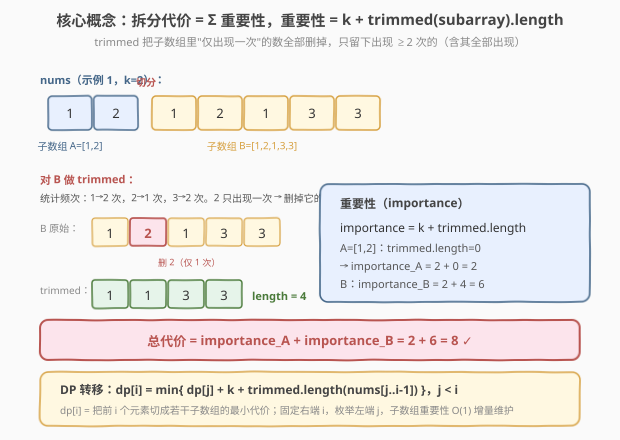

# LeetCode 拆分数组的最小代价 题解

## 1. 题目概述

- **标题 / 题号**：拆分数组的最小代价（#2547，hard）
- **链接**：https://leetcode.cn/problems/minimum-cost-to-split-an-array/
- **难度**：困难
- **标签**：动态规划、数组

**题意**：给定整数数组 `nums` 与整数 `k`。把 `nums` 拆成若干**非空连续子数组**，拆分的**代价**等于各子数组**重要性**之和。

先定义子数组的 **trimmed** 特征：把子数组中所有**仅出现一次**的数字全部移除（出现 $\ge 2$ 次的数字连同其全部出现都保留）。

- 如 `trimmed([3,1,2,4,3,4]) = [3,4,3,4]`（1、2 各只 1 次被删；3、4 各 2 次全留）。

子数组的**重要性**定义为：

$$
\text{importance}(\text{subarray}) = k + \text{trimmed}(\text{subarray}).\text{length}
$$

返回所有可行拆分方案中的**最小代价**。

**示例 1**：

```text
输入：nums = [1,2,1,2,1,3,3], k = 2
输出：8
解释：拆成 [1,2] 与 [1,2,1,3,3]。
[1,2] 重要性 = 2 + 0 = 2。
[1,2,1,3,3]：trimmed=[1,1,3,3]，length=4，重要性 = 2 + 4 = 6。
总代价 = 2 + 6 = 8。
```

**示例 2**：

```text
输入：nums = [1,2,1,2,1], k = 2
输出：6
解释：拆成 [1,2] 与 [1,2,1]。后者 trimmed=[1,1]，length=2，重要性 2+2=4；总代价 2+4=6。
```

**示例 3**：

```text
输入：nums = [1,2,1,2,1], k = 5
输出：10
解释：k 很大，整段不切反而最优。子数组 [1,2,1,2,1] 中 1 出现 3 次、2 出现 2 次，均 ≥2 次，
没有任何元素被删（trimmed 原样保留），trimmed.length=5，重要性 = 5 + 5 = 10。
```

**约束**：

- $1 \le \text{nums.length} \le 1000$
- $0 \le \text{nums}[i] < \text{nums.length}$（值域恰为 $[0,n)$，可作数组下标）
- $1 \le k \le 10^9$

> ⚠️ **读约束**：$n \le 1000$ 提示 $O(n^2)$ 可过；`nums[i] < n` 意味着频次表用数组而非哈希即可；$k$ 高至 $10^9$ 说明每切一刀至少付 $k$，切得太多不划算——存在"切短省 trimmed"与"切多花 k"的权衡。

## 2. 解题思路

### 2.1 暴力思路：枚举所有切分方案

把 $n$ 个元素间的 $n-1$ 个间隙，每个间隙决定切/不切，共 $2^{n-1}$ 种方案；每种方案算各子数组 trimmed（$O(n)$ 统计频次）。$n=1000$ 时 $2^{999}$ 天文数字，彻底不可行。瓶颈在于"在哪切"被当整体搜索，且各子数组 trimmed 重复计算。

### 2.2 核心观察：线性 DP + 增量维护 trimmed



**切入点**：代价是"前缀分段的累加"，天然具有**最优子结构**。令：

$$
\text{dp}[i] = \text{把 nums}[0..i-1]\text{（前 }i\text{ 个元素）切成若干子数组的最小代价}
$$

则只需关心"**最后一段**从哪里开始"——枚举最后一段为 $\text{nums}[j..i-1]$（$j < i$），前面 $\text{nums}[0..j-1]$ 的最小代价已是 $\text{dp}[j]$，于是：

$$
\text{dp}[i] = \min_{0 \le j < i}\;\Big\{\text{dp}[j] + k + \text{trimmed.length}\big(\text{nums}[j..i-1]\big)\Big\}
$$

边界 $\text{dp}[0]=0$（空前缀代价 0），答案 $\text{dp}[n]$。

> 💡 **这是典型的"区间划分型 DP"**：把序列切成若干段，每段有代价，求总代价最值。与 [132. 分割回文串 II](https://leetcode.cn/problems/palindrome-partitioning-ii/)、[139. 单词拆分](https://leetcode.cn/problems/word-break/) 同构：固定右端 $i$、枚举左端 $j$、用 $\text{dp}[j]$ 拼 $\text{cost}(j,i)$。难点是 $\text{cost}(j,i)$ 怎么快速算——本题靠"**右端固定、左端左移增量维护**"压成 $O(1)$。

### 2.3 增量维护 trimmed：右端固定，左端左移

关键技巧：对**固定的右端 $i$**，让左端 $j$ 从 $i-1$ 向 $0$ 递减，窗口 $\text{nums}[j..i-1]$ **在左边不断扩张**。每加入一个 $\text{nums}[j]$（值 $v$），按"**加入前 $v$ 在窗口内出现次数 $c$**"分三支更新 trimmed：

| 加入前频次 $c$ | 加入后频次 | trimmed 变化 | 解释 |
|----------------|-----------|-------------|------|
| $0$ | $1$ | $+0$ | $v$ 现 1 次，仍 $<2$，不进 trimmed |
| $1$ | $2$ | $+2$ | $v$ 现 2 次，**两份都补回**（原来那 1 份 + 新这 1 份） |
| $\ge 2$ | $c+1$ | $+1$ | $v$ 已计入 trimmed，**只多这 1 份** |

每个 $j$ 一步 $O(1)$（数组随机访问 + 常数判断），单轮 $i$ 内层 $O(n)$，总 $O(n^2)$。

![算法流程：固定右端 i，左端 j 向左扩展，按加入前频次 c 分三支 O(1) 更新 trimmed，再 min 更新 dp[i]](../images/mincost_split_algorithm_flow.svg)

```text
dp[0] = 0；dp[1..n] = +∞
for i = 1 .. n:                      # 计算 dp[i]
    freq[0..n-1] = 0; trimmed = 0    # 每轮重置频次表
    for j = i-1 ↓ 0:                  # 左端向左扩展窗口 [j..i-1]
        v = nums[j]; c = freq[v]
        if   c == 0: trimmed += 0
        elif c == 1: trimmed += 2     # 两份都补回
        else       : trimmed += 1     # 多 1 份计数
        freq[v] = c + 1
        dp[i] = min(dp[i], dp[j] + k + trimmed)
return dp[n]
```

> ⚠️ **两个细节**：① `freq` 用长度 $n$ 的数组（因 $\text{nums}[i] < n$），每轮重置 $O(n)$，总 $O(n^2)$；若用 `memset`/逐元素清零会带常数。② 更新 $\text{dp}[i]$ 用的是**加入 $\text{nums}[j]$ 之后**的 trimmed——此时窗口恰为 $[j..i-1]$，cost 对应的就是这段子数组的 importance。

### 2.4 示例演算

![示例演算：nums=[1,2,1,2,1,3,3], k=2，先列 dp 表再展开末步 i=7 的 j 扫描](../images/mincost_split_example_walkthrough.svg)

对示例 1 `nums=[1,2,1,2,1,3,3]`, $k=2$，$n=7$。先逐列递推得 $\text{dp}$ 表：

| $i$ | 0 | 1 | 2 | 3 | 4 | 5 | 6 | **7** |
|-----|---|---|---|---|---|---|---|-------|
| $\text{dp}[i]$ | 0 | 2 | 2 | 4 | 4 | 6 | 6 | **8** |

末步 $i=7$ 展开 $j$ 扫描（向左扩展窗口 $[j..6]$，逐次累加 trimmed）：

| $j$ | 窗口 | 频次变化 | trimmed | $\text{dp}[j]$ | 候选 $\text{dp}[j]+k+\text{trimmed}$ |
|-----|-------|----------|---------|----------------|--------------------------------------|
| 6 | $[3]$ | $3:0{\to}1$ (+0) | 0 | 6 | $6+2+0=\mathbf{8}$ |
| 5 | $[3,3]$ | $3:1{\to}2$ (+2) | 2 | 6 | $6+2+2=10$ |
| 4 | $[1,3,3]$ | $1:0{\to}1$ (+0) | 2 | 4 | $4+2+2=\mathbf{8}$ |
| 3 | $[2,1,3,3]$ | $2:0{\to}1$ (+0) | 2 | 4 | $4+2+2=\mathbf{8}$ |
| **2** | **$[1,2,1,3,3]$** | $1:1{\to}2$ (+2) | **4** | **2** | **$2+2+4=\mathbf{8}$** ← 官方切分 |
| 1 | $[2,1,2,1,3,3]$ | $2:1{\to}2$ (+2) | 6 | 2 | $2+2+6=10$ |
| 0 | $[1,2,1,2,1,3,3]$ | $1:2{\to}3$ (+1) | 7 | 0 | $0+2+7=9$ |

最小 $8$，$\text{dp}[7]=8$。$j=2$ 命中：子数组 $[1,2,1,3,3]$ trimmed.length=4、importance=6，前缀 $\text{dp}[2]=2$（即 $[1,2]$，importance=2），合 $2+6=8$，与官方切分一致。注意 $j$ 越左窗口越长、trimmed 越大，子数组代价上升会抵消"少切几刀省下 $k$"的收益——这是本题权衡的核心。

## 3. 参考代码

### C++

```cpp
class Solution {
public:
    int minCost(vector<int>& nums, int k) {
        int n = nums.size();
        vector<int> dp(n + 1, INT_MAX);
        dp[0] = 0;
        vector<int> freq(n, 0);          // nums[i] < n，可用数组当频次表
        for (int i = 1; i <= n; ++i) {
            fill(freq.begin(), freq.end(), 0);  // 每轮重置
            int trimmed = 0;
            for (int j = i - 1; j >= 0; --j) {  // 左端向左扩展
                int v = nums[j], c = freq[v];
                if (c == 0)      trimmed += 0;
                else if (c == 1) trimmed += 2;   // 两份都补回
                else             trimmed += 1;   // 多 1 份计数
                freq[v] = c + 1;
                dp[i] = min(dp[i], dp[j] + k + trimmed);
            }
        }
        return dp[n];
    }
};
```

> 💡 **实现要点**：① `freq` 复用同一份、每轮 `fill` 清零，避免反复分配 $n$ 个 vector；总清零成本 $O(n^2)$ 与主循环同级。② `dp[j] + k + trimmed` 中 $k$ 可达 $10^9$、累加最多 $n$ 段即 $\le 10^{12}$，理论接近 `INT_MAX`（$\sim 2.1\times 10^9$）边界——实际因 trimmed 与 $k$ 不会同时拉满、且求 min，单次 $\text{dp}[j]+k+\text{trimmed}\le 10^9 + 10^9 + 1000 < 2.1\times 10^9$ 多数情况安全；稳妥起见可把 `dp` 改 `long long`，见下方"扩展"。

### Python

```python
class Solution:
    def minCost(self, nums: List[int], k: int) -> int:
        n = len(nums)
        dp = [0] + [float('inf')] * n
        for i in range(1, n + 1):
            freq = [0] * n              # 每轮新建频次表
            trimmed = 0
            for j in range(i - 1, -1, -1):   # 左端向左扩展
                v = nums[j]
                c = freq[v]
                if c == 0:
                    pass
                elif c == 1:
                    trimmed += 2            # 两份都补回
                else:
                    trimmed += 1            # 多 1 份计数
                freq[v] = c + 1
                cand = dp[j] + k + trimmed
                if cand < dp[i]:
                    dp[i] = cand
        return dp[n]
```

> 💡 **对照 C++**：逻辑一致；Python 整数任意精度无溢出之忧。`float('inf')` 作初值便于 `min`/比较；亦可初始化为一个大整数（如 `10**18`）保持全整型。Python 解释执行 $O(n^2)=10^6$ 通常在 1s 内可过，常数上比 C++ 慢但仍充裕。

## 4. 复杂度分析

| 维度 | 复杂度 | 说明 |
|------|--------|------|
| 时间 | $O(n^2)$ | 外层 $n$ 轮，每轮内层 $j$ 扫 $O(n)$、每步 $O(1)$ 更新；`freq` 每轮清零 $O(n)$，总计 $O(n^2)$ |
| 空间 | $O(n)$ | `dp` 数组 $O(n)$；`freq` 数组 $O(n)$（复用一份） |
| 对照：枚举切分方案 | $O(2^{n-1}\cdot n)$ | 指数级，$n=1000$ 不可行 |

> 💡 $n=1000$ 时 $O(n^2)=10^6$，远低于 1s 时限。本题瓶颈不在算法而在"把 $\text{cost}(j,i)$ 增量化"——若每对 $(j,i)$ 都 $O(n)$ 重算 trimmed 会退化到 $O(n^3)=10^9$ 超时。

## 5. 扩展：溢出与常数优化

**① 防溢出**：稳妥写法把 `dp` 设为 `long long`，初值 `LLONG_MAX`/一个大数：

```cpp
vector<long long> dp(n + 1, LLONG_MAX);
dp[0] = 0;
// ...
dp[i] = min(dp[i], (long long)dp[j] + k + trimmed);
return (int)dp[n];
```

理论上界：最差全切成单元素，代价 $= n\cdot k \le 1000 \times 10^9 = 10^{12}$，超 `int` 范围。虽然"全切单元素"不会是最优解（实际答案远小），但 DP 中间态 $\text{dp}[j]+k+\text{trimmed}$ 仍可能短暂超 $2.1\times 10^9$，故工程上建议用 `long long`。

**② 进一步优化思路**：本题 $n\le 1000$，$O(n^2)$ 已足够。若 $n$ 更大（如 $10^5$），需利用"trimmed 增量满足某种单调/凸性"尝试决策单调性优化（1D1D DP 优化），但 trimmed 与频次强耦合、单调性弱，难以直接套 Slope Trick 或分治优化——这也是本题卡在 $n=1000$ 的原因。

## 6. 面试要点

1. **怎么想到用 DP？代价结构有何特征？**

   > 代价是"各子数组 importance 之和"，可按"最后一段"切分：总代价 = 前缀代价 + 最后一段 importance。这天然形成 $\text{dp}[i]=\min_j\{\text{dp}[j]+\text{cost}(j,i)\}$ 的最优子结构。识别"序列分段 + 段代价累加"即套区间划分 DP 模板。

2. **$\text{cost}(j,i)$ 为什么能 $O(1)$ 增量维护？关键在扫的方向。**

   > 固定右端 $i$、左端 $j$ **从右向左**扩展窗口，每加一个 $\text{nums}[j]$ 只影响该值的频次。按"加入前频次 $c$"三分支更新 trimmed：$c=0$ 加 0、$c=1$ 加 2、$c\ge 2$ 加 1。方向选错（左端固定右端右移）则每步得改两个端点，无法摊还 $O(1)$。

3. **$c=1$ 时为什么加 2 而不是 1？**

   > 加入前 $v$ 出现 1 次，**那次没计入 trimmed**（出现 $<2$ 次不入 trimmed）。加入后达 2 次，符合"$\ge 2$"，则**两份出现**都要计入——所以补回原来漏的 1 份 + 新增 1 份 = $+2$。$c\ge 2$ 时原来就已全计入，只多这 1 份即可，故 $+1$。

4. **为什么 `freq` 用数组而非哈希表？**

   > 约束 $\text{nums}[i] < \text{nums.length}=n$，值域恰 $[0,n)$，可直接作长度 $n$ 数组的下标。数组随机访问 $O(1)$ 且常数远小于哈希（无哈希、无装箱），$n=1000$ 时差距明显。这是"利用约束缩小值域"的典型优化。

5. **$k$ 很大或很小分别对应什么策略？**

   > $k$ 是每段的固定开销。$k$ 越大，多切一刀越不划算，倾向少切（极端如示例 3 $k=5$ 整段不切最优）；$k$ 越小，切短省 trimmed 更划算，倾向多切。DP 自动权衡：枚举所有 $j$ 取 min 即在"切多花 $k$"与"切少留 trimmed"间择优。

> 💡 **一句话总结**：区间划分 DP $\text{dp}[i]=\min_j\{\text{dp}[j]+k+\text{trimmed}(\text{nums}[j..i{-}1])\}$，固定右端、左端左移按"加入前频次 $c$"三分支 $O(1)$ 增量维护 trimmed，$O(n^2)$ 解决。

## 同类练习题

| # | 题目 | 与本题的关联 |
|---|------|-------------|
| 132 | [分割回文串 II](https://leetcode.cn/problems/palindrome-partitioning-ii/) | 区间划分 DP 同模板（$\text{dp}[i]=\min_j\{\text{dp}[j]+\text{cost}(j,i)\}$），cost 是"是否回文"，靠预处理回文表把 cost 降到 $O(1)$ |
| 139 | [单词拆分](https://leetcode.cn/problems/word-break/) | 区间划分 DP 的判定版，$\text{cost}(j,i)$=子串是否在词典，前缀缓存 $O(1)$ 查询 |
| 140 | [单词拆分 II](https://leetcode.cn/problems/word-break-ii/) | 139 的"枚举全部方案"版，记忆化 DFS 复用同样的分段结构 |
| 410 | [分割数组的最大值](https://leetcode.cn/problems/split-array-largest-sum/) | 把数组切成 $k$ 段最小化"最大段和"，区间划分 DP（或二分答案 + 贪心验证） |
| 1043 | [分隔数组以得到最大和](https://leetcode.cn/problems/partition-array-for-maximum-sum/) | 分段 DP，每段长度 $\le k$、代价为"段长 $\times$ 段内最大值"，固定右端枚举左端同模板 |
