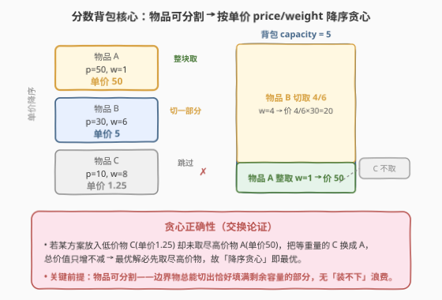
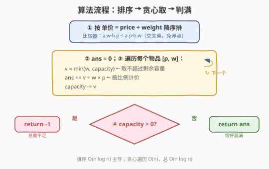

# LeetCode 填满背包的最大价格 题解

## 1. 题目概述

- **标题 / 题号**：填满背包的最大价格（#2548，medium）
- **链接**：https://leetcode.cn/problems/maximum-price-to-fill-a-bag/
- **难度**：中等
- **标签**：贪心、数组、排序

**题意**：给定二维整数数组 `items`，其中 `items[i] = [price_i, weight_i]` 表示第 $i$ 个物品的**价格**与**重量**。再给定**正**整数容量 `capacity`。

每个物品可以分成两个部分，比率为 `part1` 与 `part2`，满足 `part1 + part2 == 1`：

- 第一部分重量 $= weight_i \times part_1$，价格 $= price_i \times part_1$；
- 第二部分重量 $= weight_i \times part_2$，价格 $= price_i \times part_2$。

换言之，**物品可按任意比例切分取用**。返回用给定物品填满容量为 `capacity` 的背包所能获得的**最大总价格**；若无法填满，返回 $-1$。与实际答案误差在 $10^{-5}$ 以内即视为正确。

**示例 1**：

```text
输入：items = [[50,1],[10,8]], capacity = 5
输出：55.00000
解释：单价 50/1=50 > 10/8=1.25。先整取物品 [50,1]（价 50，余容量 4）；
     再切取物品 [10,8] 的 4/8（价 4/8×10=5，余容量 0）。
     总价 50 + 5 = 55。
```

**示例 2**：

```text
输入：items = [[100,30]], capacity = 50
输出：-1.00000
解释：总重量 30 < 50，无法装满背包，返回 -1。
```

**约束**：

- $1 \le \text{items.length} \le 10^5$
- $\text{items}[i].\text{length} == 2$
- $1 \le price_i, weight_i \le 10^4$
- $1 \le capacity \le 10^9$

> 💡 **读约束**：$n \le 10^5$ 指向 $O(n \log n)$；$price_i, weight_i \le 10^4$ 使交叉乘积 $w_a \cdot p_b \le 10^8$，远在 `int` 范围内，排序比较器可用整数交叉乘免浮点；$capacity$ 高至 $10^9$ 而 $n \cdot \max w = 10^9$ 恰处边界——能否装满取决于「总重量 $\ge$ 容量」。

## 2. 解题思路

### 2.1 暴力思路：枚举切分比例

把每个物品的取用比例当成连续决策，搜索所有「取多少」的组合再求最大总价——决策空间连续且维度 $n$，无法枚举。退一步用 0-1 背包的思路：把每个物品「离散化」成若干等分小段再 DP，既丢精度又把 $capacity \le 10^9$ 放进状态维度，时间和空间都不可承受。瓶颈在于**没有利用「可任意切分」带来的贪心结构**。

### 2.2 核心观察：分数背包——按单价降序贪心



物品**可任意比例切分**是本题与 0-1 背包的本质区别：它使得「单位重量的价值」即 $\dfrac{price}{weight}$（**单价**）成为唯一可比的择优指标。直觉上，同等重量下单价越高越划算，故应**优先取尽高单价物品**；当某物品重量超过剩余容量时，**切下恰好填满剩余容量的那一部分**即可。

> 💡 **贪心正确性（交换论证）**：设最优方案中放入了单价较低的物品 $C$（单价 $u_C$），却未取尽单价较高的物品 $A$（单价 $u_A > u_C$）。把等重量的 $C$ 换成 $A$，价格变化 $\Delta = (u_A - u_C) \times \Delta w \ge 0$，总价值只增不减。反复交换直至「低价物出现前高价物必先取尽」，故**按单价降序贪心取用即得最优解**。关键前提正是「可分割」——边界物品总能切出恰好填满剩余容量的部分，没有「装不下整块只能放弃」的浪费，这正是 0-1 背包贪心失效、必须 DP 的根因。

### 2.3 算法流程图



```text
按 price/weight 降序排序（比较器用交叉乘 a.w·b.p < a.p·b.w，避免浮点）
ans = 0
for 每个 [p, w] in 排序后的 items:
    v = min(w, capacity)          # 取不超过剩余容量
    ans += v / w * p              # 按比例计价（此处用浮点）
    capacity -= v
return capacity > 0 ? -1 : ans   # 还剩容量即装不满
```

> ⚠️ **两个细节**：① **排序比较器用交叉乘**而非 `p/w` 浮点除法——浮点比较在边界情况（如 $1/3$ 与 $2/6$）可能因精度误差导致顺序错乱，交叉乘 $w_a \cdot p_b \lessgtr p_a \cdot w_b$ 是精确整数比较；而**累加计价** $v/w \times p$ 必须用浮点（结果要求 `double`），两者分工不同。② 遍历中一旦 `capacity` 降为 $0$ 即可提前 `break`（后续物品全跳过），但即便不 break 也只是多跑常数次空操作，不影响复杂度。

### 2.4 示例演算

![示例演算：items=[[50,1],[10,8]], cap=5，单价 50>1.25，整取物品1价50、切取物品2的4/8价5，合55](../images/frac_knapsack_example_walkthrough.svg)

对示例 1 `items=[[50,1],[10,8]]`，$capacity=5$：

| 步骤 | 物品 $[p,w]$ | 单价 $p/w$ | 取 $v=\min(w,\text{cap})$ | 价格 $v/w \cdot p$ | 剩余 cap |
|------|-------------|-----------|--------------------------|--------------------|---------|
| 1 | $[50,1]$ | $50$ | $\min(1,5)=1$ | $1/1 \times 50 = 50$ | $4$ |
| 2 | $[10,8]$ | $1.25$ | $\min(8,4)=4$ | $4/8 \times 10 = 5$ | $0$ |

剩余容量归 $0$，恰好装满，$ans = 50 + 5 = 55.00000$。物品 $[10,8]$ 被**切下 $4/8$**：剩余容量仅差 $4$，取 $v=4$ 恰好填满。

示例 2 `items=[[100,30]]`，$capacity=50$：总重量 $30 < 50$，遍历后 `capacity=20 > 0`，装不满，返回 $-1$。

## 3. 参考代码

### C++

```cpp
class Solution {
public:
    double maxPrice(vector<vector<int>>& items, int capacity) {
        // 按单价 price/weight 降序：等价于 weight/price 升序
        // 交叉乘避免浮点：a.w*b.p < a.p*b.w  ⇔  p_a/w_a > p_b/w_b
        sort(items.begin(), items.end(),
             [](const auto& a, const auto& b) {
                 return a[1] * b[0] < a[0] * b[1];
             });
        double ans = 0;
        for (auto& e : items) {
            int p = e[0], w = e[1];
            int v = min(w, capacity);
            ans += v * 1.0 / w * p;   // 计价必须用浮点
            capacity -= v;
            if (capacity == 0) break;  // 装满即止
        }
        return capacity > 0 ? -1 : ans;
    }
};
```

> 💡 **比较器方向**：`a[1]*b[0] < a[0]*b[1]` 即 $w_a \cdot p_b < p_a \cdot w_b$，两边同除 $w_a w_b$ 得 $\dfrac{p_b}{w_b} < \dfrac{p_a}{w_a}$，即 $A$ 的单价更高排在前面——**降序**。交叉乘最大 $10^4 \times 10^4 = 10^8 \ll 2.1 \times 10^9$，`int` 安全。`v * 1.0 / w * p` 先转 `double` 再除，避免整数截断。

### Python

```python
class Solution:
    def maxPrice(self, items: List[List[int]], capacity: int) -> float:
        # 按 weight/price 升序 = price/weight 降序；用交叉乘 key 也可
        items.sort(key=lambda x: x[1] / x[0])
        ans = 0.0
        for p, w in items:
            v = min(w, capacity)
            ans += v / w * p
            capacity -= v
            if capacity == 0:
                break
        return -1 if capacity else ans
```

> 💡 Python 的 `sort` 用 `x[1]/x[0]` 浮点 key 通常足够稳（题目精度容差 $10^{-5}$）；若追求与 C++ 一致的精确比较，可用 `functools.cmp_to_key` 配交叉乘。Python 整数任意精度，无溢出之忧；`return -1 if capacity else ans` 利用 `0` 的假值简洁判空。

## 4. 复杂度分析

| 维度 | 复杂度 | 说明 |
|------|--------|------|
| 时间 | $O(n \log n)$ | 排序主导；贪心遍历 $O(n)$，每步 $O(1)$ |
| 空间 | $O(\log n)$ | 原地排序的栈空间（快排/归并）；额外仅常数变量 |
| 对照：0-1 背包 DP | $O(n \cdot capacity)$ | 物品不可切分须 DP，$capacity \le 10^9$ 直接爆内存/时间 |
| 对照：枚举切分比例 | 不可行 | 连续决策空间，维度 $n$ |

> 💡 $n = 10^5$ 时 $O(n \log n) \approx 1.7 \times 10^6$，远低于时限。本题的「便宜」完全来自「可分割」——它把 0-1 背包的 $O(n \cdot capacity)$ DP 压成了 $O(n \log n)$ 贪心，正是分数背包与 0-1 背包复杂度分野的根源。

## 5. 扩展：与 0-1 背包的对比

「可分割」是分数背包能用贪心的**充要条件**。对比如下：

| 维度 | 分数背包（本题） | 0-1 背包 |
|------|-----------------|---------|
| 物品 | 可任意比例切分 | 整块取或不取，不可切 |
| 择优指标 | 单价 $price/weight$ | 须统筹「重量—价值」二维权衡 |
| 算法 | 贪心 $O(n \log n)$ | DP $O(n \cdot capacity)$ |
| 贪心为何有效 | 边界物可切出恰好填满的量，无浪费 | 装不下整块只能放弃，局部最优不等于全局最优 |
| 代表题 | 本题 2548 | [416. 分割等和子集](https://leetcode.cn/problems/partition-equal-subset-sum/)、[1049. 最后一块石头的重量 II](https://leetcode.cn/problems/last-stone-weight-ii/) |

> 💡 **面试识别信号**：题目出现「可切分 / 按比例 / part1+part2=1 / 流体、粉末、液体」等暗示物品可分数取用时，**第一反应应是分数背包贪心**而非套 0-1 背包 DP——后者既慢又在容量 $10^9$ 下不可行。反过来，若物品是「整件、 indivisible」，则贪心必失效，须 DP。

**精度处理**：结果要求 `double` 且容差 $10^{-5}$。累加 `ans += v / w * p` 用 `double` 即可，$n \le 10^5$ 项求和的浮点误差远小于 $10^{-5}$。若担心比较器浮点不稳，统一用交叉乘整数比较（C++ 已采用）。

## 6. 面试要点

1. **为什么分数背包能用贪心，而 0-1 背包必须 DP？**

   > 分数背包物品可任意切分，单位重量的价值 $price/weight$ 成为可比指标：同等重量下取单价高的总不会更差。交换论证保证「低价物出现前高价物必先取尽」。而 0-1 背包物品不可切，装不下的整件只能放弃，可能错过「虽单价略低但整体更合算」的组合，局部贪心失效，故须 DP 枚举取/不取。

2. **排序比较器为什么用交叉乘而不是直接 `price/weight`？**

   > 浮点除法在相等或接近的单价（如 $1/3$ 与 $2/6$）上可能因精度误差打乱顺序，而交叉乘 $w_a \cdot p_b \lessgtr p_a \cdot w_b$ 是**精确整数比较**。本题 $price, weight \le 10^4$，乘积 $\le 10^8$ 在 `int` 范围内安全。注意「比较器用整数」与「累加计价用浮点」分工不同，不能混用。

3. **如何判断「装不满」返回 $-1$？**

   > 贪心遍历后会尽可能取尽所有物品。若遍历结束 `capacity` 仍 $> 0$，说明所有物品总重量 $< capacity$，物理上无法填满，返回 $-1$。等价于提前判断 $\sum w_i < capacity$，但贪心循环里顺带判 `capacity > 0` 更省一次遍历。

4. **`capacity` 高达 $10^9$ 会不会有问题？**

   > 不会。`capacity` 是 `int`，最大 $10^9 < 2.1 \times 10^9$；`v = min(w, capacity)` 与 `capacity -= v` 始终非增且 $\le 10^9$，无溢出。而 `ans` 是 `double`，求和最多 $n \cdot \max price = 10^5 \times 10^4 = 10^9$，`double` 有效位 15+ 位，精度充足。真正的「大容量陷阱」是 0-1 背包 DP 把 `capacity` 当状态维度——$10^9$ 内存爆掉，本题因可分割避开了它。

5. **题目里「分成 part1、part2 两部分」是不是意味着只能切一刀？**

   > 不是。`part1 + part2 == 1` 是任意比例，相当于「取该物品的 $part_1$ 比例」。把 $part_1$ 设成你想取的比例、$part_2$ 设成剩余（不取）即可。所以等价于「物品可按任意分数取用」——标准分数背包。示例中 $[10,8]$ 取 $4/8=0.5$，即 $part_1=0.5$、$part_2=0.5$，取其中一份，价 $10 \times 0.5=5$、重 $8 \times 0.5=4$，恰好填满。

> 💡 **一句话总结**：物品可任意切分 $\Rightarrow$ 按单价 $price/weight$ 降序贪心（交叉乘整数比较器），每物取 $\min(w, capacity)$、累加 $v/w \cdot p$，装不满（`capacity>0`）返回 $-1$，$O(n \log n)$。可分割是把 $O(n \cdot capacity)$ DP 降为贪心的关键。

## 同类练习题

| # | 题目 | 与本题的关联 |
|---|------|-------------|
| 416 | [分割等和子集](https://leetcode.cn/problems/partition-equal-subset-sum/)（[题解](../0401-0500/416_分割等和子集.md)） | 0-1 背包，物品**不可切分**故贪心失效须 DP，与本题分数背包形成正面对照 |
| 1049 | [最后一块石头的重量 II](https://leetcode.cn/problems/last-stone-weight-ii/)（[题解](../1001-1100/1049_最后一块石头的重量II.md)） | 0-1 背包求最值，对照「整件不可分」时为何不能贪心而须 DP |
| 322 | [零钱兑换](https://leetcode.cn/problems/coin-change/)（[题解](../0301-0400/322_零钱兑换.md)） | 完全背包求最少硬币数，同属背包家族，对照不同背包变体的算法分野 |
| 502 | [IPO](https://leetcode.cn/problems/ipo/)（[题解](../0501-0600/502_IPO.md)） | 贪心 + 大顶堆，另一类「排序解锁 + 贪心择优」范式，对照贪心择优指标的不同形态 |
| 435 | [无重叠区间](https://leetcode.cn/problems/non-overlapping-intervals/)（[题解](../0401-0500/435_无重叠区间.md)） | 贪心区间调度（按右端点），同类「交换论证保贪心最优」的思想内核 |
