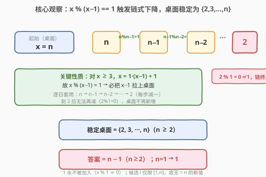
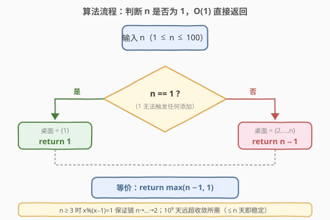
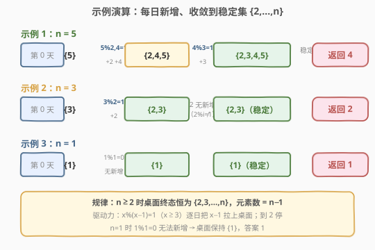

# LeetCode 统计桌面上的不同数字 题解

## 1. 题目概述

- **标题 / 题号**：统计桌面上的不同数字（#2549，easy）
- **链接**：https://leetcode.cn/problems/count-distinct-numbers-on-board/
- **难度**：简单
- **标签**：脑筋急转弯、数学、模拟

**题意**：给你一个正整数 `n`，开始时它放在桌面上。在 $10^9$ 天内，每天执行：

- 对桌面上**每个**数字 $x$，找出所有满足 $1 \le i \le n$ 且 $x \bmod i == 1$ 的数字 $i$；
- 把这些 $i$ 放到桌面上（已存在的不再重复计入）。

返回 $10^9$ 天后桌面上**不同**整数的数目。注意：一旦数字上桌则一直保留至结束；`%` 为取余运算。

**示例 1**：

```text
输入：n = 5
输出：4
解释：第 0 天桌面 {5}。
  第二天 5%2=1、5%4=1 → +2、+4，桌面 {2,4,5}。
  再一天 4%3=1 → +3，桌面 {2,3,4,5}。
  此后 2 无新增、3%2=1（2 已在），桌面不再变化。
  十亿天结束时桌面不同数字为 2、3、4、5，共 4 个。
```

**示例 2**：

```text
输入：n = 3
输出：2
解释：3%2=1 → +2，桌面 {2,3}；此后 2 无新增，桌面稳定。
  最终桌面不同数字只有 2 和 3，共 2 个。
```

**约束**：

- $1 \le n \le 100$

> 💡 关键细节：候选 $i$ 受**双重夹逼**——$1 \le i \le n$，故桌面数字永远在 $[1,n]$ 内，至多 $n$ 个；又因 $x \bmod 1 \equiv 0$（恒不等于 $1$），数字 $1$ **永远无法被任何 $x$ 拉上桌**（除非它本来就是初始的 $n=1$）。$10^9$ 天是充分大的「跑到不动」的保证，并非真的要迭代十亿次——桌面只增不减且元素有界，至多 $n$ 天内必收敛。

## 2. 解题思路

### 2.1 暴力思路：逐日模拟到收敛

最直接的实现是按题意**模拟每天**：维护桌面集合 $S$（初值 $\{n\}$），每天对 $S$ 中每个 $x$ 枚举 $i \in [1,n]$，凡 $x \bmod i == 1$ 者加入 $S$，直到某天无任何新增即收敛。

```python
board = {n}
while True:
    add = set()
    for x in board:
        for i in range(1, n + 1):
            if x % i == 1:
                add.add(i)
    if add <= board:          # 无新增即收敛
        break
    board |= add
return len(board)
```

因 $n \le 100$，每天 $O(n^2)$、至多 $n$ 天收敛，总 $O(n^3) \le 10^6$，可 AC。但这**完全没利用「$10^9$ 天」的冗余**——真正的终态由数学规律一锤定音，根本不必逐日跑。

### 2.2 核心观察：$x \bmod (x-1) == 1$ 触发链式下降



**关键直觉**：对任意 $x \ge 3$，有 $x = 1 \cdot (x-1) + 1$，故

$$x \bmod (x-1) = 1 \quad (x \ge 3)$$

这意味着**每个 $x \ge 3$ 都会把自己的 $x-1$ 拉上桌面**。从初始的 $n$ 出发逐日套用：

$$n \xrightarrow{\,n \bmod (n-1)=1\,} n-1 \xrightarrow{\,n-1 \bmod (n-2)=1\,} n-2 \to \cdots \to 3 \xrightarrow{\,3 \bmod 2=1\,} 2$$

到 $2$ 时，$2 \bmod 1 = 0 \ne 1$（且 $2 \bmod i = 0$ 或 $2$，对 $i \ge 1$ 恒不等于 $1$），**链终止**，桌面不再新增。故 $n \ge 2$ 时桌面终态必含 $\{2,3,\dots,n\}$。

> 💡 **为何终态「恰好」是 $\{2,\dots,n\}$ 而非更多？** 两道夹逼：① 候选 $i \in [1,n]$，桌面数字不可能超过 $n$；② $x \bmod 1 \equiv 0$，数字 $1$ 永远不会被任何 $x$ 拉上桌。所以 $n \ge 2$ 时终态恰为 $\{2,3,\dots,n\}$，元素数 $= n-1$。其它附加（如 $5 \bmod 2=1$ 提前拉入 $2$）只是加速收敛，不改变终态。

> ⚠️ **$n=1$ 是边界**：桌面 $\{1\}$，$1 \bmod 1 = 0 \ne 1$，无人可加，终态 $\{1\}$，答案 $1$（套 $n-1$ 会得 $0$，故需特判）。

验证三个示例：

| $n$ | 链式下降轨迹 | 终态桌面 | 元素数 | 输出 |
|-----|---------------|----------|--------|------|
| $5$ | $5 \to 4 \to 3 \to 2$ | $\{2,3,4,5\}$ | $4$ | $4$ |
| $3$ | $3 \to 2$ | $\{2,3\}$ | $2$ | $2$ |
| $1$ | $1$（无下降） | $\{1\}$ | $1$ | $1$ |

### 2.3 算法流程图



流程是一次三分支判定，化为一个三元判断：

1. 若 $n == 1$ → 返回 $1$；
2. 否则（$n \ge 2$）→ 返回 $n - 1$；
3. 等价写法：`return max(n - 1, 1)`。

> 💡 整张流程图没有循环、没有状态——这是「脑筋急转弯」类题的标志：题目用 $10^9$ 天的浩大过程**误导**你模拟，而真值由一个代数恒等式 $x \bmod (x-1)=1$ 一眼锁定。识别这类「过程冗余、终态可解析」的信号，是此类题的解题钥匙。

### 2.4 示例演算



- **示例 1** $n=5$：$\{5\} \xrightarrow{+2,+4} \{2,4,5\} \xrightarrow{+3} \{2,3,4,5\}$，此后 $2$ 无新增、$3 \bmod 2=1$ 但 $2$ 已在，桌面稳定。终态 $4$ 个，返回 $4 = n-1$。
- **示例 2** $n=3$：$\{3\} \xrightarrow{+2} \{2,3\}$，$2$ 无新增，稳定。终态 $2$ 个，返回 $2 = n-1$。
- **示例 3** $n=1$：$\{1\}$，$1 \bmod 1=0$ 无新增，桌面保持 $\{1\}$，返回 $1$（此处 $n-1=0$ 失效，特判为 $1$）。

## 3. 参考代码

### C++（数学，$O(1)$ / $O(1)$）

```cpp
class Solution {
public:
    int distinctNumbers(int n) {
        return n == 1 ? 1 : n - 1;
    }
};
```

> 💡 等价写法 `return max(n - 1, 1);`。无需模拟 $10^9$ 天：终态由 $x \bmod (x-1)=1$ 的链式下降唯一确定为 $\{2,\dots,n\}$。

### Python（数学，$O(1)$ / $O(1)$）

```python
class Solution:
    def distinctNumbers(self, n: int) -> int:
        return n - 1 if n >= 2 else 1
```

> 💡 也可写 `return max(n - 1, 1)`。若坚持模拟验证（见第 5 节），用集合逐日推到收敛，$n \le 100$ 下同样 AC，但失去了 $O(1)$ 的优雅。

## 4. 复杂度分析

| 维度 | 复杂度 | 说明 |
|------|--------|------|
| **时间复杂度** | $O(1)$ | 一次比较一次减法，常数时间 |
| **空间复杂度** | $O(1)$ | 无额外存储 |
| 对照：逐日模拟版 | $O(n^3)$ 时间 / $O(n)$ 空间 | 每天 $O(n^2)$、至多 $n$ 天收敛，$n\le 100$ 可 AC 但非最优 |

> 💡 $O(1)$ 已是理论最优：任何算法至少要读入 $n$ 并产出答案，本题答案可由 $n$ 经一次运算得出，无可再降。模拟版的 $O(n^3)$ 在约束下亦可接受，但暴露了对「过程冗余」信号的忽视。

## 5. 扩展：逐日模拟的收敛性证明

**为何模拟必在 $\le n$ 天内收敛？** 桌面集合 $S \subseteq [1,n]$ 且单调不减（只增不删），元素上限 $n$ 个。若某天有新增则 $|S|$ 至少 $+1$，从 $|S_0|=1$ 出发至多新增 $n-1$ 次即达上限；若无新增则已收敛。故收敛天数 $\le n \le 100 \ll 10^9$，题目「$10^9$ 天」恒为「跑到不动」的充分保证。

```python
def distinctNumbers_simulate(n: int) -> int:
    board = {n}
    while True:
        add = {i for x in board for i in range(1, n + 1) if x % i == 1}
        if add <= board:
            break
        board |= add
    return len(board)
```

> 💡 推广模式：任何「单调有界 + 反复施加固定算子」的过程，其终态都可在有限步内收敛，且步数 $\le$ 状态空间大小。若算子有代数规律可解（如本例 $x \bmod (x-1)=1$），可一步直接写出终态，跳过迭代——这是「不动点 / 收敛」类题的通用范式：先证收敛，再求不动点。

## 6. 面试要点

1. **为什么 $10^9$ 天不是要真模拟十亿次？**

   > 桌面集合 $S \subseteq [1,n]$（候选 $i$ 受 $1 \le i \le n$ 约束）且单调不减，元素至多 $n \le 100$ 个。每天要么新增至少一个元素，要么不再新增即收敛。故收敛在 $\le n$ 天内必发生，$10^9$ 天只是「跑到不动」的冗余表述，终态即收敛态。

2. **核心恒等式 $x \bmod (x-1)=1$ 为什么成立？何时失效？**

   > $x = 1 \cdot (x-1) + 1$，商 $1$、余 $1$，故 $x \bmod (x-1)=1$ 对 $x-1 \ge 1$ 即 $x \ge 2$ 的算术成立。但 $x=2$ 时 $x-1=1$，而任何数模 $1$ 均为 $0$，故 $2 \bmod 1=0 \ne 1$，链在 $2$ 处终止。即「$x \bmod (x-1)=1$」严格成立的下界是 $x \ge 3$。

3. **$n=1$ 为什么特判？答案为何不是 $n-1=0$？**

   > $n=1$ 时桌面 $\{1\}$，$1 \bmod 1=0$，无人可加，终态 $\{1\}$，答案 $1$。此时 $n-1=0$ 不成立，因链式下降要求起始 $n \ge 3$ 才能触发 $n \bmod (n-1)=1$；$n=1$ 起点即终点，需单独返回 $1$。故写成 `max(n-1, 1)` 统一覆盖。

4. **为什么终态恰好是 $\{2,\dots,n\}$，不会多出别的数？**

   > 上界：候选 $i \in [1,n]$，桌面数字 $\le n$。下界：$x \bmod 1 \equiv 0$，数字 $1$ 永远不会被任何 $x$ 拉上桌，故 $1 \notin$ 终态（$n \ge 2$ 时）。链式下降保证 $n,n-1,\dots,2$ 全在桌面。两端夹逼得终态 $= \{2,\dots,n\}$，恰 $n-1$ 个。其它偶发添加（如 $7 \bmod 2=1$）都落在 $[2,n]$ 内，不扩出终态。

5. **面试时如何识别这类「过程冗余」的脑筋急转弯？**

   > 信号：题目给一个极长/极多的迭代次数（$10^9$ 天、$10^{18}$ 步）且状态空间有界、操作单调。看到此类「明显跑不完」的规模，先别写模拟，转而问「终态由什么决定？」——找每步操作的代数恒等式（本例 $x \bmod (x-1)=1$），据此直接解出不动点。先证收敛性、再求不动点，是通用解法路径。

> 💡 **一句话总结**：$x \bmod (x-1)=1$（$x \ge 3$）使 $n$ 逐日把 $n-1,n-2,\dots,2$ 拉上桌面，到 $2$ 停；$1$ 因 $x \bmod 1\equiv 0$ 永不入场。故 $n \ge 2$ 终态为 $\{2,\dots,n\}$，答案 $n-1$；$n=1$ 答案 $1$，即 `max(n-1,1)`，$O(1)$。

## 同类练习题

| # | 题目 | 与本题的关联 |
|---|------|-------------|
| 2507 | [使用质因数之和替换后可以取到的最小值](https://leetcode.cn/problems/smallest-value-after-replacing-with-sum-of-prime-factors/)（[题解](../2501-2600/2507_使用质因数之和替换后可以取到的最小值.md)） | 反复用「质因数之和」替换直到稳定，同属「单调有界过程求不动点」范式，先证收敛再找终态 |
| 202 | [快乐数](https://leetcode.cn/problems/happy-number/)（[题解](../0201-0300/202_快乐数.md)） | 反复求数位平方和判定是否收敛到 $1$，同属「反复施加算子到收敛/成环」，用 Floyd 判圈识别终态 |
| 2520 | [统计能整除数字的位数](https://leetcode.cn/problems/count-the-digits-that-divide-a-number/)（[题解](../2501-2600/2520_统计能整除数字的位数.md)） | 同区间的取余计数题，对照「$x \bmod i$ 关系驱动答案」的简单数学骨架 |
| 2521 | [数组乘积中的不同质因数数目](https://leetcode.cn/problems/count-prime-factors-of-array-product/)（[题解](../2501-2600/2521_数组乘积中的不同质因数数目.md)） | 同区间数学题，质因数分解驱动计数，对照「$O(1)$ 代数结论」与「分解模拟」的取舍 |
| 292 | [Nim 游戏](https://leetcode.cn/problems/nim-game/)（[题解](../0201-0300/292_Nim游戏.md)） | 经典脑筋急转弯，看似要搜博弈树实为 `n % 4 != 0` 一行，同类「过程冗余、代数定终态」的解法路径 |
