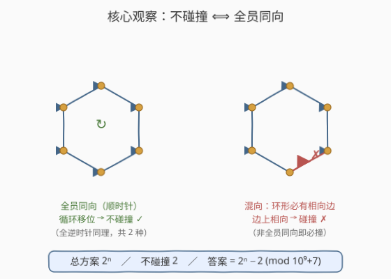
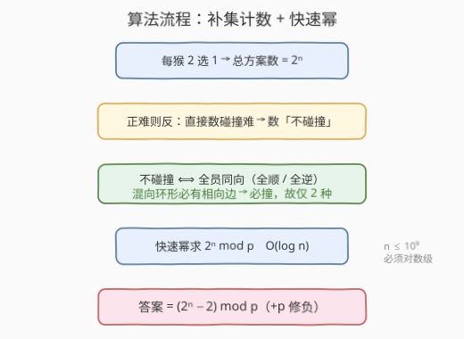
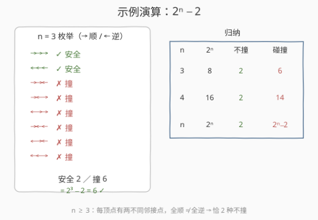

# 猴子碰撞的方法数

- **题目名称**：猴子碰撞的方法数
- **链接**：[2550. 猴子碰撞的方法数](https://leetcode.cn/problems/count-collisions-of-monkeys-on-a-polygon/)
- **难度**：中等
- **标签**：数学、组合计数、容斥原理、快速幂

## 1. 题目概述

给定一个正凸多边形，其上共有 $n$ 个顶点，按顺时针方向编号 $0$ 到 $n-1$，每个顶点上**正好一只猴子**。每只猴子同时移动到一个**相邻顶点**，且只能移动一次：

- 顺时针方向：$(i+1) \bmod n$，或
- 逆时针方向：$(i-1+n) \bmod n$。

若移动后**至少有两只猴子停留在同一顶点**，或**两只猴子相交在一条边上**，则发生**碰撞**。返回至少发生一次碰撞的移动方法数，对 $10^9+7$ 取余。

**示例 1**：

```text
输入：n = 3
输出：6
解释：共 8 种移动方式，其中 6 种发生碰撞。
```

**示例 2**：

```text
输入：n = 4
输出：14
解释：共 16 种移动方式，其中 14 种发生碰撞。
```

**约束条件**：

- $3 \le n \le 10^9$

> 💡 本题的支点不在「数碰撞」，而在「数不碰撞」。直接枚举碰撞情形（同顶相撞、边上相撞、多对同时撞）极易重复遗漏；而**不碰撞**的情形极其稀少——只有「全员顺时针」「全员逆时针」两种。于是答案 $= 2^n - 2$。$n \le 10^9$ 决定了必须用 $O(\log n)$ 的快速幂。

---

## 2. 解题思路

### 2.1 暴力思路：枚举 $2^n$ 种方案逐一判定

每只猴子有 $2$ 个选择，总方案数 $2^n$。最直白的是枚举每种方案，模拟移动后判定是否碰撞。

但 $n \le 10^9$，$2^n$ 本身是天文数字，$O(2^n)$ 完全不可行。而且即便能枚举，碰撞判定的分支（同顶 / 边上 / 多对）也很难写得干净。必须换视角。

### 2.2 核心观察：补集计数——不碰撞 ⟺ 全员同向



**正难则反**：与其数「至少一次碰撞」，不如数「一次也不碰撞」，再用总数减。

**关键定理**：一个方案不碰撞 $\iff$ 全部猴子朝同一方向移动（全顺时针或全逆时针）。

分两向证明：

- $\Longleftarrow$（同向则不碰撞）：全员顺时针时，猴 $i$ 去 $(i+1)\bmod n$，这是一次**循环移位**——每个顶点恰好收到一只猴子，无人同顶；所有猴子都沿环同一方向行进，没有任何一对在一条边上相向而行，故不碰撞。全员逆时针同理（反方向的循环移位）。共 **2 种**。

- $\Longrightarrow$（混向则必碰撞）：把每只猴子的方向排成环形 0/1 串（顺为 1、逆为 0）。若不全同，则串中既有 1 又有 0。沿环走一圈，1→0 的转变数 $=$ 0→1 的转变数（回到起点必自洽），且都 $\ge 1$。在任一 **1→0 转变处**（顶点 $i$ 顺时针、顶点 $i+1$ 逆时针）：猴 $i$ 沿边 $(i,i+1)$ 走向 $i+1$，猴 $i+1$ 沿同一条边走向 $i$——二者**在同一条边上相向而行，必相交**，碰撞。

> 💡 **为什么 1→0 转变一定存在？** 环形 0/1 串若同时含 0 和 1，绕一圈必然从 1「变回」0 至少一次（否则全是 1）。这一处转变正是「相邻两猴相向」的碰撞边。所以「不全同向」$\Rightarrow$ 必有碰撞，逆否即「不碰撞 $\Rightarrow$ 全员同向」。

由定理，不碰撞方案恰好 $2$ 种（全顺、全逆），故：

$$\text{碰撞方法数} = 2^n - 2$$

### 2.3 算法流程图



流程是一条线性链：总数 $2^n$ → 正难则反数「不碰撞」→ 不碰撞 $=2$ → 快速幂求 $2^n \bmod p$ → 答案 $(2^n-2)\bmod p$（减后加 $p$ 修负）。

### 2.4 示例演算



以 $n=3$（三角形）为例，逐个列出 $2^3=8$ 种方向串（$\to$=顺、$\leftarrow$=逆）：

| 方向串 | 结果 |
|--------|------|
| $\to\to\to$（全顺） | ✓ 安全 |
| $\leftarrow\leftarrow\leftarrow$（全逆） | ✓ 安全 |
| $\to\to\leftarrow,\ \to\leftarrow\to,\ \leftarrow\to\to,\ \to\leftarrow\leftarrow,\ \leftarrow\to\leftarrow,\ \leftarrow\leftarrow\to$ | ✗ 撞 |

安全 $2$ 种、碰撞 $6$ 种 $= 2^3-2=6$，与示例 1 吻合。$n=4$：$2^4-2=14$，与示例 2 吻合。

> ⚠️ **$n \ge 3$ 为何关键？** 只有 $n\ge 3$ 时，每个顶点的两个邻接点 $(i+1)\bmod n$ 与 $(i-1+n)\bmod n$ 才**不同**（猴子确有 2 个选择，$2^n$ 才有意义），且「全顺」与「全逆」是两个**不同**的方案（$n=2$ 时二者退化为同一种换位，不碰撞仅 1 种）。这正是约束给 $n\ge 3$ 的原因，也保证答案恒为 $2^n-2$。

---

## 3. 参考代码

### C++（快速幂）

```cpp
class Solution {
public:
    int monkeyMove(int n) {
        const int MOD = 1e9 + 7;
        long long ans = 1, base = 2;
        while (n) {
            if (n & 1) ans = ans * base % MOD;   // 当前二进制位为 1，累乘
            base = base * base % MOD;           // 平方，准备下一位
            n >>= 1;
        }
        return (ans - 2 + MOD) % MOD;           // 2^n - 2，加 MOD 规避负数
    }
};
```

### Python

```python
class Solution:
    def monkeyMove(self, n: int) -> int:
        MOD = 10**9 + 7
        return (pow(2, n, MOD) - 2) % MOD
```

> 💡 **几处细节**：(1) C++ 用 `long long` 承接中间乘积，`base * base % MOD` 每步取模防溢出。(2) `ans - 2` 理论上 $\ge 0$（$n\ge3 \Rightarrow 2^n\ge8$），但模运算后 `ans` 可能小于 2，故 `+ MOD` 再取模是稳妥的防御性写法。(3) Python 直接用内置三参数 `pow(2, n, MOD)`，底层即快速幂，最简。

---

## 4. 复杂度分析

| 维度 | 复杂度 | 说明 |
|------|--------|------|
| **时间复杂度** | $O(\log n)$ | 快速幂循环次数为 $n$ 的二进制位数 $\lfloor\log_2 n\rfloor+1$ |
| **空间复杂度** | $O(1)$ | 仅常数个变量 |

> 💡 $n \le 10^9$ 时 $\log_2 n \approx 30$，约 30 次乘法，极快。$O(\log n)$ 是本题的下界门槛：$O(n)$ 都会超时。

---

## 5. 扩展：直接证「混向必撞」的另一视角

除「环形 0/1 串必有 1→0 转变」外，还有一个更几何的论证：

设想所有猴子同时起跳。把每个顶点 $i$ 的方向记为箭头。若不全同向，则环上箭头方向发生「拐折」。沿环顺时针扫描，箭头从「顺」变「逆」的那条边，两端猴子箭头**指向前者的下家、后者的前家**——即都指向这条边的内部，二者必在边中相遇。这与「环形 0/1 串转变数」论证本质同构，只是把抽象的转变换成了直观的「箭头相向」。

> 💡 若题面改为「不发生碰撞的方法数」，答案即 $2$；若改为「$k$ 只猴子的最大同向群」之类，则需另立模型。本题的妙处在于「不碰撞」被压缩到了极致的 $2$ 种，使补集计数一击命中。

---

## 6. 面试要点

1. **为什么用补集计数，而不是直接数碰撞？**

   > 碰撞情形类别多（同顶相撞、边上相撞、多对同时撞），直接枚举易重易漏。而「不碰撞」极简——只有全员同向 2 种，数它再用 $2^n$ 减，干净利落。这是「正难则反」的经典体现。

2. **为什么「混向必撞」？请给出严格论证。**

   > 把方向排成环形 0/1 串，不全同则同时含 0、1。绕环一圈，1→0 转变数 $=$ 0→1 转变数且均 $\ge1$。任一 1→0 处，顶点 $i$ 顺时针走向 $i+1$、$i+1$ 逆时针走向 $i$，在边 $(i,i+1)$ 相向，必相交——碰撞。故混向必撞，逆否得「不撞 $\Rightarrow$ 同向」。

3. **$n \ge 3$ 的约束为什么必要？**

   > $n\ge3$ 才保证每顶点的两个邻接点不同（猴子确有 2 选 1，$2^n$ 有意义），且「全顺」「全逆」是两个不同方案（$n=2$ 时二者退化为同一种换位，不撞仅 1 种）。这也是答案恒为 $2^n-2$ 的前提。

4. **$n=10^9$ 时怎么算 $2^n \bmod p$？**

   > 快速幂（二进制拆分）：$n$ 写成二进制，逐位平方 `base`，该位为 1 则累乘进 `ans`，全程取模。$O(\log n)\approx30$ 次乘法。Python 可直接 `pow(2, n, MOD)`。

5. **`(ans - 2 + MOD) % MOD` 里 `+ MOD` 是不是多余的？**

   > 逻辑上 $2^n-2\ge0$（$n\ge3$），但模运算后 `ans`（$2^n\bmod p$）可能落在 $[0,2)$，直接减 2 在 C++ 会得负数。`+ MOD` 再取模是防御性写法，保证结果非负，无副作用。Python 的 `%` 天然返回非负，可省。

> 💡 **一句话总结**：2550 = 「$2^n-2$」。不碰撞仅「全员同向」2 种（循环移位，无同顶无相向），混向环形必有 1→0 转变即相向边必撞；补集计数 $2^n-2$，快速幂 $O(\log n)$ 取模。

---

## 7. 同类练习题

- [50. Pow(x, n)](https://leetcode.cn/problems/powx-n/)（[题解](../0001-0100/50_Powx_n.md)）：快速幂母题，二进制拆分求幂，本题 $2^n\bmod p$ 的直接基础
- [231. 2 的幂](https://leetcode.cn/problems/power-of-two/)（[题解](../0201-0300/231_2的幂.md)）：$2$ 的幂的判定，与本题「$2^n$ 总方案」的计数背景同源
- [29. 两数相除](https://leetcode.cn/problems/divide-two-integers/)（[题解](../0001-0100/29_两数相除.md)）：位运算「倍增 / 二进制拆分」思想，与快速幂同属对数级降阶范式
- [371. 两整数之和](https://leetcode.cn/problems/sum-of-two-integers/)（[题解](../0301-0400/371_两整数之和.md)）：位运算模拟运算，与快速幂的「位驱动」思路一脉相承
- [509. 斐波那契数](https://leetcode.cn/problems/fibonacci-number/)（[题解](../0501-0600/509_斐波那契数.md)）：可用矩阵快速幂将 $O(n)$ 递推优化到 $O(\log n)$，快速幂在 DP 加速上的迁移
