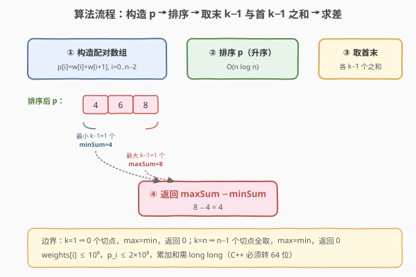

# 将珠子放入背包中

- **题目名称**：将珠子放入背包中
- **链接**：[2551. 将珠子放入背包中](https://leetcode.cn/problems/put-marbles-in-bags/)
- **难度**：困难
- **标签**：贪心、数组、排序、前缀和

## 1. 题目概述

有 `k` 个背包与一个下标从 $0$ 开始的整数数组 `weights`（`weights[i]` 为第 $i$ 颗珠子的重量）。把所有珠子按原顺序切成 $k$ 段**连续**子数组分别装入 $k$ 个背包，规则：

- 没有背包是空的；
- 同一背包内的珠子下标必须连续（即切分是 $k-1$ 个切割点）；
- 一个装下标 $i\ldots j$ 的背包，价格为 $\text{weights}[i]+\text{weights}[j]$（段首 + 段尾）。

一个方案的**分数**为 $k$ 个背包价格之和。求所有方案中**最大分数与最小分数的差值**。

**示例 1**：

```text
输入：weights = [1,3,5,1], k = 2
输出：4
解释：方案 [1],[3,5,1] 得分 (1+1)+(3+1)=6 为最小；
        方案 [1,3],[5,1] 得分 (1+3)+(5+1)=10 为最大。
        差值 = 10 − 6 = 4。
```

**示例 2**：

```text
输入：weights = [1,3], k = 2
输出：0
解释：唯一方案 [1],[3]，最大 = 最小，返回 0。
```

**约束条件**：

- $1 \le k \le \text{weights.length} \le 10^5$
- $1 \le \text{weights}[i] \le 10^9$

> ⚠️ **数值规模读法**：$n\le 10^5$，$\text{weights}[i]\le 10^9$，单段价格可达 $2\times 10^9$、$k$ 段求和上界 $\sim 2\times 10^{14}$，**必须用 `long long`**。切割方案数 $\binom{n-1}{k-1}$ 天文数字，**枚举切法必然超时**——必须把"切点如何贡献价格"拆成可独立排序求和的结构。

---

## 2. 解题思路

### 2.1 暴力思路：枚举所有切割方案

在 $n-1$ 个间隙中选 $k-1$ 个作切割点，共 $\binom{n-1}{k-1}$ 种方案，每种 $O(k)$ 累加价格。$n=10^5$ 时组合爆炸，彻底不可行。瓶颈在于把"哪 $k-1$ 个切点"当成整体搜索，未察觉每个切点贡献**独立可加**。

### 2.2 核心观察：切点贡献可加 + 首尾固定

![核心观察：每个切点 i 贡献 weights[i]+weights[i+1]，首尾 weights[0] 与 weights[n−1] 固定，分数 = 固定项 + 切点贡献之和](../images/marbles_concept.svg)

把切分写成 $k$ 段，设切割点为 $c_1<c_2<\dots<c_{k-1}$（在第 $c_j$ 颗后切，第 $j$ 段是 $[c_{j-1}+1,\ c_j]$，记 $c_0=-1$、$c_k=n-1$）。分数为各段首尾之和：

$$
\text{score}=\sum_{j=1}^{k}\big(\text{weights}[c_{j-1}+1]+\text{weights}[c_j]\big)
$$

展开重排——**每个内部下标恰作为前一段的尾与后一段的首出现两次**，首尾各出现一次：

$$
\text{score}=\underbrace{\text{weights}[0]+\text{weights}[n-1]}_{\text{固定项}}\;+\;\sum_{j=1}^{k-1}\underbrace{\big(\text{weights}[c_j]+\text{weights}[c_j+1]\big)}_{\text{切点 }c_j\text{ 的贡献}}
$$

于是分数完全由**选了哪 $k-1$ 个切点**决定，且每个切点的贡献 $p_i=\text{weights}[i]+\text{weights}[i+1]$ **彼此独立可加**。

> 💡 **为什么固定项是 $\text{weights}[0]+\text{weights}[n-1]$？** 第一段首恒为下标 $0$、第 $k$ 段尾恒为下标 $n-1$，它们永远贡献且只贡献一次；中间任一下标 $i$ 要么段内（不贡献），要么被切（作为前段尾 $+1$ 份、后段首 $+1$ 份共两份，即 $p_i$）。所以"段首+段尾求和"本质就是"首尾固定 + 切点配对求和"。

- **最大化分数**：在 $n-1$ 个切点里选 $k-1$ 个贡献 $p_i$ **最大**的；
- **最小化分数**：选 $k-1$ 个贡献 $p_i$ **最小**的；
- 固定项 $\text{weights}[0]+\text{weights}[n-1]$ 在两极值里**相同**，求差时**直接抵消**：

$$
\text{answer}=\Big(\sum\text{最大的 }k-1\text{ 个 }p_i\Big)-\Big(\sum\text{最小的 }k-1\text{ 个 }p_i\Big)
$$

即把 $p$ 排序后，**末尾 $k-1$ 个之和 − 开头 $k-1$ 个之和**。

### 2.3 算法流程图



```text
n = len(weights)
若 k == 1：return 0                      # 无切点，max=min
p[i] = weights[i] + weights[i+1],  i = 0..n-2    # n-1 个切点贡献
sort(p)
minSum = sum(p[0 .. k-2])                 # 最小的 k-1 个
maxSum = sum(p[n-k+1 .. n-2])            # 最大的 k-1 个（即末尾 k-1 个）
return maxSum - minSum
```

> ⚠️ **边界自洽**：① $k=1$ ⇒ $k-1=0$ 个切点，maxSum=minSum=0，返回 0。② $k=n$ ⇒ 必须 $n-1$ 个切点全切（每段单颗），$p$ 全取，maxSum=minSum=$\sum p$，返回 0。两种退化均正确。③ 注意"末尾 $k-1$ 个"的下标区间：$p$ 长度为 $n-1$，末尾 $k-1$ 个是 $p[n-k]\ldots p[n-2]$（共 $k-1$ 个）。

### 2.4 示例演算

![示例演算：weights=[1,3,5,1], k=2，配对 p=[4,8,6] 排序为 [4,6,8]，末 1 个 8 − 首 1 个 4 = 4](../images/marbles_example_walkthrough.svg)

$\text{weights}=[1,3,5,1]$，$k=2$，故 $k-1=1$ 个切点。

| 切点 $i$ | 段划分 | 分数 = $\text{weights}[0]+\text{weights}[3]+p_i$ | $p_i=\text{weights}[i]+\text{weights}[i+1]$ |
|----------|--------|--------------------------------------------------|---------------------------------------------|
| $i=0$ | $[1]\mid[3,5,1]$ | $(1+1)+(3+1)=6$ | $1+3=4$ |
| $i=1$ | $[1,3]\mid[5,1]$ | $(1+3)+(5+1)=10$ | $3+5=8$ |
| $i=2$ | $[1,3,5]\mid[1]$ | $(1+1)+(5+1)$ — 即 $(1+5)+(1+1)=8$ | $5+1=6$ |

固定项 $\text{weights}[0]+\text{weights}[3]=1+1=2$。三方案分数 = $2+p_i$ = $\{6,10,8\}$，与"固定项 + 切点贡献"完全吻合。

- 排序 $p=[4,6,8]$；
- $\maxSum=$ 末 $1$ 个 $=8$，$\minSum=$ 首 $1$ 个 $=4$；
- 答案 $=8-4=\mathbf{4}$，与示例一致（固定项 $2$ 在两极值里相同，被抵消）。

---

## 3. 参考代码

### C++

```cpp
class Solution {
public:
    long long putMarbles(vector<int>& weights, int k) {
        int n = weights.size();
        if (k == 1) return 0;                       // 无切点，max = min
        vector<long long> p(n - 1);
        for (int i = 0; i < n - 1; ++i) {
            p[i] = (long long)weights[i] + weights[i + 1];
        }
        sort(p.begin(), p.end());
        long long minSum = 0, maxSum = 0;
        for (int i = 0; i < k - 1; ++i) {           // 最小 k-1 个 / 最大 k-1 个
            minSum += p[i];
            maxSum += p[n - 2 - i];                 // p 末尾从右往左取
        }
        return maxSum - minSum;
    }
};
```

> 💡 **实现要点**：① `p` 用 `vector<long long>`：$\text{weights}[i]\le 10^9$，$p_i\le 2\times 10^9$ 已超 `int` 上界 $2{,}147{,}483{,}647$，必须 64 位。② 装入 `p` 时即强转 `long long`，避免 `int+int` 先溢出再转。③ 单循环同时累加首尾两端：`p[i]`（前 $k-1$）与 `p[n-2-i]`（末 $k-1$ 镜像），一次遍历 $O(k)$。④ `k==1` 提前返回 0，避免 `n-1=0` 时 `p` 为空、循环不执行也正确，但显式更清晰。

### Python

```python
class Solution:
    def putMarbles(self, weights: list[int], k: int) -> int:
        if k == 1:
            return 0
        p = sorted(weights[i] + weights[i + 1] for i in range(len(weights) - 1))
        return sum(p[-(k - 1):]) - sum(p[:k - 1])
```

> 💡 **对照 C++**：逻辑一致；Python 切片 `p[:k-1]` 取最小 $k-1$、`p[-(k-1):]` 取最大 $k-1$，写法更紧凑。Python 整数任意精度无溢出之忧。`sorted` 接生成器直接产出列表，省一次显式构造。

---

## 4. 复杂度分析

| 维度 | 复杂度 | 说明 |
|------|--------|------|
| 时间 | $O(n\log n)$ | 构造配对数组 $O(n)$；排序 $O(n\log n)$；首尾两端累加 $O(k)$，瓶颈在排序 |
| 空间 | $O(n)$ | 配对数组 $p$ 长度 $n-1$ |
| 对照：枚举切法 | $O\!\big(\binom{n-1}{k-1}\cdot k\big)$ | 组合爆炸，$n=10^5$ 不可行 |

> 💡 当 $k$ 接近 $n$ 或 $1$ 时累加部分 $O(k)$ 可达 $O(n)$，但仍小于排序 $O(n\log n)$。若只需差值而不必分别得 max/min，可用**快速选择 + 部分和**把排序降到 $O(n)$，但 $n\log n$ 已轻松通过 $10^5$，无需复杂化。

---

## 5. 扩展：从"切点贡献可加"到"排序选 Top"的范式

本题的精髓是**把一个带组合搜索的划分问题，归约成"在独立可加的标量集中选 Top"**。这一范式贯穿多题：

- **410. 分割数组的最大值**：把数组切 $k$ 段使"最大段和"最小——不能用"切点贡献可加"（段和不是切点的独立函数），转而**二分答案 + 贪心验证**；与本题互补，对照"何时能用排序选 Top、何时必须二分"。
- **1338. 数组大小减半**：按频率排序选 Top，贪心减半——同样是"独立贡献 + 排序选 Top"，但目标是覆盖而非极值差。
- **2141. 每位刷窗最大运行时间**：把任务分配给工人，按时长排序 + 二分可行性——同属"排序后用单调/二分解耦"的家族。

> ⚠️ **判断"可加"的关键**：若目标量能写成 $\sum f(\text{切点})$ 形式（本题 $f(i)=p_i$），则切点独立、可排序选 Top；若目标量是 $\max/\min$ over 段（如 410 的"最大段和"），切点间**耦合**，须改用二分答案。这是划分型问题最关键的分流判据。

---

## 6. 面试要点

1. **为什么固定项是 $\text{weights}[0]+\text{weights}[n-1]$，中间下标恰好成对出现？**

   > 第一段首恒为下标 $0$、第 $k$ 段尾恒为下标 $n-1$，各贡献一次。任一内部切点 $i$：$i$ 是前段尾（贡献 $\text{weights}[i]$）、$i+1$ 是后段首（贡献 $\text{weights}[i+1]$），合起来正是 $p_i$。未被切的下标既非任何段首也非任何段尾，不贡献。所以求和 = 首尾各一 + 每个切点 $p_i$ 一次。

2. **$k=1$ 与 $k=n$ 的边界如何自洽？**

   > $k=1$：$k-1=0$ 个切点，整段为一袋，分数恰为 $\text{weights}[0]+\text{weights}[n-1]$，max=min 该值，差 0。$k=n$：$n-1$ 个切点全切，每段单颗，分数 = $\sum_{i=0}^{n-1}2\text{weights}[i]$ — 但按公式 = 首尾 + $\sum_{i=0}^{n-2}p_i$ = $\text{weights}[0]+\text{weights}[n-1]+\sum_{i=0}^{n-2}(\text{weights}[i]+\text{weights}[i+1])$ = $2\sum\text{weights}$，吻合；唯一方案故 max=min，差 0。

3. **$\text{weights}[i]$ 可达 $10^9$，为什么必须用 `long long`？**

   > $p_i=\text{weights}[i]+\text{weights}[i+1]\le 2\times 10^9$，已超 32 位有符号 `int` 上界 $2{,}147{,}483{,}647$。累加 $k-1\le n-1\le 10^5-1$ 个，$\maxSum$ 上界 $\sim 10^5\times 2\times 10^9=2\times 10^{14}$，更远超 `int`。C++ 必须用 `long long` 存 $p$ 与累加和；Python 整数任意精度无需顾虑。

4. **能否不排序、用快速选择把时间降到 $O(n)$？**

   > 可以。用 `nth_element` 把第 $k-1$ 小与第 $k-1$ 大定位后，分别对两侧 $O(n)$ 求和，整体 $O(n)$。但常数较大，$n\le 10^5$ 时 $O(n\log n)$ 已毫秒级通过，工程上排序更简洁可读；仅当 $n$ 紧张到 $10^7$ 量级才值得换。

5. **为什么 max 与 min 的固定项相减时抵消，而不必显式算它？**

   > 固定项 $\text{weights}[0]+\text{weights}[n-1]$ 对**任何**切法都相同（首尾下标恒定），在 $\max$ 与 $\min$ 中取值一致。求差 $\max-\min$ 时 $\text{const}-\text{const}=0$，自然抵消。代码中干脆不计算固定项，直接返回"末 $k-1$ 之和 − 首 $k-1$ 之和"。

> 💡 **一句话总结**：切点贡献 $p_i=\text{weights}[i]+\text{weights}[i+1]$ 独立可加，首尾固定项抵消，答案 = 排序后末 $k-1$ 个之和 − 首 $k-1$ 个之和——把组合级划分搜索压成 $O(n\log n)$。

---

## 7. 同类练习题

- [410. 分割数组的最大值](https://leetcode.cn/problems/split-array-largest-sum/)：同为"数组切 $k$ 段"，但目标是"最大段和最小"，切点耦合不可加，须二分答案 + 贪心验证——与本题为"划分型问题可加 vs 不可加"的判分流对照
- [1011. 在 D 天内送达包裹的能力](https://leetcode.cn/problems/capacity-to-ship-packages-within-d-days/)：切 $k$ 段求"最大段和 ≤ 上限"的最小上限，二分答案 + 贪心，与 410 同构
- [2141. 每位刷窗最大运行时间](https://leetcode.cn/problems/maximum-running-time-of-n-computers/)：把任务分给工人，按时长排序 + 二分可行性，同属"排序后解耦 + 极值"家族
- [1338. 数组大小减半](https://leetcode.cn/problems/reduce-array-size-to-the-half/)：按频率排序选 Top 贪心覆盖，"独立贡献 + 排序选 Top"的纯贪心版
- [2538. 最大价值和与最小价值和的差值](https://leetcode.cn/problems/difference-between-maximum-and-minimum-price-sum/)：树形 DP 求"以某点为根时最大/最小价值和之差"，差值型题目但结构是树而非线性切分，对照"求 max−min"的不同载体
