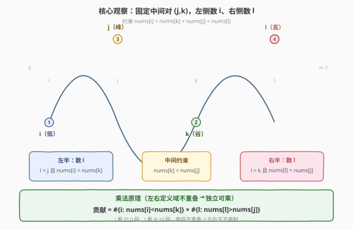

# 统计上升四元组

- **题目名称**：统计上升四元组
- **链接**：[2552. 统计上升四元组](https://leetcode.cn/problems/count-increasing-quadruplets/)
- **难度**：困难
- **标签**：数组、动态规划、枚举优化

## 1. 题目概述

给你一个长度为 $n$、下标从 $0$ 开始的整数数组 `nums`，它包含 $1$ 到 $n$ 的所有数字（即 `nums` 是一个**排列**）。请你返回**上升四元组**的数目。

四元组 $(i, j, k, l)$ 称为**上升的**，当且仅当：

- $0 \le i < j < k < l < n$，且
- $\textit{nums}[i] < \textit{nums}[k] < \textit{nums}[j] < \textit{nums}[l]$。

注意值的大小顺序并非沿下标递增——中间 $j$ 是一个**局部峰**（$\textit{nums}[j]$ 较大），$k$ 是一个**局部谷**（$\textit{nums}[k]$ 较小），整体呈「低—高—低—高」的锯齿形。

**示例 1**：

```text
输入：nums = [1,3,2,4,5]
输出：2
解释：
- i=0, j=1, k=2, l=3：nums[0]=1 < nums[2]=2 < nums[1]=3 < nums[3]=4 ✓
- i=0, j=1, k=2, l=4：nums[0]=1 < nums[2]=2 < nums[1]=3 < nums[3]=5 ✓
```

**示例 2**：

```text
输入：nums = [1,2,3,4]
输出：0
解释：唯一四元组 (0,1,2,3) 中 nums[1]=2 < nums[2]=3，不满足 nums[k] < nums[j]。
```

**约束条件**：

- $4 \le \textit{nums.length} \le 4000$
- $1 \le \textit{nums}[i] \le \textit{nums.length}$
- `nums` 中所有数字**互不相同**，`nums` 是一个排列。

> 💡 **关键性质**：`nums` 是排列意味着任意两个位置的值都不相等，比较结果非 $<$ 即 $>$，无需处理等号——这让后续的「互斥分支」判定（`nums[k] < nums[j]` 与 `nums[k] > nums[j]` 必居其一）天然成立。

---

## 2. 解题思路

### 2.1 暴力思路：四重循环枚举

最直白的做法是四重循环枚举所有 $(i, j, k, l)$，逐一检查 $\textit{nums}[i] < \textit{nums}[k] < \textit{nums}[j] < \textit{nums}[l]$：

```text
ans = 0
for i in 0..n-4:
  for j in i+1..n-3:
    for k in j+1..n-2:
      for l in k+1..n-1:
        if nums[i] < nums[k] < nums[j] < nums[l]:
          ans += 1
```

共 $O(n^4)$ 个四元组。$n = 4000$ 时约 $2.7\times10^{13}$，远超承受，必 TLE。

> ⚠️ 暴力的根病在于「把四个下标耦合在一起枚举」——任一层循环的推进都受其余三层牵制，无法独立优化。突破口是把四元约束**拆解**为左右两个**互相独立**的子计数，用乘法原理合并。

### 2.2 核心观察：固定中间对 (j, k)，左右独立计数



把约束 $\textit{nums}[i] < \textit{nums}[k] < \textit{nums}[j] < \textit{nums}[l]$ 按 $(j, k)$ 切成两半：

- **左半**（只涉及 $i$）：$i < j$ 且 $\textit{nums}[i] < \textit{nums}[k]$；
- **中间约束**：$\textit{nums}[k] < \textit{nums}[j]$（决定这对 $(j,k)$ 是否可用）；
- **右半**（只涉及 $l$）：$l > k$ 且 $\textit{nums}[l] > \textit{nums}[j]$。

关键在于：选定一个合法的中间对 $(j, k)$ 后（即 $j < k$ 且 $\textit{nums}[k] < \textit{nums}[j]$），**左半的 $i$ 与右半的 $l$ 互不牵制**——$i$ 只看 $[0, j)$ 段、$l$ 只看 $(k, n)$ 段，两段不重叠。由**乘法原理**：

$$\text{该 }(j,k)\text{ 的贡献} = \underbrace{\#\{i < j : \textit{nums}[i] < \textit{nums}[k]\}}_{\text{left}[k]} \times \underbrace{\#\{l > k : \textit{nums}[l] > \textit{nums}[j]\}}_{\text{right}}$$

答案即为所有合法 $(j, k)$ 对的贡献之和：

$$\textit{ans} = \sum_{\substack{j < k \\ \textit{nums}[k] < \textit{nums}[j]}} \text{left}[k] \times \text{right}$$

> 💡 **一句话直觉**：四个下标的耦合，在「固定中间两个」后被拆成左右两个**一维计数**；左右各自只依赖 $j$ 的一侧信息，互不干扰，乘起来即得该对贡献。把 $O(n^4)$ 的四重耦合降成 $O(n^2)$ 的两重枚举 $\times$ $O(1)$ 计数。

### 2.3 算法流程图

![算法流程：less[] 左扫维护、greater 右扫即时、单趟合并](../images/ciq_algorithm_flow.svg)

两个一维计数各有高效的维护方式，最终合并到**一趟右扫**：

1. **`less[k]` 左扫增量维护**：`less[k]` = 当前 $j$ 左侧 $\#\{i<j:\textit{nums}[i]<\textit{nums}[k]\}$。随 $j$ 从 $0$ 向右推进，每处理完一个 $j$，就把 $\textit{nums}[j]$ 并入前缀——对所有 $k>j$，若 $\textit{nums}[j] < \textit{nums}[k]$ 则 `less[k]++`。这样 $j$ 推进到下一格时 `less[k]` 已就绪。

2. **`greater` 右扫即时计算**：对固定的 $j$，`greater` = $\#\{l>k:\textit{nums}[l]>\textit{nums}[j]\}$。让 $k$ 从 $n-1$ 向左扫到 $j+1$，每步先用当前 `greater`（代表 $l>k$ 的计数），再把 $\textit{nums}[k]$ 并入「右侧」——若 $\textit{nums}[k] > \textit{nums}[j]$ 则 `greater++`（供更左的 $k$ 使用）。

3. **单趟合并**：由于 `nums` 是排列，$\textit{nums}[k]$ 与 $\textit{nums}[j]$ 非 $<$ 即 $>$，两条分支**互斥**：
   - $\textit{nums}[k] < \textit{nums}[j]$（合法对）：$\textit{ans} \mathrel{+}= \text{less}[k] \times \text{greater}$；
   - $\textit{nums}[k] > \textit{nums}[j]$（非合法对）：`greater++` 且 `less[k]++`（同时服务「右扫的 greater」与「左扫的 less」）。

> 💡 **合并的精妙**：右扫时 `less[k]` 的更新（`+1`）发生在 $\textit{nums}[k]>\textit{nums}[j]$ 分支，而 `less[k]` 的**使用**发生在 $\textit{nums}[k]<\textit{nums}[j]$ 分支——两者互斥，故「先读后写」不会自污染；又因每个 $k$ 只访问一次，更新也不波及其它 $k$。于是左扫增量与右扫即时被**无缝缝合进同一趟循环**，每步 $O(1)$。

### 2.4 示例演算

![示例演算：nums=[1,3,2,4,5] → j=1 命中，ans=2](../images/ciq_example_walkthrough.svg)

以示例 1 $\textit{nums}=[1,3,2,4,5]$（$n=5$）演算。初始 `less=[0,0,0,0,0]`，`ans=0`。

| $j$ | $\textit{nums}[j]$ | 右扫 $k$（$n{-}1\to j{+}1$） | less 变化 | greater | ans |
|-----|------|--------------------------------------------|-----------|---------|-----|
| 0 | 1 | $k$=4→1 全 $>\!1$，无合法对 | `[0,1,1,1,1]` | — | 0 |
| 1 | 3 | $k$=4,3 $>\!3$ → greater=2；$k$=2 $<\!3$ → **ans += less[2]×2 = 1×2** | `[0,1,1,2,2]` | 2 | **2** |
| 2 | 2 | $k$=4,3 $>\!2$，无合法对 | `[0,1,1,3,3]` | — | 2 |
| 3 | 4 | $k$=4 $>\!4$，无合法对 | `[0,1,1,3,4]` | — | 2 |
| 4 | 5 | 无 $k>4$ | — | — | 2 |

- **$j=1$（$\textit{nums}[j]=3$）是唯一命中点**：右扫 $k=4$（值 5 > 3）→ `greater=1`、`less[4]++`；$k=3$（值 4 > 3）→ `greater=2`、`less[3]++`；$k=2$（值 2 < 3）→ **合法对**，$\textit{ans} \mathrel{+}= \text{less}[2]\times\text{greater}=1\times2=2$。
- `less[2]=1` 代表 $i<1$ 且 $\textit{nums}[i]<\textit{nums}[2]=2$ 的个数，即 $i=0$（值 1 < 2）唯一一个；`greater=2` 代表 $l>2$ 且 $\textit{nums}[l]>\textit{nums}[1]=3$ 的个数，即 $l=3$（值 4）、$l=4$（值 5）两个。$1\times2=2$ ✓。
- $j=2$（值 2）右扫 $k=4,3$ 均 $>\!2$，无合法对（没有 $k$ 使 $\textit{nums}[k]<2$）。

$\textit{ans}=2$ ✓。

> ⚠️ 示例 2 $[1,2,3,4]$：$j=0$（值 1）右扫全 $>\!1$；$j=1$（值 2）右扫 $k=3,2$ 均 $>\!2$，无 $\textit{nums}[k]<\textit{nums}[j]$ 的合法对；$j=2$（值 3）右扫 $k=3$（值 4 > 3）。全程无命中，$\textit{ans}=0$ ✓——单调递增排列里不存在「峰—谷」结构。

---

## 3. 参考代码

### C++

```cpp
class Solution {
public:
    long long countQuadruplets(vector<int>& nums) {
        int n = nums.size();
        long long ans = 0;
        vector<int> less(n, 0);            // less[k] = #{i < j : nums[i] < nums[k]}
        for (int j = 0; j < n; ++j) {
            int greater = 0;               // greater = #{l > k : nums[l] > nums[j]}
            for (int k = n - 1; k > j; --k) {
                if (nums[k] < nums[j]) {   // 合法中间对 (j, k)
                    ans += (long long)less[k] * greater;
                } else {                   // nums[k] > nums[j]（排列，无相等）
                    greater++;
                    less[k]++;             // nums[j] 并入左前缀，服务后续 j
                }
            }
        }
        return ans;
    }
};
```

> 💡 **为什么 `less[k]` 在右扫里更新是安全的**：`less[k]` 的**使用**（`ans +=`）发生在 $\textit{nums}[k]<\textit{nums}[j]$ 分支，**更新**（`++`）发生在 $\textit{nums}[k]>\textit{nums}[j]$ 分支，两分支互斥；且 $k$ 从右到左各访问一次，更新不波及其它 $k$。故「右扫即时维护 left」与「左扫增量服务后续 j」被合并进同一趟循环，每步 $O(1)$。

### Python

```python
class Solution:
    def countQuadruplets(self, nums: List[int]) -> int:
        n = len(nums)
        ans = 0
        less = [0] * n                     # less[k] = #{i < j : nums[i] < nums[k]}
        for j in range(n):
            greater = 0                    # greater = #{l > k : nums[l] > nums[j]}
            for k in range(n - 1, j, -1):
                if nums[k] < nums[j]:      # 合法中间对 (j, k)
                    ans += less[k] * greater
                else:                      # nums[k] > nums[j]（排列，无相等）
                    greater += 1
                    less[k] += 1           # nums[j] 并入左前缀，服务后续 j
        return ans
```

> 💡 Python 原生大整数，`ans` 累加无需担心溢出（最坏 $\binom{4000}{4}\approx 2.7\times10^{13}$，超 `int` 但 Python 自动转长整型）。两版逻辑完全镜像，$O(n^2)$ 时间、$O(n)$ 空间。

---

## 4. 复杂度分析

| 维度 | 复杂度 | 说明 |
|------|--------|------|
| **时间复杂度** | $O(n^2)$ | 外层 $j$ 跑 $n$ 趟，每趟内层 $k$ 从 $n-1$ 扫到 $j+1$，至多 $n$ 步、每步 $O(1)$；$n\le4000$ ⟹ $\le 1.6\times10^7$ |
| **空间复杂度** | $O(n)$ | 仅一个 `less` 数组长度 $n$；`greater` 是标量 |
| 对照：四重暴力 | $O(n^4)$ | 逐四元组检查，$n=4000$ 时约 $2.7\times10^{13}$，不可行 |
| 对照：三重 + 预处理 | $O(n^3)$ | 固定 $(j,k)$ 后线性数 $i$、$l$，仍 $\sim6.4\times10^{10}$，不可行 |

> 💡 降阶关键：把「四下标耦合枚举」拆成「固定中间两个 + 左右各一维计数」。左计数 `less[]` 用**左扫增量**摊到每步 $O(1)$，右计数 `greater` 用**右扫即时**也摊到 $O(1)$，于是每对 $(j,k)$ 的贡献在 $O(1)$ 内得出，总计 $O(n^2)$。

---

## 5. 扩展：另一种等价的「三元组累积」视角

固定 $j$ 与 $l$（两个「高位」），把中间的 $(i, k)$ 看作一个**合法三元组** $(i, j, k)$ 满足 $i<j<k$ 且 $\textit{nums}[i]<\textit{nums}[k]<\textit{nums}[j]$。对固定的 $j$，让 $l$ 从 $j+1$ 向右扫，维护一个累加器 `triple`：

- 遇 $\textit{nums}[l]>\textit{nums}[j]$：以 $l$ 为第四位的四元组数 $=$ 当前 `triple`，$\textit{ans}\mathrel{+}=\textit{triple}$；
- 遇 $\textit{nums}[l]<\textit{nums}[j]$：$l$ 可充当某个三元组的 $k$，`triple += less[l]`（$i$ 的个数由 `less` 给出）。

这同样 $O(n^2)$、$O(n)$ 空间，视角从「固定 $(j,k)$ 数左右」换成「固定 $(j,l)$ 累积中间三元组」。两者**等价**——只是把乘法原理的「左 $\times$ 右」换成了「右扫时累加左」的卷积形式。选择哪种取决于哪种更好讲清楚：乘法版更直观（左右独立），累积版更连贯（一趢单向扫）。

> 💡 更一般地，本题属于「**枚举中间断点 + 两侧独立计数**」范式：把高元约束沿某个断点切成左右两个低元子问题，用乘法或卷积合并。同类思路见逆序对（固定一个断点数左右）、$k$ 元递增子序列计数（逐位 DP 累积前驱个数）。

---

## 6. 面试要点

1. **为什么固定 $(j, k)$ 而不是固定 $(i, l)$ 或 $(j, l)$？**

   > 固定 $(j, k)$ 后，左半只约束 $i<j$（与 $l$ 无关）、右半只约束 $l>k$（与 $i$ 无关），两侧**定义域不重叠**，天然独立可乘。若固定 $(i,l)$，中间的 $j,k$ 互相约束（$j<k$ 且 $\textit{nums}[k]<\textit{nums}[j]$），仍需二重枚举，未降阶。$(j,k)$ 恰是「使两侧定义域分离」的切点。

2. **`less[k]` 为什么能在右扫时同步更新而不出错？**

   > `less[k]` 的使用在 $\textit{nums}[k]<\textit{nums}[j]$ 分支，更新在 $\textit{nums}[k]>\textit{nums}[j]$ 分支，因 `nums` 是排列二者**互斥**，不会「先改后用同值」。又因 $k$ 从右到左各访问一次，对 `less[k]` 的 `++` 不影响其它下标。这两个条件合起来保证「右扫即时维护 left」与「为后续 $j$ 准备 left」可合并进同一趟循环。

3. **为什么答案要用 `long long`？最坏有多大？**

   > 四元组总数上界 $\binom{n}{4}$，$n=4000$ 时约 $\binom{4000}{4}\approx 2.7\times10^{13}$，远超 `int`（$\sim2.1\times10^9$）。C++ 必须用 `long long`；Python 原生大整数无需操心。累加项 `less[k]*greater` 也可能超 `int`，需在乘法前转型。

4. **如果不是排列（允许相等元素），算法要怎么改？**

   > 相等时 $\textit{nums}[k]=\textit{nums}[j]$ 既不满足 $<$ 也不满足 $>$，当前两分支都不进——但此 $k$ 既不该计入 `greater`（需 $>$）也不该让 `less[k]` 并入 $\textit{nums}[j]$（需 $<$），所以**跳过即可**，逻辑仍正确。唯一要确认的是题面约束 $\textit{nums}[i]<\textit{nums}[k]$ 等严格不等号在相等时天然不满足，跳过等于自动排除，无需额外处理。

5. **`greater` 为什么必须从 $k=n{-}1$ 往左扫，不能从 $j{+}1$ 往右扫？**

   > `greater` 表示「$l>k$ 的右侧计数」，只有从右往左扫时，已处理过的（更右的）$k$ 恰是「$l>$ 当前 $k$」的候选来源，每左移一步把 $\textit{nums}[k]$ 并入即可增量维护。若从左往右扫，`greater` 需表示「$l>$ 当前 $k$」即右半段，但右半段尚未遍历，无从增量累计，只能每步重数，退化为 $O(n)$ 每步、$O(n^3)$ 总计。

> 💡 **一句话总结**：固定中间对 $(j,k)$，左侧 $i$ 计数用 `less[]` 左扫增量维护、右侧 $l$ 计数用 `greater` 右扫即时计算，乘法原理合并 $O(1)$ 得每对贡献；两维护合并进同一趟右扫（互斥分支不冲突），$O(n^2)$ 时间、$O(n)$ 空间。

---

## 7. 同类练习题

- [315. 计算右侧小于当前元素的个数](https://leetcode.cn/problems/count-of-smaller-numbers-after-self/)（[题解](../0301-0400/315_计算右侧小于当前元素的个数.md)）：「右侧计数」的鼻祖，对照本题 `greater` 的右扫即时维护与归并/树状数组的通用手法
- [611. 有效三角形的个数](https://leetcode.cn/problems/valid-triangle-number/)（[题解](../0601-0700/611_有效三角形的个数.md)）：固定一边 + 双指针数两侧，同为「固定断点 + 两侧独立计数」范式，对照乘法合并 vs 双指针合并
- [1296. 划分为递增数字序列](https://leetcode.cn/problems/divide-array-in-sets-of-k-consecutive-numbers/)：排列/频次约束下的计数与划分，对照本题对「排列」性质的利用
- [139. 单词拆分](https://leetcode.cn/problems/word-break/)（[题解](../0001-0100/139_单词拆分.md)）：前缀缓存 + 增量查表，对照本题 `less[]` 左扫增量维护「前缀复用」的思想
