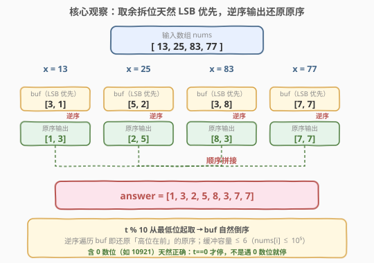
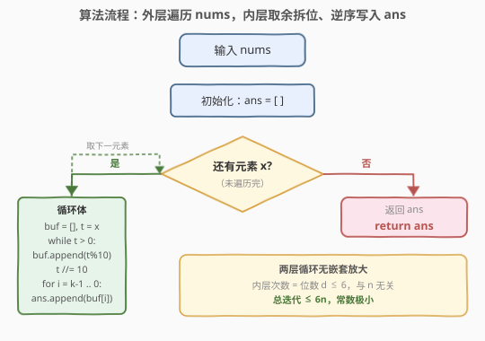
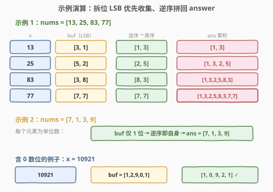

# LeetCode 分割数组中数字的数位 题解

## 1. 题目概述

- **标题 / 题号**：分割数组中数字的数位（#2553，easy）
- **链接**：https://leetcode.cn/problems/separate-the-digits-in-an-array/
- **难度**：简单
- **标签**：数组、数学、模拟

**题意**：给定一个正整数数组 `nums`，返回一个数组 `answer`：将 `nums` 中每个整数按出现顺序做**数位分割**后，依次把分割得到的数字拼到 `answer` 末尾。

对一个整数做数位分割，指的是把它**每一位十进制数字按原本出现的顺序**排列成数组（高位在前、低位在后）。

- 例如 $10921$ 分割为 $[1, 0, 9, 2, 1]$。

**示例 1**：

```text
输入：nums = [13,25,83,77]
输出：[1,3,2,5,8,3,7,7]
解释：分割 13 得 [1,3]；分割 25 得 [2,5]；分割 83 得 [8,3]；分割 77 得 [7,7]。
     answer = [1,3,2,5,8,3,7,7]。
```

**示例 2**：

```text
输入：nums = [7,1,3,9]
输出：[7,1,3,9]
解释：nums 中每个整数都是一位数，分割即自身。
```

**约束**：

- $1 \le \text{nums.length} \le 1000$
- $1 \le \text{nums[i]} \le 10^5$

> 💡 关键细节：题目要求**保留原顺序**——既要保留 `nums` 中元素出现的顺序，也要保留**每个整数内部高位到低位的原始顺序**。后者是隐性约束，常被忽略：`%10` 取余天然从**最低位**起拆，方向正好相反，必须借助小缓冲区逆序输出，才能还原「高位在前」的原始顺序。

## 2. 解题思路

### 2.1 暴力思路：转字符串逐字符还原

最直观的写法是**走字符串**：对每个 `x`，`str(x)` 直接给出「高位在前」的字符序列，逐字符 `int(c)` 转回数字、追加到答案即可。

```python
ans = []
for x in nums:
    for c in str(x):
        ans.append(int(c))
```

一行 Python：`[int(c) for x in nums for c in str(x)]`。逻辑零转弯——字符串天然按书写顺序遍历，无需关心方向问题。但引入了字符串对象与字符→整型的类型转换，每个元素额外开辟 $O(d)$ 的字符串空间（$d$ 为位数）。

> ⚠️ 转字符串版是**正确性最容易保证**的写法，面试可先给此版讲清题意，再优化为纯整数运算版展示对底层运算的把控。两种实现**结果一致**，差别只在「如何取到每一位」。

### 2.2 核心观察：取余拆位 LSB 优先，逆序输出即还原原序



**关键直觉**：纯整数拆位靠 `t % 10` 取最低位、`t //= 10` 推进。这套循环**从低位向高位**逐位产出数字，方向与题目要求的「高位在前」**正好相反**。

直接把每次 `t % 10` 取出的数字追加到答案会得到**完全倒置**的数位序列（如 $13$ 拆出 $3$ 再拆出 $1$，直接拼得 $[3, 1]$，错）。修正方法是「**先收容、后倒序**」：

- 设一个小缓冲 `buf`（容量 $\le 6$，因 $\text{nums[i]} \le 10^5$ 至多 6 位），按取余顺序写入 `buf`；
- 全部取完后，**逆序遍历 `buf`** 把数字追加到 `answer`，即得原序。

> 💡 **为何缓冲区是 $O(1)$？** 单个 `nums[i]` 至多 6 位十进制，故 `buf` 最多 6 个元素——可视为常数空间。整个算法的额外空间只算这份「单元素缓冲」，不随 $n$ 增长；最终 `answer` 的长度本身 $\sum d_i = O(n \cdot \overline{d})$，是输出固有开销，不计入辅助空间。

**关于含 0 数位**：题目保证 $\text{nums[i]} \ge 1$ 为正整数，循环条件 `t > 0` 在 `t == 0` 时终止——注意是 `t`（整个数被吃完）归零才停，不是「遇到 0 数位」就停。例如 $10921$：拆位产出 $1, 2, 9, 0, 1$（LSB→MSB），中间的 $0$ 数位照样被取出并写入 `buf`，逆序得 $[1, 0, 9, 2, 1]$ ✓。

验证两个示例：

| `nums` | 各元素拆位（LSB 优先）| 逆序后拼接 | 输出 |
|--------|------------------------|------------|------|
| $[13, 25, 83, 77]$ | $[3,1]$ / $[5,2]$ / $[3,8]$ / $[7,7]$ | $[1,3]$ + $[2,5]$ + $[8,3]$ + $[7,7]$ | $[1,3,2,5,8,3,7,7]$ |
| $[7, 1, 3, 9]$ | $[7]$ / $[1]$ / $[3]$ / $[9]$ | $[7]$ + $[1]$ + $[3]$ + $[9]$ | $[7,1,3,9]$ |

> ⚠️ 单位数元素是退化情形：`t % 10` 直接取出唯一一位，`buf` 仅含 1 个元素，逆序即自身。无需特判。

### 2.3 算法流程图



流程分两层循环：

1. 初始化空数组 `ans`；
2. 对每个 $x \in \text{nums}$：
   - 初始化空缓冲 `buf` 与临时副本 $t = x$；
   - **内层 while**：当 $t > 0$，取 $d = t \bmod 10$ 写入 `buf` 末尾，$t \leftarrow \lfloor t / 10 \rfloor$；
   - **逆序写回**：从 `buf` 末位向首位遍历，把每个数字 `push_back` 到 `ans`；
3. 返回 `ans`。

> 💡 内层循环总次数 $= \sum_i d_i \le 6n$（$d_i$ 为 `nums[i]` 位数），常数极小。两层循环**没有嵌套放大**——内层循环次数由「位数」决定，与 $n$ 无关。

### 2.4 示例演算



- **示例 1** `[13, 25, 83, 77]`：
  - $13$：$t=13 \to d=3$、$t=1 \to d=1$；`buf=[3,1]`，逆序 $\to$ `[1,3]` 拼入 `ans`；
  - $25$：`buf=[5,2]`，逆序 $\to$ `[2,5]`；
  - $83$：`buf=[3,8]`，逆序 $\to$ `[8,3]`；
  - $77$：`buf=[7,7]`，逆序 $\to$ `[7,7]`；
  - 最终 `ans = [1,3,2,5,8,3,7,7]`。
- **示例 2** `[7, 1, 3, 9]`：每个元素为单位数，`buf` 仅 1 位、逆序即自身，`ans` 与原数组一致。

## 3. 参考代码

### C++

```cpp
class Solution {
public:
    vector<int> separateDigits(vector<int>& nums) {
        vector<int> ans;
        ans.reserve(nums.size() * 6);  // nums[i] <= 1e5，至多 6 位
        int buf[6];
        for (int x : nums) {
            int k = 0;
            for (int t = x; t; t /= 10) buf[k++] = t % 10;
            for (int i = k - 1; i >= 0; --i) ans.push_back(buf[i]);
        }
        return ans;
    }
};
```

> 💡 `buf[6]` 在栈上分配、循环外复用，每元素只更新 `k` 与内容，零堆分配。`ans.reserve(nums.size() * 6)` 预留容量避免多次扩容（最坏情况全部 6 位数）。内层 `for (int t = x; t; t /= 10)` 用拷贝 `t` 推进拆位，`x` 原值不动（本题本轮后不再用，但拷贝习惯便于阅读，与 [2520](../2501-2600/2520_统计能整除数字的位数.md) 同一拆位范式）。`t` 为正整数时循环条件 `t` 等价于 `t > 0`，到 `0` 自然终止。

### Python

```python
class Solution:
    def separateDigits(self, nums: List[int]) -> List[int]:
        ans = []
        for x in nums:
            buf = []
            t = x
            while t:
                buf.append(t % 10)
                t //= 10
            ans.extend(reversed(buf))
        return ans
```

> 💡 Python 整除用 `//=`；`buf` 是列表，`reversed(buf)` 返回迭代器、`extend` 一次性吞入。也可走字符串版一行：`return [int(c) for x in nums for c in str(x)]`——更 Pythonic 但含类型转换、空间 $O(\sum d_i)$ 字符串。取余版纯整数、辅助空间 $O(1)$（不计输出）。

## 4. 复杂度分析

| 维度 | 复杂度 | 说明 |
|------|--------|------|
| **时间复杂度** | $O(n \cdot \overline{d})$ | 外层 $n$ 次，内层每位一次取余 + 一次整除；$d_i \le 6$ 故 $\overline{d} \le 6$，即 $O(n)$ |
| **空间复杂度** | $O(1)$ 辅助 / $O(n \cdot \overline{d})$ 输出 | 缓冲 `buf` 容量 $\le 6$ 为常数；输出 `ans` 长度固有 $\sum d_i$ |
| 对照：转字符串版 | $O(n \cdot d)$ 时间 / $O(n \cdot d)$ 辅助空间 | 额外生成各元素字符串 |

> 💡 本题无可省的代数捷径——必须逐元素读入并拆位输出，$O(n)$ 已是最优。但因 $d \le 6$ 常数极小，实践中近乎瞬时。`ans.reserve(n * 6)` 把扩容次数从均摊 $O(\sum d_i)$ 降到 $O(1)$，但总复杂度级别不变。

## 5. 扩展：高位优先拆位的另一种实现

「逆序输出小缓冲」并非唯一还原原序的方法。另一种思路是**预计算最高位权** $10^{d-1}$，从高位向低位逐位取出：

```python
import math
ans = []
for x in nums:
    p = 10 ** int(math.log10(x))   # 最高位权，如 x=10921 → p=10000
    while p:
        ans.append(x // p)         # 取最高位
        x %= p                     # 去掉最高位
        p //= 10
```

例如 $10921$：$p=10000 \to 10921 // 10000 = 1$、余 $921$；$p=1000 \to 921 // 1000 = 0$、余 $921$；$p=100 \to 921 // 100 = 9$、余 $21$；$p=10 \to 21 // 10 = 2$、余 $1$；$p=1 \to 1 // 1 = 1$、余 $0$；$p=0$ 终止。得 $[1, 0, 9, 2, 1]$ ✓。

两种思路对比：

| 维度 | LSB 优先 + 逆序 | MSB 优先（预计算权） |
|------|------------------|----------------------|
| 实现复杂度 | 简单（一个 `%10 //10` 循环 + 倒序遍历）| 需 `log10` 预计算高位权 |
| 中间 0 数位处理 | 天然正确（`t > 0` 终止于数被吃完）| 天然正确（`x % p` 保留中间 0）|
| 缓冲区 | 需要 `buf`（容量 $\le 6$）| 无需缓冲，直接写 `ans` |
| 实战偏好 | 面试常用、易写对 | 略繁，但代码更「直接」 |

> 💡 LSB + 逆序版更符合「逐位取余」的肌肉记忆，写起来不易出错；MSB 优先版省了缓冲，但要小心 `x = 0` 的边界（`log10(0)` 未定义）——但本题保证 `nums[i] >= 1`，故安全。

## 6. 面试要点

1. **为什么 `%10 // 10` 拆出的数位是「倒序」的？怎么修正？**

   > `t % 10` 取的是**最低位**（个位、十位、百位…顺序产出），而题目要「高位在前」。直接 `ans.append(t % 10)` 会得到完全倒置的序列。修正是先收容到小缓冲 `buf`，全部取完后再**逆序遍历 `buf`** 追加到 `ans`。本质上 `buf` 起到了「栈」的作用——后进先出反转顺序。

2. **含 0 数位的数（如 $10921$）会不会出问题？**

   > 不会。循环终止条件是 `t == 0`（整个数被吃完），不是「遇到 0 数位就停」。$10921$ 拆位产出 $1, 2, 9, 0, 1$（LSB→MSB），中间的 $0$ 数位照样被 `t % 10` 取出并写入 `buf`，逆序得 $[1, 0, 9, 2, 1]$ ✓。常见 bug 是误以为「`t % 10 == 0` 就跳过」，这会漏掉 0 数位。

3. **为什么 `ans` 的空间不计入辅助空间复杂度？**

   > `ans` 是题目**要求返回的输出**，空间复杂度分析通常只算「为计算而额外开辟」的辅助空间，不算输出本身。`ans` 长度固有地等于 $\sum d_i = O(n \cdot \overline{d})$，无法省。真正的辅助空间是 `buf`（$\le 6$）、`t`、`k` 等常数项，故 $O(1)$。

4. **`ans.reserve(n * 6)` 的作用？不加会怎样？**

   > `push_back` 在容量满时触发扩容（通常 1.5 倍或 2 倍），均摊下来每次 `push_back` 仍 $O(1)$，总均摊 $O(\sum d_i)$。`reserve` 把扩容次数从 $O(\sum d_i)$ 降到 $O(1)$（一次性预留），去掉均摊分析里的常数因子。本题规模 $n \le 1000$、$\sum d_i \le 6000$，性能差异可忽略，但 `reserve` 是「知道上界就预留」的好习惯。

5. **取余拆位与转字符串拆位如何取舍？**

   > 判定逻辑一致，差别在「如何取到每位」。取余 `%10 // 10` 纯整数、$O(1)$ 辅助空间、无类型转换；转字符串 `str(x)` 直观（自然按书写顺序）但开 $O(d)$ 字符串空间。面试可先给字符串版讲清思路，再优化为取余版展示对底层运算的把控。本题 $d \le 6$ 两者性能无实质差异。

> 💡 **一句话总结**：外层遍历 `nums`，内层 `t = x; while t: buf.append(t % 10); t //= 10` 收集 LSB 优先数位，再 `ans.extend(reversed(buf))` 逆序拼回——还原「高位在前」的原序；$O(n \cdot \overline{d})$ 时间、$O(1)$ 辅助空间，输出 $O(n \cdot \overline{d})$ 固有。

## 同类练习题

| # | 题目 | 与本题的关联 |
|---|------|-------------|
| 2520 | [统计能整除数字的位数](https://leetcode.cn/problems/count-the-digits-that-divide-a-number/)（[题解](../2501-2600/2520_统计能整除数字的位数.md)） | 同用 `t = x; while t: t%10; t//=10` 拆位模板，对照「逐位判定」与「逐位输出」两种用法 |
| 2535 | [数组元素和与数字和的绝对差](https://leetcode.cn/problems/difference-between-element-sum-and-digit-sum-of-an-array/)（[题解](../2501-2600/2535_数组元素和与数字和的绝对差.md)） | 同一「数组遍历 + 逐位拆数」骨架，对照「拆位求和」与「拆位输出」 |
| 1281 | [整数的各位积和之差](https://leetcode.cn/problems/subtract-the-product-and-sum-of-digits-of-an-integer/)（[题解](../1201-1300/1281_整数各位积和之差.md)） | 单数拆位累乘与累加的母题，承接「逐位聚合」一族 |
| 2119 | [反转两次的数字](https://leetcode.cn/problems/a-number-after-a-double-reversal/)（[题解](../2101-2200/2119_反转两次的数字.md)） | 数位反转判定与原数是否相等，承接「整数的数位操作」一族 |
| 7 | [整数反转](https://leetcode.cn/problems/reverse-integer/)（[题解](../0001-0100/7_整数反转.md)） | 逐位 `%10` 取出再 `*10+` 拼接成反转数，数位拆取的母题 |
