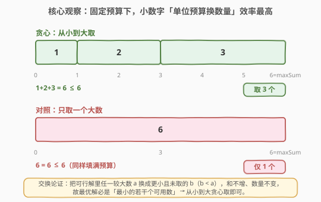
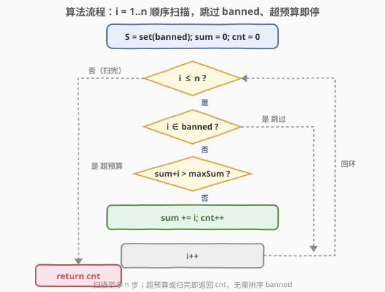
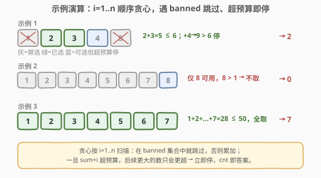

# LeetCode 从一个范围内选择最多整数 I 题解

## 1. 题目概述

- **标题 / 题号**：从一个范围内选择最多整数 I（#2554，medium）
- **链接**：https://leetcode.cn/problems/maximum-number-of-integers-to-choose-from-a-range-i/
- **难度**：中等
- **标签**：贪心、数组、哈希表

**题意**：给定一个整数数组 `banned` 和两个整数 `n`、`maxSum`。从范围 $[1, n]$ 中选择一些整数，需满足：

- 每个整数**至多选一次**；
- 选中的整数不能出现在 `banned` 中；
- 选中整数的**和不超过** `maxSum`。

返回按上述规则**最多**能选的整数数目。

**示例 1**：

```text
输入：banned = [1,6,5], n = 5, maxSum = 6
输出：2
解释：可选 2 和 4。2+4=6 ≤ 6，二者都在 [1,5] 内且不在 banned 中。
     （注意：选 2 和 3 也是 5 ≤ 6，同样取 2 个。）
```

**示例 2**：

```text
输入：banned = [1,2,3,4,5,6,7], n = 8, maxSum = 1
输出：0
解释：[1,8] 内只有 8 不在 banned 中，但 8 > 1，无法选任何整数。
```

**示例 3**：

```text
输入：banned = [11], n = 7, maxSum = 50
输出：7
解释：可选 1,2,3,4,5,6,7，和为 28 ≤ 50，全部可选。
```

**约束**：

- $1 \le \text{banned.length} \le 10^4$
- $1 \le \text{banned[i]},\, n \le 10^4$
- $1 \le \text{maxSum} \le 10^9$
- `banned` 中元素**互不相同**

> 💡 关键细节：目标是「最大化**数量**」而非「最大化**和**」。在固定的预算 `maxSum` 下，小数字「每个数吃掉一小段预算」的效率更高——同样填满预算，挑小数字能塞更多个。这一直觉正是贪心的支点，详见 2.2 的交换论证。

## 2. 解题思路

### 2.1 暴力思路：枚举所有可用子集

可用候选集 $A = [1, n] \setminus \text{banned}$，大小 $|A| \le n$。最朴素的解法是枚举 $A$ 的所有子集，对每个子集检查和是否 $\le \text{maxSum}$，取满足条件的最大规模：

```python
best = 0
for mask in range(1 << len(A)):
    s = cnt = 0
    for j in range(len(A)):
        if mask >> j & 1:
            s += A[j]; cnt += 1
    if s <= maxSum:
        best = max(best, cnt)
return best
```

时间 $O(2^{|A|} \cdot |A|)$，指数级——$n \le 10^4$ 时 $|A|$ 可达上万，完全不可行。暴力只为引出「最优结构长什么样」：它暗示答案与「最小的若干个数」强相关。

### 2.2 核心观察：贪心从小到大取（交换论证）



**关键引理**：在可用数 $A$ 中，任取 $r$ 个**不同**的数，其和的**最小值** = $A$ 中最小的 $r$ 个数之和（由重排：要让和最小，必取最小的那些）。

**贪心算法**：按 $i = 1, 2, \dots, n$ 顺序扫描；遇到 `banned` 中的就跳过；否则若 $\text{sum} + i \le \text{maxSum}$ 就选入（累加、计数），一旦 $\text{sum} + i > \text{maxSum}$ 就**立即停止**。

设贪心选出 $k$ 个数。由引理：

- 贪心取的恰是「最小的若干个可用数」，且 $\text{prefix}(k) \le \text{maxSum}$、$\text{prefix}(k+1) > \text{maxSum}$（$\text{prefix}(r)$ 为最小 $r$ 个可用数之和）。
- 任何选了 $\ge k+1$ 个的方案，其和 $\ge \text{prefix}(k+1) > \text{maxSum}$，必然非法。

故 $k$ 即最大数量，贪心最优。✓

> 💡 **为何 $\text{sum}+i > \text{maxSum}$ 就能直接停？** 因为扫描按 $i$ 递增进行，$i$ 是当前最小的可用候选；后面所有未扫到的可用数都 $\ge i$，$\text{sum} + (\text{更大的数}) \ge \text{sum} + i > \text{maxSum}$，加谁都超——提前 `break` 安全。

> ⚠️ `banned` 中的数要**跳过而非计入和**，也不触发停止：它根本不进入候选。只有「可用且 $\text{sum}+i > \text{maxSum}$」才停。

### 2.3 算法流程图



1. 把 `banned` 装入哈希集合 $S$（$O(1)$ 判存在）；初始化 $\text{sum}=0,\ \text{cnt}=0$；
2. 对 $i = 1 \dots n$：
   - 若 $i \in S$ → 跳过（`continue`）；
   - 若 $\text{sum} + i > \text{maxSum}$ → `break`；
   - 否则 $\text{sum} \mathrel{+}= i$，$\text{cnt} \mathrel{+}= 1$；
3. 返回 $\text{cnt}$。

> 💡 三步决策「禁选 / 超预算 / 选入」对应流程图三个菱形分支；`break` 与「扫完 $i>n$」都汇入 `return cnt`。

### 2.4 示例演算



- **示例 1** `banned=[1,6,5], n=5, maxSum=6`：可用 $\{2,3,4\}$（$6>n$ 不影响）。$i=1$ 禁选跳过；$i=2$ 选入 $\text{sum}=2$；$i=3$ 选入 $\text{sum}=5$；$i=4$：$5+4=9>6$ → `break`。$\text{cnt}=2$ ✓。
- **示例 2** `banned=[1..7], n=8, maxSum=1`：$i=1\dots7$ 全禁选跳过；$i=8$：$0+8=8>1$ → `break`。$\text{cnt}=0$ ✓。
- **示例 3** `banned=[11], n=7, maxSum=50`：$11>n$ 不影响。$i=1\dots7$ 依次选入，$\text{sum}=1+\dots+7=28\le50$，扫描结束。$\text{cnt}=7$ ✓。

## 3. 参考代码

### C++

```cpp
class Solution {
public:
    int maxCount(vector<int>& banned, int n, int maxSum) {
        unordered_set<int> S(banned.begin(), banned.end());
        long long sum = 0;          // maxSum 可达 1e9，累加用 long long 防溢出
        int cnt = 0;
        for (int i = 1; i <= n; ++i) {
            if (S.count(i)) continue;        // 被禁，跳过
            if (sum + i > maxSum) break;     // 超预算，后续更大必超，提前停
            sum += i;
            ++cnt;
        }
        return cnt;
    }
};
```

> 💡 `unordered_set` 构造即把 `banned` 装入，单次 `count` 均摊 $O(1)$。`sum` 用 `long long`：虽然因 `break` 保护 $\text{sum}\le\text{maxSum}\le10^9$ 且 $\text{sum}+i\le10^9+10^4$ 未越 `INT_MAX`，用更宽类型可消除任何溢出顾虑、便于阅读。`break` 是利用单调性的提前终止，不改变结果。

### Python

```python
class Solution:
    def maxCount(self, banned: List[int], n: int, maxSum: int) -> int:
        S = set(banned)
        s = cnt = 0
        for i in range(1, n + 1):
            if i in S:
                continue
            if s + i > maxSum:
                break
            s += i
            cnt += 1
        return cnt
```

> 💡 Python 整数无界无需操心溢出。也可写得更「函数式」：`sum` 边累加边判，但显式 `s`/`cnt` 更直观。`set(banned)` 一次构建、循环内 $O(1)$ 查询，是本题最直接的写法。

## 4. 复杂度分析

| 维度 | 复杂度 | 说明 |
|------|--------|------|
| **时间复杂度** | $O(n + \|\text{banned}\|)$ | 建集合 $O(\|\text{banned}\|)$；循环至多 $n$ 次，每次集合查询均摊 $O(1)$ |
| **空间复杂度** | $O(\|\text{banned}\|)$ | 哈希集合存 `banned` |
| 对照：暴力枚举子集 | $O(2^{n})$ 时间 | 完全不可行 |

> 💡 $n \le 10^4$、$\|\text{banned}\| \le 10^4$，$O(n)$ 扫描毫无压力。本解已是最优——至少要遍历一遍候选才能判定，$O(n)$ 是下界。空间上哈希表是「为 $O(1)$ 判禁」付出的代价；若改对 `banned` 排序后与 $1..n$ 归并扫描可压到 $O(1)$ 额外空间，但时间升为 $O(n + b\log b)$，且写法更繁，本题规模下不划算。

## 5. 扩展：$n$ 放大到 $10^9$ 怎么办（[2557. 从一个范围内选择最多整数 II 🔒](https://leetcode.cn/problems/maximum-number-of-integers-to-choose-from-a-range-ii/)）

本题主解 $O(n)$ 在 $n \le 10^4$ 时秒杀。但进阶版 2555 把 $n$ 放大到 $10^9$、$\|\text{banned}\|$ 放大到 $10^5$，逐个扫 $1..n$ 必然超时。关键转变：**只扫 `banned` 的边界，在「可用连续段」上用等差数列求和 + 二分一次性吃掉整段**。

思路：把 `banned` 排序去重（并过滤 $>n$ 的），它把 $[1, n]$ 切成若干**可用连续段** $[\text{lo}, \text{hi}]$（相邻被禁数之间、以及末尾到 $n$）。每段里最小的 $t$ 个数即 $\text{lo}, \text{lo}+1, \dots, \text{lo}+(t-1)$，其和为等差数列：

$$
\text{cost}(t) = t\cdot \text{lo} + \frac{t(t-1)}{2} = \frac{t\,(2\text{lo} + t - 1)}{2}
$$

对每段，在 $[0, L]$（$L$ 为段长）内**二分**找最大的 $t$ 使 $\text{cost}(t) \le$ 剩余预算，累计 $t$、扣减预算；若 $t < L$ 说明预算在本段耗尽，后续段更不必看，直接停。

```python
def maxCount(banned, n, maxSum):
    bs = sorted(set(x for x in banned if x <= n))
    bs.append(n + 1)                 # 哨兵：末段以 n 收尾
    lo = 1
    cnt = 0
    for hi in bs:                    # hi = 下一个被禁数（或哨兵）
        L = hi - lo                  # 段 [lo, hi-1] 共 L 个可用数
        if L > 0 and maxSum >= lo:   # 还有预算且段非空
            # 二分最大 t in [0,L] 使 t*lo + t(t-1)/2 <= maxSum
            l, r = 0, L
            while l < r:
                mid = (l + r + 1) // 2
                if mid * lo + mid * (mid - 1) // 2 <= maxSum:
                    l = mid
                else:
                    r = mid - 1
            t = l
            cnt += t
            maxSum -= t * lo + t * (t - 1) // 2
            if t < L:               # 预算在本段耗尽
                break
        lo = hi + 1
    return cnt
```

时间 $O(\|\text{banned}\|\log\|\text{banned}\|)$（排序）+ 每段二分 $O(\log n)$；空间 $O(\|\text{banned}\|)$（排序副本）。本题（2554）$n$ 小，无需此优化，但理解「连续段等差求和 + 二分」是从 2554 跨到 2555 的关键一跃。

## 6. 面试要点

1. **为什么贪心取最小的若干个就最优？怎么严格证明？**

   > 用「最小 $r$ 个之和」引理：可用数中任取 $r$ 个不同数，其和 $\ge$ 最小 $r$ 个可用数之和 $\text{prefix}(r)$。设贪心取了 $k$ 个（即 $\text{prefix}(k)\le\text{maxSum}<\text{prefix}(k+1)$）。任何取 $\ge k+1$ 个的方案之和 $\ge\text{prefix}(k+1)>\text{maxSum}$，必非法。故最大数量恰为 $k$，贪心最优。本质是「预算固定时，要塞最多个数就该挑最小的」。

2. **`sum + i > maxSum` 时为什么能直接 `break` 而不是 `continue`？**

   > 扫描按 $i$ 递增，当前 $i$ 是最小可用候选。若连最小的 $i$ 都使和超预算，那么后面更大的可用数只会让和更超，加谁都非法——再扫下去也是浪费，`break` 安全。注意触发条件是「$i$ **可用**且超预算」；若 $i$ 在 `banned` 中则只 `continue` 跳过、不计入和、不触发停止。

3. **要不要给 `banned` 排序？**

   > 不必。排序是为「$O(1)$ 判禁」吗？不，判禁用哈希集合 $O(1)$ 均摊即可，无需排序。排序（$O(b\log b)$）后归并扫描可省去哈希表空间，但本题 $\|\text{banned}\|\le10^4$、$n\le10^4$，哈希集合法更简单且 $O(n+b)$ 时间已够优。排序的真正用武之地是 2555 的连续段法（见第 5 节）。

4. **`banned` 含 $> n$ 的元素（如示例 1 的 `6`、示例 3 的 `11`）要处理吗？**

   > 无需特判。循环只跑 $i=1..n$，$>n$ 的 `banned` 元素根本不会被扫到，装进集合也只是「白存」一个键，不影响正确性与复杂度量级。若在意常数，可在建集合前过滤 `x <= n`，但非必需。

5. **`sum` 用 `long long` 是必要的吗？**

   > 严格说非必需：因 `break` 保护，$\text{sum}$ 始终 $\le\text{maxSum}\le10^9$，而 $\text{sum}+i\le10^9+10^4<\text{INT\_MAX}\approx2.1\times10^9$，`int` 不溢出。但用 `long long` 消除「万一 $\text{maxSum}$、$n$ 放大」的边界顾虑、降低心智负担，是工程稳妥写法。Python 整数无界无此问题。

> 💡 **一句话总结**：把 `banned` 装入哈希集合，按 $i=1..n$ 顺序贪心取——跳过禁选、累加到超预算即 `break`，`cnt` 即答案；$O(n+\|\text{banned}\|)$ 时间、$O(\|\text{banned}\|)$ 空间，是「预算下最大化数量」的贪心招牌题。

## 同类练习题

| # | 题目 | 与本题的关联 |
|---|------|-------------|
| 2557 | [从一个范围内选择最多整数 II 🔒](https://leetcode.cn/problems/maximum-number-of-integers-to-choose-from-a-range-ii/) | 直接进阶版（Plus 会员题），$n$ 放大到 $10^9$，需放弃逐个扫描、改用「连续段等差求和 + 二分」，承接第 5 节 |
| 1710 | [卡车上的最大单元数](https://leetcode.cn/problems/maximum-units-on-a-truck/)（[题解](../1701-1800/1710_卡车上的最大单元数.md)） | 同「预算下贪心取最值」，按单位价值排序优先取「单位预算收益高」的，与本题「取最小的换更多个」互为镜像 |
| 881 | [救生艇](https://leetcode.cn/problems/boats-to-save-people/)（[题解](../0801-0900/881_救生艇.md)） | 容量预算下的贪心配对（最重 + 最轻双指针），对照「单人 vs 配对」两种贪心形态 |
| 2141 | [同时运行 N 台电脑的最长时间](https://leetcode.cn/problems/maximum-running-time-of-n-computers/)（[题解](../2101-2200/2141_同时运行N台电脑的最长时间.md)） | 电池预算下贪心延长时间，排序 + 分配，同为「固定预算下贪心调度」家族 |
