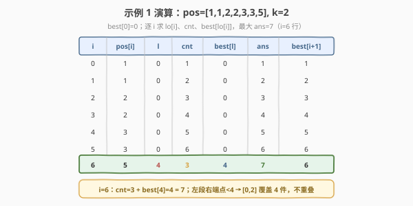

# 两个线段获得的最多奖品

- **题目名称**：两个线段获得的最多奖品
- **链接**：[2555. 两个线段获得的最多奖品](https://leetcode.cn/problems/maximize-win-from-two-segments/)
- **难度**：中等
- **标签**：数组、双指针、动态规划、前缀最大值

## 1. 题目概述

在 **X 轴**上有一些奖品。给定按**非递减**顺序排列的整数数组 `prizePositions`，其中 `prizePositions[i]` 是第 $i$ 件奖品的位置（同一位置可有多件）。再给定整数 $k$。

你可以同时选择**两个**端点为整数的线段，每条线段长度都必须是 $k$。你将获得位置落在**任一条线段上**（含端点）的所有奖品。两条线段**可以相交**。返回在最优选择下能获得的**最多**奖品数目。

**示例 1**：

```text
输入：prizePositions = [1,1,2,2,3,3,5], k = 2
输出：7
解释：选择线段 [1, 3] 和 [3, 5]，获得 7 个奖品。
```

**示例 2**：

```text
输入：prizePositions = [1,2,3,4], k = 0
输出：2
解释：选择线段 [3, 3] 和 [4, 4]，获得 2 个奖品。
```

**约束条件**：

- $1 \le \text{prizePositions.length} \le 10^5$
- $1 \le \text{prizePositions[i]} \le 10^9$
- $0 \le k \le 10^9$
- `prizePositions` 有序非递减。

> 💡 关键细节：线段端点**不要求落在奖品位置上**，但可证明最优解中右端点必能对齐到某件奖品；线段长度固定 $k$、允许相交是两个易被忽略的前提。

---

## 2. 解题思路

### 2.1 暴力思路

枚举两条线段的右端点位置（各 $O(V)$ 种，$V$ 为坐标值域）或右端点对齐到的奖品下标（各 $O(n)$ 种）。对每个右端点 $i$，线段 $[\text{pos}[i]-k,\ \text{pos}[i]]$ 覆盖的奖品数可用二分 $O(\log n)$ 求出。两两配对、求并集去重，总复杂度 $O(n^2 \log n)$，在 $n=10^5$ 下超时。

> ⚠️ 两段可相交意味着直接相加会重复计算重叠部分，暴力必须做并集去重——这正是要避免的陷阱。下面用「交换论证」把问题化为**不重叠的两段之和**，免去去重。

### 2.2 核心观察：右端点对齐奖品 + 左段取前缀最大值

![核心观察：右段对齐奖品 i，左段取 best[lo[i]]](../images/mwts_concept.svg)

**第一步：右端点对齐到奖品。** 若某条线段右端点未落在任何奖品上，可将其整体右移至右端点碰到最近的一件奖品，覆盖的奖品集只增不减。故只需考虑右端点对齐到某件奖品下标 $i$ 的线段，共 $n$ 个候选。

**第二步：固定右段，左段取前缀最大值。** 固定第二条线段（右段）右端点为下标 $i$，它覆盖下标区间 $[\text{lo}[i],\ i]$，其中

$$\text{lo}[i] = \min\{\,j \mid \text{pos}[j] \ge \text{pos}[i]-k\,\}$$

即最小的「奖品位置 $\ge \text{pos}[i]-k$」的下标。该线段覆盖数 $\text{cnt}[i] = i - \text{lo}[i] + 1$。

若允许两段相交，左段溢入右段范围的部分会被右段重复覆盖——**这部分对并集无贡献**。下面的交换论证说明：把左段换成「右端点下标 $< \text{lo}[i]$ 的最大单段」，总数不降。

> **交换论证（为何可假设两段不重叠）**
>
> 设最优解中左段 $A$ 与右段 $B$ 相交，$A$ 右端点下标 $r_1 \ge \text{lo}[r_2]$（落在 $B$ 覆盖区内）。$A$ 对并集的**净贡献**仅为下标落在 $[\text{lo}[r_1],\ \text{lo}[r_2]-1]$ 内的奖品（其余被 $B$ 重复覆盖）。取 $A'$ 为右端点对齐到下标 $\text{lo}[r_2]-1$ 的线段：因 $\text{lo}$ 单调不减且 $r_1 \ge \text{lo}[r_2]-1$，有 $\text{lo}[\text{lo}[r_2]-1] \le \text{lo}[r_1]$，故 $A'$ 覆盖区 $[\text{lo}[\text{lo}[r_2]-1],\ \text{lo}[r_2]-1] \supseteq [\text{lo}[r_1],\ \text{lo}[r_2]-1]$，**包住 $A$ 的全部净贡献**且完全不与 $B$ 重叠。于是 $(A',B)$ 总数 $\ge (A,B)$，可替换为不重叠解。

由此，固定右段于 $i$ 时，左段最优值为

$$\text{best}[\text{lo}[i]] = \max_{0 \le j < \text{lo}[i]} \text{cnt}[j]$$

即「右端点下标 $< \text{lo}[i]$ 的最大单段覆盖数」。这是一个**前缀最大值**，可随 $i$ 递推滚动维护。答案为

$$\text{ans} = \max_{0 \le i < n}\bigl(\text{cnt}[i] + \text{best}[\text{lo}[i]]\bigr)$$

> 💡 $\text{best}[l]$ 语义为「右端点下标 $< l$ 的最大单段覆盖数」，用大小 $n+1$ 的数组、$\text{best}[0]=0$、$\text{best}[i+1]=\max(\text{best}[i],\text{cnt}[i])$ 滚动更新，恰好把 $\text{best}[\text{lo}[i]]$ 对应到「右端点 $< \text{lo}[i]$」，避开负下标。

### 2.3 算法流程图

![算法流程：双指针求 lo[i] + 前缀最大值 best[]](../images/mwts_algorithm_flow.svg)

单趟遍历 $i$，三步合一：

1. **双指针求 $\text{lo}[i]$**：维护左指针 $l$，`while pos[l] < pos[i] - k: l += 1`。因 `pos` 有序，$l$ 随 $i$ 单调不减，均摊 $O(1)$。
2. **算右段覆盖数**：$\text{cnt} = i - l + 1$。
3. **更新答案与前缀最大**：`ans = max(ans, cnt + best[l])`；`best[i+1] = max(best[i], cnt)`。

### 2.4 示例演算



以示例 1 `pos=[1,1,2,2,3,3,5], k=2` 逐步走一遍（$\text{best}[0]=0$）：

| $i$ | pos[i] | $l$=lo[i] | cnt | best[l] | ans | best[i+1] |
|-----|--------|-----------|-----|---------|-----|-----------|
| 0 | 1 | 0 | 1 | 0 | 1 | 1 |
| 1 | 1 | 0 | 2 | 0 | 2 | 2 |
| 2 | 2 | 0 | 3 | 0 | 3 | 3 |
| 3 | 2 | 0 | 4 | 0 | 4 | 4 |
| 4 | 3 | 0 | 5 | 0 | 5 | 5 |
| 5 | 3 | 0 | 6 | 0 | 6 | 6 |
| **6** | **5** | **4** | **3** | **4** | **7** | **6** |

$i=0\ldots5$ 时 $\text{lo}[i]=0$（线段 $[\text{pos}[i]-2,\text{pos}[i]]$ 都从位置 $1$ 起），单段就能覆盖前 $i+1$ 件、无左段可叠加。到 $i=6$（位置 $5$），$l$ 推进到 $4$（首个位置 $\ge 5-2=3$ 的下标），右段 $[3,5]$ 覆盖 $3$ 件，左段取 $\text{best}[4]=4$（即右端点对齐下标 $3$ 的线段 $[0,2]$，覆盖位置 $1,1,2,2$ 共 $4$ 件，与右段不重叠），合计 $3+4=7$。

> ⚠️ 题面给的示例解是 $[1,3]\cup[3,5]=7$（相交，$6+3$ 去重后 $7$）；算法给出的是等优的不重叠解 $[0,2]\cup[3,5]=4+3=7$——正对应 2.2 的交换论证。

---

## 3. 参考代码

### C++

```cpp
class Solution {
public:
    int maximizeWin(vector<int>& prizePositions, int k) {
        int n = prizePositions.size();
        vector<int> best(n + 1, 0);  // best[i] = 右端点下标 < i 的最大单段覆盖数，best[0]=0
        int ans = 0, l = 0;
        for (int i = 0; i < n; ++i) {
            while (prizePositions[l] < prizePositions[i] - k) ++l;  // 求 lo[i]
            int cnt = i - l + 1;                                      // 右段覆盖数
            ans = max(ans, cnt + best[l]);                            // 左段取 best[lo[i]]
            best[i + 1] = max(best[i], cnt);                          // 前缀最大值滚动
        }
        return ans;
    }
};
```

> 💡 `best` 用大小 $n+1$、下标偏移 $1$：`best[l]` 即「右端点下标 $<l$」的最大单段，规避 `best[-1]`。双指针 $l$ 只增不减，总位移 $\le n$，故内层 `while` 均摊 $O(1)$，整趟 $O(n)$。

### Python

```python
class Solution:
    def maximizeWin(self, prizePositions: List[int], k: int) -> int:
        n = len(prizePositions)
        best = [0] * (n + 1)  # best[i] = 右端点下标 < i 的最大单段覆盖数
        ans = l = 0
        for i in range(n):
            while prizePositions[l] < prizePositions[i] - k:
                l += 1                       # 求 lo[i]
            cnt = i - l + 1                   # 右段覆盖数
            ans = max(ans, cnt + best[l])     # 左段取 best[lo[i]]
            best[i + 1] = max(best[i], cnt)   # 前缀最大值滚动
        return ans
```

> 💡 Python 同样 $O(n)/O(n)$。若只追求正确性、不在意 $O(n)$ 常数，可用 `bisect` 替代双指针求 $\text{lo}[i]$：`l = bisect_left(prizePositions, prizePositions[i] - k)`，逻辑等价但每次 $O(\log n)$，总 $O(n\log n)$。双指针版利用了 `pos` 有序把 $l$ 的推进均摊到 $O(1)$，是本题的最优写法。

---

## 4. 复杂度分析

| 维度 | 复杂度 | 说明 |
|------|--------|------|
| **时间复杂度** | $O(n)$ | 双指针 $l$ 在整趟循环中累计前进不超过 $n$ 次，均摊每次 $O(1)$；其余每步 $O(1)$ |
| **空间复杂度** | $O(n)$ | `best` 数组大小 $n+1$；可视为前缀最大值的滚动载体 |
| 对照：二分版 | $O(n\log n)$ 时间 / $O(n)$ 空间 | 用 `bisect`/`lower_bound` 逐次求 $\text{lo}[i]$，未利用 $l$ 单调性 |

> 💡 本题下界为 $\Omega(n)$——至少要读入全部 $n$ 个位置，故 $O(n)$ 已最优。空间若强制 $O(1)$ 较难：因需随机访问 $\text{best}[\text{lo}[i]]$ 而 $\text{lo}[i]$ 可任意回跳，需保留历史前缀最大值，工程上 $O(n)$ 足够且常数极小。

---

## 5. 扩展：从「两条线段」到「$m$ 条线段」

本题是「在数轴上选若干定长线段覆盖最多点」的 $m=2$ 特例。一般化到 $m$ 条线段时：

定义 $f[i][j]$ 为「用 $j$ 条线段、考虑前 $i$ 件奖品（第 $j$ 条右端点对齐下标 $\le i$）」的最大覆盖数，转移：

$$f[i][j] = \max\bigl(f[i-1][j],\ \ \text{cnt}[i] + f[\text{lo}[i]-1][j-1]\bigr)$$

第一项表第 $j$ 条不取下标 $i$；第二项表第 $j$ 条取 $i$，前 $j-1$ 条限于下标 $<\text{lo}[i]$（不重叠）。复杂度 $O(nm)$。本题 $m=2$ 时退化为两个一维数组 $\text{best}$（即 $f[\cdot][1]$）与答案滚动，正是上述写法的来源。

> 💡 关键仍是不重叠假设：一般 $m$ 条同样可经交换论证假定两两不重叠（按右端点排序后逐条贪左段前缀最大），故转移里直接相加而无需并集去重。若线段长度不固定或需覆盖连续区间则另当别论。

---

## 6. 面试要点

1. **为什么右端点可以对齐到奖品？**

   > 若右端点未落在奖品上，把线段整体右移到右端点碰到最近奖品，覆盖集只增不减（移动过程中不会丢掉已被覆盖的奖品，因为左端点同步右移、但被覆盖的奖品在右移期间仍在线段内直到右端点撞上下一件）。故只需枚举 $n$ 个对齐候选。

2. **两条线段允许相交，为什么能假设不重叠？**

   > 交换论证：若左段溢入右段范围，溢入部分已被右段覆盖、对并集无贡献。把左段换成右端点对齐到「右段左界 $\text{lo}[i]-1$」的线段，由 $\text{lo}$ 单调性它覆盖左段的全部净贡献且不与右段重叠，总数不降。于是左段只需取「右端点下标 $<\text{lo}[i]$ 的最大单段」即前缀最大值，直接相加免去除重。

3. **`best` 数组为何大小 $n+1$、下标偏移 $1$？**

   > 为表达 $\text{best}[\text{lo}[i]]=$ 「右端点下标 $<\text{lo}[i]$」的最大单段。当 $\text{lo}[i]=0$ 时对应「无左段」，值为 $0$，用 $\text{best}[0]=0$ 兜底，避免负下标。更新 $\text{best}[i+1]=\max(\text{best}[i],\text{cnt}[i])$ 把下标 $i$ 的单段计入 $\text{best}[i+1]$，语义自洽。

4. **双指针为何是 $O(n)$ 而非 $O(n^2)$？**

   > $l$ 满足单调不减（随 $i$ 增大，$\text{pos}[i]-k$ 不减，$\text{lo}[i]$ 不减）。整趟循环 $l$ 从 $0$ 累计前进不超过 $n$ 次，均摊到每次迭代 $O(1)$。这是滑动窗口/双指针的标准均摊分析。

5. **$k=0$ 或所有奖品同位置时正确吗？**

   > $k=0$：线段退化为点 $[\text{pos}[i],\text{pos}[i]]$，$\text{lo}[i]$ 为首个等于 $\text{pos}[i]$ 的下标，$\text{cnt}=i-\text{lo}[i]+1$ 统计同位置奖品数。示例 2 得 $2$。所有奖品同位置：$\text{lo}[i]=0$、$\text{cnt}[i]=i+1$，$\text{best}[0]=0$，$\text{ans}$ 取末位 $\text{cnt}=n$，正确（一条线段就覆盖全部，第二条无新增）。

> 💡 **一句话总结**：固定右段右端点为奖品 $i$，左段取 $\text{best}[\text{lo}[i]]$（右端点下标 $<\text{lo}[i]$ 的前缀最大单段）；交换论证保证不重叠假设无损，双指针 $O(n)$ 求 $\text{lo}$，前缀最大值 $O(1)$ 滚动，总 $O(n)/O(n)$。

---

## 7. 同类练习题

- [3. 无重复字符的最长子串](https://leetcode.cn/problems/longest-substring-without-repeating-characters/)（[题解](../0001-0100/3_无重复字符的最长子串.md)）：同用「双指针 $l$ 随右端 $i$ 单调推进」的滑动窗口骨架，对照「维护窗口内不变式」与「求 lo[i] 左界」
- [209. 长度最小的子数组](https://leetcode.cn/problems/minimum-size-subarray-sum/)（[题解](../0201-0300/209_长度最小的子数组.md)）：正数单调前提下的双指针窗口，对照 $l$ 单调推进的均摊 $O(n)$ 分析
- [713. 乘积小于 K 的子数组](https://leetcode.cn/problems/subarray-product-less-than-k/)（[题解](../0701-0800/713_乘积小于K的子数组.md)）：滑动窗口 + 计数 `right-left+1`，与本题 `cnt=i-l+1` 同形
- [1423. 可获得的最大点数](https://leetcode.cn/problems/maximum-points-you-can-obtain-from-cards/)：两端取若干元素求最大和，思想类似「两段不重叠覆盖取最大」，可作对照
- [2009. 使数组 K 递增的最少操作次数](https://leetcode.cn/problems/minimum-number-of-operations-to-make-array-continuous/)：定长窗口 + 双指针求合法区间，承接本题 $\text{lo}[i]$ 的二分/双指针求法
