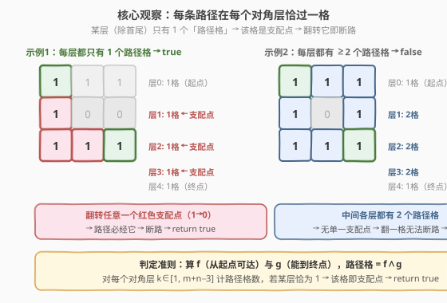
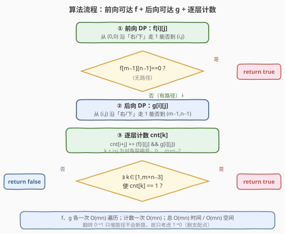
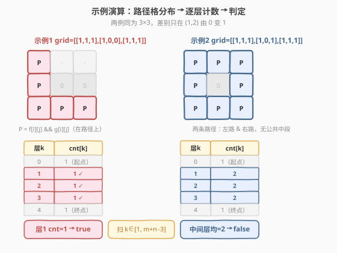

# 二进制矩阵中翻转最多一次使路径不连通

- **题目名称**：二进制矩阵中翻转最多一次使路径不连通
- **链接**：[2556. 二进制矩阵中翻转最多一次使路径不连通](https://leetcode.cn/problems/disconnect-path-in-a-binary-matrix-by-at-most-one-flip/)
- **难度**：中等
- **标签**：数组、广度优先搜索、图、矩阵、图论

## 1. 题目概述

给定 $m\times n$ 的**二进制**矩阵 `grid`，从格子 $(r,c)$ 只能走到 $(r+1,c)$ 或 $(r,c+1)$，且**目标格值必须为 $1$**。若从 $(0,0)$ 到 $(m-1,n-1)$ 不存在任何路径，称矩阵**不连通**。

你可以翻转**最多一个**格子的值（$0\to1$ 或 $1\to0$，也可不翻），但**不能翻转** $(0,0)$ 与 $(m-1,n-1)$。问：能否使矩阵变为不连通？能返回 `true`，否则返回 `false`。

**示例 1**：

```text
输入：grid = [[1,1,1],[1,0,0],[1,1,1]]
输出：true
解释：翻转 (1,0)（蓝格）由 1 变 0，翻转后 (0,0) 到 (2,2) 无路径。
```

**示例 2**：

```text
输入：grid = [[1,1,1],[1,0,1],[1,1,1]]
输出：false
解释：无法通过翻转至多一格使 (0,0) 到 (2,2) 无路径。
```

**约束条件**：

- $m == \text{grid.length}$，$n == \text{grid}[i].\text{length}$
- $1 \le m, n \le 1000$
- $1 \le m \cdot n \le 10^5$
- $\text{grid}[0][0] == \text{grid}[m-1][n-1] == 1$

> 💡 **关键约束**：$m\cdot n\le 10^5$ 意味着 $O(mn)$ 的遍历可过，$O((mn)^2)$ 不行；同时限制了稀疏长条形矩阵（如 $1\times 10^5$），下文算法对此天然友好。注意起点终点恒为 $1$，故「已连通」是默认状态，只需考虑如何「断」。

---

## 2. 解题思路

### 2.1 暴力思路：枚举翻转格 + 判连通

最直白的做法：枚举每一个可翻转格 $(i,j)\ne(0,0),(m-1,n-1)$（共 $O(mn)$ 个），翻转它后再 BFS/DFS 判一次从 $(0,0)$ 能否到 $(m-1,n-1)$（每次 $O(mn)$）。若任一翻转使路径消失则返回 `true`，全部不行返回 `false`。复杂度 $O((mn)^2)$，在 $mn=10^5$ 下约 $10^{10}$，稳稳 TLE。

> ⚠️ 翻转有两向：$0\to1$ 只会**新增**格子、增加路径，不可能断路；$1\to0$ 才会**删除**格子、可能断路。故枚举时只需考虑 $1\to0$（即原值为 $1$ 的格），候选数减半但仍 $O(mn)$，复杂度量级不变。

### 2.2 核心观察：支配点 = 对角层上唯一的路径格



矩阵只允许「向右 / 向下」走，故每条从 $(0,0)$ 到 $(m-1,n-1)$ 的路径长度恰为 $(m-1)+(n-1)$ 步，途经 $m+n-1$ 个格，且在每一个**对角层** $k=i+j$（$k=0,1,\dots,m+n-2$）上**恰好经过一格**。

**定义**：格 $c$ 是**支配点（dominator）**，当且仅当每条 $(0,0)\to(m-1,n-1)$ 路径都经过 $c$。翻转一个支配点（$1\to0$）即能断路。

**核心定理**：格 $c$（位于层 $k$）是支配点 $\iff$ 层 $k$ 上**路径格恰好只有 $c$ 一个**。

> **证明**：
> - **$\Leftarrow$**：若层 $k$ 上路径格只有 $c$，而每条路径必在层 $k$ 经过一格，则每条路径只能经过 $c$，故 $c$ 是支配点。
> - **$\Rightarrow$**：若 $c$ 是支配点（每条路径在层 $k$ 都经 $c$），假设层 $k$ 上还有另一路径格 $c'$。则存在一条经过 $c'$ 的路径，该路径在层 $k$ 经 $c'$ 而非 $c$，与「每条路径都经 $c$」矛盾。故层 $k$ 路径格只能有 $c$ 一个。

由此问题归约为：**是否存在某个中间层 $k\in[1,\,m+n-3]$（排除首尾两端点所在层）恰有 $1$ 个路径格**。（端点 $(0,0)$、$(m-1,n-1)$ 是层 $0$、层 $m+n-2$ 的唯一格，但不能翻转，须排除。）

那么如何高效判定「格是否在路径上」？设：

- $f[i][j]$：从 $(0,0)$ 沿「右/下」走 $1$ 能否到达 $(i,j)$（**前向可达**）；
- $g[i][j]$：从 $(i,j)$ 沿「右/下」走 $1$ 能否到达 $(m-1,n-1)$（**后向可达**）。

格 $(i,j)$ 在**某条路径上** $\iff f[i][j]\wedge g[i][j]$。二者均为 DAG 上的可达性 DP，$O(mn)$ 即可求出。

> 💡 **为何是 $f\wedge g$ 而非单看 $f$？** $f[i][j]=1$ 只说明前半段能到，未必能续到终点（后半段被 $0$ 堵死）；只有前后两段都通才在完整路径上。例 2 中 $(0,1)$ 虽然 $f=1$，但它能经右路到终点（$g=1$），故确在路径上——这正揭示了「多路径」的存在。

### 2.3 算法流程图



三步合一，全为 $O(mn)$ 遍历：

1. **前向 DP**：`f[0][0]=1`；按行优先扫，`f[i][j] = grid[i][j]==1 && (f[i-1][j] | f[i][j-1])`（首行/首列只取一侧）。
2. **早停**：若 `f[m-1][n-1]==0`，原本就无路径，$0$ 次翻转已不连通 → 直接 `return true`。
3. **后向 DP**：`g[m-1][n-1]=1`；按行逆序扫，`g[i][j] = grid[i][j]==1 && (g[i+1][j] | g[i][j+1])`。
4. **逐层计数**：`cnt[i+j] += f[i][j] && g[i][j]`；扫 $k\in[1,\,m+n-3]$，若存在 `cnt[k]==1` → `return true`，否则 `return false`。

> ⚠️ 两个易错边界：① 扫描层范围 **$k\in[1,\,m+n-3]$**，必须排除层 $0$（起点）与层 $m+n-2$（终点），因为两端点不可翻转；当 $m+n-3<1$（即 $1\times1$ 或 $1\times2$ 矩阵）时范围为空直接 `false`。② 早停判据是 `f[m-1][n-1]==0`（原本无路），此时 $0$ 翻转即 `true`，切勿遗漏。

### 2.4 示例演算



**例 1** `grid=[[1,1,1],[1,0,0],[1,1,1]]`：因 $(1,1),(1,2)$ 为 $0$，上半路被堵，唯一路径为 $(0,0)\to(1,0)\to(2,0)\to(2,1)\to(2,2)$。路径格 $f\wedge g$ 恰为此 5 格，各层计数：

| 层 $k$ | 0 | 1 | 2 | 3 | 4 |
|--------|---|---|---|---|---|
| cnt    | 1 | 1 | 1 | 1 | 1 |

层 $1$ 的 `cnt=1` → 翻转 $(1,0)$ 即断路 → `true`。✓

**例 2** `grid=[[1,1,1],[1,0,1],[1,1,1]]`：$(1,1)$ 为 $0$ 但 $(1,2)=1$ 打通右路，存在左路 $(0,0)\to(1,0)\to(2,0)\to(2,1)\to(2,2)$ 与右路 $(0,0)\to(0,1)\to(0,2)\to(1,2)\to(2,2)$ 两条。路径格分布使中间各层均有 $2$ 格：

| 层 $k$ | 0 | 1 | 2 | 3 | 4 |
|--------|---|---|---|---|---|
| cnt    | 1 | 2 | 2 | 2 | 1 |

中间层 $k\in[1,3]$ 无一为 $1$ → 无单一支配点 → `false`。✓

> 💡 体会两例差别仅在 $(1,2)$ 由 $0$ 变 $1$：打通右路后层 $1,2,3$ 各从 $1$ 变 $2$，支配点消失——这正说明「支配点」是路径**汇聚再发散**处的瓶颈，多一条路即解除瓶颈。

---

## 3. 参考代码

### C++

```cpp
class Solution {
public:
    bool isPossibleToCutPath(vector<vector<int>>& grid) {
        int m = grid.size(), n = grid[0].size();
        vector<vector<char>> f(m, vector<char>(n, 0)), g(m, vector<char>(n, 0));
        // ① 前向可达 DP
        f[0][0] = 1;
        for (int i = 0; i < m; ++i)
            for (int j = 0; j < n; ++j) {
                if (grid[i][j] == 0) continue;
                if (i == 0 && j == 0) { f[i][j] = 1; continue; }
                char up   = (i > 0) ? f[i - 1][j] : 0;
                char left = (j > 0) ? f[i][j - 1] : 0;
                f[i][j] = up | left;
            }
        if (!f[m - 1][n - 1]) return true;          // 原本无路径 → 0 翻转即 true
        // ② 后向可达 DP
        g[m - 1][n - 1] = 1;
        for (int i = m - 1; i >= 0; --i)
            for (int j = n - 1; j >= 0; --j) {
                if (grid[i][j] == 0) continue;
                if (i == m - 1 && j == n - 1) { g[i][j] = 1; continue; }
                char down  = (i + 1 < m) ? g[i + 1][j] : 0;
                char right = (j + 1 < n) ? g[i][j + 1] : 0;
                g[i][j] = down | right;
            }
        // ③ 逐层计数，查中间层是否恰 1 个路径格
        vector<int> cnt(m + n - 1, 0);
        for (int i = 0; i < m; ++i)
            for (int j = 0; j < n; ++j)
                if (f[i][j] && g[i][j]) ++cnt[i + j];
        for (int k = 1; k <= m + n - 3; ++k)
            if (cnt[k] <= 1) return true;          // 路径存在时中间层必 ≥1，==1 即支配点
        return false;
    }
};
```

> 💡 `f`/`g` 用 `char` 省 $4$ 倍内存（$2\times10^5$ 字节）。DP 转移用 `|`（按位或）代替 `||`，对 `char` 等价于逻辑或且免去短路求值开销。`cnt` 大小 $m+n-1$，对 $1\times10^5$ 长条矩阵为 $10^5$，安全。判 `cnt[k] <= 1` 而非 `== 1`：路径存在时各中间层必 $\ge1$（每条路径必经每层一格），故 `<=1` 与 `==1` 等价，但更稳健地兼容极端用例。

### Python

```python
class Solution:
    def isPossibleToCutPath(self, grid: List[List[int]]) -> bool:
        m, n = len(grid), len(grid[0])
        f = [[0] * n for _ in range(m)]
        g = [[0] * n for _ in range(m)]
        # ① 前向可达 DP
        f[0][0] = 1
        for i in range(m):
            for j in range(n):
                if grid[i][j] == 0:
                    continue
                if i == 0 and j == 0:
                    f[i][j] = 1
                    continue
                up   = f[i - 1][j] if i > 0 else 0
                left = f[i][j - 1] if j > 0 else 0
                f[i][j] = up | left
        if not f[m - 1][n - 1]:
            return True                      # 原本无路径
        # ② 后向可达 DP
        g[m - 1][n - 1] = 1
        for i in range(m - 1, -1, -1):
            for j in range(n - 1, -1, -1):
                if grid[i][j] == 0:
                    continue
                if i == m - 1 and j == n - 1:
                    g[i][j] = 1
                    continue
                down  = g[i + 1][j] if i + 1 < m else 0
                right = g[i][j + 1] if j + 1 < n else 0
                g[i][j] = down | right
        # ③ 逐层计数
        cnt = [0] * (m + n - 1)
        for i in range(m):
            for j in range(n):
                if f[i][j] and g[i][j]:
                    cnt[i + j] += 1
        for k in range(1, m + n - 2):        # k ∈ [1, m+n-3]
            if cnt[k] <= 1:
                return True
        return False
```

> 💡 Python 用列表嵌套即可，$mn\le10^5$ 无需 `numpy`。`range(1, m + n - 2)` 对应 $k\in[1,\,m+n-3]$（`range` 右端开区间）。亦可把前向 / 后向 DP 合并到同一双循环里按斜线遍历，但写法更绕，此处拆开更易读。

---

## 4. 复杂度分析

| 维度 | 复杂度 | 说明 |
|------|--------|------|
| **时间复杂度** | $O(mn)$ | 前向 DP、后向 DP、逐层计数各一次 $O(mn)$ 遍历，总计 $3\times mn$；常数为 $3$ |
| **空间复杂度** | $O(mn)$ | `f`、`g` 各 $mn$；`cnt` 为 $m+n-1$；三者合计约 $2mn$ |
| 对照：暴力枚举翻转 | $O((mn)^2)$ | 每个格翻转后判一次连通，$mn=10^5$ 时约 $10^{10}$，TLE |

> 💡 本算法**无需建显式图**：矩阵本身就是 DAG（边向右/向下，天然无环），可达性 DP 直接在格上递推，比 BFS 省去队列与边表。若追求空间极限，可在后向 DP 时边算 `g` 边累计 `cnt`（前向 `f` 需保留以便相与），空间降至约 $mn$，但常数与可读性权衡下 $O(mn)$ 已足够。

---

## 5. 扩展：支配树与一般图割点

本题的「支配点」概念在编译器优化、控制流分析中即**支配树（dominator tree）**的标准问题：在一张有向图（流图）中，节点 $d$ 支配 $n$ 当且仅当从起点到 $n$ 的每条路径都经 $d$。

- **DAG 特例**：本题矩阵只允许右/下移动，是 DAG。DAG 上支配关系有天然捷径——按**拓扑序**处理，节点 $v$ 的直接支配点 = 其所有前驱的支配点的**最近公共祖先（LCA）**。但本题只需判断「是否存在单一支配点」，故用对角层计数这一更轻巧的特判即可，无需建支配树。
- **一般有向图**：Lengauer-Tarjan 算法可在近线性 $O((V+E)\,\alpha(V,E))$ 时间内求出全图支配树。
- **无向图割点**：若把矩阵视为四连通无向图（可上下左右移动），则求「删一格使不连通」即**无向图割点（articulation point）**，用 Tarjan DFS 一次 $O(V+E)$。但本题限制右/下移动（有向），割点算法不直接适用——**对角层计数正是 DAG 上的「割点特判」**。

> 💡 把「删除单点使源汇不连通」推广到「删除至多 $K$ 点」即**最小点割**问题，最大流 / Menger 定理可解。本题 $K=1$ 退化，对角层计数是最简特解；$K>1$ 时需回到最大流框架。

---

## 6. 面试要点

1. **为什么只需考虑 $1\to0$ 翻转，不考虑 $0\to1$？**

   > $0\to1$ 会使某格从「不可走」变「可走」，只会**新增**边、**增加**路径，绝不可能让原本存在的路径消失，故对「断路」无贡献。只有 $1\to0$（删格删边）才可能切断路径。所以枚举翻转方向时直接排除 $0\to1$。

2. **「支配点 = 对角层唯一路径格」这一定理为何成立？**

   > 路径在每层 $k=i+j$ 恰过一格（因每步 $i+j$ 恰增 $1$）。若层 $k$ 路径格只有 $c$，每条路径在层 $k$ 必经 $c$，故 $c$ 支配所有路径。反推：若 $c$ 支配所有路径，层 $k$ 上不可能有别的路径格（否则那条路径绕开 $c$），故 $c$ 唯一。双向成立。

3. **为什么要排除首尾两层 $k=0$ 和 $k=m+n-2$？**

   > 层 $0$ 只有 $(0,0)$、层 $m+n-2$ 只有 $(m-1,n-1)$，二者恒为各自层的唯一路径格，但题面**禁止翻转端点**。若不排除，会把端点误判为「可翻转的支配点」而错误返回 `true`。扫描范围必须是 $k\in[1,\,m+n-3]$，且当 $m+n-3<1$（如 $1\times1$、$1\times2$）时为空，直接 `false`。

4. **原本就无路径时为什么直接 `return true`？**

   > 题面允许「翻转**最多一个**格」（含 $0$ 个）。若 `f[m-1][n-1]==0` 说明原本就不连通，$0$ 次翻转已满足条件，返回 `true`。这是必须的早停分支，否则后续 `cnt` 各中间层可能为 $0$，需正确语义处理。

5. **$1\times n$ 长条矩阵的极端表现如何？**

   > 此时 $m=1$，只能向右走，路径唯一（沿 $1$ 的格连成串）。若中途有 $0$，原本不通 → `true`；若全 $1$，每个中间格都是支配点，层 $k\in[1,n-3]$ 计数均为 $1$ → `true`（除非 $n\le2$ 无中间格 → `false`）。算法对长条矩阵天然 $O(n)$、`cnt` 数组长 $n$，无额外负担。

> 💡 **一句话总结**：求前向可达 $f$ 与后向可达 $g$，路径格为 $f\wedge g$；按对角层 $k=i+j$ 计数，若某中间层（$k\in[1,m+n-3]$）恰 $1$ 格，则该格为支配点，翻转即断路 → `true`。$O(mn)$ 时间、$O(mn)$ 空间。

---

## 7. 同类练习题

- [1970. 你能穿过矩阵的最后一天吗](https://leetcode.cn/problems/last-day-where-you-can-still-cross/)：同在二进制矩阵判「$(0,0)$ 到 $(m-1,n-1)$ 连通性」，但是反向「逐日淹没 + 并查集」框架，对照本题「删一格断路」的对偶
- [1568. 使陆地分离的最少天数](https://leetcode.cn/problems/minimum-number-of-days-to-disconnect-island/)：在网格图上求「最少删多少格使图不连通」，涉及割点 / 网格图小割点枚举，是本题「至多 1 次」的 $K$ 次推广
- [200. 岛屿数量](https://leetcode.cn/problems/number-of-islands/)（[题解](../0201-0300/200_岛屿数量.md)）：网格连通性 BFS/DFS 基础母题，对照「连通分量」与本题「断连通」的对偶视角
- [924. 尽量减少恶意软件的传播](https://leetcode.cn/problems/minimize-malware-spread/)：删一个节点使受感染节点最少，本质是「删谁收益最大」的图论删点问题，承接本题删点断路思路
- [802. 找到最终的安全状态](https://leetcode.cn/problems/find-eventual-safe-states/)：在有向图上判「能否到终点」的反向可达性问题，对照本题后向 DP $g$ 的求解方式
