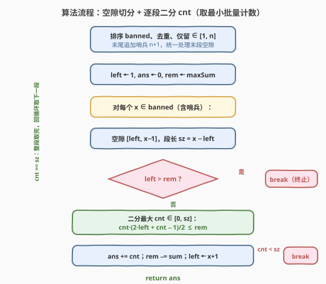

# 从一个范围内选择最多整数 II

- **题目名称**：从一个范围内选择最多整数 II
- **链接**：[2557. 从一个范围内选择最多整数 II](https://leetcode.cn/problems/maximum-number-of-integers-to-choose-from-a-range-ii/)
- **难度**：中等
- **标签**：贪心、数组、二分查找、排序

## 1. 题目概述

给你一个整数数组 `banned` 和两个整数 `n`、`maxSum`。需要按以下规则从 `[1, n]` 中选择一些整数：

- 每个整数**至多选择一次**；
- 被选整数不能在 `banned` 中；
- 被选整数的和**不超过 `maxSum`**。

返回**最多**可以选择的整数数目。

> ⚠️ 本题是 **Plus 会员专享题**，题面正文被锁。下方描述据免费姊妹题 [2554. 从一个范围内选择最多整数 I](https://leetcode.cn/problems/maximum-number-of-integers-to-choose-from-a-range-i/) 的规则 + II 版放宽的约束重建；官方标签 `Greedy / Array / Binary Search / Sorting` 印证了「排序 + 贪心取最小 + 二分」的解法骨架。示例沿用 2554 的典型用例（规则相同，对 II 同样有效）。

**示例 1**：

```text
输入：banned = [1,6,5], n = 5, maxSum = 6
输出：2
解释：去重后 banned=[1,5,6]，6 > n 丢弃；可用数为 {2,3,4}。
      贪心取最小的 {2,3} 和为 5 ≤ 6，剩预算 1 取不起下一个 4，共 2 个。
      （官方 2554 解释取 {2,4} 和 6，同样 2 个——最优集不唯一，答案同为 2。）
```

> 💡 同一答案可有多个最优集（如本例 `{2,3}` 与 `{2,4}`），但「数量最大」唯一——贪心取最小是构造其中之一最直接的方式，下文由此展开。

**示例 2**：

```text
输入：banned = [1,2,3,4,5,6,7], n = 8, maxSum = 1
输出：0
解释：唯一非 banned 的可用数是 8，但 8 > maxSum=1，一个都取不起。
```

**示例 3**：

```text
输入：banned = [11], n = 7, maxSum = 50
输出：7
解释：banned 的 11 > n=7 丢弃，1..7 全可用，和 1+2+…+7=28 ≤ 50，全取。
```

**约束条件**（II 版，相比 2554 放宽）：

- $1 \le \text{banned.length} \le 10^5$
- $1 \le \text{banned[i]} \le 10^9$，且两两不同
- $1 \le n \le 10^9$
- $1 \le \text{maxSum} \le 10^{15}$

> 💡 **I vs II 的本质差距**：2554 的 $n \le 10^4$、$\text{maxSum} \le 10^9$，直接从 `1` 起逐个贪心（用集合跳过 banned）即可 AC。II 版把 $n$ 拉到 $10^9$、$\text{maxSum}$ 拉到 $10^{15}$，答案个数 $k$ 满足 $k(k+1)/2 \le 10^{15}$，即 $k$ 可达约 $4.5\times 10^7$——逐个枚举在 Python 必 TLE，必须**整段批量计数**。

---

## 2. 解题思路

### 2.1 暴力思路：从 1 起逐个贪心（I 版够用，II 版超时）

最朴素的贪心：把 `banned` 装进哈希集合，从 `x = 1` 起递增，遇到 banned 就跳过，否则若 $x \le \text{rem}$（剩余预算）就取（`rem -= x`，`ans += 1`），直到 $x > n$ 或 $x > \text{rem}$。

```text
ans = 0; rem = maxSum; s = set(banned)
x = 1
while x <= n and x <= rem:
    if x not in s: rem -= x; ans += 1
    x += 1
return ans
```

复杂度 $O(k + m)$，其中 $k$ 为答案个数、$m = |\text{banned}|$。I 版 $k \le \sqrt{2\cdot 10^9} \approx 44721$，绰绰有余；II 版 $k$ 可达 $\approx 4.5\times 10^7$，Python 逐个循环 + 集合查询要数千万次，稳稳 TLE。

> ⚠️ 关键瓶颈：当 `banned` 稀疏、预算很大时，可用数几乎是连续的 $1,2,3,\dots$，逐个取等于在跑一个长达 $4.5\times 10^7$ 的线性扫描。但这些连续段**完全可用等差数列求和一次性算出能取多少个**——这正是 II 版要做的优化。

### 2.2 核心观察：banned 切出可用空隙，每段从左侧批量取最小

![核心观察：banned 把 [1,n] 切成可用空隙，每段从左侧批量取最小](../images/maxrangeii_concept.svg)

两条关键观察把逐个枚举压缩成「逐段批量」：

- **贪心取最小最优**：在「和不超过 `maxSum`」下求「数量最大」，最优解必取最小的若干可用数。**交换论证**：若某解取了大数 $x$ 却留下更小的可用 $y$，把 $x$ 换成 $y$ 会让总和更小、数量不变，腾出的预算还能再取更多——故任何非「取最小」的解都能被改进，取最小即最优。于是把 `banned` 排序后，**按位置从左到右逐段处理空隙**，每段从最左侧（最小）取若干个，就等价于全局贪心取最小。

- **banned 切出空隙**：把 `banned` 去重、排序、仅保留 $\in [1,n]$ 的值后，它们把 $[1,n]$ 切成若干「连续可用段」（空隙）。每段是一个等差数列 $L, L+1, \dots, R$。设段长 $\text{sz} = R-L+1$，从左取最小的 $\text{cnt}$ 个（$L, L+1, \dots, L+\text{cnt}-1$），其和为等差数列求和：

$$
\text{sum}(L, \text{cnt}) = \frac{\text{cnt}\cdot(2L + \text{cnt} - 1)}{2}
$$

$\text{sum}$ 关于 $\text{cnt}$ 单调递增，故可**二分最大 $\text{cnt} \in [0,\ \text{sz}]$** 使 $\text{sum}(L,\text{cnt}) \le \text{rem}$（剩余预算）。

> 💡 **取完一段就转下一段，预算耗尽就停**：若 $\text{cnt} = \text{sz}$（整段取完且仍有预算），更新 `rem`、`ans` 后转下一个空隙；若 $\text{cnt} < \text{sz}$（预算在该段内耗尽），取完这 $\text{cnt}$ 个后下一个数 $L+\text{cnt}$ 必有 $L+\text{cnt} > \text{rem}$（因 $\text{cnt}$ 已是最大可行值），而后续数更大，故**直接终止**。此外若某段起点 $L > \text{rem}$（连最小都取不起），因后续段起点更大，也直接终止。

### 2.3 算法流程图



伪代码骨架：

```text
b = sorted(set(x for x in banned if 1 <= x <= n))   # 去重排序，仅留 ∈[1,n]
b.append(n + 1)                                      # 哨兵：统一处理末段空隙
ans = 0; rem = maxSum; left = 1
for x in b:                          # x 为当前 banned（或哨兵 n+1）
    sz = x - left                    # 空隙 [left, x-1] 的长度
    if sz > 0:
        if left > rem: break         # 连最小都取不起 → 终止
        # 二分最大 cnt ∈ [1, sz]：cnt*(2*left + cnt - 1)/2 <= rem
        cnt = upper_bound_cnt(left, sz, rem)
        ans += cnt
        rem -= sum(left, cnt)
        if cnt < sz: break          # 预算耗尽 → 终止
    left = x + 1                    # 跳过 banned，移到下一段起点
return ans
```

> ⚠️ 三个易错点：① **哨兵 `n+1`** 把末段空隙 $[\text{last\_banned}+1,\ n]$ 纳入主循环，免去循环后补判；② 二分上界是 **`sz = x - left`**（空隙内可用数个数），不是 $n$；③ 终止判据**不是**「`x > n`」而是「`left > rem`」或「`cnt < sz`」——前者是最小数超预算，后者是该段预算耗尽。

### 2.4 示例演算

![示例演算：banned=[1,6,5], n=5, maxSum=6](../images/maxrangeii_example_walkthrough.svg)

以 `banned=[1,6,5], n=5, maxSum=6` 为例：

1. **预处理**：去重后 `[1,5,6]`，仅保留 $\le n=5$ 得 `[1,5]`（`6 > 5` 丢弃），追加哨兵 `6` → 处理序列 `[1, 5, 6]`。`left=1, ans=0, rem=6`。
2. `x=1`：空隙 `[1, 0]`，`sz = 0`，跳过；`left=2`。
3. `x=5`：空隙 `[2, 4]`，`sz=3`，`L=2 ≤ rem=6`。二分 `cnt ∈ [1,3]`：

   | `cnt` | `sum = cnt·(2·2+cnt−1)/2` | `≤ rem=6 ?` |
   |-------|----------------------------|-------------|
   | 1 | `2` | ✓ |
   | 2 | `5` | ✓（最大可行）|
   | 3 | `9` | ✗ 超预算 |

   取 `cnt=2`：选 `{2,3}`，`ans=2`，`rem = 6−5 = 1`。`cnt=2 < sz=3` → **终止**。
4. 返回 `ans = 2` ✓。

验证示例 2 `banned=[1..7], n=8, maxSum=1`：处理序列 `[1,2,…,7,9]`，前 7 步 `sz=0` 跳过到 `left=8`；`x=9` 时空隙 `[8,8]`、`sz=1`，但 `L=8 > rem=1` → 终止，`ans=0` ✓。

验证示例 3 `banned=[11], n=7, maxSum=50`：`11>7` 丢弃，处理序列 `[8]`（哨兵），`x=8` 时空隙 `[1,7]`、`sz=7`，`L=1 ≤ 50`，二分得 `cnt=7`（`sum=28 ≤ 50`），`ans=7`，`cnt=sz` 无终止，返回 `7` ✓。

---

## 3. 参考代码

### C++

```cpp
class Solution {
public:
    int maxCount(vector<int>& banned, int n, long long maxSum) {
        // 排序、去重、仅保留 ∈ [1, n]
        vector<int> b;
        for (int x : banned) if (x >= 1 && x <= n) b.push_back(x);
        sort(b.begin(), b.end());
        b.erase(unique(b.begin(), b.end()), b.end());
        b.push_back(n + 1);                      // 哨兵：统一处理末段空隙

        long long ans = 0, rem = maxSum;
        int left = 1;
        for (int x : b) {
            int sz = x - left;                   // 空隙 [left, x-1] 长度
            if (sz > 0) {
                if (left > rem) break;           // 连最小都取不起 → 终止
                int lo = 1, hi = sz, cnt = 0;
                while (lo <= hi) {               // 二分最大 cnt
                    int mid = lo + (hi - lo) / 2;
                    long long s = (long long)mid * (2LL * left + mid - 1) / 2;
                    if (s <= rem) { cnt = mid; lo = mid + 1; }
                    else hi = mid - 1;
                }
                long long s = (long long)cnt * (2LL * left + cnt - 1) / 2;
                ans += cnt;
                rem -= s;
                if (cnt < sz) break;             // 预算耗尽 → 终止
            }
            left = x + 1;
        }
        return (int)ans;
    }
};
```

> ⚠️ **签名说明**：题面为 Plus 会员专享、代码模板被锁，上方签名按 II 版放宽约束推断——`maxSum` 用 `long long`（可达 $10^{15}$），返回 `int`（答案 $\le n \le 10^9 < 2.1\times 10^9$，`int` 足够）。若平台模板对 `n`/`maxSum` 用 `int`，则把对应形参改回 `int` 即可，逻辑不变。
>
> 💡 **防溢出**：二分中 `s = mid*(2*left + mid - 1)/2`，`mid`、`left` 均可达 $10^9$，乘积约 $3\times 10^{18}$，超过 `int` 但远小于 `long long` 上限 $9.2\times 10^{18}$，故用 `2LL * left` 把运算提升到 `long long`。

### Python

```python
from typing import List

class Solution:
    def maxCount(self, banned: List[int], n: int, maxSum: int) -> int:
        b = sorted(set(x for x in banned if 1 <= x <= n))
        b.append(n + 1)                          # 哨兵：统一处理末段空隙
        ans = 0
        rem = maxSum
        left = 1
        for x in b:
            sz = x - left                        # 空隙 [left, x-1] 长度
            if sz > 0:
                if left > rem:                   # 连最小都取不起 → 终止
                    break
                lo, hi, cnt = 1, sz, 0
                while lo <= hi:                  # 二分最大 cnt
                    mid = (lo + hi) // 2
                    if mid * (2 * left + mid - 1) // 2 <= rem:
                        cnt = mid
                        lo = mid + 1
                    else:
                        hi = mid - 1
                ans += cnt
                rem -= cnt * (2 * left + cnt - 1) // 2
                if cnt < sz:                     # 预算耗尽 → 终止
                    break
            left = x + 1
        return ans
```

> 💡 Python 整数精度无限，无需防溢出。`sorted(set(...))` 一步完成去重+排序+筛选。`b.append(n+1)` 后主循环自然覆盖末段，无需循环外补判。

---

## 4. 复杂度分析

| 维度 | 复杂度 | 说明 |
|------|--------|------|
| **时间复杂度** | $O(m \log n)$ | $m = |\text{banned}|$，空隙数 $\le m+1$；每段二分 `cnt` 上界为段长 $\le n$，故每段 $O(\log n)$，总 $\le (m+1)\log n \approx 10^5 \times 30 = 3\times 10^6$ |
| **空间复杂度** | $O(m)$ | 存去重排序后的 `b`（长度 $\le m$）|
| 对照：逐个贪心（I 版式）| $O(k + m)$，$k$=答案 | II 版 $k$ 可达 $\approx 4.5\times 10^7$，Python TLE；本算法不随 $k$ 线性增长 |
| 对照：二分答案 $k$ | $O(m \log n)$ | 见第 5 节，渐近同阶，常数略大（每轮 check 需扫一遍 `banned`）|

> 💡 本算法**与答案 $k$ 无关**——只随 banned 段数与 $\log n$ 增长，故 $k$ 再大（哪怕 $\sim 10^7$）也不影响。这是把「逐个线性」压成「逐段对数」的典型收益。

---

## 5. 扩展：二分答案 k 与 O(1) 求 cnt

### 5.1 二分答案 k

另一种同骨架思路：直接**二分答案** $k \in [0, n]$（最多能取 $k$ 个），`check(k)` 判断「最小的 $k$ 个可用数之和 $\le \text{maxSum}$」。计算最小的 $k$ 个可用数之和：遍历排序后的 `banned`，逐段用等差求和累加，直到凑满 $k$ 个（跨越 banned 则跳过该数、调整起止）。

```text
def sum_of_smallest_k(b, n, k):            # b 已排序去重并含哨兵 n+1
    total = 0; left = 1; need = k
    for x in b:
        sz = x - left
        take = min(sz, need)
        if take > 0:
            total += take * (2*left + take - 1) // 2
            need -= take
            if need == 0: return total
        left = x + 1
    return total                              # 可用数不足 k 个，返回全量和

lo, hi = 0, n
while lo < hi:
    mid = (lo + hi + 1) // 2
    if sum_of_smallest_k(b, n, mid) <= maxSum: lo = mid
    else: hi = mid - 1
return lo
```

复杂度 $O(m \log n)$（外层 $\log n$ 轮 × 每轮 $O(m)$ 扫描），与主解同阶但常数更大（多次扫 `banned`）。主解「逐段二分 cnt」只扫一遍 `banned`、每段局部二分，常数更优，故作为主解。

### 5.2 O(1) 求 cnt：解二次方程

给定段起点 $L$ 与剩余预算 $\text{rem}$，最大 $\text{cnt}$ 满足 $\frac{\text{cnt}(2L+\text{cnt}-1)}{2} \le \text{rem}$，即 $\text{cnt}^2 + (2L-1)\text{cnt} - 2\,\text{rem} \le 0$。正根为

$$
\text{cnt} = \left\lfloor \frac{\sqrt{(2L-1)^2 + 8\,\text{rem}} - (2L-1)}{2} \right\rfloor
$$

用**整数平方根**（Python `math.isqrt`）精确求根，避免浮点误差，再 `min(cnt, sz)` 截断：

```python
import math
disc = (2*left - 1)**2 + 8 * rem
cnt = min((math.isqrt(disc) - (2*left - 1)) // 2, sz)
```

把每段二分 $O(\log n)$ 降到 $O(1)$，总复杂度 $O(m)$。但 $m \le 10^5$ 时 $O(m\log n)$ 已毫秒级，此优化只在 $m$ 极大或追求极限常数时有意义。C++ 需注意判别式 $(2L-1)^2 + 8\,\text{rem}$ 可达 $\sim 10^{18}+8\times 10^{15} \approx 10^{18}$，`long long` 仍够，但 `isqrt` 无标准库等价物，可用 `unsigned long long` 配手写整数开方或直接用 `long double` 近似后微调。

> 💡 二次方程法与主解的「二分 cnt」等价，只是把二分换成解析解。两者对每段都是 $O(\text{常数})$ vs $O(\log\text{sz})$ 的差别；段数才是主导项 $O(m)$。

---

## 6. 面试要点

1. **为什么贪心「取最小的若干可用数」是最优？**

   > 交换论证：设最优解 $\mathcal{S}$ 取了某大数 $x$ 却留下更小的可用 $y$（$y \notin \text{banned}$、$y \le n$、$y$ 未被 $\mathcal{S}$ 选中）。把 $x$ 换成 $y$，和减小（$y < x$）、数量不变，仍合法；腾出的预算还能再纳入更多数。故任何「非取最小」的解都能被改进或保持，取最小即最优。这等价于「01 背包中按重量升序取以最大化件数」的贪心。

2. **II 版为什么不能直接从 1 逐个枚举？**

   > $n \le 10^9$、$\text{maxSum} \le 10^{15}$，答案个数 $k$ 满足 $k(k+1)/2 \le 10^{15}$，即 $k \approx 4.5\times 10^7$。逐个枚举要数千万次循环 + 集合查询，Python 稳 TLE、C++ 也偏慢。关键在于可用数常呈长连续段，可用等差求和**一段一段**算，把 $O(k)$ 压成 $O(m\log n)$。

3. **为什么要排序 banned 并加哨兵 `n+1`？**

   > 排序是为了让空隙**按位置从左到右**出现，从而「逐段从左取」等价于全局贪心取最小。哨兵 `n+1` 把末段空隙 $[\text{last}+1, n]$ 纳入主循环（处理到 `x = n+1` 时空隙正是 $[\text{last}+1, n]$），省去循环后补判末段，逻辑统一、边界更少。

4. **二分 `cnt` 的上界为什么是 `sz = x - left`？终止判据是什么？**

   > 上界是**空隙内可用数个数** `sz`——`cnt` 不可能超过空隙里实际存在的数。每段只二分一次 $O(\log\text{sz})$。终止有两处：① 段起点 $L > \text{rem}$，连最小都取不起，且后续段起点更大 → `break`；② 取了 `cnt` 个且 `cnt < sz`，则下一个数 $L+\text{cnt}$ 必 $> \text{rem}$（因 `cnt` 已是使 $\text{sum} \le \text{rem}$ 的最大值，再加一个就超），后续更大 → `break`。若 `cnt == sz` 则整段取完仍有预算，转下一段。

5. **`banned` 里有重复或 $> n$ 的值怎么办？**

   > 去重 + 筛选 `1 <= x <= n` 一步到位（C++ `sort`+`unique`，Python `sorted(set(...))`）。重复值会让哨兵/空隙逻辑混乱，去重保证每个 banned 只切一次；$> n$ 的值不在 $[1,n]$ 内、永不被选，筛掉避免空段计算出错。$< 1$ 的值同理筛掉（题目保证 $\ge 1$，但稳健代码仍过滤）。

> 💡 **一句话总结**：把 `banned` 排序去重并加哨兵 `n+1` 切出可用空隙，每段用等差求和 $\frac{\text{cnt}(2L+\text{cnt}-1)}{2}$ 二分最大 `cnt`（$\le \text{rem}$），取完转下段、耗尽即停——$O(m\log n)$ 时间、$O(m)$ 空间，与答案 $k$ 无关。

---

## 7. 同类练习题

- [2554. 从一个范围内选择最多整数 I](https://leetcode.cn/problems/maximum-number-of-integers-to-choose-from-a-range-i/)：免费姊妹题，约束 $n \le 10^4$、$\text{maxSum} \le 10^9$，逐个贪心即可；本题是其大约束升级版（注：本仓库暂未写 2554 题解）
- [875. 爱吃香蕉的珂珂](https://leetcode.cn/problems/koko-eating-bananas/)（[题解](../0801-0900/875_爱吃香蕉的珂珂.md)）：同为「二分 + 贪心验证」范式，对照「二分答案 $k$」与「逐段二分 cnt」两种切法
- [1011. 在 D 天内送达包裹的能力](https://leetcode.cn/problems/capacity-to-ship-packages-within-d-days/)（[题解](../1001-1100/1011_在D天内送达包裹的能力.md)）：二分答案 + 贪心验证，单调谓词二分母题，承接本题对「二分上界/终止判据」的辨析
- [410. 分割数组的最大值](https://leetcode.cn/problems/split-array-largest-sum/)（[题解](../0401-0500/410_分割数组的最大值.md)）：二分答案 + 贪心划分，同属「二分值域 + 贪心 check」一族
- [719. 找出第 K 小的数对距离](https://leetcode.cn/problems/find-k-th-smallest-pair-distance/)（[题解](../0701-0800/719_找出第K小的数对距离.md)）：二分值域 + 计数验证，对照「二分 + 计数」与「二分 + 求和」两类验证函数
