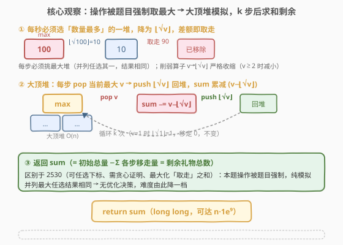
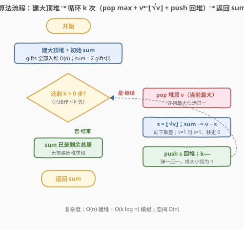

# LeetCode 从数量最多的堆取走礼物 题解

## 1. 题目概述

- **标题 / 题号**：从数量最多的堆取走礼物（#2558，easy）
- **链接**：https://leetcode.cn/problems/take-gifts-from-the-richest-pile/
- **难度**：简单
- **标签**：堆、优先队列、模拟

**题意**：给你一个下标从 $0$ 开始的整数数组 `gifts`，其中 `gifts[i]` 表示第 $i$ 堆礼物的数量。每一秒你需要执行以下**操作**：

1. 选择礼物数量**最多**的那一堆（若不止一堆并列最多，任选其一即可）；
2. 将该堆的礼物数量**减少到**原数量的**平方根向下取整** $\lfloor\sqrt{\text{gifts}[i]}\rfloor$（取走的是差额 $\text{gifts}[i]-\lfloor\sqrt{\text{gifts}[i]}\rfloor$）。

返回在 $k$ 秒后剩下的礼物**总数量**。

**示例 1**：

```text
输入：gifts = [25,64,9,4,100], k = 4
输出：29
解释：
- 第 1 秒选最后一堆 100，降到 ⌊√100⌋ = 10，取走 90；
- 第 2 秒选第二堆 64，降到 ⌊√64⌋ = 8，取走 56；
- 第 3 秒选第一堆 25，降到 ⌊√25⌋ = 5，取走 20；
- 第 4 秒再选 10，降到 ⌊√10⌋ = 3，取走 7；
- 各堆剩余为 [5,8,9,4,3]，总数 5+8+9+4+3 = 29。
```

**示例 2**：

```text
输入：gifts = [1,1,1,1], k = 4
输出：4
解释：每堆都是 1，⌊√1⌋ = 1 不变，任选哪堆都取走 0，剩余总量仍为 4。
```

**约束**：

- $1 \le \text{gifts.length} \le 10^3$
- $1 \le \text{gifts}[i] \le 10^9$
- $1 \le k \le 10^3$

> 💡 关键细节：被取走的礼物**并非让该堆消失**，而是堆变小后**继续参与后续选择**。因此这不是「一次性取 $k$ 个最大」的 Top-K，而是「反复挑当前最大、把它开方削弱放回」的过程。剩余总量最坏可达 $n\cdot 10^9 \approx 10^{12}$，**累加用 64 位整数**。

## 2. 解题思路

### 2.1 暴力思路：每步线性扫描找最大

最直白的实现是**每步线性扫一遍 `gifts`，找最大值 $v$ 的下标 $i$，原地写回 $\lfloor\sqrt v\rfloor$**，循环 $k$ 次，最后再求和。

设 $n = \text{gifts.length}$。每步扫描 $O(n)$，共 $k$ 步，总复杂度 $O(n\cdot k)$。取 $n, k$ 均为 $10^3$，约 $10^6$ 次比较，**本题规模能过**，但非最优。

> ⚠️ 暴力暴露的事实：每步都在重复「在一群随时被改写的数里找当前最大」。这正是**优先队列（大顶堆）**的标准战场——把「反复找最大」从 $O(n)$ 摊到 $O(\log n)$，弹出后把开方值压回堆里即可。

### 2.2 核心观察：操作被题目强制取最大 → 大顶堆模拟即可



2558 与同目录的 [2530](../2501-2600/2530_执行K次操作后的最大分数.md) 形似而神不同。2530 里你**可以任选下标**（为最大化分数），所以必须证明「每步取最大」最优；2558 里题目**硬性规定**每秒必须选「数量最多」的那一堆——你没有任何选择余地，只有「选哪一个并列最大」的自由，而这个自由不影响结果（见下）。因此 2558 是**纯模拟**，无需贪心证明，难度也由此降一档。

**第一步：并列最大任选结果相同。** 设某步堆中有两堆同为最大值 $v$（还可能有别的更小值）。无论选哪一堆，被选堆从 $v$ 降为 $\lfloor\sqrt v\rfloor$，另一堆仍为 $v$；下一步的最大值仍是 $v$（来自未被选的那堆），它同样会被降为 $\lfloor\sqrt v\rfloor$。两步过后两堆都成了 $\lfloor\sqrt v\rfloor$，与「先选谁」无关。归纳地，任意并列局面下不同选择最终殊途同归——**结果由初始数组与 $k$ 唯一决定**。

**第二步：削弱算子严格收缩。** 对 $v \ge 2$，$\lfloor\sqrt v\rfloor < v$（因 $v>1$ 时 $\sqrt v < v$）；$v=1$ 时 $\lfloor\sqrt 1\rfloor = 1$ 不变。故每步（在 $v>1$ 时）确会取走 $v-\lfloor\sqrt v\rfloor \ge 1$ 个礼物，剩余总量单调下降；$v=1$ 时取走 $0$。

**第三步：动态找最大 → 大顶堆。** 每步都要「在被反复改写的一群数里找当前最大」，这正是**大顶堆**的战场：把「找最大」从 $O(n)$ 摊到 $O(\log n)$——弹出堆顶 $v$，把 $\lfloor\sqrt v\rfloor$ 压回，堆自动重排。维护一个滚动总量 `sum`（初始为 $\sum\text{gifts}[i]$），每步 `sum -= (v - ⌊√v⌋)`，$k$ 步后返回 `sum` 即剩余礼物总数。

> 💡 与 2530 的对照：2530 的削弱算子是 $\lceil v/3\rceil$（线性收缩，需处理 $v=1$ 稳态），目标是**最大化取走之和**（累加 $v$）；2558 的算子是 $\lfloor\sqrt v\rfloor$（指数收缩，见第 5 节），目标是**最小化剩余之和**（累减 $v-\lfloor\sqrt v\rfloor$，等价最后求和）。两者骨架完全同构，差异只在「有无选择自由」与「算子/目标方向」。

### 2.3 算法流程图



四步：

1. **建堆**：把 `gifts` 全部塞进大顶堆（C++ `priority_queue<int>` 区间构造 $O(n)$；Python `heapq` 存 $-x$ + `heapify` $O(n)$）；同时 `sum = Σ gifts[i]`；
2. 循环 $k$ 次：
   - pop 堆顶 $v$（当前最大）；
   - $s = \lfloor\sqrt v\rfloor$（向下取整）；
   - `sum -= (v - s)`（移走 $v-s$ 个礼物）；
   - push $s$ 回堆；
3. 返回 `sum`。

> 💡 **为何维护 `sum` 而非最后遍历堆求和？** `priority_queue` 不暴露迭代器，最后求和得把 $n$ 个元素逐个 `pop`，多花 $O(n\log n)$。维护滚动 `sum` 让每步 $O(1)$ 更新，结束时直接返回，省去收尾遍历。Python 的 `heap` 虽是列表可 `sum(heap)`，但取负模拟大顶堆时需 `sum(-x for x in heap)`，不如滚动 `sum` 直观省事。

### 2.4 示例演算

![示例演算：gifts=[25,64,9,4,100], k=4，逐步弹出 100/64/25/10，回写 10/8/5/3，剩余 29](../images/takegifts_example_walkthrough.svg)

以示例 1 为例（红 $=$ 取出的最大，蓝 $=$ 开方后回写，移走 $=v-\lfloor\sqrt v\rfloor$）：

| 步 | 取出 $\max\ v$ | 替换为 $\lfloor\sqrt v\rfloor$ | 移走 $v-\lfloor\sqrt v\rfloor$ | 堆内剩余（降序） | 合计 |
|----|----------------|-------------------------------|--------------------------------|-------------------|------|
| 初始 | — | — | — | $\{100, 64, 25, 9, 4\}$ | 202 |
| 1 | 100 | 10 | 90 | $\{64, 25, 10, 9, 4\}$ | 112 |
| 2 | 64 | 8 | 56 | $\{25, 10, 9, 8, 4\}$ | 56 |
| 3 | 25 | 5 | 20 | $\{10, 9, 8, 5, 4\}$ | 36 |
| 4 | 10 | 3 | 7 | $\{9, 8, 5, 4, 3\}$ | 29 |

$$\text{sum} = 202 - (90+56+20+7) = 29 \ \checkmark$$

> 💡 第 1 步取 $100$ 回写 $10$，此时 $10 < 64$，第 2 步自然改取 $64$——堆自动维护「当前最大」，无需手动判断。第 4 步堆顶 $10$，$\lfloor\sqrt{10}\rfloor = 3$，移走 $7$，最终剩余 $\{9,8,5,4,3\}$ 合计 $29$。

## 3. 参考代码

### C++

```cpp
class Solution {
public:
    long long pickGifts(vector<int>& gifts, int k) {
        priority_queue<int> pq(gifts.begin(), gifts.end()); // 大顶堆，O(n) 建堆
        long long sum = 0;
        for (int g : gifts) sum += g;                       // 初始礼物总量
        while (k-- > 0) {
            int v = pq.top();
            pq.pop();
            int s = (int)sqrt((double)v);                   // ⌊√v⌋ 初值（可能偏小 1）
            while ((long long)(s + 1) * (s + 1) <= v) ++s;  // 修正浮点截断误差
            sum -= (v - s);                                 // 移走 (v - s) 个
            pq.push(s);
        }
        return sum;
    }
};
```

> 💡 `priority_queue<int> pq(begin, end)` 用迭代器区间构造，底层是 Floyd 建堆 $O(n)$，比逐个 `push` 的 $O(n\log n)$ 更优。返回类型 `long long`：最坏 $n\cdot 10^9 \approx 10^{12}$ 超 32 位 `int` 上界。`sqrt` 后的上升修正用 `long long` 做平方，防 $s\approx 31623$ 时 $(s+1)^2 \approx 10^9$ 贴近 32 位上界。

### Python

```python
class Solution:
    def pickGifts(self, gifts: List[int], k: int) -> int:
        heap = [-x for x in gifts]      # 取负模拟大顶堆
        heapq.heapify(heap)             # 原地建堆 O(n)
        total = sum(gifts)
        for _ in range(k):
            v = -heapq.heappop(heap)
            s = math.isqrt(v)           # ⌊√v⌋，整数精确、零浮点误差
            total -= v - s              # 移走 v - s
            heapq.heappush(heap, -s)
        return total
```

> 💡 Python 无内置大顶堆，**取负 + `heapq`** 是标准套路：`heappop` 取出最小 $=$ 最负 $=$ 原数最大，取反还原。`heapify` 原地 $O(n)$ 建堆。**`math.isqrt(v)` 是 Python 3.8+ 标准库整数开方**，返回精确 $\lfloor\sqrt v\rfloor$、任意精度、无浮点误差，是本题首选。Python `int` 任意精度，无溢出之忧。两版逻辑等价，均 $O(n + k\log n)$ 时间、$O(n)$ 空间。

## 4. 复杂度分析

| 维度 | 复杂度 | 说明 |
|------|--------|------|
| **时间复杂度** | $O(n + k\log n)$ | Floyd 建堆 $O(n)$；$k$ 次循环各一弹一压，每次 $O(\log n)$；算 $\lfloor\sqrt v\rfloor$ 为 $O(1)$ |
| **空间复杂度** | $O(n)$ | 堆存全部 $n$ 个元素（弹一压一，净增 $0$，大小恒为 $n$） |
| 对照：暴力线性扫 | $O(n\cdot k)$ | 每步 $O(n)$ 找最大；$n,k\le 10^3$ 时约 $10^6$，本题规模能过但非最优 |
| 对照：每步排序 | $O(k\cdot n\log n)$ | 削弱后整体序被打乱，反复排序毫无意义 |

> 💡 本题 $n, k \le 10^3$，$O(n + k\log n) \approx 10^3 + 10^3\cdot 10 \approx 1.1\times 10^4$，微秒级。即便把 $n, k$ 提到 $10^5$（即 2530 的规模），本算法仍轻松通过。堆大小恒为 $n$（每次弹一个就压一个，净增为 $0$），故空间 $O(n)$ 稳定。

## 5. 扩展：√ 收缩极快 → 堆顶降到 1 可提前结束；整数开方写法

**√ 的极速收缩。** 相比 2530 的 $\lceil v/3\rceil$（线性收缩），$\lfloor\sqrt v\rfloor$ 是**指数级收缩**。以 $v = 10^9$ 为例，反复开方：

$$10^9 \xrightarrow{\sqrt{}} 31622 \xrightarrow{\sqrt{}} 177 \xrightarrow{\sqrt{}} 13 \xrightarrow{\sqrt{}} 3 \xrightarrow{\sqrt{}} 1$$

仅 **5 步**即归 $1$。一般地，任意 $v$ 经 $O(\log\log v)$ 次开方稳定到 $1$。因此全部 $n$ 堆「有效削减」的总步数上界为 $n\cdot O(\log\log(\max)) \approx 5n$。

**提前结束优化。** 一旦堆顶降到 $1$，意味着所有非 $1$ 值都已削到 $1$（堆顶是全局最大，它为 $1$ 则全体为 $1$），此后每步取 $1$、回写 $1$、移走 $0$，剩余总量不再变化。此时可 `break` 提前退出：

```cpp
if (v == 1) break;   // 堆顶=1 ⇒ 全体=1，后续 k 步零移除
```

本题 $k \le 10^3$、$n \le 10^3$，规模小不必优化；但当 $k$ 远大于 $5n$ 时（如 $k = 10^9$），提前结束把复杂度从 $O(k\log n)$ 降到 $O(n\log n\cdot\log\log(\max))$，是质的提升。

**整数开方的精确写法。** $\lfloor\sqrt v\rfloor$ 不能盲目依赖浮点 `sqrt` 后直接强转——$v$ 达 $10^9$ 时 `double` 尾数 52 位虽足够精确表示，但个别完全平方数边界可能因舍入差 $1$。三种稳健写法：

| 语言 | 写法 | 说明 |
|------|------|------|
| Python | `math.isqrt(v)` | 标准库整数开方，任意精度，**零浮点误差**，首选 |
| C++ | `(int)sqrt((double)v)` + 修正 | 先估再 `while ((s+1)*(s+1) <= v) ++s;` 双向修正 |
| C++（无 isqrt） | 二分开方 $O(\log v)$ | 完全规避浮点，$v\le 10^9$ 时二分上界 $31623$ |

> ⚠️ 本题 C++ 参考代码用「估 $+$ 上升修正」：先 `s = (int)sqrt(v)`（`sqrt` 截断一般只偏小 $1$），再 `while ((long long)(s+1)*(s+1) <= v) ++s;` 补足。平方用 `long long` 防 $s\approx 31623$ 时 $(s+1)^2 \approx 10^9$ 贴近 32 位上界。Python 直接 `math.isqrt` 最省心。

## 6. 面试要点

1. **2558 和 2530 的核心区别？为什么一个简单一个中等？**

   > 2530 你**可任选下标**，为最大化分数须证明「每步取最大」最优（轨迹固定 + 非递增 ⇒ 前 $k$ 大轨迹值）；2558 题目**硬性规定必须选最大堆**，无优化决策，并列任选结果相同，纯模拟即可。骨架（大顶堆 pop-max + push 削弱值）完全同构，差异在「有无选择自由」，故难度降一档。

2. **并列最大时选哪一堆会影响结果吗？**

   > 不会。两堆同为 $v$，选谁都被降为 $\lfloor\sqrt v\rfloor$；下一步另一堆仍是最大 $v$，同样被降。归纳地，任意并列局面不同选择殊途同归，结果由初始数组与 $k$ 唯一决定。

3. **$\lfloor\sqrt v\rfloor$ 在代码里怎么算才不会错？**

   > Python 用 `math.isqrt(v)`，整数精确、零误差。C++ 无标准 `isqrt`，用 `(int)sqrt((double)v)` 估值后修正（`while (s+1)*(s+1) <= v ++s;`），平方用 `long long` 防 $s\approx 31623$ 时溢出。直接强转浮点 `sqrt` 在完全平方数边界可能差 $1$。

4. **为什么维护 `sum` 而不最后遍历堆求和？**

   > `priority_queue` 不暴露迭代器，最后求和得把 $n$ 个元素逐个 `pop`，多花 $O(n\log n)$。维护滚动 `sum`，每步 $O(1)$ 更新 `sum -= (v - s)`，结束直接返回，省去收尾遍历。Python 的 `heap` 虽可 `sum(heap)`，但取负模拟大顶堆时不直观，滚动 `sum` 更直接。

5. **$k$ 极大时怎么办？需要优化吗？**

   > $\sqrt$ 收缩极快，$v = 10^9$ 经 5 步即归 $1$。当堆顶降到 $1$（全局最大为 $1$ ⇒ 全体为 $1$），后续每步移走 $0$，可 `break` 提前结束，复杂度从 $O(k\log n)$ 降到 $O(n\log n\cdot\log\log(\max))$。本题 $k\le 10^3$ 不必，但 $k$ 达 $10^9$ 时是质的优化。

> 💡 **一句话总结**：操作被题目强制取最大（并列任选结果相同）⇒ 无优化决策、纯模拟；大顶堆把「动态找最大」摊到 $O(\log n)$，维护滚动 `sum` 每步累减 $v-\lfloor\sqrt v\rfloor$；$O(n + k\log n)$ 出解，整数开方用 `math.isqrt`/修正防浮点误差。

## 同类练习题

| # | 题目 | 与本题的关联 |
|---|------|-------------|
| 2530 | [执行K次操作后的最大分数](https://leetcode.cn/problems/maximal-score-after-applying-k-operations/)（[题解](../2501-2600/2530_执行K次操作后的最大分数.md)） | 同骨架的「中等升级版」——pop max + push 削弱值，但削弱算子是 $\lceil v/3\rceil$、目标是「最大化取走之和」且**可任选下标**（需贪心证明），对照「有无选择自由」 |
| 2182 | [构造限制重复的字符串](https://leetcode.cn/problems/construct-string-with-repeat-limit/)（[题解](../2101-2200/2182_构造限制重复的字符串.md)） | 大顶堆按频率取最大、削一次后回堆，同一 pop-max + push-削弱 范式 |
| 1167 | [连接木棍的最低费用](https://leetcode.cn/problems/minimum-cost-to-connect-sticks/)（[题解](../1101-1200/1167_连接木棍的最低费用.md)） | 小顶堆反复取两最小合并回堆，方向相反但同属「堆维护动态极值」 |
| 767 | [重构字符串](https://leetcode.cn/problems/reorganize-string/)（[题解](../0701-0800/767_重构字符串.md)） | 大顶堆按频率取最大交替放置，频率取负模拟大顶堆（承接 Python 取负技巧） |
| 502 | [IPO](https://leetcode.cn/problems/ipo/)（[题解](../0501-0600/502_IPO.md)） | 贪心 + 大顶堆每轮取最大利润，与本题「反复取最大」同源 |
