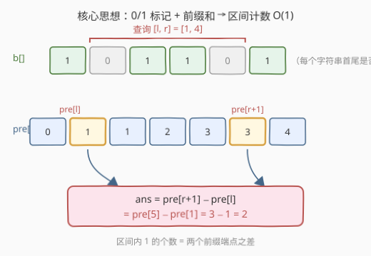
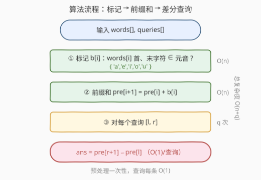
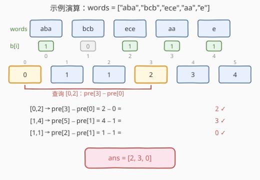

# LeetCode 统计范围内的元音字符串数 题解

## 1. 题目概述

- **标题 / 题号**：统计范围内的元音字符串数（#2559，medium）
- **链接**：https://leetcode.cn/problems/count-vowel-strings-in-ranges/
- **难度**：中等
- **标签**：数组、前缀和

**题意**：给你一个下标从 **0** 开始的字符串数组 `words` 以及一个二维整数数组 `queries`。每个查询 `queries[i] = [li, ri]` 要求统计 `words` 中下标在 `[li, ri]`（**含两端**）范围内、且**以元音开头并以元音结尾**的字符串数目。返回数组 `ans`，其中 `ans[i]` 为第 `i` 个查询的答案。元音字母为 `'a'、'e'、'i'、'o'、'u'`。

**示例 1**：

```text
输入：words = ["aba","bcb","ece","aa","e"], queries = [[0,2],[1,4],[1,1]]
输出：[2,3,0]
解释：以元音开头和结尾的字符串是 "aba"、"ece"、"aa"、"e"。
  查询 [0,2] → "aba"、"ece" 共 2 个
  查询 [1,4] → "ece"、"aa"、"e" 共 3 个
  查询 [1,1] → "bcb" 不满足，共 0 个
```

**示例 2**：

```text
输入：words = ["a","e","i"], queries = [[0,2],[0,1],[2,2]]
输出：[3,2,1]
解释：每个字符串都以元音开头和结尾，故 [0,2]→3、[0,1]→2、[2,2]→1。
```

**约束**：

- $1 \le \text{words.length} \le 10^5$
- $1 \le \text{words[i].length} \le 40$
- `words[i]` 仅由小写英文字母组成
- $\sum \text{words[i].length} \le 3 \times 10^5$
- $1 \le \text{queries.length} \le 10^5$
- $0 \le \text{queries[j][0]} \le \text{queries[j][1]} < \text{words.length}$

> 💡 **读题要点**：「以元音开头**且**以元音结尾」是单个字符串的属性，与查询无关；查询只决定「看哪一段下标」。因此可把每个字符串先压成一个 0/1 标记，问题就变成「**若干区间内 1 的个数**」——经典前缀和场景。$n, q$ 均达 $10^5$，暴力 $O(nq)$ 必超时。

## 2. 解题思路

### 2.1 暴力思路

对每个查询 `[l, r]`，从 `words[l]` 扫到 `words[r]`，逐个判断首尾字符是否为元音并计数。单次查询 $O(n)$，$q$ 次查询共 $O(nq) \approx 10^{10}$，远超时限。问题在于「**同样的区间求和被反复计算**」。

### 2.2 核心观察：0/1 标记 + 一维前缀和



把问题拆成两步：

**① 离线标记**：先扫一遍 `words`，对每个 `words[i]` 只看首字符 `words[i][0]` 与末字符 `words[i].back()` 是否都在元音集合 $\{'a','e','i','o','u'\}$ 内，得到标记数组 $b[i] \in \{0,1\}$。这一步 $O(n)$（每字符串 $O(1)$，只看首尾）。

> 💡 **单字符特例**：如 `"e"`，首末同为 `'e'`，仍是元音 → 标记 $1$。判断时不必特判长度，直接取首尾即可（长度为 1 时首尾是同一字符，结论不变）。

**② 前缀和预处理**：构造前缀和 `pre`，长度 $n+1$，约定半开区间：

$$
\text{pre}[0] = 0,\qquad \text{pre}[i+1] = \text{pre}[i] + b[i]\quad(0 \le i < n)
$$

即 $\text{pre}[i]$ 等于 $b[0..i-1]$ 中 1 的个数（前 $i$ 个元素的标记和）。

**③ 区间查询 $O(1)$**：查询 $[l, r]$ 即求 $b[l] + b[l+1] + \dots + b[r]$。用前缀和相减：

$$
\text{ans} = \text{pre}[r+1] - \text{pre}[l]
$$

> 💡 **半开区间约定**：用 $\text{pre}[r+1] - \text{pre}[l]$ 而非 $\text{pre}[r] - \text{pre}[l-1]$，好处是 $l=0$ 时 $\text{pre}[0]$ 天然存在（无需对左端点特判负下标），消除边界 `if`。

### 2.3 算法流程图



```text
vowels = {'a','e','i','o','u'}
n = len(words)
pre = [0] * (n + 1)
for i in 0..n-1:
    b = (words[i][0] ∈ vowels) and (words[i][-1] ∈ vowels) ? 1 : 0
    pre[i+1] = pre[i] + b

ans = []
for (l, r) in queries:
    ans.append(pre[r+1] - pre[l])     # 半开区间 [l, r+1)
return ans
```

### 2.4 示例演算

以示例 1 `words = ["aba","bcb","ece","aa","e"]` 为例：



| $i$ | `words[i]` | 首 | 末 | $b[i]$ | $\text{pre}[i]$ | $\text{pre}[i+1]$ |
|-----|------------|----|----|--------|------------------|--------------------|
| 0 | "aba" | a | a | 1 | 0 | 1 |
| 1 | "bcb" | b | b | 0 | 1 | 1 |
| 2 | "ece" | e | e | 1 | 1 | 2 |
| 3 | "aa"  | a | a | 1 | 2 | 3 |
| 4 | "e"   | e | e | 1 | 3 | 4 |

三个查询：

| 查询 $[l,r]$ | 计算 | 结果 |
|--------------|------|------|
| $[0,2]$ | $\text{pre}[3] - \text{pre}[0] = 2 - 0$ | 2 ✓ |
| $[1,4]$ | $\text{pre}[5] - \text{pre}[1] = 4 - 1$ | 3 ✓ |
| $[1,1]$ | $\text{pre}[2] - \text{pre}[1] = 1 - 1$ | 0 ✓ |

返回 `[2,3,0]`，与示例一致 ✓。

> 💡 **例 2 自检**：`words = ["a","e","i"]`，$b = [1,1,1]$，`pre = [0,1,2,3]`；$[0,2] \to \text{pre}[3]-\text{pre}[0]=3$、$[0,1] \to \text{pre}[2]-\text{pre}[0]=2$、$[2,2] \to \text{pre}[3]-\text{pre}[2]=1$ → `[3,2,1]` ✓。

## 3. 参考代码

### C++

```cpp
class Solution {
public:
    vector<int> vowelStrings(vector<string>& words, vector<vector<int>>& queries) {
        auto isVowel = [](char c) {
            return c=='a'||c=='e'||c=='i'||c=='o'||c=='u';
        };
        int n = words.size();
        vector<int> pre(n + 1, 0);
        for (int i = 0; i < n; i++) {
            bool b = isVowel(words[i].front()) && isVowel(words[i].back());
            pre[i + 1] = pre[i] + b;
        }
        vector<int> ans;
        ans.reserve(queries.size());
        for (auto& q : queries) {
            int l = q[0], r = q[1];
            ans.push_back(pre[r + 1] - pre[l]);   // 半开区间 [l, r+1)
        }
        return ans;
    }
};
```

### Python

```python
class Solution:
    def vowelStrings(self, words: List[str], queries: List[List[int]]) -> List[int]:
        vowels = set("aeiou")
        n = len(words)
        pre = [0] * (n + 1)
        for i, w in enumerate(words):
            b = 1 if (w[0] in vowels and w[-1] in vowels) else 0
            pre[i + 1] = pre[i] + b
        ans = []
        for l, r in queries:
            ans.append(pre[r + 1] - pre[l])        # 半开区间 [l, r+1)
        return ans
```

> 💡 **空间可优化但不必**：标记 $b[i]$ 可不单独存（边算边并入 `pre`）；`pre` 本身 $O(n)$ 不可省（查询需随机访问任意两端点）。`ans.reserve` / 预分配避免反复扩容。

## 4. 复杂度分析

| 维度 | 复杂度 | 说明 |
|------|--------|------|
| 时间 | $O(n + q)$ | 预处理：$n$ 个字符串各看首尾 $O(1)$，建前缀和 $O(n)$；查询：$q$ 次差分各 $O(1)$ |
| 空间 | $O(n)$ | 前缀和数组 `pre` 长 $n+1$；输出数组 $O(q)$ 不计 |
| 对照：逐查询扫描 | $O(nq)$ | 每个查询扫 `[l, r]`，$n=q=10^5$ 时 $\sim 10^{10}$ 超时 |

> 💡 本题本质是 [303. 区域和检索](../0301-0400/303_区域和检索 - 数组不可变.md) 的「**区间计数版**」：把元素从「数值」换成「0/1 标记」，前缀和从「数值和」换成「1 的个数」，套路完全一致。

## 5. 扩展：前缀和的「标记化」思想

本题体现前缀和的一个常见变体——**先把复杂对象压成 0/1（或某个标量标记），再对标记求前缀和**，从而把「区间内满足某性质的元素个数」转成两端点之差：

| 原始问题 | 标记定义 | 区间查询 |
|----------|----------|----------|
| 区间内元音字符串个数（本题） | $b[i]=1$ 当 `words[i]` 首尾皆元音 | $\text{pre}[r+1]-\text{pre}[l]$ |
| 区间内奇数个数 | $b[i] = \text{nums}[i] \bmod 2$ | 同上 |
| 区间和（[303](../0301-0400/303_区域和检索 - 数组不可变.md)） | $b[i] = \text{nums}[i]$（不压） | 同上 |

> ⚠️ 标记必须是**可加**的标量。若查询属性不可加（如「区间内不同元素种类数」），前缀和失效，需改用莫队 / 离线扫描等高级手段。

## 6. 面试要点

1. **为什么用前缀和而不是对每个查询扫描？**

   > $q$ 次查询都作用在**同一段数组**的不同区间上，前缀和把「区间聚合」从 $O(n)$ 压到 $O(1)$ 差分，$O(nq) \to O(n+q)$。识别「**多次区间查询 + 可加属性**」是套前缀和的关键信号。

2. **如何 $O(1)$ 判断一个字符串是否「元音首尾」？**

   > 只取 `words[i][0]` 与 `words[i].back()`，各查一次元音集合即可，与字符串长度无关。单字符（如 `"e"`）首末同一字符，仍判为元音，无需特判长度。

3. **为什么用 $\text{pre}[r+1] - \text{pre}[l]$ 而不是 $\text{pre}[r] - \text{pre}[l-1]$？**

   > 半开区间约定：$\text{pre}[i]$ 表示前 $i$ 个元素之和，对应下标区间 $[0, i)$。这样 $l=0$ 时用 $\text{pre}[0]$（值为 0）天然合法，避免对左端点做 $l==0$ 的负下标特判，代码更简洁、不易越界。

4. **前缀和数组能否省掉？**

   > 标记 $b[i]$ 可以并入 `pre` 一步生成、不单独存数组；但 `pre` 本身 $O(n)$ 无法省——查询要在任意 $l$、$r$ 处随机访问端点值，必须保留整条前缀和。若改成「流式、只能顺序到达的查询」才有别的做法（如 [1352](../1301-1400/1352_最后K个数的乘积.md) 用前缀积 + 延迟清零处理流式）。

5. **如果改为「以元音开头**或**结尾」会怎样？**

   > 属性仍可加（每个字符串 0/1），前缀和照样适用，只改标记函数为「首或末属元音」。前缀和的威力正在于：**查询逻辑不变，只换标记**。

> 💡 **一句话总结**：把「字符串首尾是否皆元音」压成 0/1 标记，求其前缀和，每个查询 $[l,r]$ 的答案即为 $\text{pre}[r+1] - \text{pre}[l]$，总体 $O(n+q)$。

## 同类练习题

| # | 题目 | 与本题的关联 |
|---|------|-------------|
| 303 | [区域和检索 - 数组不可变](https://leetcode.cn/problems/range-sum-query-immutable/)（[题解](../0301-0400/303_区域和检索 - 数组不可变.md)） | 前缀和区间查询的母题，把本题的 0/1 标记换回数值即此题 |
| 304 | [二维区域和检索 - 数组不可变](https://leetcode.cn/problems/range-sum-query-2d-immutable/)（[题解](../0301-0400/304_二维区域和检索 - 数组不可变.md)） | 前缀和升至二维，四角容斥，承接本题一维差分 |
| 724 | [寻找数组的中心下标](https://leetcode.cn/problems/find-pivot-index/)（[题解](../0701-0800/724_寻找数组的中心下标.md)） | 前缀和应用——找使左和等于右和的下标，本题差分的对偶 |
| 528 | [按权重随机选择](https://leetcode.cn/problems/random-pick-with-weight/)（[题解](../0501-0600/528_按权重随机选择.md)） | 前缀和 + 二分查找，把区间和升级为「按权重抽位置」 |
| 1352 | [最后 K 个数的乘积](https://leetcode.cn/problems/product-of-the-last-k-numbers/)（[题解](../1301-1400/1352_最后K个数的乘积.md)） | 把「和」换成「积」、把「静态」换成「流式」，前缀积 + 延迟清零的同思路变体 |
