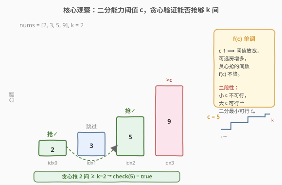
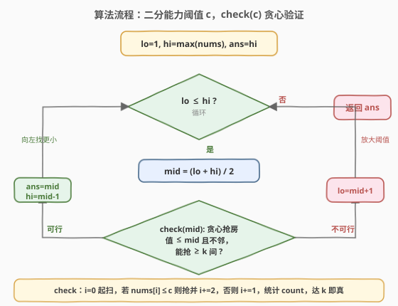

# LeetCode 打家劫舍 IV 题解

## 1. 题目概述

- **标题 / 题号**：打家劫舍 IV（#2560，medium）
- **链接**：https://leetcode.cn/problems/house-robber-iv/
- **难度**：中等
- **标签**：数组、二分查找、二分答案、贪心

**题意**：沿街一排连续房屋，第 `i` 间放有 `nums[i]` 美元现金。**相邻房屋装有防盗系统，不能同时窃取**。小偷的**窃取能力** = 窃取过程中从单间房屋窃得的**最大金额**。给定 `k` 表示**至少**要窃取的房屋数（保证总能窃取至少 `k` 间）。返回**最小**窃取能力。

**示例 1**：

```text
输入：nums = [2,3,5,9], k = 2
输出：5
解释：至少抢 2 间、不相邻，共有 3 种方式：
     - 下标 0,2：能力 = max(2,5) = 5
     - 下标 0,3：能力 = max(2,9) = 9
     - 下标 1,3：能力 = max(3,9) = 9
     返回 min(5,9,9) = 5。
```

**示例 2**：

```text
输入：nums = [2,7,9,3,1], k = 2
输出：2
解释：能力最小的方式是抢下标 0,4：能力 = max(2,1) = 2。
```

**约束**：

- $1 \le \text{nums.length} \le 10^5$
- $1 \le \text{nums[i]} \le 10^9$
- $1 \le k \le \lfloor(\text{nums.length}+1)/2\rfloor$

> 💡 本题是「打家劫舍」系列的**二分答案变体**：198 用 DP 求最大收益、213 拆环、337 上树，而 2560 把目标从「最大收益」换成「最小化最大值」，于是 DP 退场、二分答案登场。与 [2517. 礼盒的最大甜蜜度](../2501-2600/2517_礼盒的最大甜蜜度.md)（最大化最小值）是同一骨架、方向相反的镜像。

## 2. 解题思路

### 2.1 暴力思路

枚举所有「不相邻地选若干间、至少 `k` 间」的方式，每算一种的「最大金额」再取最小。但「选至少 `k$ 间不相邻」的组合数在最坏情况下约为 $\binom{\lceil n/2\rceil}{k}$（取所有偶数下标中选 $k$ 个），$n=10^5$ 时天文级，完全不可行。

> ⚠️ 暴力的根因在于把「选哪些房」当**组合搜索**处理。一旦意识到能力只取决于「所选房屋中最大的那个值」，就能把问题从「搜索选法」转为「对能力阈值 $c$ 的二分」。

### 2.2 核心观察：二分能力阈值 + 贪心验证



三个观察层层递进：

1. **能力 = 所选房屋的最大值**：设小偷抢的房屋集合为 $S$，则能力 $=\max_{i\in S}\text{nums}[i]$。若限定「只抢金额 $\le c$ 的房」，则任何合法选法的能力必 $\le c$。于是「能力 $\le c$ 是否可行」$\Leftrightarrow$「能否只在金额 $\le c$ 的房中、不相邻地抢至少 $k$ 间」。

2. **答案域单调（二段性）**：设 $f(c)=$ 在阈值 $c$ 下贪心最多能抢的间数。$c$ 越大可选房越多 $\Rightarrow$ $f(c)$ 随 $c$ 单调不降。故存在分界 $c^*$：$c<c^*$ 时 $f(c)<k$ 不可行、$c\ge c^*$ 时 $f(c)\ge k$ 可行。答案即最小可行 $c^*$。

3. **check 贪心 $O(n)$**：给定 $c$，能否抢至少 $k$ 间？从左到右扫，遇到金额 $\le c$ 的房就抢（`count++`）并**跳过下一间**（`i\mathrel{+}=2`，满足不相邻），否则 `i+=1`。抢到就跳过相邻房，越早抢越给后续留空间（交换论证：贪心选的位置不晚于任意合法解，故贪心抢的间数 $\ge$ 合法解）。

> 💡 **识别信号**：题目求「最小化最大值」+ 能 $O(n)$ 验证候选答案 $\Rightarrow$ 想「二分答案」。本题与 [875](../0801-0900/875_爱吃香蕉的珂珂.md)/[1011](../1001-1100/1011_在D天内送达包裹的能力.md)/[410](../0401-0500/410_分割数组的最大值.md) 同属「最小化最大值」一脉：可行时 `ans=mid; hi=mid-1` 向左收缩。

### 2.3 算法流程图



二分 $c \in [1,\ \max(\text{nums})]$，每轮 `check(c)` 贪心计数：

- `i = 0, count = 0`
- 遍历：若 `nums[i] <= c`，则 `count++`（达 `k` 即返回真），`i += 2`；否则 `i += 1`
- `count >= k` 即可行

可行 $\Rightarrow$ `ans = mid; hi = mid - 1`（向左找更小）；不可行 $\Rightarrow$ `lo = mid + 1`（放大阈值）。

### 2.4 示例演算

![示例演算：nums=[2,3,5,9], k=2 二分过程](../images/house_robber_iv_walkthrough.svg)

以示例 1 `nums = [2,3,5,9]`、`k = 2` 为例。值域 $[1, 9]$，`lo=1, hi=9, ans=9`。各轮 `check(mid)` 的贪心抢房与计数见上表，最终 `ans = 5`。

> ⚠️ **贪心抢房的细节**：以 `mid=5` 为例，`i=0`：`nums[0]=2<=5` 抢（`count=1`，`i=2`）；`i=2`：`nums[2]=5<=5` 抢（`count=2`，`i=4` 终止）。`count=2≥k` ✓。注意「抢一间就跳过相邻的下一间」是贪心的核心，而非遍历所有偶数下标。

## 3. 参考代码

### C++

```cpp
class Solution {
public:
    int minCapability(vector<int>& nums, int k) {
        int lo = 1, hi = *max_element(nums.begin(), nums.end());
        int ans = hi;
        while (lo <= hi) {
            int mid = lo + (hi - lo) / 2;
            if (check(nums, mid, k)) {
                ans = mid;        // 可行，向左找更小
                hi = mid - 1;
            } else {
                lo = mid + 1;     // 不可行，放大阈值
            }
        }
        return ans;
    }
private:
    bool check(const vector<int>& nums, int c, int k) {
        int cnt = 0;
        for (int i = 0; i < (int)nums.size(); ) {
            if (nums[i] <= c) {
                if (++cnt >= k) return true;   // 提前终止
                i += 2;                        // 抢了则跳过相邻
            } else {
                i += 1;
            }
        }
        return cnt >= k;
    }
};
```

### Python

```python
class Solution:
    def minCapability(self, nums: List[int], k: int) -> int:
        def check(c: int) -> bool:
            cnt, i, n = 0, 0, len(nums)
            while i < n:
                if nums[i] <= c:
                    cnt += 1
                    if cnt >= k:
                        return True
                    i += 2      # 抢了则跳过相邻
                else:
                    i += 1
            return cnt >= k

        lo, hi, ans = 1, max(nums), max(nums)
        while lo <= hi:
            mid = (lo + hi) // 2
            if check(mid):
                ans = mid    # 可行，向左找更小
                hi = mid - 1
            else:
                lo = mid + 1  # 不可行，放大阈值
        return ans
```

> ⚠️ **三个易错点**：
> 1. **抢一间要 `i += 2`**：仅 `count++` 而不跳过相邻下标会违反「不能相邻」约束，得到偏大的假计数。
> 2. **上界取 $\max(\text{nums})$**：当 $c=\max(\text{nums})$ 时所有房可选，贪心最多抢 $\lceil n/2\rceil\ge k$（约束保证 $k\le\lfloor(n+1)/2\rfloor$），故 `check(hi)` 必真，`ans` 初始化为 `hi` 安全。
> 3. **提前终止**：`cnt >= k` 立即返回，避免遍历全数组，常数更优。

## 4. 复杂度分析

| 维度 | 复杂度 | 说明 |
|------|--------|------|
| **时间** | $O(n \log M)$ | 二分 $O(\log M)$ 次（$M=\max(\text{nums}) \le 10^9$，约 $30$ 次），每次 `check` 至多 $O(n)$ |
| **空间** | $O(1)$ | 仅若干变量；原地扫描，不额外开数组（Python `check` 闭包常数空间） |
| 对照：暴力枚举选法 | $O(\binom{\lceil n/2\rceil}{k}\cdot k)$ | 组合数爆炸，$n=10^5$ 不可行 |

> 💡 $M \le 10^9$ 时二分约 $30$ 轮，$n=10^5$ ⇒ 总比较约 $3\times10^6$ 次，远低于时限。若二分排序去重后的值数组可降到 $O(n\log n + n\log n)$，但常数与可读性不如直接二分值域，主解用值域二分即可。

## 5. 扩展：贪心 check 的正确性与值域二分

### 5.1 贪心 check 的正确性（交换论证）

设最优解在不相邻约束下、只在金额 $\le c$ 的房中抢了 $b_1<b_2<\cdots$（下标递增），贪心抢 $g_1<g_2<\cdots$。归纳证明 $g_i\le b_i$：

- 基座：$g_1$ 取首个金额 $\le c$ 的房，其下标 $\le b_1$（$b_1$ 是某合法选法的首抢位置，必 $\ge$ 首个可选房）。
- 归纳：若 $g_i\le b_i$，贪心抢 $g_i$ 后跳到 $g_i+2$，下一可选房位置 $\le b_i+2\le b_{i+1}$（因 $b_{i+1}$ 与 $b_i$ 不相邻 $\Rightarrow b_{i+1}\ge b_i+2$）。故贪心选的下一个 $g_{i+1}\le b_{i+1}$。

故贪心至少能抢到与最优解同样多间：贪心抢 $\ge k\Leftrightarrow$ 存在合法选法 $\Leftrightarrow$ `check(c)` 为真。即贪心判定与最优解等价，不漏判也不误判。

### 5.2 为何在值域上二分？

`check(c)` 只依赖「`nums[i] <= c`」的布尔值，故 $f(c)$ 在相邻两个不同 `nums` 值之间是常数。对整数 $c$ 二分时，`check` 从假翻真的临界点必落在某个 `nums[i]` 上（其下方 $c-1$ 仍假），故收敛到的最小可行 $c$ 恰等于某个房屋金额，答案天然合法。亦可二分 `sorted(set(nums))` 的下标，省到 $O(\log n)$ 轮但需排序，总复杂度同为 $O(n\log n)$ 量级。

### 5.3 与「最大化最小值」的对照

| 维度 | 2560（最小化最大值） | 2517（最大化最小值） |
|------|------|------|
| 求解 | 最小可行上界 $c^*$ | 最大可行下界 $d^*$ |
| 单调方向 | $f(c)$ 随 $c$ 递增 | $f(d)$ 随 $d$ 递减 |
| 可行分支 | `ans=mid; hi=mid-1`（向左缩） | `ans=mid; lo=mid+1`（向右扩） |
| check 结构 | 贪心抢满 $k$ 间（阈值型，跳相邻） | 贪心选满 $k$ 个（相邻差 $\ge d$） |

## 6. 面试要点

1. **为什么能二分？二段性来自哪？**

   > $f(c)=$「阈值 $c$ 下贪心最多能抢间数」随 $c$ 单调不降（$c$ 越大可选房越多）。故存在分界 $c^*$：$<c^*$ 不可行、$\ge c^*$ 可行。二分定位最小可行 $c^*$ 即答案。

2. **贪心 check 为什么对？为何抢一间要跳过下一间？**

   > 「抢一间就跳过相邻」直接满足不相邻约束且给后续留最大空间。交换论证：贪心第 $i$ 个位置 $g_i\le$ 任意合法解第 $i$ 个 $b_i$（归纳用 $b_{i+1}\ge b_i+2$），所以贪心抢的间数 $\ge$ 合法解，即贪心可行 $\Leftrightarrow$ 存在合法选法，不漏判。

3. **上界为何取 $\max(\text{nums})$？答案为何一定落在 `nums` 中？**

   > $c=\max(\text{nums})$ 时所有房可选，贪心最多抢 $\lceil n/2\rceil\ge k$（约束 $k\le\lfloor(n+1)/2\rfloor$ 保证），故 `check` 必真。又 `check` 在相邻 `nums` 值间为常数，临界翻转点必落在某 `nums[i]` 上，故答案天然是某房屋金额。

4. **与 198 打家劫舍是什么关系？**

   > 198 求「最大收益」用 DP（抢不抢的两态转移）；2560 求「最小化最大值」改用二分答案，因为目标从「求和型最值」变成「阈值型最值」，后者具备单调可二分结构。同系列 213 拆环、337 上树仍走 DP，因为目标仍是求和型。

5. **为什么不直接 DP？**

   > 「最小化最大值」+ 容量约束 $k$ 用 DP 需要把「抢了几间」和「当前最大值」都做状态，值域 $10^9$ 无法枚举；而二分答案把值域折半 $30$ 次、每次 $O(n)$ 验证，避开大值域，是此类题的标准降维手段。

> 💡 **一句话总结**：2560 = 二分答案的「最小化最大值」——把「最小化能力」转为「对阈值 $c$ 二分」，$f(c)$ 单调给二段性，贪心 $O(n)$ 验证每个 $c$，可行即向左找更小，最终拿到最小能力。

## 同类练习题

| # | 题目 | 与本题的关联 |
|---|------|-------------|
| 198 | [打家劫舍](https://leetcode.cn/problems/house-robber/)（[题解](../0101-0200/198_打家劫舍.md)） | 系列母题，对照「求和型最值用 DP」与本题「阈值型最值用二分答案」的分野 |
| 2517 | [礼盒的最大甜蜜度](https://leetcode.cn/problems/maximum-tastiness-of-candy-basket/)（[题解](../2501-2600/2517_礼盒的最大甜蜜度.md)） | 同骨架二分答案，方向相反（最大化最小值），check 同为贪心选满 $k$ 个 |
| 875 | [爱吃香蕉的珂珂](https://leetcode.cn/problems/koko-eating-bananas/)（[题解](../0801-0900/875_爱吃香蕉的珂珂.md)） | 二分答案母题，同为「最小化最大值」+ $O(n)$ 贪心验证 |
| 410 | [分割数组的最大值](https://leetcode.cn/problems/split-array-largest-sum/)（[题解](../0401-0500/410_分割数组的最大值.md)） | 二分答案+贪心 check，check 改为「贪心划分子数组不超过 m 段」 |
| 2528 | [最大化城市的最小电量](https://leetcode.cn/problems/maximize-the-minimum-powered-city/) | 同区间「最大化最小值」二分答案，与本题方向相反，便于对照两种收缩写法 |
