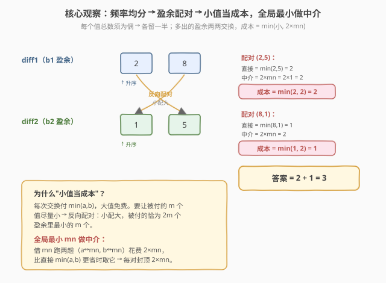
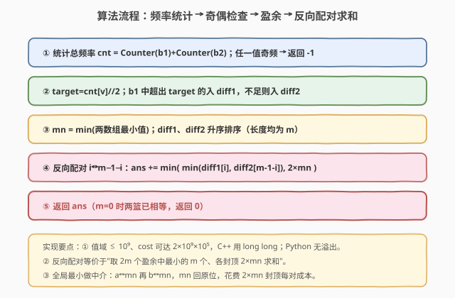

# 重排水果

- **题目名称**：重排水果
- **链接**：[2561. 重排水果](https://leetcode.cn/problems/rearranging-fruits/)
- **难度**：困难
- **标签**：贪心、数组、哈希表、排序

## 1. 题目概述

两个果篮 `basket1` 与 `basket2`，各有 $n$ 个水果，每个水果有一个成本。每次操作选下标 $i$、$j$，交换 `basket1[i]` 与 `basket2[j]`，**交换成本** $=\min(\text{basket1}[i],\text{basket2}[j])$。目标：使两篮排序后完全相同（即两篮作为多重集合相等），求**最小总交换成本**；不可行返回 $-1$。

**示例 1**：

```text
输入：basket1 = [4,2,2,2], basket2 = [1,4,1,2]
输出：1
解释：交换 basket1[1]=2 与 basket2[0]=1，成本 min(2,1)=1。
      交换后 basket1=[4,1,2,2]，basket2=[2,4,1,2]，排序后均为 [1,2,2,4]。
```

**示例 2**：

```text
输入：basket1 = [2,3,4,1], basket2 = [3,2,5,1]
输出：-1
解释：4、5 各出现 1 次，无法均分到两篮，无解。
```

**约束条件**：

- $n=\text{basket1.length}=\text{basket2.length}$，$1\le n\le 10^5$
- $1\le \text{basket1}[i],\text{basket2}[i]\le 10^9$

> ⚠️ **规模读法**：$n\le10^5$，单值 $\le10^9$，单次成本 $\le10^9$，总成本可达 $\sim10^{14}$，**必须 64 位**。交换只搬移水果不改总频次，故"能否相等"完全取决于**各值总频次的奇偶性**。

---

## 2. 解题思路

### 2.1 暴力思路：枚举交换方案

$n$ 个位置两两配对交换，方案数天文数字，且每次成本依赖具体配对，搜索不可行。瓶颈：未察觉"每个值该出现在哪一篮"已被总频次唯一确定，配对只需在"盈余水果"间进行。

### 2.2 核心观察：频率均分 → 盈余配对 → 小值当成本 + 全局最小做中介



分三步：

**① 可行性 = 奇偶性。** 合并两篮统计每个值的总频次 $\text{cnt}[v]$。交换不改变总频次，故两篮要相等，每个值必须**出现偶数次**（各分一半）。任一奇频次 → 返回 $-1$。每个值的目标份数 $\text{target}[v]=\text{cnt}[v]/2$。

**② 盈余列表。** 设 $c_1[v],c_2[v]$ 为 $v$ 在两篮中的频次。若 $c_1[v]>\text{target}[v]$，basket1 多出 $c_1[v]-\text{target}[v]$ 个 $v$ 必须送走，加入 `diff1`；若 $c_1[v]<\text{target}[v]$，basket2 多出对应数量，加入 `diff2`。`diff1`、`diff2` 是两个**等长**的多重集合，长度记 $m$（每个送走的元素恰有一个对侧元素接收，故守恒）。

**③ 最小化配对成本。** $m$ 次交换，每次配一个 `diff1` 元素 $a$ 与一个 `diff2` 元素 $b$，直接成本 $\min(a,b)$。但还有一招：借**全局最小值** $\text{mn}$ 当中介——先 $a\leftrightarrow\text{mn}$（成本 $\text{mn}$），再 $b\leftrightarrow\text{mn}$（成本 $\text{mn}$），$\text{mn}$ 原位往返，净效果同 $a\leftrightarrow b$，花费 $2\,\text{mn}$。故每对成本封顶：

$$
\text{cost}_i=\min\!\big(\min(a,b),\;2\,\text{mn}\big)
$$

> 💡 **为什么"小值当成本"？** 每次交换只付两者之小者，大值免费。要把被付的 $m$ 个值压到最小，应让 $2m$ 个盈余里**最小的 $m$ 个**成为被付者——即"小配大"。**反向配对**（`diff1` 升序配 `diff2` 降序）恰使被付集合 = 最小的 $m$ 个盈余，再各封顶 $2\,\text{mn}$，即为最优。

### 2.3 算法流程图



```text
cnt = Counter(basket1) + Counter(basket2)
若任一 v 的 cnt[v] 为奇：return -1
target[v] = cnt[v] / 2
diff1, diff2 = [], []
for v, c1 in Counter(basket1).items():
    excess = c1 - target[v]
    if excess > 0: diff1.extend([v] * excess)      # basket1 多余
    elif excess < 0: diff2.extend([v] * (-excess)) # basket2 多余
mn = min(min(basket1), min(basket2))
sort(diff1); sort(diff2); m = len(diff1)
ans = 0
for i in 0..m-1:
    ans += min( min(diff1[i], diff2[m-1-i]), 2*mn )
return ans
```

> ⚠️ **边界自洽**：① $m=0$（两篮本就相等）→ 循环不执行，返回 0。② 全局最小 $\text{mn}$ 本身可能是盈余水果之一，作中介的"借还"逻辑仍成立，公式不变。③ 反向配对等价于"取 $2m$ 个盈余中最小的 $m$ 个、各封顶 $2\,\text{mn}$ 求和"，两种写法等价。

### 2.4 示例演算

![示例演算：basket1=[4,2,2,2] basket2=[1,4,1,2]，diff1=[2] diff2=[1] mn=1，配对成本 min(1,2)=1](../images/2561_example_walkthrough.svg)

$\text{basket1}=[4,2,2,2]$，$\text{basket2}=[1,4,1,2]$。

| 值 $v$ | $c_1$ | $c_2$ | $\text{cnt}$ | $\text{target}$ | $c_1-\text{target}$ |
|--------|-------|-------|--------------|------------------|----------------------|
| 1 | 0 | 2 | 2 | 1 | $-1$ → `diff2` 加 1 |
| 2 | 3 | 1 | 4 | 2 | $+1$ → `diff1` 加 2 |
| 4 | 1 | 1 | 2 | 1 | $0$（平衡） |

总频全偶，可均分。`diff1=[2]`，`diff2=[1]`，$m=1$，$\text{mn}=1$。

- 配对 $(2,1)$：直接 $\min(2,1)=1$；中介 $2\,\text{mn}=2$；取 $\min(1,2)=1$。
- 答案 $=\mathbf{1}$。

**示例 2**：$[2,3,4,1]$ 与 $[3,2,5,1]$，值 $4$、$5$ 总频均为 $1$（奇）→ 返回 $-1$。交换不改总频，故奇偶性是可行性的充要条件。

---

## 3. 参考代码

### C++

```cpp
class Solution {
public:
    long long minCost(vector<int>& basket1, vector<int>& basket2) {
        unordered_map<int,int> cnt, c1;
        for (int x : basket1) { cnt[x]++; c1[x]++; }
        for (int x : basket2) cnt[x]++;
        for (auto& [v,c] : cnt) if (c % 2) return -1;   // 奇频无解

        vector<int> d1, d2;
        for (auto& [v,c] : cnt) {                  // 遍历所有值，含只在 b2 出现者
            int target = c / 2;
            int have = c1.count(v) ? c1[v] : 0;
            int excess = have - target;
            if (excess > 0) for (int k=0;k<excess;k++) d1.push_back(v);
            else if (excess < 0) for (int k=0;k<-excess;k++) d2.push_back(v);
        }
        int mn = min(*min_element(basket1.begin(),basket1.end()),
                     *min_element(basket2.begin(),basket2.end()));
        sort(d1.begin(),d1.end());
        sort(d2.begin(),d2.end());
        int m = d1.size();
        long long ans = 0;
        for (int i=0;i<m;i++)
            ans += min((long long)min(d1[i], d2[m-1-i]), (long long)2*mn);
        return ans;
    }
};
```

> 💡 **实现要点**：① 返回值与累加用 `long long`：成本可达 $10^{14}$。② `2*mn` 在 $\text{mn}\approx10^9$ 时为 `int` 溢出风险，故显式转 `long long` 再参与 `min`。③ 用 `c1` 单独记 basket1 频次，避免再扫一遍；`excess` 正负分流到 `d1/d2`，守恒保证两者等长。④ 也可不分 `d2`、改为合并排序取最小 $m$ 个，等价。

### Python

```python
from collections import Counter

class Solution:
    def minCost(self, basket1: list[int], basket2: list[int]) -> int:
        cnt = Counter(basket1) + Counter(basket2)
        if any(c % 2 for c in cnt.values()):
            return -1
        c1 = Counter(basket1)
        d1, d2 = [], []
        for v in cnt:                              # 遍历所有值，含只在 b2 出现者
            excess = c1.get(v, 0) - cnt[v] // 2
            if excess > 0:
                d1.extend([v] * excess)
            elif excess < 0:
                d2.extend([v] * (-excess))
        mn = min(min(basket1), min(basket2))
        d1.sort(); d2.sort()
        m = len(d1)
        return sum(min(min(d1[i], d2[m - 1 - i]), 2 * mn) for i in range(m))
```

> 💡 **对照 C++**：逻辑一致；Python 整数任意精度无溢出。`Counter` 相加直接合并总频，`any(...)` 一行完成奇偶检查。`d2` 也可省略——把 `d1+d2` 合并排序后取前 $m$ 个各封顶 $2\,\text{mn}$ 求和，等价且更短：

```python
d = sorted(d1 + d2)
return sum(min(x, 2 * mn) for x in d[:m])
```

---

## 4. 复杂度分析

| 维度 | 复杂度 | 说明 |
|------|--------|------|
| 时间 | $O(n\log n)$ | 频率统计 $O(n)$；排序盈余 $O(m\log m)\le O(n\log n)$；配对求和 $O(m)$，瓶颈在排序 |
| 空间 | $O(n)$ | 哈希表与盈余列表，合计不超过 $O(n)$ |
| 对照：枚举交换 | 指数级 | $n$ 个位置配对方案天文数字，不可行 |

> 💡 值域 $\le10^9$ 故用哈希表而非数组统计频次。$m$ 最大 $n$（一半对一半），故排序上限 $O(n\log n)$，$n=10^5$ 毫秒级通过。

---

## 5. 扩展：从"配对最小化"到"封顶技巧"

本题两招可推广：

- **小值当成本（反向配对）**：当目标量是 $\sum\min(a_i,b_{\pi(i)})$ 形式时，两个序列分别排序后**反向配对**使被付集合最小、和最小。镜像问题是 [561. 数组拆分](https://leetcode.cn/problems/array-partition/)——它要**最大化** $\sum\min(a_i,b_{\pi(i)})$，故改用**同向配对**（相邻配对），方向相反而动机对称：都是"控制哪个元素当较小者"。
- **全局极值做中介封顶**：当存在一个可"无损往返"的全局最小 $\text{mn}$ 时，任何单次交换成本可封顶 $2\,\text{mn}$，大值对借此大幅降价。这是利用"冗余/可复用资源"降成本的典型套路。

> ⚠️ **判断封顶是否可用**：需存在一个可"无损往返"的全局最小元素（本题 $\text{mn}$ 经两次交换回原位）。若所有元素都"一次性消耗"则无此招。判断"可加/可封顶"与判断"是否耦合"一样，是贪心设计前的关键分流判据。

---

## 6. 面试要点

1. **为什么可行性等价于"每个值总频为偶"？**

   > 交换只搬运水果不改总频次，故终态两篮相等等价于每个值在两篮各占一半，前提是该值总数能被 2 整除。任一值奇频 → 该值无法对半均分 → 无解。反之全偶则可构造（按盈余配对交换），故充要。

2. **为什么反向配对最优，而非同向？**

   > 每次成本付 $\min(a,b)$，大值免费。要让被付的 $m$ 个尽量小，应让 $2m$ 个盈余里最小的 $m$ 个各作"小者"配一个大的。反向配对（升序配降序）恰使被付集合 = 最小 $m$ 个盈余；同向配对会把较大的也卷入被付，和更大。交换论证：若两对的被付出现"逆序"（较大被付配到了较小自由项），对调配对可不增总成本，故最优解被付集合单调即最小 $m$ 个。

3. **$2\,\text{mn}$ 的"中介"操作如何保证 $\text{mn}$ 回到原篮？**

   > 设 $\text{mn}$ 在 basket2。先交换 $a$（basket1 盈余）与 $\text{mn}$（basket2）：$a$ 入 basket2、$\text{mn}$ 入 basket1，成本 $\text{mn}$。再交换 $b$（basket2 盈余）与 $\text{mn}$（现在 basket1）：$b$ 入 basket1、$\text{mn}$ 回 basket2，成本 $\text{mn}$。净效果 $a\to$basket2、$b\to$basket1、$\text{mn}$ 原位往返，总成本 $2\,\text{mn}$。

4. **$\text{mn}$ 本身是盈余水果时，中介公式还成立吗？**

   > 成立。$\text{mn}$ 若属盈余，它本就要移动；把它当作某对的直接成员时成本 $\le\text{mn}$，比 $2\,\text{mn}$ 更小，自然取直接值；其余大值对仍用 $2\,\text{mn}$ 封顶。公式 $\min(\min(a,b),2\,\text{mn})$ 对所有情形一致成立，无需特判。

5. **为何必须 64 位整数？**

   > 单值 $\le10^9$，单次成本 $\le10^9$（直接）或 $2\times10^9$（中介，$\text{mn}\le10^9$）；$m\le n\le10^5$，总成本上界 $\sim10^5\times2\times10^9=2\times10^{14}$，远超 32 位 `int` 上界 $\approx2.1\times10^9$。C++ 累加与返回须 `long long`；`2*mn` 计算时也先转 64 位防中间溢出。Python 无此虑。

> 💡 **一句话总结**：奇偶定可行，盈余两两配；反向配对让小值当成本，全局最小做中介封顶 $2\,\text{mn}$——把指数级搜索压成 $O(n\log n)$。

---

## 7. 同类练习题

- [881. 救生艇](https://leetcode.cn/problems/boats-to-save-people/)：排序后最重配最轻贪心压数量，与本题"反向配对"同向思考（目标不同：压船数 vs 压成本和）
- [561. 数组拆分](https://leetcode.cn/problems/array-partition/)：排序后取每对较小者求和并**最大化**，故同向相邻配对——本题"最小化和"的镜像，对照"配对方向如何决定被付集合"
- [2449. 使数组相似的最少操作次数](https://leetcode.cn/problems/minimum-number-of-operations-to-make-arrays-similar/)：按奇偶位分流后排序配对，"分组后配对贪心"的同类思路
- [2033. 使网格单值的最少操作次数](https://leetcode.cn/problems/minimum-operations-to-make-a-univalue-grid/)：中位数 + 排序，"聚拢使总成本最小"的另一载体，对照"最小化总和"的不同结构
- [1338. 数组大小减半](https://leetcode.cn/problems/reduce-array-size-to-the-half/)：按频率排序选 Top 贪心覆盖，"排序后贪心选"的纯计数版
